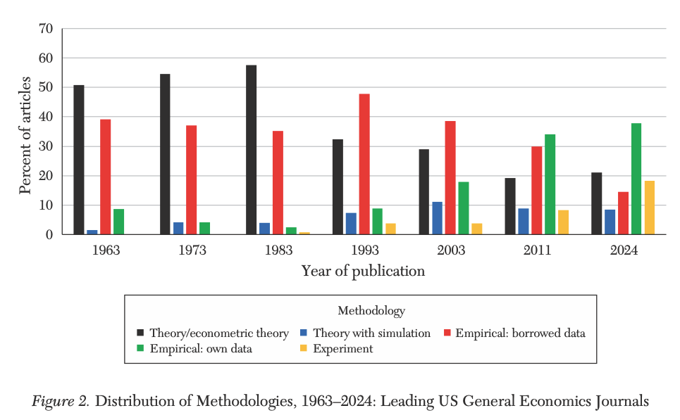
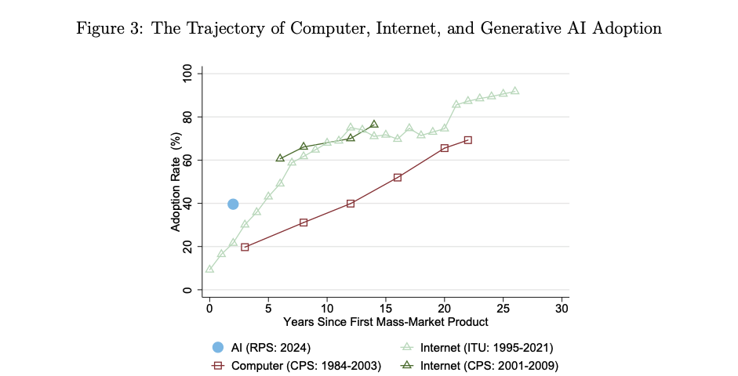
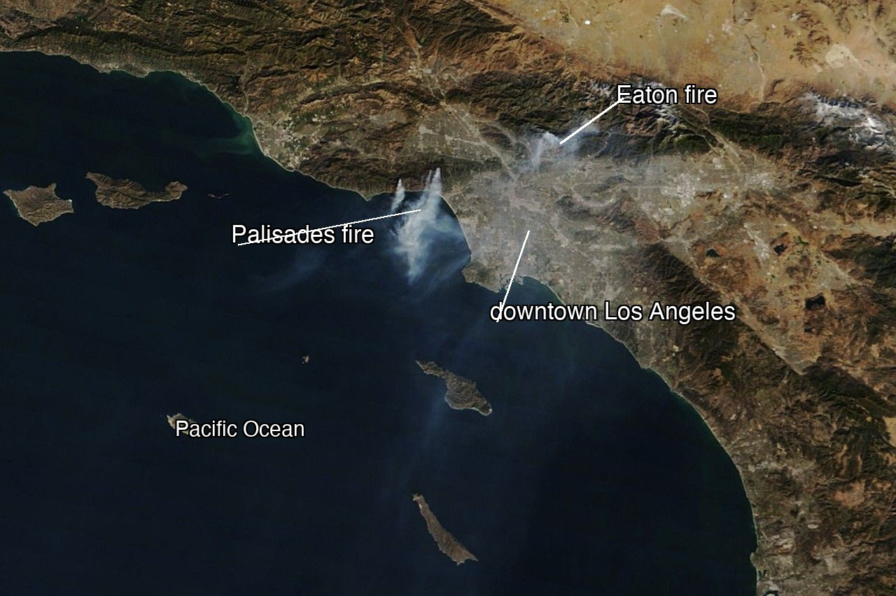

```{r}
#| purl: false
#| include: false
knitr::opts_chunk$set(
  comment = "#>",
  collapse = FALSE,
  fig.width = 8,
  fig.height = 4,
  fig.align = "center",
  dpi = 150
)
```

::: {.content-hidden when-format="revealjs"}

[Slides](01-overview-slides.html) · [Live script](01-overview.R) ·
[Source](https://github.com/ArielOrtizBobea/aem6850/blob/main/fall-2026/sessions/01-overview.qmd)

This page is the "manual" for the session. The slides are the same material but in condensed form for the lecture. The live script is any R code we use in the session. 

:::

::: {.content-visible when-format="revealjs"}

## Polls open

{fig-align="center" height="380"}

[**pollev.com/arielortizbobea090** · text **arielortizbobea090** to **22333**]{style="font-size:0.75em"}

::: {.notes}
Items 1–10 of the background survey run one at a time while people arrive.
Item 11 (the free point) right after, as the graded-quiz demo.
:::

:::

## Objectives {#objectives}

By the end of this session you can:

- State the course’s objectives and navigate the course map.
- Run a script and find its outputs.
- Predict what a simple script prints.
- Get your private course repository (repo) and commit a change in the browser.

::: {.content-hidden when-format="revealjs"}

## Before class {#before-class}

If you did the setup from the welcome email (GitHub account, R, RStudio),
today's install party is a quick check for you. If you didn't, we set
everything up in class. If your laptop is locked down, borrowed, or old,
come anyway: a free browser-based R (see the [install
party](#install-check)) covers the first weeks.

:::

## About me {#about-me}

:::: {.columns}

::: {.column width="66%"}
- Prof. Ariel Ortiz-Bobea: Dyson School and the Brooks School of Public
  Policy; at Cornell since 2014.
- Before Cornell: Resources for the Future; PhD, University of Maryland;
  Ministry of the Environment of the Dominican Republic.
- Research: how people cope with environmental change, especially how
  climate change affects the economy, and agriculture in particular.
  More at [arielortizbobea.github.io](https://arielortizbobea.github.io).
:::

::: {.column width="30%"}
{fig-align="center" height="500"}
:::

::::

## Motivation {#motivation}

::: {.content-hidden when-format="revealjs"}

Every empirical paper rests on data somebody found, cleaned, checked, and
reshaped. Methods courses start after that work is done. This course teaches
that work.

Two trends make that work matter more than ever.

**Economics turned empirical.** Theory fell from over half of top-journal
articles in the 1960s–80s to about a fifth in 2024. The largest category is
now empirical work with data the authors assembled themselves: 38% of
articles, up from 9% in 1963 ([Hamermesh,
2025](https://www.nber.org/papers/w33731), updating [Hamermesh,
2013](https://www.aeaweb.org/articles?id=10.1257/jel.51.1.162)).

,
Figure 2.](figures/trend1-methods.png)

**AI arrived, fast.** Two years after ChatGPT launched, close to 40% of
working-age Americans used generative AI, about double the PC or the
internet at the same age ([Bick, Blandin, and Deming,
2024](https://www.nber.org/papers/w32966), published in [*Management
Science*](https://pubsonline.informs.org/doi/10.1287/mnsc.2025.02523),
2026).

, Figure
3.](figures/trend6-ai.png)

AI is changing how research gets done. It writes competent first drafts of
code, summarizes documents, and turns plain English into working scripts.
That solves real problems: faster starts, less boilerplate, fewer hours
lost to syntax. It also creates new ones: plausible code that runs and is
wrong, results nobody checked, numbers nobody can trace. The scarce skill
shifts from writing code to judging what comes back. This course engages
exactly that.

:::

::: {.content-visible when-format="revealjs"}

- Every empirical paper rests on data somebody found, cleaned, checked, and
  reshaped.
- Methods courses start after that work is done. This course teaches it.

:::

::: {.content-visible when-format="revealjs"}

## Economics is now an empirical field

{fig-align="center" height="500"}

[[Hamermesh (2025)](https://www.nber.org/papers/w33731), update to "Six Decades of Top Economics Publishing" (*JEL*).]{style="font-size:0.55em"}

::: {.notes}
Green bars: papers built on data the authors assembled themselves, now the
single largest category, 38% in 2024 vs 9% in 1963. That assembling is this
course.
:::

## AI is arriving faster than the PC or the internet

{fig-align="center" height="480"}

[[Bick, Blandin & Deming (2024)](https://www.nber.org/papers/w32966), "The Rapid Adoption of Generative AI".]{style="font-size:0.55em"}

::: {.notes}
Blue dot: generative AI two years after launch, just under 40% adoption,
about double the PC and the internet at the same age.
:::

## AI is changing research work

- It writes competent first drafts: code, summaries, extraction, text.
- This reduces the marginal cost of doing research.
- But increases the chances of making costly and yet potentially invisible mistakes.
- Key emerging skill: supervise and verify in robust and efficient ways.

::: {.notes}
Do not rush this slide. Everything downstream depends on students believing
the last bullet. Ask the room: who has had a model hand them code that ran
fine and was wrong?
:::

:::

> **AI models draft and execute code. You supervise and verify.**
>
> If the code runs without an error, it does not mean it is correct. A wrong number coming our of your error-less code is the key challenge of this AI era. This course will develop your skills to avoid that.

::: {.content-hidden when-format="revealjs"}

So every homework ends the same way: you check a number against something
outside the computer: a published total, a printed figure, a calendar fact.
That check is the assignment.

:::

## The course map {#map}

Twenty-eight meetings, two parts.

::: {.content-visible when-format="revealjs"}

- **Part I — foundations** (1–12). Learn how to work with basic tabular data.
  Coding "by hand" through session 7. AI assistance enters in session 8.
- **Part II — applications** (13–28). We explore various families of unconventional data types and ways to acquire and process them.

:::

::: {.content-hidden when-format="revealjs"}

**Part I — foundations** (sessions 1–12, weeks 1–6). The whole pipeline on
ordinary tables: R, diagnostic plots, wrangling, joins, functions and
debugging, git, AI, verification, reproducible projects, graphics. You work
by hand through session 7. AI enters at session 8, once you can judge its
output.

**Part II — applications** (sessions 13–28, weeks 7–15). One family of
unconventional data per session, each through the same pipeline: what the
family answers, where to get it, how to process it, and which checks it
demands.

The [full schedule](../index.qmd#schedule) lists all twenty-eight sessions.
The [syllabus](../syllabus.qmd) has the grading, the AI policy, and the
homework calendar.

:::

## Six families of data types {#families}

::: {.content-hidden when-format="revealjs"}

1. **Messy tables**: real spreadsheets and CSVs: merged headers, footnotes,
   sentinel codes. Clean them into data you can analyze.
2. **Text**: laws, news, transcripts, listings. Turn words into variables
   with patterns and LLMs.
3. **Documents (PDFs & scans)**: reports and archives, born-digital or
   scanned. Extract tables that were never meant to be data.
4. **Images**: photos and satellite tiles. Turn pixels into measurements:
   air quality from photos, growth from nightlights.
5. **Audio**: speeches and interviews. Transcripts, plus the pauses and
   tone that carry meaning.
6. **Maps & rasters**: points, boundaries, grids. Join places and build
   exposures: what is upwind, what is nearby.

The *channels* (how data reaches you) cut across all six: packaged
downloads, APIs, scraping, licensed vendors, replication archives, and data
you collect yourself.

**What this course does not cover.** No causal inference, no econometric
theory, no estimation strategy; that is AEM 6851 in the spring. No
machine-learning theory: we *use* models, we do not derive them. No video,
no network data.

:::

::: {.content-visible when-format="revealjs"}

1. **messy tables**: clean real spreadsheets
2. **text**: from words into variables
3. **documents**: tables out of PDFs and scans
4. **images**: pixels into measurements
5. **audio**: speech, pauses, tone as data
6. **maps & rasters**: places, joins, vectors

Cross-cutting *channels*: downloads, APIs, scraping, vendors,
archives, your own collection.

:::

::: {.content-visible when-format="revealjs"}

## What we do not cover

- No causal inference, no econometric theory.
- No machine-learning theory: we *use* models, we do not derive them.
- No video, no network data (at least this year).

:::

## Why R? {#why-r}

::: {.content-hidden when-format="revealjs"}

Almost everything this course teaches transfers. Finding, cleaning,
checking, and verifying data work the same way in Python, Stata, or Julia.
The habits are the point; R is the vehicle.

We drive in R for practical reasons. It is free, open source, and built
for data analysis, and one install gives you everything you need. Its user
base spans statistics, economics, epidemiology, ecology, and data
journalism, so most problems you will hit already have an answer written
down. Its graphics are excellent. Stata is common in economics but paid
and narrower. Python is a general-purpose language that also does data;
it is the most common second language for this work.

Moving later is cheap. Once you can do this work in R, Python is close,
and AI makes the move cheaper still: translating working R into Python is
exactly the kind of delegation this course teaches you to verify.

:::

::: {.content-visible when-format="revealjs"}

- The habits transfer: acquire, clean, check, verify work the same in any
  language.
- R is free, open source, and built for data analysis. One install covers
  the course.
- Wide user base across fields, excellent graphics, answers easy to find.
- Python later is cheap; AI translation makes it cheaper. The habits
  carry.

::: {.notes}
The survey just showed the room's tool split. Acknowledge Stata and Python
users: nothing they know is wasted, and nothing here locks them in.
:::

:::

## Install party {#install}

Do these in order: RStudio looks for R when it starts, so install R
first.

**1. Install R.** [cran.r-project.org](https://cran.r-project.org) → your
operating system.

- *macOS:* there are two builds. Apple silicon (M1–M4) needs the `arm64`
  installer; older Intel Macs need the `x86_64` one. Apple menu → About This
  Mac tells you which you have.
- *Windows:* click "base", then the download link. You do not need Rtools.

**2. Install RStudio.**
[posit.co/download/rstudio-desktop](https://posit.co/download/rstudio-desktop)
→ the free Desktop version. It also bundles Quarto, a tool that turns
scripts into reports (we use it later in the course). There is nothing else
to install.

## Check it worked {#install-check}

**3.** Open RStudio (not R) and type this into the Console, bottom left:

```{r}
#| label: check-install
#| script: "Check the install"
#| eval: false
R.version.string
```

You should see version 4-point-something. If you see an error, or RStudio says
it cannot find an R installation, raise your hand.

**4. One setting, right now.** Tools → Global Options → General: uncheck
**"Restore .RData into workspace at startup"**, and set **"Save workspace to
.RData on exit"** to **Never**.

::: {.content-hidden when-format="revealjs"}

This setting prevents a common trap. By default RStudio saves your objects
between sessions, so a script can seem to work because of a leftover you
created an hour ago. With the setting off, your script is the only record of
what you did.

**The four panes.** The Console (bottom left) runs code as you press Return.
The Source pane (top left) holds scripts. Environment (top right) lists your
objects. Plots and Files sit bottom right. Today: type in the Console, keep
code worth keeping in Source.

::: {.column-margin}
**If your laptop refuses.** Make a free account at
[posit.cloud](https://posit.cloud): RStudio in a browser. The first weeks
all work there. Bring the machine to office hours and we fix the install.
:::

:::

::: {.content-visible when-format="revealjs"}

Laptop refusing? [posit.cloud](https://posit.cloud) is RStudio in a
browser. Free, works today.

:::

::: {.content-visible when-format="revealjs"}

## The four panes

- **Console** (bottom left): runs code the moment you press Return.
- **Source** (top left): scripts: code you keep.
- **Environment** (top right): the objects you have made.
- **Plots / Files** (bottom right): figures and your folder.

Today: type in the Console. Keep code worth keeping in Source.

::: {.notes}
Point at each pane on the projected RStudio while naming it. Land on:
Console = scratch, Source = keep.
:::

:::

## Onboarding: get your repo {#onboarding}

::: {.content-hidden when-format="revealjs"}

Here is what this block is for. Everyone in the course gets a personal
**repository**: a private folder on GitHub that holds your work, keeps
every version of it, and shows it to the teaching team. Every homework this
semester is handed in there: you change files, you commit, we grade what
you committed. Nothing is emailed, nothing is uploaded to Canvas.

Today you set that pipeline up and prove it works: create a GitHub
account, receive your repository, and make one small commit. Ten minutes
now means HW1 on Thursday rides on plumbing you have already tested.

:::

::: {.content-visible when-format="revealjs"}

- Everyone gets a **private repository** on GitHub: your course workspace.
- Every homework is handed in there. Nothing by email, nothing on Canvas.
- Today: account → repository → one commit. The pipeline works before any
  grade rides on it.

:::

Everyone finishes this today, in the room. It runs entirely in a browser,
so a half-installed laptop is no obstacle.

::: {.content-hidden when-format="revealjs"}

**1. Get a GitHub account.** [github.com/signup](https://github.com/signup).

Any email works; add your Cornell address later for the free GitHub
Education benefits. Pick a username you would put on a CV. Already have an
account? Use it; do not create a second one.

**2. Submit the sign-up form.** Open it either way: scan the QR on the
screen, or click the **Sign-up form** link in the Canvas welcome
announcement. It is a Google form with three boxes: your name, your NetID,
your GitHub username. Fill them in and press **Submit**. (Your username is
the name under the top-right menu on github.com, not your email address.)

This form is how we collect the class's GitHub usernames. A script reads
them, creates each student's personal repository in the course
organization, and sends the invitations in bulk. The invitation in the
next step is generated from what you just typed.

**3. Accept the invitation.** We collect the usernames and send the
invitations in batches during class. Yours arrives as an email from GitHub
and as a banner at
[github.com/notifications](https://github.com/notifications). Click
**Accept invitation**. You land in your new repository.

The repository is private. You own it, the teaching team can see it, and
other students cannot.

:::

::: {.content-visible when-format="revealjs"}

## The three steps

**1. Account.** [github.com/signup](https://github.com/signup). Pick a
username you would put on a CV.

**2. Form.** Your name · NetID · GitHub username. Scan, or open the
**Sign-up form** link on Canvas:

{fig-align="center" height="240"}

**3. Accept the invitation.** We send the invitations in batches during
class. Check email or
[github.com/notifications](https://github.com/notifications), then click
**Accept invitation**.

::: {.notes}
Username = top-right menu on github.com, not the email. The form feeds the
provisioning script: username in, repository + invitation out. While they
type: export the CSV and run the sweep (runbook); re-run for stragglers.
:::

:::

## Onboarding: your first commit {#onboarding-commit}

**4. Edit the README in the browser.** Click `README.md`, then the pencil
icon. Fill in the three lines:

```
Name:
Program:
One dataset or question I would like to be able to handle by December:
```

**5. Commit.** Green **"Commit changes…"** button, top right. Type a short
message (`add my intro`), leave "Commit directly to the `main` branch"
selected, and click **Commit changes**.

**6. Look at what you did.** Reload the repository's front page. Your text is
there, and above it your message, `add my intro`, with a timestamp.

## You just used version control {#onboarding-reveal}

::: {.callout-note appearance="simple"}
**What just happened.** You made a commit: a permanent, timestamped
snapshot of your work. No git install, no terminal: the browser did it.
:::

You will hand in the first few homeworks the same way: edit or drag files onto
the repository page, then commit. Session 7 will explain what git did here.

**7. Check in.** The last poll of the day asks for your repository's URL.
Copy it from the address bar and paste it in. This is how we take
attendance today, and it shows us your setup worked end to end.


::: {.content-hidden when-format="revealjs"}

**If something goes wrong.**

| Symptom | Fix |
|:--|:--|
| No invitation after a few minutes | Check [github.com/notifications](https://github.com/notifications) and your email (spam too); then raise your hand; a typo'd username takes seconds to fix |
| You submitted the wrong username | Submit the form again with the right one, and raise your hand |
| You accepted while signed into the wrong account | Tell us; we re-invite the right one. Do not make a second account |
| No pencil icon on the README | You are looking at someone else's repository, or you are signed out |

:::

::: {.content-visible when-format="revealjs"}

## The January 2025 Los Angeles fires

{fig-align="center" height="470"}

[Both ignited January 7, 2025, in Santa Ana winds gusting near 100 mph. Together they destroyed about 16,000 structures. NASA Terra/MODIS, January 10, 2025.]{style="font-size:0.55em; color:#6b6b6b"}

::: {.notes}
Orient the room; many students are new to the US. Los Angeles sits on the
Pacific coast. Palisades fire by the ocean, Eaton fire inland above
Altadena, the grey between them is the city. This event runs through every
homework this semester.
:::

:::

## Predict before you run {#predict}

::: {.content-hidden when-format="revealjs"}

On January 7, 2025, two fires started in Los Angeles County: the Palisades
fire near the coast, the Eaton fire above Altadena. Together they destroyed
about sixteen thousand structures. The homeworks build on these fires all
semester. Today they just give us a reason to pull one small file.

,
Terra/MODIS; labels added.](figures/la-fires-2025-annotated.jpg)

:::

::: {.content-visible when-format="revealjs"}

January 7, 2025: the Palisades and Eaton fires start in Los Angeles County.
The semester's running example. Today, just a reason to pull one file.

:::

We are about to download daily weather for downtown Los Angeles (December 1,
2024 through February 28, 2025: ninety days, six columns) and plot the
strongest wind gust recorded each day.

**Before any of that, write down three predictions.** On paper, or in a
comment at the top of your script. Written down, not held in your head.

1. Which date in that window has the largest daily maximum gust?
2. Roughly how many times bigger is that gust than a typical day's?
3. How much rain fell on Los Angeles in December 2024?

::: {.content-hidden when-format="revealjs"}

Use what you already know about the fires and about Southern California in
winter. That knowledge turns a guess into a prediction.

:::

::: {.content-visible when-format="revealjs"}
::: {.notes}
Take answers out loud before running anything. Someone will say Jan 7 for Q1;
ask them why they believe it. Q2 gets wild spread; good, that is the point.
Q3 is the one nobody predicts well.
:::
:::

## Step 1: Pull the data {#demo-pull}

The data comes from [Open-Meteo](https://open-meteo.com), which serves
historical weather as a plain CSV over a URL. No account, no key, no package.

```{r}
#| label: demo-pull
#| script: "Pull the data"
#| message: false
url <- paste0(
  "https://archive-api.open-meteo.com/v1/archive",
  "?latitude=34.05&longitude=-118.24",
  "&start_date=2024-12-01&end_date=2025-02-28",
  "&daily=wind_gusts_10m_max,wind_speed_10m_max,",
  "temperature_2m_max,relative_humidity_2m_min,precipitation_sum",
  "&timezone=America%2FLos_Angeles&format=csv"
)

la <- read.csv(url, skip = 3)
names(la) <- c("date", "gust", "wind", "tmax", "rh_min", "precip")
la$date <- as.Date(la$date)
```

::: {.content-hidden when-format="revealjs"}

Three details.

`read.csv()` reads a URL like a filename. `skip = 3` skips the first three
lines, which describe the location, not the weather; the real header sits
on line 4 (open the URL and look). The file ships names like
`wind_gusts_10m_max..km.h.` (R's rewrite of `(km/h)`), so we rename them.
You will type these names all day.

::: {.callout-tip collapse="true"}
## If the download fails

Campus wifi, a rate limit, an API outage: downloads fail. This session
ships a saved copy of the exact response, so the demo still runs:

```r
la <- read.csv(paste0(
  "https://arielortizbobea.github.io/aem6850/fall-2026/sessions/",
  "data/la-weather-dec2024-feb2025.csv"
), skip = 3)
```

Session 14 turns this into a habit: commit the raw response so the pipeline
re-runs identically later.
:::

:::

## Step 2: Look at what arrived {#demo-look}

Never compute on a file you have not looked at. Three lines, every time:

```{r}
#| label: demo-look
#| script: "Look at what arrived"
dim(la)
str(la)
summary(la$gust)
```

::: {.content-hidden when-format="revealjs"}

`dim()` reports ninety rows, six columns: what ninety days of daily data
should give. If it said 89 or 91, we would stop and find out why. `str()`
confirms `date` is a Date and the rest are numbers. `summary()` shows the
range: a maximum gust of 4 or 4000 would flag a unit problem before any
plot.

Session 3 names this habit (arrival checks) and every homework expects
it.

:::

## Step 3: One plot {#demo-plot}

```{r}
#| label: demo-plot
#| script: "One plot"
#| fig-alt: "Daily maximum wind gust in downtown Los Angeles, December 2024 through February 2025. Most days sit near 20 km/h. A single spike reaches about 66 km/h on January 7, 2025, with a second, smaller spike the following day."
plot(la$date, la$gust,
     type = "h", col = "grey30",
     xlab = "", ylab = "Maximum wind gust (km/h)",
     main = "Downtown Los Angeles, daily maximum gust")

abline(h = median(la$gust), lty = 2, col = "grey60")
abline(v = as.Date("2025-01-07"), col = "#b31b1b", lwd = 2)
text(as.Date("2025-01-07"), max(la$gust), "  Jan 7",
     col = "#b31b1b", adj = c(0, 1))
```

::: {.content-hidden when-format="revealjs"}

That is base R graphics, session 3's topic: one-line plots for you, not
for readers. `type = "h"` draws each day as a spike, the right shape for the
question "how unusual was this one day?"

:::

## Step 4: Reconcile {#demo-reconcile}

Now compare the screen against what you wrote down.

```{r}
#| label: demo-reconcile
#| script: "Reconcile against the predictions"
la$date[which.max(la$gust)]                 # 1. the windiest day
max(la$gust) / median(la$gust)              # 2. how unusual it was
sum(la$precip[format(la$date, "%Y-%m") == "2024-12"])  # 3. December rain, in mm
```

::: {.content-hidden when-format="revealjs"}

**The windiest day of the winter is January 7, the day the fires
started.** The data and the world agree on something specific.

**The gust ran 3.3 times a typical day.** Most winter days in downtown LA
top out near 20 km/h; January 7 hit 66.

**December brought half a millimetre of rain.** Two days in the month
recorded anything at all. Wind alone does not burn a city; wind on three dry
months of fuel does.

:::

::: {.content-visible when-format="revealjs"}

- The windiest day of the winter is the day the fires started.
- It was 3.3× a normal day.
- December's total rainfall: half a millimetre.

:::

:::: {.content-hidden when-format="revealjs"}

## Where the number came from {#measurement}

66 km/h is about 41 mph. The National Weather Service was warning about that
windstorm in far more dramatic terms than 41 mph, and it was right to. Both
numbers are correct.

This file reports **one model grid cell over downtown Los Angeles, ten metres
above flat ground.** The fires started in canyons twenty kilometres away,
where Santa Ana winds funnel and accelerate.

::: {.callout-important appearance="simple"}
A dataset is not the world. It measures the world somewhere specific, by a
specific method, at a specific resolution. Always ask where your number came
from.
:::

**Your turn:** find the peak gust the National Weather Service recorded
during that windstorm, and where that station sits. Write both down and
bring them Thursday. That is a reconciliation: the smallest version of what
every homework asks you to do.

::::

## You try {#you-try}

Five minutes. The stub is in the live script.

```{r}
#| label: you-try
#| exercise: true
#| script: "You try (5 minutes)"
#| eval: false
# 1. Pick a place you care about. Look up its latitude and longitude, put them
#    into the URL above, and re-run everything from the top.
#
# 2. Plot `tmax` instead of `gust`. What units is it in? (If you are not sure,
#    look at line 4 of the raw file -- open the URL in a browser.)
#
# 3. Add one comment saying, in a sentence, what your plot shows.
```

## Verify {#verify}

Each session ends with the verification habit it installs. This is the
first one; the rest build on it.

> **Predict, then run, then reconcile.**

::: {.content-hidden when-format="revealjs"}

Write the prediction down before you run the code. A prediction in your
head bends to match whatever appears on screen; you will remember expecting
exactly that. A written one stays put.

When the prediction and the output disagree, one of three things happened:

- **Your prediction was wrong**: you learned about the world.
- **The code is wrong**: you learned about your code.
- **The data is not what you thought**: you learned about the data, usually
  the most valuable of the three.

All three teach you something. Skip the prediction and the output has
nothing to disagree with, and you will just believe it.

:::

::: {.content-visible when-format="revealjs"}

Prediction ≠ output means one of three things, all useful:

- your prediction was wrong → you learned about the world
- the code is wrong → you learned about your code
- the data is not what you thought → you learned about the data

No prediction → nothing to check.

:::

:::: {.content-hidden when-format="revealjs"}

## Quick reference {#quick-reference}


**Install checklist**

| Step | Where | Done when |
|:--|:--|:--|
| R | [cran.r-project.org](https://cran.r-project.org); match your chip on macOS | `R.version.string` prints 4.x |
| RStudio | [posit.co/download/rstudio-desktop](https://posit.co/download/rstudio-desktop) | It opens and finds R |
| Workspace setting | Tools → Global Options → General | Restore is off, Save is Never |
| GitHub | [github.com/signup](https://github.com/signup) | You can sign in |
| Course repo | The sign-up form on Canvas | Your commit shows on the repo page |
| Fallback | [posit.cloud](https://posit.cloud) | Only if the install failed |

**Today's R, in one screen**

| Code | What it does |
|:--|:--|
| `R.version.string` | Which R you are running |
| `read.csv(url, skip = 3)` | Read a CSV from a file or a URL, ignoring the first 3 lines |
| `names(d) <- c(...)` | Rename all the columns |
| `as.Date(x)` | Turn text like `"2025-01-07"` into a date |
| `dim(d)`, `str(d)`, `summary(d$x)` | The three arrival checks |
| `d$x` | One column, by name |
| `d$x[which.max(d$y)]` | The value of `x` in the row where `y` is largest |
| `plot(x, y, type = "h")` | Scatter, or spikes with `type = "h"` |
| `abline(h =, v =, lty =, col =)` | A horizontal or vertical reference line |
| `median(x)`, `max(x)`, `sum(x)` | Column summaries |

**Keyboard**

| Keys | What |
|:--|:--|
| `Cmd`/`Ctrl` + `Return` | Run the current line and move down |
| `Cmd`/`Ctrl` + `Shift` + `Return` | Run the whole script |
| `Ctrl` + `L` | Clear the console |
| `Tab` | Complete a name |
| `↑` | The last thing you typed |

**Links**

- Session materials: [slides](01-overview-slides.html) ·
  [live script](01-overview.R) ·
  [snapshot of today's data](data/la-weather-dec2024-feb2025.csv)
- [Syllabus](../syllabus.qmd) · [full schedule](../index.qmd#schedule)
- Open-Meteo historical archive: [open-meteo.com](https://open-meteo.com)

::::

## After class {#after-class}

**Before Thursday**, four things:

1. R and RStudio installed and opening, with the workspace setting off.
2. Your course repository accepted, with your commit on it.
3. Today's script run once on your own machine, start to finish.
4. The peak wind gust the National Weather Service recorded during the
   January 7 windstorm, and the station that recorded it. Bring both
   numbers; we compare them with our 66 km/h on Thursday.

::: {.content-hidden when-format="revealjs"}

**Thursday** is R essentials: objects, vectors, types, data frames,
reading a real and slightly broken file, subsetting. It is the densest
session of the semester. The live script is the safety net: re-run
everything at home, one line at a time.

**HW1 posts Thursday after class**, due the following Thursday at 8:40 am.
It uses EPA air-quality data from the same fires. Hand it in the way you
handed in today's README: edit or drag files onto the repository page, then
commit.

**No textbook.** These pages are the manual. They stay at these URLs, so a
link you save today keeps working.

**Stuck?** Office hours, or ask in class. No prerequisites means nobody
expects you to have done this before.

:::

::: {.content-visible when-format="revealjs"}

Thursday: R essentials. HW1 posts after class.

:::

```{r}
#| purl: false
#| include: false
# Single-source build: the .R live script is generated from this file every
# time the page renders, so it cannot fall out of step with the prose.
source("_purl.R")
purl_session("01-overview.qmd", "01-overview.R")
```
