::: {.content-hidden when-format="revealjs"}

[Slides](07-git-slides.html) · [Source](https://github.com/ArielOrtizBobea/aem6850/blob/main/fall-2026/sessions/07-git.qmd)

What a repository is, how to copy one onto your laptop, and how a change
moves from a saved file to a snapshot on GitHub. Every command is typed in
RStudio's Terminal tab, read as text, and undone at the place where it
went wrong.

:::

::: {.content-hidden when-format="revealjs"}

::: {#before-class .callout-important title="Before class: install git and connect it to GitHub"}

Thirty to forty-five minutes, once, on the laptop you will bring; most of
it is waiting for a download, so start it this weekend; the download is
the slow part. In class you type git commands; this makes them work. Do
all six steps; step 6 is the test.

**1. Install git.**

*Mac.* Open RStudio, then **Tools → Terminal → New Terminal**. A tab named
*Terminal* opens beside the Console. Type `git --version` and press Enter.
If a window offers to install the *command line developer tools*, click
**Install** and wait (ten to forty minutes; it is a large download). Then
**quit and reopen RStudio** (it decided at startup that git was missing,
and only a restart brings the Git pane and the Git option in the New
Project dialog back), open a new Terminal tab, and type `git --version`
again. You should see `git version 2.` and a number. If the installer
fails (*not currently available from the Software Update server*),
download Command Line Tools from
[developer.apple.com/download/all](https://developer.apple.com/download/all)
(search "Command Line Tools", sign in with any Apple ID), or bring the
laptop and use the browser path for the first exercise.

*Windows.* Download the **64-bit Git for Windows Setup** at
[git-scm.com/download/win](https://git-scm.com/download/win) and run it.
Click **Next** on every screen except one: on the screen titled *Choosing
the default editor used by Git*, pick **Use Notepad as Git's default
editor**. Everything else stays at its default, and the defaults include
the two things we use: Git Bash, and the credential manager that will
remember your GitHub login. Quit and reopen RStudio. **Tools → Global
Options → Terminal → New terminals open with:** choose **Git Bash** → OK.
Then Tools → Terminal → New Terminal and type `git --version`. You should
see `git version 2.` and a number. The prompt should contain `MINGW64`; if
it does not, redo the Global Options → Terminal step, because the next
steps only work in Git Bash.

**2. Tell RStudio where git is.** **Tools → Global Options → Git/SVN.** The
*Git executable* box should show a path: `/usr/bin/git` on a Mac,
`C:/Program Files/Git/bin/git.exe` on Windows. If it is empty, click
**Browse** and find it there, click OK, and restart RStudio once more.

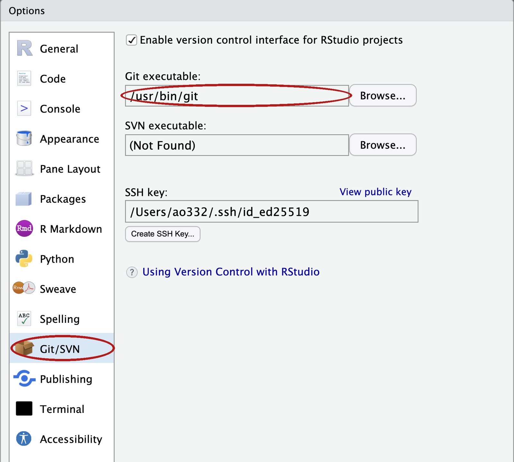{fig-align="center" fig-alt="RStudio's Global Options window on the Git/SVN page, with the Git executable box showing a path and circled in red."}

**3. Tell git who you are.** In the Terminal tab, with your name and the
email on your GitHub account. Enter after each line:

```bash
git config --global user.name "Your Name"
git config --global user.email "you@cornell.edu"
git config --global pull.rebase false
```

No output means it worked. Every snapshot you take will carry this name.
The third line picks the simpler of two behaviours for a situation in the
practice set, and the first time you upload in the browser and push from
your laptop.

Then make the folder where every repository this semester will live. That
folder must not be inside Dropbox, OneDrive, Google Drive or iCloud Drive;
on a Mac, *Desktop* and *Documents* often are.

*Mac.* In the same Terminal tab: `mkdir ~/github` (`File exists` is also
fine). `~` is your home folder, and it is not synced.

*Windows.* Not in the Terminal: inside RStudio, `~` is *Documents*, which
OneDrive often syncs, so `mkdir ~/github` would put the folder in the
wrong place. In RStudio's **Console** instead, Enter after each line:

```r
Sys.getenv("USERPROFILE")
dir.create(file.path(Sys.getenv("USERPROFILE"), "github"))
```

The first prints `[1] "C:\\Users\\<name>"` (R doubles the backslashes on
screen; the folder is `C:\Users\<name>`). Write down that `<name>`: it is
your Windows username and you type it in step 5. The second prints
nothing; no output means it worked. If it prints a warning ending in
`already exists`, that is also fine. Check in File Explorer: **This PC →
C: → Users → your name → github** exists.

**4. Get a token so your laptop can talk to GitHub.** GitHub does not
accept your password from a program; it accepts a **token** (a *personal
access token*): a long random string that a program shows GitHub in place
of your password, and that you can revoke without changing the password.
In RStudio's *Console* (not the Terminal):

```r
install.packages(c("usethis", "gitcreds"))
usethis::create_github_token()
```

If R asks whether to use a personal library, answer Yes; if it asks about
installing from sources, answer No.

Your browser opens GitHub's *New personal access token (classic)* page
with the right boxes already ticked. Type anything in **Note**
(`AEM 6850 laptop`), set **Expiration** to **Custom** and pick a date
after **December 31, 2026**. Scroll down, click **Generate token**,
and copy the long string that starts with `ghp_` (the copy icon next to
it). You will not see it again.

{fig-align="center" fig-alt="GitHub's New personal access token page with the Expiration dropdown and the Generate token button circled in red."}

Back in the Console:

```r
gitcreds::gitcreds_set()
```

Paste the token at the `? Enter password or token:` prompt and press
Enter. It prints `-> Adding new credentials...`,
`-> Removing credentials from cache...` and `-> Done.` The token is now in
your computer's keychain; git will use it without asking. Do not paste it
anywhere else.

*If step 4 fails on Windows*, skip it. The first time git talks to GitHub,
a sign-in window opens; sign in there once and it remembers.

**5. Make a repository, commit once in the browser, clone it.** A
private repository under your own account; a successful clone then
proves the token can read a private repository.

*Make it.* On [github.com](https://github.com), click **+** at the top
right → **New repository**. Repository name: `git-practice`. Select
**Private**. Tick **Add a README file**. Click **Create repository**.
The page that opens is the repository: one file, `README.md`.

*Commit once in the browser.* Click `README.md`, then the pencil icon at
the top right of the file. Add one line at the end, with your name and
your program:

```
Your Name, PhD student in Applied Economics.
```

Click the green **Commit changes…** button. In the dialog, replace the
text in the message box with `add my intro`, leave *Commit directly to
the main branch* selected, and click **Commit changes**. The front page
now reads **2 Commits**. This is the last snapshot you take in the
browser; on Tuesday you take them from your laptop.

*Clone it.* On the front page click the green **Code** button and, on
the **HTTPS** tab, click the copy icon beside the address. It reads

```
https://github.com/<your-username>/git-practice.git
```

**File → New Project → Version Control → Git.** Repository URL: paste
the address.

{fig-align="center" fig-alt="RStudio's New Project dialog for a Git repository, with the Repository URL box filled, the subdirectory box showing /Users/ao332/github, and the Create Project button circled in red."}

*Create project as subdirectory of:* this box cannot be typed in. Click
**Browse…** and pick the `github` folder you made in step 3. On a Mac it
is inside your home folder (the house icon, or **Go → Home** in the
dialog). On Windows the dialog opens in *Documents*, which is often
OneDrive; do not stop there. Go to **This PC → C: → Users → your name →
github**, select it, and click **Open**. The box then shows the full
path, ending in `github`. **Create Project.** A window shows `Cloning into
'git-practice'...`. On a Mac, if a dialog asks whether
*git-credential-osxkeychain* may use your confidential information, click
**Always Allow**: that is git reading the token from step 4, not an error.
RStudio restarts inside the new project, the Files pane lists `README.md`
and `git-practice.Rproj`, and a **Git** tab appears top-right listing
those two plus `.gitignore` (the Files pane usually hides it, because its
name starts with a dot; the Git tab never does). RStudio made the two new
files and we deal with them in class.

*Already cloned your onboarding repository from the course organization
instead?* Keep it. It has the same two commits, `Initial commit` and
`add my intro`, and everything on Tuesday works there the same way.

**6. Test the rest.** In the new project, **Tools → Terminal → New
Terminal**. The prompt shows `git-practice` just before the `%` (Mac) or
on the line above the `$` (Windows). Type these two lines,
Enter after each:

```bash
git config user.name
git push
```

The first prints your name. The second prints `Everything up-to-date`: git
signed in to GitHub with permission to write, and changed nothing. That is
a pass. If the second asks for a username and password, repeat step 4. If
the first prints nothing, repeat step 3. Do nothing else in this project
before Tuesday.

`Repository not found`: repeat step 4 (`gitcreds::gitcreds_set()` again,
and choose the option to replace the stored token), and check that the
address is the one the Code button gave you. *git not found* or no Git
tab: repeat step 2. Anything else: bring the laptop to class; the first
exercise has a browser-only path.

:::

*Diagnostic:* in the Terminal,
`git ls-remote https://github.com/<your-username>/git-practice.git`
prints two lines of hashes when the token reaches the private repository,
`Repository not found` when a stored token cannot, and asks for a username
when no token is stored at all (press Ctrl+C and repeat step 4).

*Privacy:* every commit carries the email from step 3; if you would rather
not publish it, GitHub gives you a `noreply` address at
[github.com/settings/emails](https://github.com/settings/emails) (tick
*Keep my email addresses private*). Set that in step 3 instead. Course
repositories are private, so this is optional.

:::

## Objectives {#objectives .smaller}

By the end of this session you can:

- Draw the picture: a folder, a timeline of snapshots, two copies of it
  (your laptop and GitHub), and the three places a change can be.
- Say where a change is right now — working folder, staging area, or
  history — from `git status` alone.
- Clone a repository into an RStudio project, commit a change with a
  message that says why, push it, and pull a change made on GitHub.
- Read a diff, including one a model wrote, and say in one sentence what
  changed.
- Undo at each place: discard an edit, unstage a file, fix the last
  commit's message.
- Say what a branch and a pull request are, and when a solo project needs
  one.

## Plan for today {#plan}

1. Why version control
2. A repository is a folder plus a timeline
3. Two copies: your laptop and GitHub
4. Three places a change lives
5. Push and pull
6. Undoing at each place
7. Branches, pull requests, and what stays out of a repository

## A folder without version control {#chaos}

```
analysis_v1.R
analysis_v2.R
analysis_FINAL.R
analysis_FINAL_v2.R
analysis_REALLY_FINAL.R
analysis_FINAL_USE_THIS.R
```

- Which one made Table 2?
- What changed between `FINAL` and `FINAL_v2`?
- Which one still runs?

::: {.content-visible when-format="revealjs"}

::: {.notes}
Everyone has this folder. The cost is not the clutter. It is that you
made a choice somewhere in there that you cannot reconstruct.
:::

:::

::: {.content-hidden when-format="revealjs"}

Everyone has this folder. The clutter is not the cost. The cost is that
somewhere in there you changed something that worked, and you cannot
remember what. The file names say that you were worried; they do not say
what you did.

The tool today is **version control**: a program that records every
state a folder has been in, each with a note, so that you can compare any
two states later. It answers all three questions above, for every file,
forever, and it does so without a single `_v2` in a file name.

:::

## Three questions version control answers {#three-questions}

- **What did I change since the version that worked?** You, four months
  later, when a coefficient moved.
- **What exactly did this edit change?** A coauthor, or a tool that
  writes forty lines in ten seconds, hands you a file. The change is what
  you review, not the file.
- **Who changed this line, when, and why?** Two people, one script, no
  emailing of `paper_v3_jane_edits.R`.

::: {.content-visible when-format="revealjs"}

::: {.notes}
The second one is why this matters more this year than last. When
something else writes code for you, the difference between before and
after is the only thing you can actually check.
:::

:::

::: {.content-hidden when-format="revealjs"}

Version control works by taking a **snapshot**: the whole folder as it
was at one moment, saved together with a note on what changed and why.
Three situations show what the snapshots buy you.

*The coefficient that moved.* You present a table in a seminar in April.
In August you rerun the script for the paper and one coefficient is
different. You did not mean to change that script. Without snapshots you
reread every line and hope. With snapshots you ask for the difference
between the April version and today's, and read a screen of changed
lines instead of a file.

*The edit that is mostly right.* A coauthor sends back your script with
"a few small fixes". A coding tool rewrites a block in ten seconds. In
both cases you receive a file, and a file is the wrong thing to review.
What you want to review is the change: which lines are different now,
and only those. A snapshot taken before the edit is what makes that
question answerable afterwards.

*The referee, three months later.* The referee asks why 2019 is dropped
from the sample. You and your coauthor both edited the cleaning script
that spring. Every snapshot carries a name, a date and a message, so the
question "who dropped 2019, when, and why" has a written answer, and
nobody has to reconstruct it from email.

A fourth benefit needs one line. A copy of the folder and all its
snapshots kept on GitHub is a backup, so a stolen laptop costs an
afternoon, not a project.

:::

## What a model's edit looks like {#model-edit}

```{=html}
<style>
code.diff span.st { color: #b31b1b; }
code.diff span.va { color: #1a7f37; }
</style>
```

```diff
 # analysis.R -- days above the PM2.5 standard
-STANDARD <- 35
+STANDARD <- 9
 pm <- read.csv("data/epa_pm25_la_fires_2024_2025.csv")
+stopifnot(nrow(pm) > 0)
```

- You asked for the last line.
- Nobody asked for the `-`/`+` pair in the middle: 35 became 9.
- **What did the model change?** That is the question for the rest of the
  day.

::: {.content-visible when-format="revealjs"}

::: {.notes}
Green is added, red is removed. Git prints three more lines above this;
they come when we run a diff ourselves. You asked for a check; you also
got a different air-quality standard. Nine is a real EPA number, the
annual one. A model that corrects your constant is not being malicious;
it is being confident. This picture does not care about confidence. You
read your first one of these in ten minutes.
:::

:::

::: {.content-hidden when-format="revealjs"}

The block above is a **diff**: two versions of a file compared line by
line, each removed line marked `-`, each added line marked `+`, unmarked
lines unchanged and shown so you know where you are. Nothing here was
run; it is what a coding assistant did to a three-line script when asked
to add a check that the data file is not empty. The check is the last
line, and it is what you asked for. The pair in the middle is not: the
model replaced the daily PM2.5 standard, 35, with 9. Nine is a real EPA
number, the annual one, so the line looks plausible, and it is wrong for
a script that counts days. The model's own summary of its work would
probably not mention it, because from the model's side it was a
correction rather than a change.

That is the case for version control in the year you are learning to
code. A model writes forty lines in ten seconds. Most are right. A few are
subtly wrong, and the wrong ones look exactly like the right ones. Reading
forty new lines cold is slow, so you skim. Reading five changed lines is
fast, so you do not.

The transcript says what the model meant to do. The diff says what it
did. Only the diff treats the two edits above the same way, as lines that
are different now, and only the diff is short enough to read in full every
time. It is the one thing you can actually check.

The diff is only this clean because the starting point was clean. If a
tool edits a folder that already holds your own half-finished changes, the
diff mixes the two and you cannot tell whose line is whose. Take a
snapshot of your own work first. Then everything the diff shows is the
model's, and nothing else.

Version control also has an undo for exactly this situation,
`git restore` (shown under [git restore: discard the edit](#restore)),
which puts a file back the way it was at the last snapshot. That one command is
what makes trying cheap: ask for the change, read the diff, keep it or
throw it away. You are never more than one command from the version that
worked, so there is no reason to be shy about asking.

Finally, the timeline is the record. A snapshot whose note says
`add empty-file check` is yours; one whose note says `model: rewrite the
cleaning step` is not, if you write it that way. Say in the message when
a model wrote the change; it costs six characters. Six months from now that difference matters, to
you and to anyone who reads the paper. Written into the timeline, the
split between what a model wrote and what you wrote is a fact. In your
memory, it is a guess.

:::

## git and GitHub are two different things {#git-vs-github}

| | git | GitHub |
|:--|:--|:--|
| What | a program on your laptop | a website |
| Does | takes and keeps snapshots of a folder | keeps a copy of the snapshots and shows them in a browser |
| Needs the internet | no | yes |
| You have used it | not yet | once: `add my intro`, before class. Twice, once you upload hw1 |

::: {.content-visible when-format="revealjs"}

::: {.notes}
Every commit you have made so far, GitHub made for you. Today you make
them yourself, and you see what the button was doing.
:::

:::

::: {.content-hidden when-format="revealjs"}

**git** is a program that runs on your laptop; it takes snapshots of a
folder and keeps them, and it works with no internet connection at all.
**GitHub** is a website that stores a copy of those snapshots and shows
them in a browser, so that a coauthor, a grader, or you on another
machine can see them.

The two are separate. You can use git for a year and never put a
folder's snapshots on GitHub. You can, as you have so far, use GitHub without git
on your laptop: every snapshot you have made so far was taken by GitHub
when you clicked a button in the browser. Today you take them yourself,
and you see what the button was doing.

:::

## A repository is a folder plus a timeline {#repository}

::: {.content-visible when-format="revealjs"}

{fig-align="center" height="440" fig-alt="A folder labelled git-practice/ containing README.md and a dashed, hidden .git/ entry, beside a horizontal timeline with two circles labelled Initial commit and add my intro; a bracket spanning both halves is labelled repository."}

::: {.notes}
Left is the folder you already know: the repository you cloned before
class, one file, `README.md`. Right is the part that is new: a line of
snapshots, oldest to newest, each with a message. Two of them, and you
made the second. The timeline is stored inside the folder, in a hidden subfolder
called `.git`. Folder plus timeline. That is a repository. Everything
today is a verb that acts on one or the other.
:::

:::

::: {.content-hidden when-format="revealjs"}

{fig-align="center" fig-alt="A folder labelled git-practice/ containing README.md and a dashed, hidden .git/ entry, beside a horizontal timeline with two circles labelled Initial commit and add my intro; a bracket spanning both halves is labelled repository."}

A **repository** is a folder plus a timeline of the snapshots taken of
it. The left half of the picture is the folder you already know: the
`git-practice` repository you made before class holds one file,
`README.md`. The right half is the new part: a line of snapshots, oldest
on the left, each with a message. There are two, and you made the second
one in the browser.

The timeline lives inside the folder, in a hidden subfolder called
`.git`. Never open it. If you delete it, the files survive but the
timeline is gone; if you copy the folder with `.git` inside, the timeline
comes along.

One thing to get right from the start: a snapshot records the whole
folder as it was at one moment, not the difference from the previous one.
Git computes the difference between any two snapshots when you ask for
it. That is why you can ask "what changed between Tuesday and today"
without having planned for the question on Tuesday.

:::

## Your repository on GitHub {#reveal-repo}

::: {.content-visible when-format="revealjs"}

:::: {.columns}
::: {.column width="60%"}
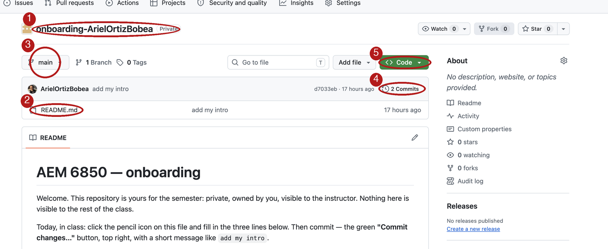{width="100%" fig-alt="The front page of the onboarding-ArielOrtizBobea repository on GitHub, with five numbered red circles on the repository name, the file list, the main dropdown, the 2 Commits link, and the green Code button."}
:::
::: {.column width="40%"}
1. **Name** — owner / repository
2. **Files** — `README.md`, the only file
3. **`main`** — the timeline's name
4. **`2 Commits`** — two snapshots
5. **Code** — where a copy comes from
:::
::::

::: {.notes}
This is my repository. Yours is `git-practice`, under your own account,
and the page looks the same. The name is the owner, a slash, the
repository; my owner is the course organization, yours is your username.
Every repository starts with one timeline, and it is called `main`. You clicked
the green button for the hw1 ZIP. Everything you have done with this page
so far treated it as a folder on a website. Item 4 is what makes it not a
folder.
:::

:::

::: {.content-hidden when-format="revealjs"}

{fig-align="center" fig-alt="The front page of the onboarding-ArielOrtizBobea repository on GitHub, with five numbered red circles on the repository name, the file list, the main dropdown, the 2 Commits link, and the green Code button."}

Open your `git-practice` repository in the browser:
`github.com/<your-username>/git-practice`. It looks like the picture,
which is mine. Five things on this page matter today.

1. **The name.** The owner, then a slash, then the repository. For yours
   the owner is your username; for mine it is `aem6850-cornell`, the
   course organization. Together they are the repository's full name, and
   they are the first part of its address.
2. **The file list.** `README.md` is the only file. Until today, this
   list is all you have looked at, and you treated the page as a folder
   on a website.
3. **`main`.** The dropdown at the top left of the file list names the
   timeline you are looking at. Every repository starts with one
   timeline, and it is called `main`.
4. **`2 Commits`.** The clock icon and the count at the top right of the
   file list. Two snapshots. This link is what makes the page a
   repository and not a folder; it opens the timeline.
5. **Code.** The green button. It is where a copy of the repository comes
   from: you clicked it for the ZIP, and today you use it for the address.

:::

## The history: the Commits page {#reveal-commits}

::: {.content-visible when-format="revealjs"}

:::: {.columns}
::: {.column width="60%"}
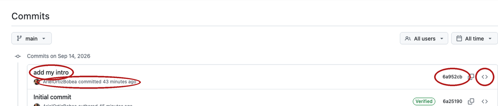{width="100%" fig-alt="The Commits page of the onboarding repository showing two rows, add my intro above Initial commit, with one row's message, author and time, seven-character hash, and angle-bracket icon circled in red."}
:::
::: {.column width="40%"}
- **Message**: `add my intro`. The only part a human wrote.
- **Author and when**: your username, the date.
- **Hash**: seven characters of a forty-character ID.
- **`<>`**: the whole folder as it was then.
:::
::::

::: {.notes}
Newest on top. Two snapshots. The bottom one GitHub made when the
repository was created. The top one is yours: you edited the README in the browser
and clicked Commit changes. That click took a snapshot and wrote your
message on it. Your hw1 repository has the same page, and the upload
button did the same thing there, with a message GitHub wrote: `Add files
via upload`. From now on you write it.
:::

:::

::: {.content-hidden when-format="revealjs"}

{fig-align="center" fig-alt="The Commits page of the onboarding repository showing two rows, add my intro above Initial commit, with one row's message, author and time, seven-character hash, and angle-bracket icon circled in red."}

Click `2 Commits`. The page that opens is the **history**: the timeline
as a list, newest on top. Each row is one **commit**, which is git's word
for a snapshot together with who took it, when, and why. The bottom row,
`Initial commit`, was made by GitHub when the repository was created. The top row,
`add my intro`, is yours: you edited the README in the browser and clicked
*Commit changes*. That click took a snapshot and wrote your message on it.

Each row has four parts.

- **Message.** `add my intro` is the **commit message**: the one line a
  human writes to say what the snapshot changed and why. It is the only
  part of the row a person typed.
- **Author and when.** Your username and the date. Git fills these in
  from the name and email you set before class.
- **Hash.** The seven characters at the right are the start of the
  commit's hash, a forty-character ID that git computes from the
  snapshot's contents. Git names commits by this ID, not by a number, so
  the first seven characters are how you point at one.
- **`<>`.** The angle-bracket icon opens the whole folder as it was at
  that commit, so you can browse any file at any point in the timeline.

:::

## One commit, opened: the diff {#reveal-diff}

::: {.content-visible when-format="revealjs"}

:::: {.columns}
::: {.column width="60%"}
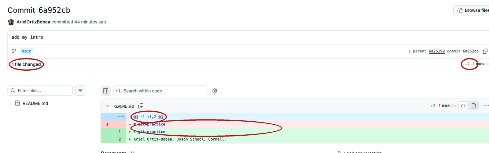{width="100%" fig-alt="The commit page for add my intro on GitHub, with the 1 file changed count and its +3 −3 badge, the grey @@ -9,9 +9,9 @@ row, and one red and green line pair circled in red."}
:::
::: {.column width="40%"}
- `+3 −3` — three lines changed
- red `-` / green `+` — the line as it was, as it is
- `@@ -9,9 +9,9 @@` — where in the file
- a **diff** — two snapshots, line by line
:::
::::

::: {.notes}
This is the most important picture of the day. A commit is not a copy of
the file; it is a snapshot you can compare to the one before. The
comparison is a diff. The badge says +3 −3: I filled in three lines of
my README in place, so three red, three green. Yours says +1: one line
added at the end, nothing removed. Both are one edit, read as lines.
:::

:::

::: {.content-hidden when-format="revealjs"}

{fig-align="center" fig-alt="The commit page for add my intro on GitHub, with the 1 file changed count and its +3 −3 badge, the grey @@ -9,9 +9,9 @@ row, and one red and green line pair circled in red."}

Click the message `add my intro`. The page that opens is the commit
itself, shown as a diff against the commit before it. This is the most
important picture of the day: a commit is not a copy of the file, it is a
snapshot you can compare to the one before, and the comparison is what
you read.

- **`1 file changed`, `+3 −3`.** One file differs between the two
  snapshots, and in it three lines were removed and three were added:
  I filled in three lines of my README in place, so each old line is
  paired with a new one. Your badge says `+1`: the line you added at the
  end before class, and nothing removed. Both are one edit, read as
  lines.
- **Red `-` and green `+`.** A red line with `-` is the line as it was.
  A green line with `+` is the line as it is now. When a line was edited
  rather than added, the two sit together as a pair.
- **`@@ -9,9 +9,9 @@`.** The grey row says where in the file you are: old
  lines 9 to 17, new lines 9 to 17. You will rarely need the numbers.
- **Unmarked lines.** Everything with no `-` or `+` is context: lines
  that did not change, shown so you can see where the change sits.

:::

## How to read a diff {#read-diff}

```
--- a/analysis.R
+++ b/analysis.R
@@ -1,3 +1,4 @@
```

- `--- a/` is the old version, `+++ b/` the new.
- `@@ ... @@` says where in the file. You rarely need the numbers.
- A **changed** line shows as one `-` and one `+`. Read them as a pair.
  A pure addition is `+` alone.
- **Read every `-` first.** A removal you did not ask for is the
  dangerous one.
- Ask of every diff: *is this the change I meant, and only that?*

::: {.content-visible when-format="revealjs"}

::: {.notes}
Rule four is the one to remember. Additions are usually what you asked
for. Removals are where the surprises hide.
:::

:::

::: {.content-hidden when-format="revealjs"}

When git prints a diff in the Terminal, three header lines sit above the
body that GitHub shows. The first two name the file twice: `--- a/` is
the old version and `+++ b/` is the new one. The third is the `@@` row from
the commit page above. After the header come the lines, marked or not.

Read the five rules in order, and apply the fourth one every time. In the
model's edit above, the only `-` line is `STANDARD <- 35`,
and it is the line that should have stopped you. Additions are usually
what you asked for. Removals are where the surprises hide. The last rule
is the question a diff exists to answer: is this the change I meant, and
only that? If the answer is no, the snapshot waits until it is yes.

:::

::: {.content-hidden when-format="revealjs"}

## Your hw1 repository {#reveal-hw1}

{fig-align="center" fig-alt="The Commits page of hw1-ArielOrtizBobea showing two rows, Add files via upload above Initial commit, with the message Add files via upload circled in red."}

- Download ZIP copied the folder to your laptop, without the timeline.
- Dragging files onto the page took a snapshot on GitHub.
- GitHub wrote the message for you. From now on you write it.

Your hw1 repository has the same Commits page, and the two routes you
used on it are the two halves of today. *Download ZIP* copied the files as
they were at one moment, with no timeline; that is why the folder on your
laptop has no history to show. Dragging files onto the repository page
took a snapshot on GitHub, and GitHub wrote the message for you:
`Add files via upload`.

The browser route still works for hw1 this week. The difference is where
the snapshot is taken. In the browser, GitHub commits whatever you dropped
and you read the diff afterwards. On your laptop, you read the diff first
and commit second. The second order is the whole point.

:::

## Local and remote: two copies of one timeline {#two-copies}

::: {.content-visible when-format="revealjs"}

{fig-align="center" height="270" fig-alt="A laptop on the left and a box labelled GitHub (origin) on the right, each with an identical timeline of three circles beneath it; a wide dashed arrow from GitHub to the laptop labelled git clone, once; a thin arrow from laptop to GitHub labelled git push; a thin arrow from GitHub to laptop labelled git pull; a pencil on the GitHub box labelled browser edit or upload."}

- **Clone** makes the first copy, once.
- **Push** sends your new snapshots up. **Pull** brings GitHub's down.
- A pencil edit or an upload in the browser is a snapshot on GitHub's
  copy. Nothing arrives on your laptop until you pull.

::: {.notes}
Two copies, same timeline, three verbs. There is no 'sync': you say which
direction, every time. That is a feature.
:::

:::

::: {.content-hidden when-format="revealjs"}

{fig-align="center" fig-alt="A laptop on the left and a box labelled GitHub (origin) on the right, each with an identical timeline of three circles beneath it; a wide dashed arrow from GitHub to the laptop labelled git clone, once; a thin arrow from laptop to GitHub labelled git push; a thin arrow from GitHub to laptop labelled git pull; a pencil on the GitHub box labelled browser edit or upload."}

A repository usually exists twice. The copy on your laptop is the
**local** one; the copy on GitHub is the **remote** one. They hold the
same timeline, and three verbs move it between them.

- **Clone** makes the local copy from the remote one: it downloads the
  whole repository, timeline included, and remembers where it came from.
  You do it once per repository.
- **Push** sends the snapshots you have taken on your laptop up to
  GitHub.
- **Pull** brings the snapshots that exist on GitHub down to your
  laptop.

There is no "sync". You say which direction, every time, and nothing
moves until you say so. That is a feature: a change on one copy never
surprises you on the other. In particular, a pencil edit or a file upload
in the browser is a snapshot taken on GitHub's copy only. Nothing arrives
on your laptop until you pull.

:::

## The address of a repository {#repo-url}

::: {.content-visible when-format="revealjs"}

:::: {.columns}
::: {.column width="60%"}
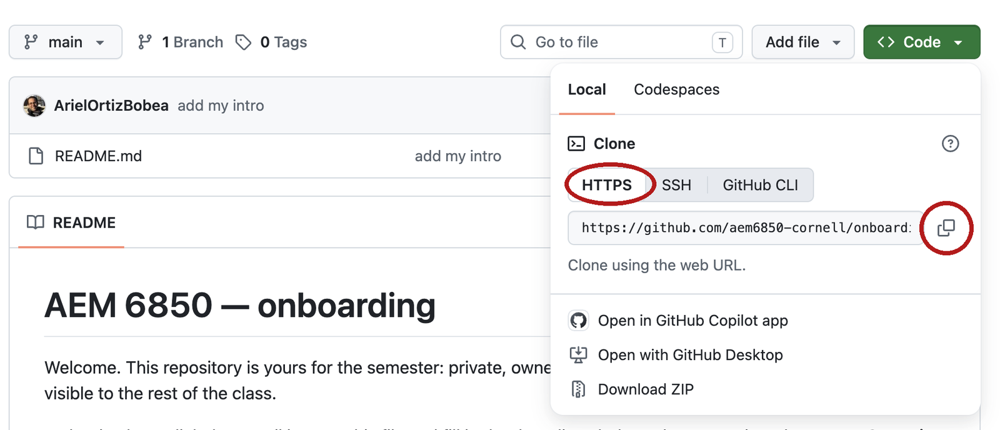{width="100%" fig-alt="The green Code button open on the onboarding repository's front page, with the HTTPS tab and the copy icon beside the .git address circled in red."}
:::
::: {.column width="40%"}
- The URL is the repository's address. Every clone, push and pull uses
  it.
- It ends in `.git`. That is part of the address, not the hidden folder.
- Use the **HTTPS** tab, not SSH and not GitHub CLI. The token from
  Before class is what makes HTTPS work.
:::
::::

:::

::: {.content-hidden when-format="revealjs"}

{fig-align="center" fig-alt="The green Code button open on the onboarding repository's front page, with the HTTPS tab and the copy icon beside the .git address circled in red."}

On the repository's front page, click the green **Code** button. A panel
opens on its **Local** tab; under *Clone* are three small tabs, and
**HTTPS** is usually already selected. Click it if it is not. The box
beneath shows the repository's address:

```
https://github.com/aem6850-cornell/onboarding-ArielOrtizBobea.git
```

Click the copy icon at the right of the box. That address is what every
clone, push and pull uses to find the remote copy. Three things to know
about it.

- It is the repository's full name, owner and repository, with
  `https://github.com/` in front and `.git` on the end. Yours reads
  `https://github.com/<your-username>/git-practice.git`.
- The `.git` is part of the address. It is not the hidden folder on your
  laptop, and you do not leave it off.
- Use the **HTTPS** tab, not SSH and not GitHub CLI. HTTPS is the route
  the token from Before class was made for; the other two need setup you
  have not done.

:::

## Clone into an RStudio project {#clone}

::: {.content-visible when-format="revealjs"}

:::: {.columns}
::: {.column width="60%"}
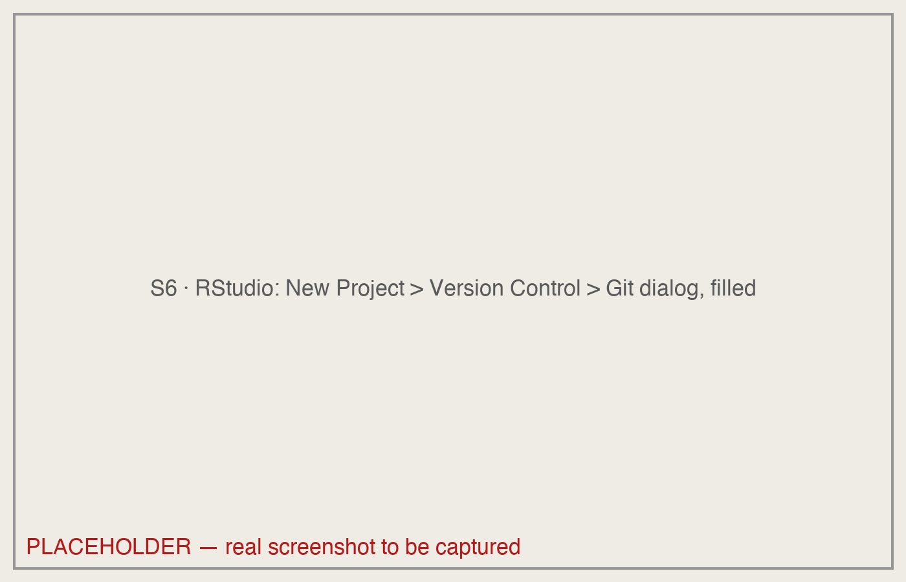{width="100%" fig-alt="RStudio's New Project dialog for a Git repository, with the Repository URL box filled, the subdirectory box showing ~/github, and the Create Project button circled in red."}
:::
::: {.column width="40%"}
- File → New Project → **Version Control** → **Git**. Paste the URL.
  Subdirectory: **Browse…** to your `github` folder.
- **Create Project.** RStudio runs one command, `git clone`. The clone
  lands in `github/git-practice`.
:::
::::

::: {.notes}
Clone means: download the whole repository, timeline included, and
remember where it came from. The dialog is a wrapper on one command, `git
clone` and the address, which every tutorial and every AI assistant will
tell you to type; it is printed on the page. And notice: the folder can
land anywhere on your disk. Your scripts still run, because paths inside a
project are relative to the project's top folder — that is why
`hw1.Rproj` sits at the top of hw1.
:::

:::

::: {.content-hidden when-format="revealjs"}

{fig-align="center" fig-alt="RStudio's New Project dialog for a Git repository, with the Repository URL box filled, the subdirectory box showing /Users/ao332/github, and the Create Project button circled in red."}

You did this before class, step 5. Read this section against the project
you already have, and do not clone a second time: RStudio refuses a
folder that already exists. To reopen the project, **File → Recent
Projects → git-practice**.

In RStudio, **File → New Project → Version Control → Git**. Three boxes.

1. **Repository URL.** Paste the address you copied.
2. **Project directory name.** RStudio fills this in from the address:
   `git-practice` for yours, `onboarding-ArielOrtizBobea` for mine in the
   picture. Leave it.
3. **Create project as subdirectory of.** The box cannot be typed in.
   Click **Browse…** and pick your `github` folder: inside your home
   folder on a Mac, `C:\Users\<you>\github` on Windows.

Click **Create Project**. RStudio runs one command and shows its output
in a small window:

```bash
git clone https://github.com/<your-username>/git-practice.git
#> Cloning into 'git-practice'...
#> remote: Enumerating objects: 6, done.        # GitHub's lines; counts vary
#> remote: Counting objects: 100% (6/6), done.
#> ...
#> Receiving objects: 100% (6/6), done.
```

*`...` stands for lines left out of a block: here, more of GitHub's
progress lines; later, lines you have already seen in an earlier block.*

The dialog is a wrapper on that one line, `git clone` and the address,
which every tutorial and every AI assistant will tell you to type. The
clone lands in `github/git-practice`: the files, plus the hidden `.git`
that holds the timeline. RStudio adds a project file, `git-practice.Rproj`,
and restarts inside the new project.

Two things about where the folder lands. First, it can be anywhere on
your disk and your scripts still run, because paths inside a project are
relative to the project's top folder. Second, `~` is your home folder on
a Mac. On Windows, RStudio's `~` is *Documents*, which is why the box gets
the full path `C:/Users/<you>/github` with forward slashes. The github
folder is where every repository goes, and it must not be inside Dropbox,
iCloud Drive, OneDrive or Google Drive: two sync tools fighting over
`.git` corrupt it silently. GitHub is the cloud copy. On a Mac, *Desktop*
and *Documents* are often iCloud folders; on Windows, *Documents* is often
OneDrive; the github folder is neither.

:::

## The Terminal tab and the Git pane {#layout}

::: {.content-visible when-format="revealjs"}

:::: {.columns}
::: {.column width="60%"}
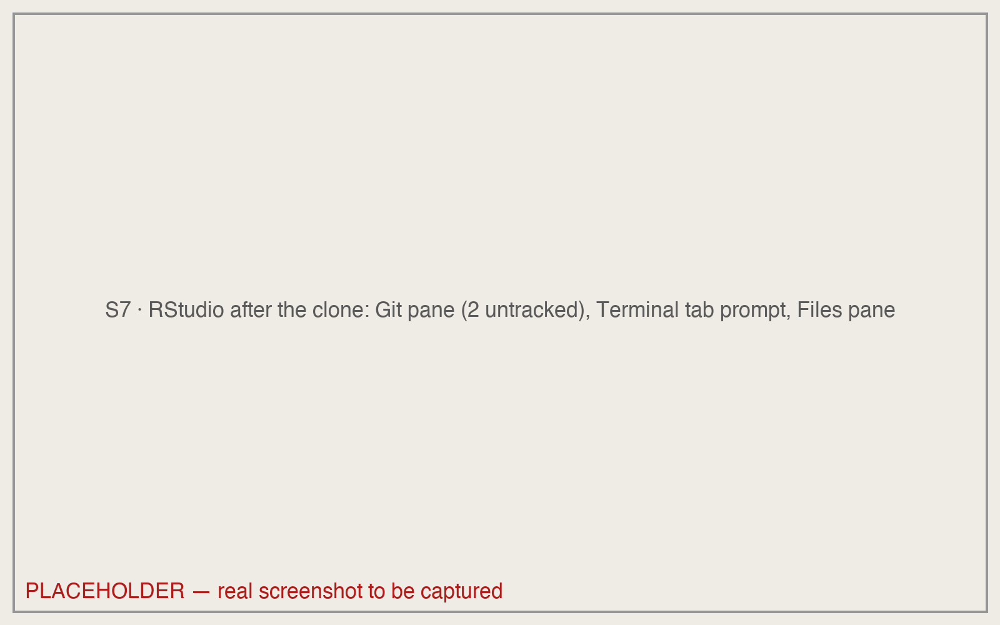{width="100%" fig-alt="RStudio just after the clone, annotated: the Git tab top-right listing .gitignore and the .Rproj file with yellow question marks, the Terminal tab bottom-left with a prompt showing onboarding-ArielOrtizBobea, and the Files pane listing README.md and onboarding-ArielOrtizBobea.Rproj."}
:::
::: {.column width="40%"}
- **Tools → Terminal → New Terminal.** The prompt shows the project's
  name, then `%` or `$`. Type after it, press Enter.
- The **Git** pane top-right shows the same state. Watch it, do not click
  it, for now.
- For the next ten minutes, watch. You type in the exercise.
:::
::::

::: {.notes}
Everything from here is typed at that prompt. The Git pane is a window
onto the same state; it changes every time we run something. For the next
ten minutes, watch. You do all of this yourself in the exercise, with the
slide on screen.
:::

:::

::: {.content-hidden when-format="revealjs"}

{fig-align="center" fig-alt="RStudio just after the clone, annotated: the Git tab top-right listing .gitignore and the .Rproj file with yellow question marks, the Terminal tab bottom-left with a prompt showing onboarding-ArielOrtizBobea, and the Files pane listing README.md and onboarding-ArielOrtizBobea.Rproj."}

After the restart, RStudio is open inside the new project. Three panes
matter today.

**The Terminal tab.** **Tools → Terminal → New Terminal** opens a tab
named *Terminal* next to the Console, already inside the project folder.
Every git command is typed there: type after the prompt, press Enter, read
what comes back. The prompt shows the project's name just before the `%`
on a Mac, or on the line above the `$` on Windows. On Windows the prompt
has two lines: the first ends in `MINGW64 …/git-practice (main)`, the
second is `$`. That is Git Bash, and it is correct.

**The Git pane.** A tab named **Git** sits top-right, beside Environment.
It lists files whose state differs from the last snapshot, each with an
icon. Right now it shows two rows with a yellow `?`: `.gitignore` (a list of
files git should leave alone; explained under
[.gitignore: what git should not track](#gitignore)) and
`git-practice.Rproj`, the two files RStudio made when it built the
project (the picture shows mine, with my repository's name). The pane
shows the same state a command reports, so you can read
it as a mirror of what you typed. It refreshes on a timer, not after every
command, so it can lag a few seconds; click its refresh icon when it does.
Watch it for now; do not click in it.

**The Files pane.** It lists `README.md` and `git-practice.Rproj`.
On most laptops it does not list `.gitignore`, because the Files pane
hides any file whose name starts with a dot unless you tick *More → Show
Hidden Files*; the Git pane never hides it.

:::

## git status: where things stand {#status}

```bash
git status
#> On branch main
#> Your branch is up to date with 'origin/main'.
#>
#> Untracked files:
#>   (use "git add <file>..." to include in what will be committed)
#>         .gitignore
#>         onboarding-ArielOrtizBobea.Rproj
#>
#> nothing added to commit but untracked files present (use "git add" to track)
```

*Lines without `#>` you type. Lines with `#>` are what git prints.*

::: {.content-visible when-format="revealjs"}

- Line 1: the branch, `main`. Line 2: your copy versus GitHub's
  (`origin`).
- **Untracked**: git sees the file; the timeline never has. RStudio made
  both.
- The parentheses name the command that moves each file. Read them; they
  are the manual.

::: {.notes}
`status` is the one command that can never hurt you. It reads, it never
writes. When you are lost, type it. Git's word for a timeline is
*branch*; you have one. `origin` is git's name for GitHub's copy.
:::

:::

::: {.content-hidden when-format="revealjs"}

Type `git status` at the prompt and press Enter. It is the one command
that can never hurt you: it reads, it never writes, and when you are lost
it is the thing to type. Read its reply line by line.

- **Line 1.** `On branch main`. A **branch** is git's word for a
  timeline; every repository starts with one, and yours is called `main`.
- **Line 2.** `Your branch is up to date with 'origin/main'`. Your copy
  of the timeline versus GitHub's. **`origin`** is the name git gives the
  remote copy it was cloned from, so `origin/main` is GitHub's `main`.
  Up to date means the two hold the same snapshots.
- **`Untracked files`.** A file is **untracked** when git can see it in
  the folder but no snapshot has ever included it. RStudio made both of
  these when it built the project. `README.md` is not listed: it is
  **tracked**, meaning a snapshot includes it, and it has not changed
  since.
- **The parentheses.** Each heading carries a hint that names the
  command that moves the files under it. Read them; they are the manual.
  `<file>` is a placeholder: type the file's name, no brackets, as in
  `git add README.md`.
- **The last line.** `nothing added to commit` says the next snapshot,
  if you took one now, would be empty. What to do about the two untracked
  files is the next section.

:::

## git log --oneline: read the timeline {#log}

```bash
git log --oneline
#> d7033eb (HEAD -> main, origin/main, origin/HEAD) add my intro
#> 2df62e3 Initial commit
```

::: {.content-visible when-format="revealjs"}

- One line per snapshot, newest first: the ID, then the message. Same
  two hashes as the Commits page.
- `HEAD -> main`: where you are. `origin/main`: where GitHub's copy is.
  Same place, for now. `origin/HEAD`: the branch GitHub opens by default.
  Ignore it.
- If the screen fills and the prompt disappears, that is the pager.
  Press `q`.

::: {.notes}
This is the picture from slide 2.1 as text. The verb for 'show me the
timeline' is `log`. Same hashes as the browser: that is the proof a clone
is the timeline, not a download.
:::

:::

::: {.content-hidden when-format="revealjs"}

Type `git log --oneline`. The reply is the timeline as text, one line per
snapshot, newest first: the first seven characters of the hash, then the
message. The two hashes are the ones on the Commits page in the browser.
That is the proof that a clone is the timeline itself, not a download of
the files.

The labels in parentheses on the top line say where things stand.
**`HEAD`** is git's name for the snapshot you are currently working from,
and `HEAD -> main` says that is the newest one on `main`. `origin/main` is
where GitHub's copy of the timeline ends; for now it is the same commit.
`origin/HEAD` is the branch GitHub opens by default. Ignore it.

Plain `git log`, without `--oneline`, prints the full forty-character
hash, the author, the date and the whole message for each commit. Either
form can print more than fits on the screen. When that happens the
Terminal hands the output to a **pager**, a viewer that shows one screen
at a time: the prompt disappears, the arrow keys move up and down, and
`q` returns the prompt. If the screen ever fills and the prompt is gone,
press `q`.

:::

## Exercise 1 {#exercise-1}

::: {.panel-tabset}

### Exercise

```bash
# Exercise 1 (7 minutes). Your git-practice repository, on your laptop.
#
# 1. Save your open hw1 scripts first: switching projects restarts R
#    and empties the Environment. Then open the project you cloned
#    before class: File > Recent Projects > git-practice.
#    Not cloned before class? Use the browser path under this box now;
#    clone tonight with Before class step 5, and bring the laptop to
#    office hours if it still fails.
#
# 2. Tools > Terminal > New Terminal, then:   git log --oneline
#    How many commits? Which one did you make in the browser?
#
# 3. git status
#    Under which heading are the two files RStudio made?
#
# Two answers to compare with the room: the number of commits, and the
# heading the two RStudio files sit under.
```

::: {.content-hidden when-format="revealjs"}

*Cloned your onboarding repository from the course organization
instead?* Same exercise, same answers: it has the same two commits.
No repository at all? Do the browser fallback below.

*Cloning now instead of before class:* File → New Project → Version
Control → Git, paste the address from your repository's Code button,
`https://github.com/<your-username>/git-practice.git`, **Browse…** to
your `github` folder. This is here for tonight, not for the seven
minutes of the exercise.

:::

### Solution

```bash
git log --oneline
#> d7033eb (HEAD -> main, origin/main, origin/HEAD) add my intro
#> 2df62e3 Initial commit
git status
#> On branch main
#> Your branch is up to date with 'origin/main'.
#>
#> Untracked files:
#>   (use "git add <file>..." to include in what will be committed)
#>         .gitignore
#>         git-practice.Rproj
#>
#> nothing added to commit but untracked files present (use "git add" to track)
```

::: {.content-visible when-format="revealjs"}

**Two** commits; both RStudio files under **`Untracked files`**.

:::

::: {.content-hidden when-format="revealjs"}

**Two** commits; `add my intro` is yours. Both RStudio files sit under
`Untracked files`: git sees the file, the timeline has never met it.
What to do about that is the next section.

:::

::: {.content-visible when-format="revealjs"}

::: {.notes}
Debrief (1 min). Three or four commits: they edited the README more than
once in the browser, or committed the RStudio files before class. Fine;
the count is theirs. Only the `.Rproj` listed: RStudio did not write a
`.gitignore` on that laptop; one file, same heading.

When it fails, say:

- `Repository not found` or a password prompt: the token did not take, or
  the username in the URL is wrong. Browser fallback now, Before class
  step 4 again tonight; no laptop is debugged during class.
- RStudio says git is not found, or there is no Git pane: Tools → Global
  Options → Git/SVN, the *Git executable* box (Before class step 2).
  Browser fallback now.
- The Terminal prompt does not end in the project name: Tools → Terminal
  → New Terminal opens a fresh one inside the project.
- The screen fills and the prompt is gone: the pager. `q`.
- `git: 'stauts' is not a git command`: a typo; git suggests the nearest
  command on the next line.
:::

:::

:::

::: {.content-hidden when-format="revealjs"}

**Fallback for laptops where git is not working.** Read-only, so nothing
is committed on GitHub that a later clone would have to pull first. No
repository yet? Make it now: the first two parts of Before class step 5
(make it, commit once in the browser) need no git and take two minutes.
Open `github.com/<your-username>/git-practice` and click the commit count
(the clock icon at the top right of the file list). Answer 1 is there.
Then click `add my intro` and read the red and green lines: the same
click you made before class, opened. Note what is *not* there: no
heading, no list of files waiting. The browser has no stop between the
edit and the snapshot (the next section names that stop the staging
area); the line went from the box straight to a snapshot. That missing
stop is the next section. For answer 2, find a neighbour
with a working clone and read their `git status` once.

:::

## Three places a change lives {#three-places}

::: {.content-visible when-format="revealjs"}

{fig-align="center" height="470" fig-alt="Three columns labelled Working folder, Staging area and History. An arrow labelled git add runs from the first column to the second and an arrow labelled git commit -m from the second to the third. Brackets beneath mark git diff between the first two columns and git diff --staged between the last two. A bar along the bottom reads git status: reads all three, changes nothing."}

::: {.notes}
A change is in exactly one of three places. The working folder: the files as you see them in RStudio. The staging area: the list of what the next snapshot will include. History: the timeline. Two verbs move a change to the right: `add`, then `commit`. `status` reads all three and changes nothing. `diff` compares the first two; `diff --staged` compares the last two. Think of it as a shopping cart: the working folder is the store, staging is the cart, commit is *Place order*. Place order does not ship anything. The order sits on your laptop until `git push`, which is the delivery. That is the whole model. Every command in the next ten minutes is one arrow on this picture. Same rule as before: watch now, type in the exercise.
:::

:::

::: {.content-hidden when-format="revealjs"}

{fig-align="center" fig-alt="Three columns labelled Working folder, Staging area and History. An arrow labelled git add runs from the first column to the second and an arrow labelled git commit -m from the second to the third. Brackets beneath mark git diff between the first two columns and git diff --staged between the last two. A bar along the bottom reads git status: reads all three, changes nothing."}

A change is in exactly one of three places, and every command in this
section moves it from one to the next or reports where it is.

The **working folder** is the folder on your disk: the files exactly as
you see them in RStudio's Files pane and editor. Git's own name for it is
the **working tree**, and that is the word `git status` prints. When you
save a file, the change is here and nowhere else.

The **staging area** is the list of changes that the next snapshot will
include. It is a list, not a copy of the folder: you put a change on it
with `git add`, and until you do, the change is not going into the next
commit. History is the timeline itself, the snapshots that already exist.

Two verbs move a change to the right. `git add` moves it from the working
folder to the staging area. `git commit -m` moves everything on the
staging list into a new snapshot on the timeline. Two commands compare
neighbouring columns: `git diff` shows what is in the working folder and
not yet on the staging list, and `git diff --staged` shows what is on the
list and not yet committed. `git status` reads all three and changes
nothing.

Once a commit is taken, the working folder matches the newest snapshot
again. That is the dashed arrow from history back to the working folder
on the picture, and that is the state git calls clean, defined two
sections down.

::: {.callout-note title="The shopping cart"}
The working folder is the store: everything you could buy is on the
shelf. Staging is the cart at checkout, where you can still take things
out. Commit is *Place order*; the confirmation number is the hash, and
`git log` is your order history. Place order does not ship anything: the
order sits on your laptop until `git push`, which is the delivery. The
checkout step exists so you can look at exactly what you are about to
make permanent, and so you can order half of what is in the cart now and
the other half later.
:::

The sections up to `git push` run the loop once on the two files RStudio made,
then again on an edit and a new file. In class you watch these; at home
you can type them in your own `git-practice` project. If you do, your counts
differ later: Exercise 2 will show more than 3 commits, its two RStudio
files will already be committed, and Practice 1 has nothing left to
stage. That is fine; the answers in the room assume you only watched.
Read each `git status` before the next command; it tells you which column
you are in.

:::

## git add: put a change in the staging area {#add}

```bash
git add .gitignore onboarding-ArielOrtizBobea.Rproj
git status
#> On branch main
#> Your branch is up to date with 'origin/main'.
#>
#> Changes to be committed:
#>   (use "git restore --staged <file>..." to unstage)
#>         new file:   .gitignore
#>         new file:   onboarding-ArielOrtizBobea.Rproj
```

::: {.content-visible when-format="revealjs"}

- `add` prints nothing. Silence is success.
- One heading now: `Changes to be committed`. That is the staging area. The hint names the undo for this step; it comes at the end of the hour.
- Nothing is permanent yet. The timeline has not moved. In the Git pane both rows show a green **A** with the *Staged* box ticked.

::: {.notes}
The verb for "this goes in the next snapshot" is `add`. You name the files. Naming them is the habit that keeps data out of a repository.
:::

:::

::: {.content-hidden when-format="revealjs"}

In the Terminal tab, type `git add`, a space, and the names of the two
files, then press Enter. On your laptop the second file is
`git-practice.Rproj` (the block shows mine); type the first few letters
and press Tab, and the terminal completes the name. `add` prints nothing.
Silence is success.

Type `git status` and press Enter. The two files have moved from
`Untracked files` to a new heading, `Changes to be committed`. That
heading is the staging area. A change listed there is **staged**: it is
on the list for the next snapshot, and nothing else has happened to it.
Each row now starts with `new file:` instead of nothing, because git is
telling you what kind of change it will record.

Nothing is permanent yet. The timeline has not moved, and the line under
`On branch main` still says you are up to date with GitHub's copy. The
hint in parentheses names the command that takes a file back out of
staging; it comes later on the page, under
[git restore --staged](#unstage).

On Windows, `add` sometimes prints
`warning: in the working copy of '…', LF will be replaced by CRLF the next time Git touches it`.
That is about line endings and it is harmless. The add worked.

You name the files you add. Naming them is the habit that keeps data out
of a repository: a file you never name never gets in.

::: {.panel-tabset}

### Terminal

1. Type `git add .gitignore git-practice.Rproj` and press Enter. Nothing prints.
2. Type `git status` and press Enter. Both files sit under `Changes to be committed`.

### RStudio Git pane

1. In the Git pane (top right), find the two rows. Each shows a yellow `?` in the *Status* column.
2. Tick the box in the *Staged* column beside each file. The `?` becomes a green **A**.
3. That tick is `git add`. Run `git status` in the Terminal and the two files sit under `Changes to be committed`.

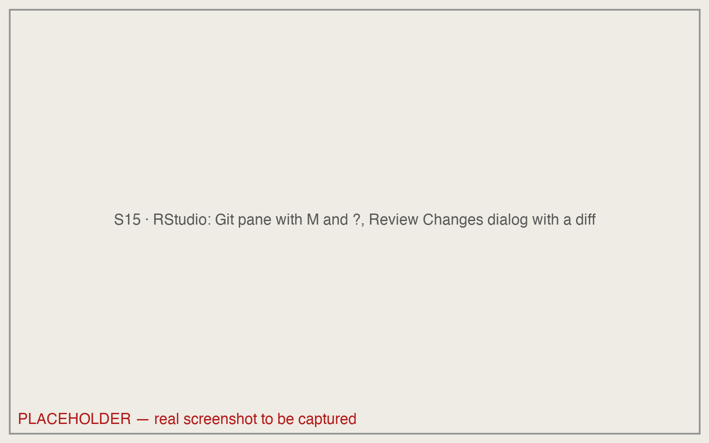{fig-align="center" fig-alt="RStudio's Git pane listing one modified file and one untracked file, and the Review Changes window open beside it with a diff showing red and green lines. The Staged checkbox column and the diff pane are circled."}

:::

:::

## git commit: take the snapshot {#commit-cmd}

::: {.content-visible when-format="revealjs"}

```bash
git commit -m "Add the files RStudio made for the project"
#> [main edd5c7f] Add the files RStudio made for the project
#>  2 files changed, 18 insertions(+)
git status
#> On branch main
#> Your branch is ahead of 'origin/main' by 1 commit.
#>   (use "git push" to publish your local commits)
#>
#> nothing to commit, working tree clean
```

- `-m` is the message. Every commit has one. It says **why**.
- The reply names the timeline, the new ID, and what went in.
- `working tree clean`: the working folder matches the newest snapshot. And a new line: *ahead of origin/main by 1*.

::: {.notes}
Place order. The receipt has the hash and a count of what changed. And status now says two things: nothing pending here, and GitHub is behind. That second line is the cue for a command we get to after the exercise. Forget `-m` and git opens an editor to ask for the message; the next slide shows that screen.
:::

:::

::: {.content-hidden when-format="revealjs"}

```bash
git commit -m "Add the files RStudio made for the project"
#> [main edd5c7f] Add the files RStudio made for the project
#>  2 files changed, 18 insertions(+)
#>  create mode 100644 .gitignore
#>  create mode 100644 onboarding-ArielOrtizBobea.Rproj
git status
#> On branch main
#> Your branch is ahead of 'origin/main' by 1 commit.
#>   (use "git push" to publish your local commits)
#>
#> nothing to commit, working tree clean
```

Type `git commit -m`, a space, and a message in double quotes, then
press Enter. `-m` stands for message. Every commit has one, and it says
why the change was made, not what file it touched: git already knows the
file.

Git replies with a receipt. The first line names the timeline (`main`),
the new commit's hash (yours will differ), and your message. The second
line counts what went in: two files, eighteen added lines. The
`create mode` lines are bookkeeping about file permissions; skip them.

Type `git status` again. Two things changed. The last line now reads
`nothing to commit, working tree clean`. A working folder is **clean**
when it matches the newest snapshot exactly: no edited file, nothing on
the staging list, nothing waiting. And a new line appeared under `On branch main`:
`Your branch is ahead of 'origin/main' by 1 commit.` Your timeline is one
snapshot longer than GitHub's copy. The hint beneath it names the command
that fixes that; it comes after the exercise.

Two symptoms mean the identity step was skipped (the two
`git config --global` lines in Before class, step 3). The first is the
error `*** Please tell me who you are.`, when git cannot guess an email
address; nothing was committed. The second is a paragraph starting
`Your name and email address were configured automatically`, when it
could guess one; the commit went through under a made-up address. In
either case run the two `git config --global` lines in the Terminal, and
the next commits carry your name. Leave the existing commit alone.

::: {.panel-tabset}

### Terminal

1. Type `git commit -m "Add the files RStudio made for the project"` and press Enter. Read the second line of the reply: `2 files changed`.
2. Type `git status` and press Enter. The last line says `working tree clean`; the second line says `ahead of 'origin/main' by 1 commit`.

### RStudio Git pane

1. With both boxes ticked in the *Staged* column, click **Commit** in the Git pane toolbar.
2. The *Review Changes* window opens: the file list on the left, the diff on the right, and a *Commit message* box at the top right. Type the message in that box.
3. Click **Commit** under the box. A small window prints the same receipt as the Terminal; close it.
4. The Git pane is empty now. Open **Commit** again and the Review Changes window's top line reads *Your branch is ahead of 'origin/main' by 1 commit.*

:::

:::

## A screen that asks for a message {#editor}

```

# Please enter the commit message for your changes. Lines starting
# with '#' will be ignored, and an empty message aborts the commit.
```

- **Mac (vim), back out and use `-m` instead:** `Esc`, then `:q!`, Enter. Git prints `Aborting commit due to empty commit message.`; nothing is lost. Then `git commit -m "…"`.
- **Mac (vim), type the message here:** press `i`, type it on the first line, `Esc`, then `:wq`, Enter.
- **Windows (Notepad):** type the message on the first line, save, close the window. Close it empty and git aborts the commit; nothing is lost.

::: {.content-visible when-format="revealjs"}

::: {.notes}
This is not an error and nothing is broken. Git wants a message. The simplest way out: Escape, colon, q, exclamation mark, Enter backs out with nothing lost, then commit again with `-m`. Or press i, type the message, Escape, colon, w, q, Enter. On Windows it is Notepad: type, save, close.
:::

:::

::: {.content-hidden when-format="revealjs"}

Forget `-m` and git opens an editor to ask for the message. The screen
above is the top of it. Nothing is broken; git is waiting for you to
type. On a Mac the editor is vim, which does not respond to typing until
you tell it to. Two ways out. To back out and use `-m` instead: press
`Esc`, type `:q!`, press Enter; git prints
`Aborting commit due to empty commit message.` and nothing is lost, and
you run `git commit -m "…"` next. To type the message here: press `i`,
type it on the first line, press `Esc`, type `:wq`, press Enter. On
Windows the editor is Notepad, if Before class
step 1 was followed: type the message on the first line, save, and close
the window; the commit completes when the window closes. While Notepad is
open the Terminal shows `hint: Waiting for your editor to close the
file...`; that is git waiting, not an error.

If the screen looks different and the bottom two lines mention `^X`, the
editor is nano: type the message, press Ctrl+X, then Y, then Enter.

Next time, `git commit -m "…"` with the message on the command line
avoids the editor entirely. The other time this screen appears is after a
`git pull` that has to join a commit made on GitHub to one of yours. That
version starts with `Merge branch 'main' of …` and is shown under
[After a browser commit and a laptop commit](#diverged), where it is
triggered.

:::

## Edit a file, save a new one: git status {#edit}

::: {.content-visible when-format="revealjs"}

```bash
git status
#> ...
#> Changes not staged for commit:
#>   (use "git add <file>..." to update what will be committed)
#>   (use "git restore <file>..." to discard changes in working directory)
#>         modified:   README.md
#>
#> Untracked files:
#>   (use "git add <file>..." to include in what will be committed)
#>         analysis.R
```

*`...` stands for lines you have already seen on an earlier slide.*

- Two headings. `modified`: a file the timeline knows, changed on disk. `Untracked`: a file the timeline has never seen.
- Both are in the working folder and only there.
- The Git pane shows a blue **M** and a yellow **?**.

::: {.notes}
Live: in RStudio open `README.md`, add the line `I cloned this repository to my laptop.` at the end, save. Then File → New File → R Script, paste the three lines of `analysis.R` from the clipboard, never typed, Cmd+S, name it `analysis.R` in the project. Three lines, printed on the page.

Two kinds of change, two headings, one place. Neither is staged, neither is in history. Read the hints: git prints the verb for each move right next to the file. The page shows one more hint line with `-a` in it; ignore `-a` today, it skips the step we are here to learn.
:::

:::

::: {.content-hidden when-format="revealjs"}

Two changes, of two kinds. First an edit to a file the timeline already
has. In the Files pane click `README.md`; it opens in the editor. Go to
the end of the file, add the line

```
I cloned this repository to my laptop.
```

and save (Cmd+S on a Mac, Ctrl+S on Windows). Second, a new file the
timeline has never seen. *File → New File → R Script* opens an empty
editor tab. Paste these three lines:

```r
# analysis.R -- days above the PM2.5 standard
STANDARD <- 35
pm <- read.csv("data/epa_pm25_la_fires_2024_2025.csv")
```

Save with Cmd+S or Ctrl+S; the save dialog opens in the project folder,
which is where the file belongs. Name it `analysis.R`. Now type
`git status` in the Terminal tab and press Enter.

```bash
git status
#> On branch main
#> Your branch is ahead of 'origin/main' by 1 commit.
#>   (use "git push" to publish your local commits)
#>
#> Changes not staged for commit:
#>   (use "git add <file>..." to update what will be committed)
#>   (use "git restore <file>..." to discard changes in working directory)
#>         modified:   README.md
#>
#> Untracked files:
#>   (use "git add <file>..." to include in what will be committed)
#>         analysis.R
#>
#> no changes added to commit (use "git add" and/or "git commit -a")
```

Two headings, two kinds of change, one place. `README.md` is
**modified**: a file the timeline knows, changed on disk since the newest
snapshot. `analysis.R` is untracked: the timeline has never seen it. Both
changes are in the working folder and only there. Neither is staged, and
neither is in history.

Read the hints in parentheses. Git prints the verb for each move right
next to the file: `git add` to stage either one, `git restore` to throw
the README edit away. The last line mentions `git commit -a`. Ignore `-a`
today; it stages every modified file and commits in one step, which skips
the step this section is about.

In the Git pane, `README.md` shows a blue **M** and `analysis.R` a yellow
**?**. The pane and the command read the same state.

:::

## git diff: what changed in the working folder {#diff}

::: {.content-visible when-format="revealjs"}

```bash
git diff
#> diff --git a/README.md b/README.md
#> index 42709cc..ea4cd2e 100644
#> --- a/README.md
#> +++ b/README.md
#> @@ -17,3 +17,4 @@ One dataset or question …
#>  When your text shows on the repository's front page with your commit
#>  message above it, you are done. Paste the repository's URL into the
#>  poll on screen.
#> +I cloned this repository to my laptop.
```

- Start reading at `---`; the two lines above are bookkeeping. One `+`, no `-`: one line added at the end.
- `analysis.R` is missing: untracked files are not diffed. `git status` lists them.
- In the Terminal git colours `-` red and `+` green; the slide cannot, so read the first character of each line.

::: {.notes}
`diff` compares the working folder with staging. Nothing is staged, so staging equals the newest snapshot, and this is the change since that snapshot. Read it once, out loud: one line added, none removed, at the end of the file. That sentence is the whole review. If you cannot say that sentence about a diff, do not commit it.
:::

:::

::: {.content-hidden when-format="revealjs"}

```bash
git diff
#> diff --git a/README.md b/README.md
#> index 42709cc..ea4cd2e 100644
#> --- a/README.md
#> +++ b/README.md
#> @@ -17,3 +17,4 @@ One dataset or question I would like to be able to handle by December: PM2.5 dur
#>  When your text shows on the repository's front page with your commit
#>  message above it, you are done. Paste the repository's URL into the
#>  poll on screen.
#> +I cloned this repository to my laptop.
```

Type `git diff` and press Enter. It compares the working folder with the
staging area. Nothing is staged right now, so the staging area equals the
newest snapshot, and what prints is the change since that snapshot.

Start reading at `---`. The two lines above it name the file, the two
versions being compared and a permission code; skip them. `--- a/` is the
old version and `+++ b/` the new one. The `@@` line says where in the
file: old lines 17 to 19, new lines 17 to 20, and after the second `@@`
git prints the nearest line above the change so you know where you are
(here it is the start of the README's last question, cut at 80
characters). The three lines that begin with a space are context,
unchanged. The last line begins with `+`: one line added, at the end of
the file. No line begins with `-`, so nothing was removed.

Say that sentence back: one line added, none removed, at the end of the
file. That sentence is the whole review. If you cannot say it about a
diff, do not commit the diff.

`analysis.R` does not appear. Untracked files are not diffed: there is no
old version of a file the timeline has never seen, so there is nothing to
compare it with. `git status` is where untracked files are listed. In the
Terminal, git colours a `-` line red and a `+` line green; the block
above cannot, so read the first character of each line.

If the screen fills and the prompt disappears, that is the pager. Press
`q` to get the prompt back.

::: {.panel-tabset}

### Terminal

1. Type `git diff` and press Enter.
2. Find the lines that begin with `-` or `+`. Say in one sentence what changed.
3. If the prompt is gone and the last line shows `:`, press `q`.

### RStudio Git pane

1. In the Git pane, click `README.md`, then click **Diff** in the toolbar.
2. The *Review Changes* window opens with the file's diff on the right: the added line in green, three lines of context above it, and no red line, because nothing was removed.
3. At the top of the diff, *Show: Unstaged* is `git diff`; switch it to *Staged* and the window shows `git diff --staged` instead.

:::

:::

## git diff --staged: the next commit, exactly {#diff-staged}

```bash
git add analysis.R
git diff --staged
#> diff --git a/analysis.R b/analysis.R
#> new file mode 100644
#> index 0000000..a3eb8fb
#> --- /dev/null
#> +++ b/analysis.R
#> @@ -0,0 +1,3 @@
#> +# analysis.R -- days above the PM2.5 standard
#> +STANDARD <- 35
#> +pm <- read.csv("data/epa_pm25_la_fires_2024_2025.csv")
```

::: {.content-visible when-format="revealjs"}

- `git diff --staged` compares staging with the newest snapshot: the next commit, exactly. `/dev/null` is the old version of a file that did not exist.
- Read `--staged` before every `commit`.

::: {.notes}
I staged one of the two changes: `analysis.R` is in the cart, the README edit is still on the shelf. Same picture, different column. `diff` is the arrow between columns one and two; `diff --staged` is the arrow between two and three. The second one is the last look before you place the order.
:::

:::

::: {.content-hidden when-format="revealjs"}

Type `git add analysis.R` and press Enter. Nothing prints. Only one of the
two changes is staged now: `analysis.R` is in the cart, and the README
edit is still on the shelf.

Type `git diff --staged` and press Enter. This compares the staging area
with the newest snapshot, so what prints is the next commit, exactly.
The old version is `/dev/null`: the file did not exist before, so every
one of its three lines is a `+`. The `@@` line says the same thing in
numbers: zero old lines, three new ones.

If you run `git status` at this point, it lists a file under each
heading: `analysis.R` under `Changes to be committed`, and `README.md`
under `Changes not staged for commit`. That is what the staging area is
for. You choose what the next snapshot contains, and the rest waits.
Practice 3 makes you do this on purpose.

Read `git diff --staged` before every commit. It is the last look before
you place the order, and it is the one that shows exactly what you are
about to make permanent.

:::

## git commit: one change per commit {#commit-2}

::: {.content-visible when-format="revealjs"}

```bash
git commit -m "Add analysis.R with the standard"
#> [main 83123a4] Add analysis.R with the standard
#>  1 file changed, 3 insertions(+)
#>  create mode 100644 analysis.R
git status
#> On branch main
#> Your branch is ahead of 'origin/main' by 2 commits.
#>   (use "git push" to publish your local commits)
#>
#> Changes not staged for commit:
#>         modified:   README.md
```

- One file, three lines: the diff on the last slide, counted. If the number surprises you, you skipped the diff.
- `README.md` is still modified and still unstaged. The commit took only what was in the cart. Ahead by 2 now.

::: {.notes}
README is still on the shelf; the commit took only what was in the cart. Two changes, two commits. The README edit is its own snapshot with its own message. If a message needs the word "and", it is two commits.
:::

:::

::: {.content-hidden when-format="revealjs"}

```bash
git commit -m "Add analysis.R with the standard"
#> [main 83123a4] Add analysis.R with the standard
#>  1 file changed, 3 insertions(+)
#>  create mode 100644 analysis.R
git status
#> On branch main
#> Your branch is ahead of 'origin/main' by 2 commits.
#>   (use "git push" to publish your local commits)
#>
#> Changes not staged for commit:
#>   (use "git add <file>..." to update what will be committed)
#>   (use "git restore <file>..." to discard changes in working directory)
#>         modified:   README.md
#>
#> no changes added to commit (use "git add" and/or "git commit -a")
```

Type `git commit -m "Add analysis.R with the standard"` and press Enter.
The receipt says one file changed, three insertions. That is the diff you
just read, counted. If the count ever surprises you, you skipped the
diff.

Type `git status`. `README.md` is still modified and still unstaged. The
commit took only what was in the cart, and the README edit was never put
there. The line under `On branch main` now says ahead by 2 commits: two
snapshots on your timeline that GitHub does not have.

Two changes, two commits. The README edit gets its own snapshot with its
own message. If a message would need the word "and", it is two commits.

:::

## The second commit, and the timeline so far {#commit-3}

```bash
git add README.md
git commit -m "Note the clone in README"
#> [main c14d3a8] Note the clone in README
#>  1 file changed, 1 insertion(+)
git log --oneline
#> c14d3a8 (HEAD -> main) Note the clone in README
#> 83123a4 Add analysis.R with the standard
#> edd5c7f Add the files RStudio made for the project
#> d7033eb (origin/main, origin/HEAD) add my intro
#> 2df62e3 Initial commit
```

::: {.content-visible when-format="revealjs"}

- Five snapshots. Three are new and GitHub has none of them: `origin/main` still sits on `add my intro`.
- Read the messages bottom to top and you have the story of the project. That only works if the sentences say something.

::: {.notes}
Same four commands, three times now. It will be the same four commands in December. Read the messages bottom to top: they are the diary of this project. One logical change per commit, and if the message needs the word "and", it is two commits. The page has a table of messages that say why and messages that say nothing. And say the picture back to me: save puts a change in column one, `add` moves it to column two, `commit` moves it to column three and the working folder is clean again.
:::

:::

::: {.content-hidden when-format="revealjs"}

Type `git add README.md`, Enter, then
`git commit -m "Note the clone in README"`, Enter. One file, one
insertion: the README line from the diff you read two sections ago. Then
`git log --oneline`.

Five snapshots, newest first. `HEAD -> main` sits on the top line: that
is where your timeline ends. `origin/main` sits four lines down, on
`add my intro`: that is where GitHub's copy ends. The three commits
between them are new, and GitHub has none of them yet.

Read the messages bottom to top and you have the story of the project in
five lines. That only works if each sentence says something. The next
section is about writing ones that do.

Say the picture back to yourself before moving on. Saving a file puts a
change in the working folder. `git add` moves it to the staging area.
`git commit` moves it into history, and the working folder is clean
again. Same four commands, three times now, and the same four in
December.

:::

::: {.content-hidden when-format="revealjs"}

## A commit message says why {#messages}

| Says why | Says nothing |
|:--|:--|
| `Drop the two monitors outside the county` | `fix` |
| `Switch to the 24-hour standard, 35 ug/m3` | `changes` |
| `Add the distance calculation` | `update code` |
| `Fix the date parse: month came first` | `final` |

- One logical change per commit. If the message needs "and", it is two.
- Commit when the script runs and does what you meant. Also before you try something risky, and before you stop for the day.

The left column answers the question you will ask in December: why did
this change happen? The right column answers nothing. `Add files via
upload` is a message nobody chose; `stuff`, `WIP` and `.` are messages
nobody thought about.

How often to commit has three answers. Every small change: the log is
long and each diff is tiny. One per finished task: each commit is a
sentence in a research diary, and the diff is the paragraph behind it.
One per day: each diff is a page, and the message cannot say why for all
of it. Aim between the first two, about one commit per line of a research
diary. A good time to commit is when the script runs and does what you
meant. Two more: right before you try something you might want to throw
away, and before you stop for the day.

:::

::: {.content-hidden when-format="revealjs"}

## The same picture after each command {#three-places-states}

{fig-align="center" fig-alt="Four small copies of the three-column diagram in a row. A token labelled README.md sits in the Working folder column in the first copy, the Staging area column in the second, and the History column in the third; in the fourth it sits in History and the Working folder column is marked clean. Labels beneath read: after you save, after git add, after git commit, clean."}

Save puts a change in the first column. `git add` moves it to the
second. `git commit` moves it to the third, and the first column is
clean again. Run `git status` between any two of these and it names the
column.

:::

## git push: send your snapshots to GitHub {#push}

```bash
git push
#> Enumerating objects: 11, done.                 # progress lines vary
#> ...
#> To https://github.com/aem6850-cornell/onboarding-ArielOrtizBobea.git
#>    d7033eb..c14d3a8  main -> main
git status
#> On branch main
#> Your branch is up to date with 'origin/main'.
#>
#> nothing to commit, working tree clean
```

::: {.content-visible when-format="revealjs"}

- `push` sends every snapshot GitHub does not have. The last line reads *from this hash to that hash*.
- *Your branch is ahead of origin/main* is gone: GitHub now shows exactly what `git log` shows.
- **This is the upload button, from the other side.**

::: {.notes}
Three weeks ago the browser committed and stored in one click. Now you did it in three steps, and you could read each one. From now on, push is how you hand in.
:::

:::

::: {.content-hidden when-format="revealjs"}

Type `git push` and press Enter. Git sends every snapshot GitHub's copy
does not have: the three new commits. The progress lines vary from push
to push and can be ignored. The last two lines are the receipt: the
address the snapshots went to, and `d7033eb..c14d3a8  main -> main`,
which reads *GitHub's `main` moved from this hash to that hash*. The
first hash is where GitHub's copy was, the second is where it is now,
and both are hashes you saw in `git log`.

On a Mac, if the dialog asking whether *git-credential-osxkeychain* may
use your confidential information did not appear when you cloned before
class, it may appear now. Click **Always Allow**: that is git reading the token you
stored in Before class, not an error. On Windows, a browser sign-in
window means the credential manager is asking once; sign in and the push
continues.

Type `git status`. The line *Your branch is ahead of 'origin/main'* is
gone, replaced by *up to date*. GitHub's copy now shows exactly what
`git log` shows on your laptop, and the working folder is still clean.

This is the upload button, from the other side. In the browser, one click
took a snapshot and stored it on GitHub. Here you did the same thing in
three steps, `add`, `commit`, `push`, and you could read each one before
taking the next. Push is how work leaves your laptop.

::: {.panel-tabset}

### Terminal

1. Type `git push` and press Enter. Wait for the prompt to come back.
2. Read the last line: `<old hash>..<new hash>  main -> main`.
3. Type `git status`. The *ahead of* line is gone.

### RStudio Git pane

1. Click the green up arrow, **Push**, in the Git pane toolbar (it is also in the *Review Changes* window).
2. A small window prints the same lines as the Terminal, ending in `main -> main`. Close it.
3. Open **Commit** again: the *Your branch is ahead of 'origin/main'* line at the top of the Review Changes window is gone.

:::

:::

## GitHub after the push {#push-github}

::: {.content-visible when-format="revealjs"}

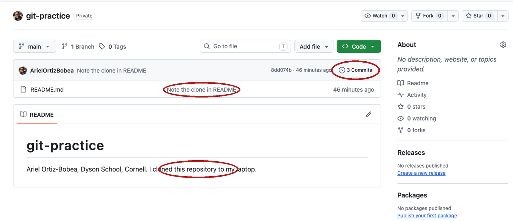{fig-align="center" height="420" fig-alt="The repository's front page on GitHub after the push. The commit count reads 5 Commits and is circled. analysis.R appears in the file list with the message Add analysis.R with the standard beside it, also circled. The rendered README below ends with the line I cloned this repository to my laptop."}

*Five commits, the new file, the new README line: what `git log` shows, in the browser.*

::: {.notes}
Reload. (Reload the real page live; the screenshot is the fallback if the wifi is slow.)
:::

:::

::: {.content-hidden when-format="revealjs"}

{fig-align="center" fig-alt="The repository's front page on GitHub after the push. The commit count reads 5 Commits and is circled. analysis.R appears in the file list with the message Add analysis.R with the standard beside it, also circled. The rendered README below ends with the line I cloned this repository to my laptop."}

Reload the repository's front page in the browser. Three things changed.
The commit count at the top right of the file list reads `5 Commits`.
`analysis.R` is in the file list, with the message of the commit that
last touched it beside it. And the README rendered beneath the file list
ends with the line you added. Five commits, the new file, the new README
line: what `git log --oneline` shows on your laptop, in the browser.
Click the commit count and the Commits page lists the same five messages
in the same order, with the same hashes.

:::

## A commit made on GitHub {#browser-commit}

::: {.content-visible when-format="revealjs"}

:::: {.columns}
::: {.column width="60%"}
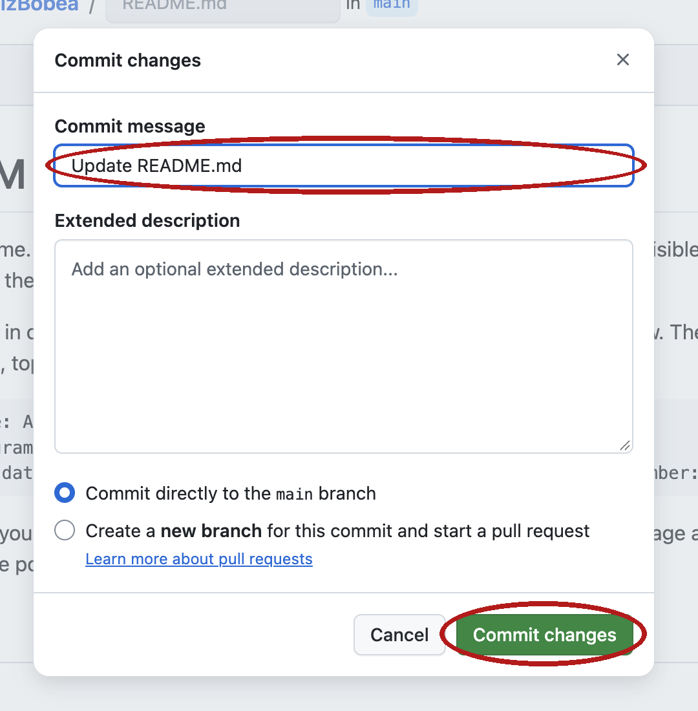{width="80%" fig-alt="GitHub's Commit changes dialog after a pencil edit. The message box holds the default text Update README.md, the option Commit directly to the main branch is selected, and the green Commit changes button is at the bottom. The message box and the button are circled."}
:::
::: {.column width="40%"}
- The pencil and the upload button both make a snapshot on GitHub's copy.
- GitHub wrote `Update README.md`. A message nobody chose, again.
- Your laptop does not know yet.
:::
::::

::: {.notes}
Live, on GitHub: click `README.md`, then the pencil. Add the line `Edited in the browser.` at the end. Click **Commit changes…**, keep the default message `Update README.md`, leave *Commit directly to the main branch* selected, click **Commit changes**. This is the coauthor, or the other laptop, or the upload button. GitHub's copy is one snapshot ahead of mine, and mine has no idea.
:::

:::

::: {.content-hidden when-format="revealjs"}

{fig-align="center" fig-alt="GitHub's Commit changes dialog after a pencil edit. The message box holds the default text Update README.md, the option Commit directly to the main branch is selected, and the green Commit changes button is at the bottom. The message box and the button are circled."}

Now make a change on GitHub's copy, the way a coauthor or your other
laptop would. On the repository's front page click `README.md`. The file
opens in a viewer; click the pencil icon at the top right of it to edit.
Go to the end of the file and add the line

```
Edited in the browser.
```

Click the green **Commit changes…** button at the top right. The dialog
in the screenshot opens. The message box already holds
`Update README.md`; keep it this once. Leave *Commit directly to the main
branch* selected and click **Commit changes**. The page returns to the
file, and the front page's commit count reads `6 Commits`.

The pencil and the upload button do the same thing: they take a snapshot
on GitHub's copy of the timeline. The message GitHub wrote,
`Update README.md`, is a message nobody chose, the same as
`Add files via upload`. When you edit in the browser, replace it with one
that says why.

Your laptop does not know yet. Nothing on GitHub reaches your copy until
you ask for it, and the next section asks.

:::

## git pull: bring GitHub's snapshots down {#pull}

::: {.content-visible when-format="revealjs"}

```bash
git status
#> ...
#> nothing to commit, working tree clean
git pull
#> ...
#> From https://github.com/aem6850-cornell/onboarding-ArielOrtizBobea
#> Updating c14d3a8..316baee
#> Fast-forward
#>  README.md | 1 +
#>  1 file changed, 1 insertion(+)
```

- `git status` said *up to date* and was wrong. **status never asks GitHub.**
- `pull` downloads what GitHub has that you do not, and applies it. `Fast-forward`: your timeline was a prefix of GitHub's.
- Open `README.md` in RStudio: the line is there. **Pull when you sit down, push when you stand up.**

::: {.notes}
A commit made in the browser, on your other laptop, or by a coauthor comes down the same way. Then you read it: `git log --oneline` has a line you did not write.
:::

:::

::: {.content-hidden when-format="revealjs"}

```bash
git status
#> On branch main
#> Your branch is up to date with 'origin/main'.
#>
#> nothing to commit, working tree clean
git pull
#> remote: Enumerating objects: 5, done.          # GitHub's lines; counts vary
#> remote: Counting objects: 100% (5/5), done.
#> remote: Compressing objects: 100% (2/2), done.
#> remote: Total 3 (delta 1), reused 0 (delta 0), pack-reused 0 (from 0)
#> Unpacking objects: 100% (3/3), 301 bytes | 150.00 KiB/s, done.
#> From https://github.com/aem6850-cornell/onboarding-ArielOrtizBobea
#>    c14d3a8..316baee  main       -> origin/main
#> Updating c14d3a8..316baee
#> Fast-forward
#>  README.md | 1 +
#>  1 file changed, 1 insertion(+)
```

Back in the Terminal, type `git status` first. It says
`Your branch is up to date with 'origin/main'.` That is wrong, and it is
wrong for a reason worth remembering: `git status` never asks GitHub. It
reports what it knew about GitHub's copy at the last push or pull, and
nothing has happened on your laptop since. The browser commit is
invisible from here.

Type `git pull` and press Enter. Git asks GitHub what it has that you do
not, downloads it (the `remote:` lines are GitHub counting what it
sends; they vary), and applies it. The line
`c14d3a8..316baee  main -> origin/main` says git's record of GitHub's
copy moved forward by one snapshot. Then `Updating c14d3a8..316baee` and
`Fast-forward`: your own timeline moved forward to match. A
**fast-forward** is a pull where your timeline was a prefix of GitHub's:
every snapshot you had, GitHub had too, so git only has to move your end
of the line forward. Nothing is joined and nothing can conflict. The
last two lines are the receipt: one file, one line added.

Open `README.md` in RStudio. The line `Edited in the browser.` is there,
and the editor reloaded it without being asked. Type
`git log --oneline` and the top line is `Update README.md`, a commit you
did not write, with `HEAD -> main` and `origin/main` on it together
again.

A commit made in the browser, on your other laptop, or by a coauthor
comes down the same way. The habit that keeps the two copies from
drifting apart is one sentence: pull when you sit down, push when you
stand up.

::: {.panel-tabset}

### Terminal

1. Type `git status` and press Enter. Note that it says *up to date*.
2. Type `git pull` and press Enter. Read the last line: `1 file changed, 1 insertion(+)`.
3. Type `git log --oneline`. The top line is the browser commit.

### RStudio Git pane

1. Click the blue down arrow, **Pull**, in the Git pane toolbar.
2. A small window prints the same lines as the Terminal, ending in `1 file changed`. Close it.
3. Click `README.md` in the Files pane; the new line is at the end.

:::

:::

## When push is refused {#push-rejected}

::: {.content-visible when-format="revealjs"}

```bash
git push
#> To https://github.com/aem6850-cornell/onboarding-ArielOrtizBobea.git
#>  ! [rejected]        main -> main (fetch first)
#> error: failed to push some refs to 'https://github.com/…/onboarding-ArielOrtizBobea.git'
#> hint: Updates were rejected because the remote contains work that you do not
#> hint: have locally. This is usually caused by another repository pushing to
#> hint: the same ref. If you want to integrate the remote changes, use
#> hint: 'git pull' before pushing again.
```

- GitHub has a snapshot you do not: a browser upload, a coauthor, your other laptop.
- The fix is two words: **pull, then push.** Git may open an editor for a message; keep the suggested one.
- If `pull` says `CONFLICT`: stop and ask. Rare in a solo project, and not a disaster.

::: {.notes}
Anyone who uploads hw1 in the browser on Thursday and pushes from a clone on Friday meets this line. Read it; it names its own fix: pull, then push.
:::

:::

::: {.content-hidden when-format="revealjs"}

```bash
git push
#> To https://github.com/aem6850-cornell/onboarding-ArielOrtizBobea.git
#>  ! [rejected]        main -> main (fetch first)
#> error: failed to push some refs to 'https://github.com/aem6850-cornell/onboarding-ArielOrtizBobea.git'
#> hint: Updates were rejected because the remote contains work that you do not
#> hint: have locally. This is usually caused by another repository pushing to
#> hint: the same ref. If you want to integrate the remote changes, use
#> hint: 'git pull' before pushing again.
#> hint: See the 'Note about fast-forwards' in 'git push --help' for details.
```

*(Printed, not run: this is what you see the first time it happens.)*
Older git words the four `hint:` lines differently
(`You may want to first integrate the remote changes (e.g., 'git pull ...') before pushing again.`;
Apple's git 2.39 does). Same meaning, same fix.

This is what `git push` prints when GitHub's copy has a snapshot yours
does not, and you push without pulling first. A **rejected push** is one
that git refuses because your timeline is not a prefix of GitHub's: an
upload or a pencil edit in the browser, a coauthor's push, or a commit
from your other laptop put something on GitHub's copy that your copy has
never seen, and git will not overwrite it. Nothing is lost on either
side. Your commit is still on your laptop, and the browser commit is
still on GitHub.

Read the message; it names its own fix in the `hint:` lines: use
`git pull` before pushing again. Type `git pull`, then `git push`. The pull joins GitHub's snapshot to yours,
and the push then goes through. Because both copies had a new snapshot,
the pull is not a fast-forward this time, and git may open an editor
asking for a message for the join. Keep the message it suggests: `Esc`,
`:wq`, Enter on a Mac; on Windows, close the Notepad window. The next
section shows that screen.

If `git pull` instead prints a line with `CONFLICT` in capitals, stop and
ask. It means the two snapshots changed the same line of the same file
and git cannot choose. It is rare in a solo project, and it is not a
disaster; it is a question git is asking you.

:::

::: {.content-hidden when-format="revealjs"}

## After a browser commit and a laptop commit {#diverged}

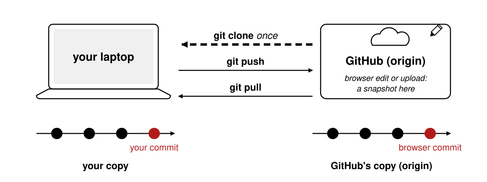{fig-align="center" fig-alt="A laptop on the left and a box labelled GitHub (origin) on the right, each with a timeline of circles beneath it. The first three circles match. GitHub's timeline has a fourth circle labelled browser commit; the laptop's has a fourth circle labelled your commit. Arrows between the two are labelled git pull and git push."}

The two copies share the first three snapshots. GitHub's has a fourth,
the browser commit; yours has a different fourth, your commit. Neither
copy is a prefix of the other, so a push is refused and a pull has to
join the two lines. Git's word for that join is defined and drawn at the
end of the page, under [A branch is a second timeline](#branch).

This is the screen `git pull` opens in this situation:

```
Merge branch 'main' of https://github.com/<your-username>/git-practice
# Please enter a commit message to explain why this merge is necessary,
# especially if it merges an updated upstream into a topic branch.
```

Keep the suggested message. On a Mac: `Esc`, then `:wq`, then Enter. On
Windows, close the Notepad window. A pull has no `-m`, and the suggested
message is fine. After the editor closes, git prints
`Merge made by the 'ort' strategy.` and a receipt; then `git push` goes
through, and both copies are equal again.

Without `pull.rebase false` (Before class, step 3), the pull stops
instead with
`fatal: Need to specify how to reconcile divergent branches.` after a
block of `hint:` lines. Run
`git config --global pull.rebase false` once, then `git pull` again.

:::

## Exercise 2 {#exercise-2 .smaller}

::: {.panel-tabset}

### Exercise

```bash
# Exercise 2 (9 minutes). In your git-practice project, Terminal tab,
# browser open on your repository.
#
# 1. Open README.md in RStudio. Add one line at the end:
#      My first commit from the terminal.
#    Save.
#
# 2. git status. Under which heading is README.md?
#    (Your two RStudio files are still untracked; ignore them today.)
#
# 3. git diff. How many added lines (a single + at the left edge,
#    green)? (If the prompt disappears, press q.)
#
# 4. git add README.md
#    git commit -m "First commit from my laptop"
#    Read the second line of the reply.
#
# 5. git push
#    Then reload your repository's page on GitHub. How many commits?
#
# Two answers to compare with the room: the second line of git commit's
# reply in step 4, and the commit count after step 5.
```

### Solution

```bash
git status
#> ...
#> Changes not staged for commit:
#>         modified:   README.md
#>
#> Untracked files:
#>         .gitignore
#>         git-practice.Rproj
git diff
#> diff --git a/README.md b/README.md
#> ...
#> +++ b/README.md
#> ...
#> +My first commit from the terminal.
git add README.md
git commit -m "First commit from my laptop"
#> [main <new>] First commit from my laptop      # your hash differs
#>  1 file changed, 1 insertion(+)
git push
#> ...
#>    <old>..<new>  main -> main                  # your two hashes
```

::: {.content-visible when-format="revealjs"}

**`1 file changed, 1 insertion(+)`**; **3 Commits** on the front page.

:::

::: {.content-hidden when-format="revealjs"}

`README.md` is modified. One added line; the `+++ b/README.md` header
does not count, and a `\ No newline at end of file` line, if one appears,
is not an added line either. Step 4's second line is
**`1 file changed, 1 insertion(+)`**. `2 insertions(+), 1 deletion(-)`
means your last line had no line ending and git re-wrote it; still one
real line, so look at the diff, not the count. After step 5 the front
page says **3 Commits** (4 for anyone who committed the RStudio files
before class), and your message sits beside `README.md`. In
`git log --oneline`, `origin/main` and `HEAD` are on the same line again.

:::

:::

::: {.content-visible when-format="revealjs"}

::: {.notes}
Debrief (1 min). One file, one commit, one push: your snapshot went up, and the browser shows it. The two RStudio files are still untracked; git does not nag, and Practice 1 commits them. The message on top of your log is one you wrote. The other half of the loop, a snapshot coming down, is what you watched me do before the exercise; Practice 7 is where you do it.

When it fails, say:

- `nothing to commit` after `git add`: the file was never saved in RStudio.
- `*** Please tell me who you are.`: Before class step 3 was skipped. In the same Terminal: `git config --global user.name "Your Name"` and `git config --global user.email "you@cornell.edu"`, then run the commit again.
- A paragraph starting `Your name and email address were configured automatically`: the commit went through under a made-up address. Run the two `git config --global` lines; the next commits carry your name. Leave this one alone.
- `git push` asks for a username and password: stop here. Your commit is safe on the laptop and pushes once the token is stored (Before class step 4 tonight). Press Ctrl+C if the prompt is still waiting. Do not type your GitHub password; it fails with `Authentication failed`.
- A browser sign-in window opens during `git push` (Windows): that is the credential manager; sign in once and the push continues.
- `! [rejected] … (fetch first)`: they edited in the browser earlier today. `git pull`, then `git push`: the slide before this exercise. If an editor screen opens, keep the message (`Esc`, `:wq`, Enter; Notepad: close the window).
- `fatal: Need to specify how to reconcile divergent branches.`: Before class step 3 was skipped: `git config --global pull.rebase false`, then `git pull` again.
:::

:::

::: {.content-hidden when-format="revealjs"}

**Fallback for laptops where git is not working.** Do the same loop on
GitHub's copy. Open your repository in the browser and click
`README.md`, then the pencil icon at the top right of the file. Go to the
end and add the same line, `My first commit from the terminal.` Click the
**Preview** tab above the editor and read your line once: this is the
last look before you commit, the browser's stand-in for `git diff`.

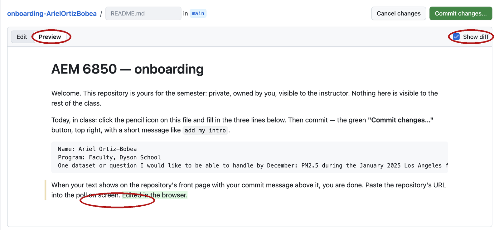{fig-align="center" fig-alt="GitHub's web editor open on README.md with one added line at the end and the Preview tab active. The Preview tab and the added line are circled."}

Click **Commit changes…**. In the dialog, replace GitHub's message with
one you wrote, `First commit from my laptop` will do, leave *Commit
directly to the main branch* selected, and click **Commit changes**.

{fig-align="center" fig-alt="GitHub's Commit changes dialog after a pencil edit. The message box holds the default text Update README.md, the option Commit directly to the main branch is selected, and the green Commit changes button is at the bottom. The message box and the button are circled."}

Reload the front page: answer 2 is the commit count, the same as the
room's. Then click the commit count to open the Commits page, and click
your message to open the commit. Answer 1 is one green line, the
browser's version of `1 file changed, 1 insertion(+)`. You have done the
loop on GitHub's copy; the only thing missing is the copy on your laptop,
and tonight's clone brings all of it down.

:::

## Three undo verbs, one per place {#undo}

::: {.content-visible when-format="revealjs"}

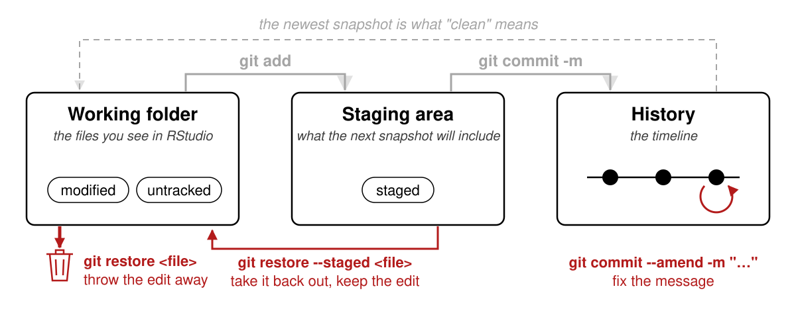{fig-align="center" height="250" fig-alt="The three-places diagram with the forward arrows greyed out and three reverse arrows in colour: git restore from the working folder down to a bin, git restore --staged from the staging area back to the working folder, and git commit --amend curling from the last commit back onto itself."}

:::

::: {.content-hidden when-format="revealjs"}

{fig-align="center" fig-alt="The three-places diagram with the forward arrows greyed out and three reverse arrows in colour: git restore from the working folder down to a bin labelled throw the edit away, git restore --staged from the staging area back to the working folder labelled edit kept, and git commit --amend curling from the last commit back onto itself labelled message only, before push."}

:::

| The change is in | To undo | Command |
|:--|:--|:--|
| the working folder | throw the edit away | `git restore <file>` |
| the staging area | take it back out, keep the edit | `git restore --staged <file>` |
| the last commit, not pushed | fix the message | `git commit --amend -m "…"` |

`<file>` is the file's name, no brackets: `git restore analysis.R`.

::: {.content-visible when-format="revealjs"}

::: {.notes}

One undo per column. `restore` is the one that destroys; git only remembers what you committed. Amend only before you push. Anything else, stop and ask. We run the first one now; the other two are on the page and in the practice set.

:::

:::

::: {.content-hidden when-format="revealjs"}

A change sits in exactly one of the three places, so undoing it is a matter of asking which place it is in and running the one command for that place. `git status` tells you the place. The table tells you the command. There are three, and they are not interchangeable.

- `restore` is the one that destroys. Git only remembers what you committed.
- The third is safe only **before you push**. After a push, leave the commit alone and make a new one.
- Everything else exists. If you are in a state not on this table, stop and ask.

What follows is the situation the printed diff at the start of the session promised: a model edits your script, you read the diff, and you throw the edit away in one line. The two commands after it are on this page only, and the practice set makes you run them.

:::

## A model edited your script: read the diff {#model-edit-live}

::: {.content-hidden when-format="revealjs"}

The brief was "add a check that the file has rows". To follow along at home, play the model yourself. If you only watched the three-places section and have no `analysis.R`, make it first: File → New File → R Script, paste the three lines from [Edit a file, save a new one](#edit), save as `analysis.R`, then `git add analysis.R` and `git commit -m "Add analysis.R with the standard"`, so there is a snapshot for the diff to compare with. Open `analysis.R` in RStudio, change `STANDARD <- 35` to `STANDARD <- 9`, add `stopifnot(nrow(pm) > 0)` as the last line, and save. Then, in the Terminal tab, ask git what changed.

:::

::: {.content-visible when-format="revealjs"}

```bash
git status
#>         modified:   analysis.R
git diff
#> diff --git a/analysis.R b/analysis.R
#> index a3eb8fb..816aaff 100644
#> --- a/analysis.R
#> +++ b/analysis.R
#> @@ -1,3 +1,4 @@
#>  # analysis.R -- days above the PM2.5 standard
#> -STANDARD <- 35
#> +STANDARD <- 9
#>  pm <- read.csv("data/epa_pm25_la_fires_2024_2025.csv")
#> +stopifnot(nrow(pm) > 0)
```

:::

::: {.content-hidden when-format="revealjs"}

```bash
git status
#> ...
#>         modified:   analysis.R
git diff
#> diff --git a/analysis.R b/analysis.R
#> index a3eb8fb..816aaff 100644
#> --- a/analysis.R
#> +++ b/analysis.R
#> @@ -1,3 +1,4 @@
#>  # analysis.R -- days above the PM2.5 standard
#> -STANDARD <- 35
#> +STANDARD <- 9
#>  pm <- read.csv("data/epa_pm25_la_fires_2024_2025.csv")
#> +stopifnot(nrow(pm) > 0)
```

:::

- Asked for: the `stopifnot`. Got: that, and a different standard.
- The `-` line is the tell. Read removals first.
- The transcript says what was meant. The diff says what happened.

::: {.content-visible when-format="revealjs"}

::: {.notes}

This is slide 1.3, in my own repository, twenty seconds after the edit. Nobody found it by reading the transcript, because there is no transcript. There is a diff.

:::

:::

::: {.content-hidden when-format="revealjs"}

Read it the way the diff rules say. `git status` lists one file under `modified`, so the change is in the working folder and nowhere else. `git diff` compares the working folder with the staging area; nothing is staged, so this is everything that differs from the newest snapshot. Start at `---`. The `@@ -1,3 +1,4 @@` line says the file went from three lines to four. Now find every `-` before you read anything else: there is one, `STANDARD <- 35`, and the `+` under it is its replacement, `STANDARD <- 9`. Nobody asked for that pair. The second `+`, at the end, is the line you asked for.

Say the diff in one sentence: one line replaced, one line added. The replaced line changes the answer to every question the script asks, and it looks like a tidy edit. If you had only read the transcript, or only skimmed the file, you would have kept it.

:::

## git restore: discard the edit {#restore}

```bash
git restore analysis.R
git status
#> On branch main
#> Your branch is up to date with 'origin/main'.
#>
#> nothing to commit, working tree clean
```

- `restore` puts the file back to what is staged; nothing is staged, so that is the newest snapshot. No output, then clean. Look at the editor: RStudio reloads the file, the edit is gone.
- **Destructive.** Edits never committed are gone for good. Run `git diff` first, every time, so you know what you are deleting.

::: {.content-visible when-format="revealjs"}

::: {.notes}

Throw the whole edit away. That is the undo the first slide promised, and it took ten seconds. Then you redo the one good line by hand; the page shows it.

:::

:::

::: {.content-hidden when-format="revealjs"}

To **discard** an edit is to throw it away and put the file back to the newest snapshot; `git restore <file>` does it, and nothing brings the edit back. That is the only command of the day that deletes work. The safety rule is one habit: `git diff` before `git restore`, every time, so the thing you are about to delete is on the screen when you delete it.

Type `git restore analysis.R` and press Enter. Nothing prints; silence is success. Then `git status`: no `modified` line, and the last line says `working tree clean`. The working folder matches the newest snapshot again. In RStudio, click into the editor tab for `analysis.R`: the file reloads from disk, the `9` is `35` again, and the last line is gone. If the old text is still showing, RStudio has not noticed the change yet; click into the editor once, or close the tab and reopen the file from the Files pane. The Git pane's row for `analysis.R` disappears, because there is nothing to report.

::: {.panel-tabset}

### Terminal

1. Type `git diff` and read what you are about to delete.
2. Type `git restore analysis.R` and press Enter. Nothing prints.
3. Type `git status`. The last line says `working tree clean`.

### RStudio Git pane

1. Click `analysis.R` in the Git pane, then **More → Revert**.
2. Confirm in the dialog. The row disappears and the editor reloads the file.
3. This is `git restore`: destructive, the same as the command.

:::

:::

::: {.content-hidden when-format="revealjs"}

## Redo the good part by hand {#restore-redo}

The model's edit is gone, and one of its two lines was the one you asked for. Put that one back yourself. In RStudio, add `stopifnot(nrow(pm) > 0)` as the last line of `analysis.R`. Save. Then read the diff and stage it.

```bash
git diff
#> ...
#>  pm <- read.csv("data/epa_pm25_la_fires_2024_2025.csv")
#> +stopifnot(nrow(pm) > 0)
git add analysis.R
```

- Redo the wanted line by hand. One `+`, no `-`. Staged.
- The model's edit is gone; the check you asked for is in the cart. That is the whole loop: read the diff, keep what you meant.

The diff now has one `+` and no `-`: the standard is untouched and the check is there. That is the sentence you could not say about the model's version. `git add analysis.R` moves the change into the staging area, and `git status` would list it under `Changes to be committed`. Stop here for a moment, because the next two sections start from exactly this state: one staged edit in `analysis.R`, nothing else pending.

The loop you just ran is the one to keep: a model edits, you read the diff, you discard what you did not mean and redo what you did. It costs a minute. Reading forty lines for the one that moved costs longer and finds less.

:::

::: {.content-hidden when-format="revealjs"}

## git restore --staged: take a file back out of staging {#unstage}

Starting point: the state after the redo, one staged edit in `analysis.R`. You have staged it and now want to look at it again before committing.

```bash
git restore --staged analysis.R
git status
#> On branch main
#> Your branch is up to date with 'origin/main'.
#>
#> Changes not staged for commit:
#>   (use "git add <file>..." to update what will be committed)
#>   (use "git restore <file>..." to discard changes in working directory)
#>         modified:   analysis.R
#>
#> no changes added to commit (use "git add" and/or "git commit -a")
```

- Nothing is lost. The file moved from column two back to column one; the edit is still on disk.
- Use it when `git diff --staged` shows something you want to look at again. In the Git pane: untick the *Staged* box.
- Then `git add analysis.R` again.

To **unstage** a file is to take it back out of the staging area while leaving the edit on disk; `git restore --staged <file>` does it, and nothing is lost. The word `restore` is the same as in the destructive command, and the flag `--staged` is the whole difference, so read the line back before you press Enter.

Type `git restore --staged analysis.R`. Nothing prints. Then `git status`: `analysis.R` has moved from `Changes to be committed` to `Changes not staged for commit`. Open the file in the editor: the `stopifnot` line is still there. The staging area is the cart, and this is taking something out of the cart to look at it again. The two hint lines under the heading name both moves you can make from here: `git add` to put it back in the cart, `git restore` to throw the edit away. When you are satisfied, `git add analysis.R` again, and `git status` shows it staged as before. Staged, then doubted. Unstage, read, stage again. The cart is for changing your mind.

::: {.panel-tabset}

### Terminal

1. Type `git restore --staged analysis.R` and press Enter. Nothing prints.
2. Type `git status`. `analysis.R` is under `Changes not staged for commit`.

### RStudio Git pane

1. Untick the *Staged* box beside `analysis.R`. The blue **M** stays; only the tick goes.
2. That untick is `git restore --staged`; the edit is still on disk.

:::

:::

::: {.content-hidden when-format="revealjs"}

## git commit --amend: fix the last commit's message {#amend}

Starting point: the edit is staged again after the previous section. Commit it with a typo in the message, on purpose, and then fix the message.

```bash
git add analysis.R
git commit -m "Check the file has rowz"
#> [main 7455467] Check the file has rowz
#>  1 file changed, 1 insertion(+)
git commit --amend -m "Check the file has rows"
#> [main 5ae7730] Check the file has rows
#>  Date: Tue Sep 15 09:31:00 2026 -0400
#>  1 file changed, 1 insertion(+)
git log --oneline
#> 5ae7730 (HEAD -> main) Check the file has rows
#> 316baee (origin/main, origin/HEAD) Update README.md
#> ...
git push
#> ...
#>    316baee..5ae7730  main -> main
```

- One commit, not two. The hash changed: an amended commit is a new commit. `rowz` is gone from the timeline.
- **Only before you push.** After a push the snapshot is on GitHub's copy too, and your next push is refused.
- Then push, so GitHub is current.

To **amend** a commit is to replace the last commit with a corrected one; `git commit --amend -m "…"` does it for the message, and it is safe only while the commit exists on your laptop alone. Read the first reply: `[main 7455467]`, with the typo. Read the second: `[main 5ae7730]`, a different hash, and the `Date:` line shows git kept the original time. `git log --oneline` has one new line on top of `Update README.md`, not two, and the message is the fixed one. The commit with `rowz` is not in the timeline any more. Then `git push` sends it up, and the last line reads from the browser commit's hash to the amended one.

Why only before pushing: once a commit is on GitHub's copy, an amended one is a different commit with the same parent, and git refuses the push because the two copies disagree about what the newest snapshot is. A pushed commit is a shared fact, and you fix shared facts with a new commit. After a push, leave the commit alone and make a new one that says what it fixes. History grows forward, and that is fine.

The other amend you will want: `git commit --amend --no-edit` adds whatever is staged to the last commit and keeps its message. That is the forgotten-file case: you committed, then noticed one file was not in the cart. Stage it, amend with `--no-edit`, and the last commit has both. Same rule, before pushing only. Amend will not help when the content of a commit is wrong; make a new commit that says what it fixes.

:::

## A branch is a second timeline {#branch}

::: {.content-visible when-format="revealjs"}

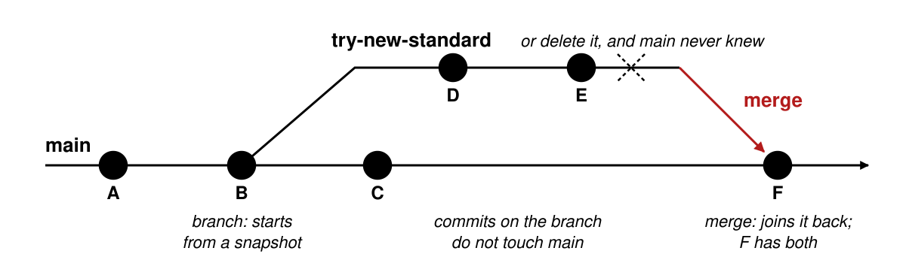{fig-align="center" height="240" fig-alt="A horizontal timeline labelled main with commits A, B, C and F. From B a second line labelled try-new-standard runs parallel with commits D and E, then angles back into F, labelled merge. A dashed X over the branch line notes: or delete it, and main never knew."}

:::

::: {.content-hidden when-format="revealjs"}

{fig-align="center" fig-alt="A horizontal timeline labelled main with commits A, B, C and F. From B a second line labelled try-new-standard runs parallel with commits D and E, then angles back into F, labelled merge. Captions beneath read: branch starts from a snapshot; commits on the branch do not touch main; merge joins it back, F has both. A dashed X over the branch line notes: or delete it, and main never knew."}

:::

::: {.content-visible when-format="revealjs"}

- A branch starts at a snapshot and grows its own snapshots. `main` keeps working while you experiment.
- Merge joins the branch back. Delete it instead and `main` never knew.
- Solo, rarely: an experiment, a risky rewrite, anything a coauthor should read first. Not for a one-line fix.

::: {.notes}

The timeline can fork. Nothing on the branch touches `main` until you merge. You will not need this for homework. You need to recognise the word when a coauthor or a tool makes one.

A pull request is that merge with a comment box next to it: a place to read a change before it lands. Not `git pull`; shared word, different thing.

:::

:::

::: {.content-hidden when-format="revealjs"}

- A branch starts at a snapshot and grows its own snapshots. `main` keeps working while you experiment.
- Merge joins the branch back. Delete it instead and `main` never knew.
- Solo, rarely: an experiment you might throw away; a rewrite that could break a working script; anything a coauthor should read first. Not for a one-line fix.

You have one branch, `main`, and everything today happened on it. A second branch starts from one of `main`'s snapshots and then takes its own snapshots. While you work on it, `main` does not move, so the script that ran this morning still runs from `main` this evening, whatever you broke on the branch. To **merge** is to join a branch back into the one it came from, so that `main` gets every snapshot the branch took. If the experiment failed, you delete the branch instead, and `main` never had it.

The four commands, one line each. You will not type them today; they are here for the day a coauthor or a tool asks you to.

| Command | What it does |
|:--|:--|
| `git switch -c try-new-standard` | Make a branch and move to it |
| `git switch main` | Move back to `main` |
| `git merge try-new-standard` | From `main`, join the branch in |
| `git branch -d try-new-standard` | Delete the branch once it is merged |

A **merge conflict** is what happens when two snapshots changed the same line and git cannot pick one. Git stops, marks the line in the file, and asks you to choose before the merge can finish. A solo project with one clone does not produce them, and they are not covered further today; if `git pull` ever says `CONFLICT`, stop and ask.

:::

::: {.content-hidden when-format="revealjs"}

## A pull request is a merge with a review attached {#pull-request}

A **pull request** is a request, made on GitHub, to merge one branch into another, with a page where a reader sees the diff and comments on lines before the merge happens. It is GitHub's feature, not git's, and it is the way most code written by more than one person gets reviewed.

- Push the branch. Open a pull request. A reader sees the diff and comments on lines.
- **Merge pull request** does the merge on GitHub's copy; `git pull` brings it down.
- Not the same as `git pull`. Shared word, different thing: `git pull` downloads, a pull request proposes.

{fig-align="center" fig-alt="GitHub pull request page on the Files changed tab. The header shows the branch try-new-standard being merged into main. Below it a small diff with one red line and one green line, and an inline comment box attached to one line. The diff is circled in red."}

The first screenshot is what the reader sees. The branch's commits are pushed to GitHub, so the diff is the branch versus `main`, everything the branch would add if merged. A comment attaches to a line, and the author replies or pushes another commit to the same branch, which updates the diff. Nothing on `main` has changed yet.

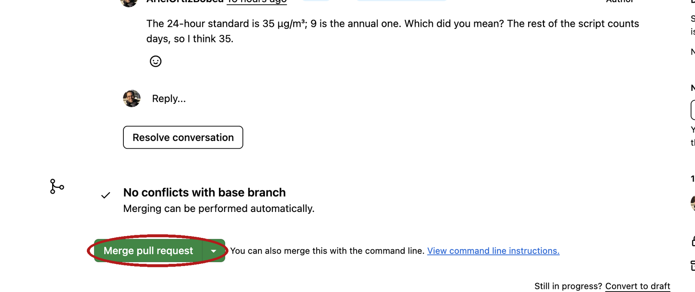{fig-align="center" fig-alt="GitHub pull request page on the Conversation tab, scrolled to the merge box. The green Merge pull request button is circled in red."}

The second screenshot is the end of the review. **Merge pull request** runs the merge on GitHub's copy of the timeline, and `main` there now has the branch's snapshots. Your laptop does not, until you `git pull`. That last sentence is the whole difference between the two uses of the word: a pull request proposes a change and waits for a person; `git pull` downloads snapshots and waits for nobody.

:::

## .gitignore: what git should not track {#gitignore}

::: {.content-visible when-format="revealjs"}

```
# Data is downloaded by your script; never upload it.
data/
data_clean/

# R session artifacts
.Rhistory
.RData
.Rproj.user/

# OS junk
.DS_Store
```

- One pattern per line. A trailing `/` is a folder and everything in it; `*.csv` would be every CSV anywhere.
- An ignored file never appears in `git status`. That is why `data/` never reached GitHub from hw1.
- `.gitignore` is itself committed. Every clone gets the same rules. RStudio wrote the four-line one we committed earlier.

::: {.notes}

This is why the grader can clone hw1 and rebuild everything: the data is not in the timeline, the script that fetches it is. Large data lives next to the repository, not in it, and the scripts find it because their paths are relative to the project. And one rule with no command: never keep a repository inside Dropbox, iCloud Drive, OneDrive or Google Drive.

:::

:::

::: {.content-hidden when-format="revealjs"}

An **ignored** file is one git refuses to track: it never appears in `git status`, `git add` will not take it, and it never reaches GitHub. The list of what to ignore lives in a file named **`.gitignore`** at the top of the repository, one pattern per line, and that file is itself committed, so every clone follows the same rules. This is hw1's `.gitignore`, all eleven lines:

```
# Data is downloaded by your script; never upload it.
data/
data_clean/

# R session artifacts
.Rhistory
.RData
.Rproj.user/
.Ruserdata

# OS junk
.DS_Store
Thumbs.db
```

- One pattern per line. A trailing `/` is a folder and everything in it; `*.csv` would be every CSV anywhere.
- An ignored file never appears in `git status`. That is why `data/` never reached GitHub from hw1: the script downloads the data, and the timeline holds the script.
- `.gitignore` is itself committed. Every clone gets the same rules. RStudio wrote the four-line one we committed earlier.
- Never keep a repository inside Dropbox, iCloud Drive, OneDrive or Google Drive. Two sync tools fighting over `.git` corrupt it silently, and GitHub is already the cloud copy. `~/github` on a Mac and `C:/Users/<you>/github` on Windows are outside all of them.

Large data lives next to the repository, not in it. The scripts still find it, because their paths are relative to the project's top folder, and the grader can clone the repository and rebuild everything from the script that fetches the data.

Three syntax rules cover every line you will write:

- `*` stands for any run of characters in a name: `*.csv` is every file ending in `.csv`, in any folder.
- A trailing `/` names a folder and everything inside it: `data/` ignores the folder and all its contents.
- `#` starts a comment. Blank lines are ignored.

Here is what git says when you try to add something the rules exclude. Printed, not run:

```bash
git add data/test.csv
#> The following paths are ignored by one of your .gitignore files:
#> data
#> hint: Use -f if you really want to add them.
#> hint: Disable this message with "git config set advice.addIgnoredFile false"
```

Do not use `-f`. Ignore the second hint too. Older git words the second hint differently (`Turn this message off by running` / `"git config advice.addIgnoredFile false"`; Apple's git 2.39 does). Both say the same thing: do not. The message means `.gitignore` is doing its job.

A `.gitignore` for an R project, to paste into a new repository's file when RStudio's four lines are not enough:

```
*.csv
*.dta
*.rds
*.xlsx
data/
.Rhistory
.RData
.Rproj.user/
output/
.DS_Store
Thumbs.db
```

One caveat. `.gitignore` only stops files that have never been committed. A file that is already in the timeline keeps being tracked after you add a pattern that matches it, until you tell git otherwise; if that happens, stop and ask rather than guessing at the command.

:::

## Practice {#practice}

::: {.content-visible when-format="revealjs"}

Ten exercises on the session page, with solutions behind a click. All of them run in your `git-practice` clone or a sandbox repository you make — never in hw1.

- **1–3** The loop: add, commit, push, and stage only part of a change
- **4–6** Undoing: discard, unstage, amend
- **7–8** Pull and read: a browser commit, and the push that is refused
- **9–10** A new project with its `.gitignore`; a model's diff, printed

:::

::: {.content-hidden when-format="revealjs"}

::: {.panel-tabset}

### Practice

```bash
# Practice
# Everything below runs in your git-practice project, Terminal tab,
# unless it says "sandbox" -- never in hw1.

# The loop
#  1. git status still lists .gitignore and your .Rproj as untracked.
#     Stage both, commit them with a message that says what they are,
#     push. Confirm on GitHub that both files and the message are there.
#  2. Add a file notes.md with three lines about what you want git to
#     remember for you. Commit it with a message that says why. Push.
#  3. Edit README.md AND notes.md. Stage only notes.md. Run git status
#     and read where each file sits. Commit. Then stage and commit the
#     README change as its own commit. Read git log --oneline bottom to
#     top: does it read like a diary?

# Undoing
#  4. Add a line to notes.md you do not mean to keep. Confirm it with
#     git diff, then throw it away with git restore. Prove it with
#     git status.
#  5. Add a line, stage it, then change your mind about staging (not
#     about the edit). Which command? What does git status say after?
#  6. Commit with a typo in the message. Fix the message before you
#     push. Check that git log --oneline shows the fixed message and the
#     same number of commits.

# Pull, and the push that is refused
#  7. On GitHub, edit notes.md with the pencil and commit. On the laptop,
#     run git status BEFORE pulling. Does it know? Then git pull. Which
#     line of git log --oneline is the browser commit?
#  8. On GitHub, edit notes.md again and commit. On the laptop, edit
#     README.md, commit, and push WITHOUT pulling first. Read the
#     message. Fix it with the command the message names, then push.

# A new project
#  9. On GitHub, make a private repository under your own account named
#     sandbox, with a README. Clone it into your github folder as an
#     RStudio project. Add a .gitignore line  data/  (RStudio made the
#     file). In the Files pane: New Folder  data, then File > New File >
#     Text File, type one line, save as  data/junk.csv.  git status
#     should not list it. Try  git add data/junk.csv  and read what git
#     says. Do not do what it hints. Commit .gitignore and push.

# A model's diff
# 10. You asked a model to "add a check that the date column parsed".
#     It returned this diff. Which line did nobody ask for, and what
#     would it do to the hw1 figure?
#
#        pm$date <- as.Date(pm$Date, format = "%m/%d/%Y")
#       -pm <- pm[pm$n_days >= 60, ]
#       +stopifnot(!any(is.na(pm$date)))
```

### Solutions

::: {.callout-tip collapse="true"}
## Solutions

```bash
# 1
git add .gitignore git-practice.Rproj
git commit -m "Add the files RStudio made for the project"
git push
# expected: both files and your message on GitHub

# 2
git add notes.md
git commit -m "Add notes on what I want git to remember"
git push
# expected: notes.md on GitHub with your message

# 3  after the first add: notes.md under "Changes to be committed",
#    README.md under "Changes not staged for commit"
git add notes.md
git commit -m "Extend the notes"
git add README.md
git commit -m "Update the README"
# expected: the two headings, then two commits in the log

# 4
git diff
git restore notes.md
git status
#> nothing to commit, working tree clean
# expected: working tree clean

# 5
git restore --staged notes.md
git status
#> Changes not staged for commit:
#>         modified:   notes.md
# expected: Changes not staged

# 6
git add notes.md
git commit -m "Add a line abuot the data"
git commit --amend -m "Add a line about the data"
git log --oneline          # same count; top message fixed, new hash

# 7  git status says "up to date": it never asks GitHub. After git pull
#    the newest line of the log is the browser commit; its message is
#    the one from the Commit changes dialog (Update notes.md by default)
# expected: up to date, then the browser line on top

# 8  the push is refused:
git push
#> To https://github.com/<user>/git-practice.git
#>  ! [rejected]        main -> main (fetch first)
#> error: failed to push some refs to 'https://github.com/<user>/git-practice.git'
#> hint: Updates were rejected because the remote contains work that you do not
#> hint: have locally. This is usually caused by another repository pushing to
#> hint: the same ref. If you want to integrate the remote changes, use
#> hint: 'git pull' before pushing again.
git pull                   # a merge commit; an editor opens with the message:
                           # vim on a Mac (Esc, :wq, Enter), Notepad on Windows (close the window)
                           # "fatal: Need to specify how to reconcile divergent branches."
                           # means Before class step 3 was skipped:
                           # git config --global pull.rebase false, then git pull again
#> Merge made by the 'ort' strategy.
#>  notes.md | 1 +
#>  1 file changed, 1 insertion(+)
git push
# expected: fetch first, then a merge commit

# 9  File > New Project > Version Control > Git, URL from the green
#    Code button. .gitignore gains the line  data/
git status                 # data/junk.csv does not appear
git add data/junk.csv
#> The following paths are ignored by one of your .gitignore files:
#> data
#> hint: Use -f if you really want to add them.
#> hint: Disable this message with "git config set advice.addIgnoredFile false"
                           # ignore the second hint too
git add .gitignore
git commit -m "Ignore the data folder"
git push
# expected: junk.csv never listed, -f never typed

# 10  -pm <- pm[pm$n_days >= 60, ]   The model removed the 60-of-90-days
#     filter while adding the check. Every one-in-three and one-in-six
#     instrument comes back as a mostly-empty row in panel B. Read
#     every - first.
# expected: the n_days line
```

:::

:::

:::

## Quick reference {#quick-reference}

::: {.content-visible when-format="revealjs"}

**A repository is a folder plus a timeline of snapshots. Every git command either moves a change toward that timeline, or copies the timeline between your laptop and GitHub.**

Every command from today, one line each, on the session page — with the three-places picture next to it and the things that bite.

:::

::: {.content-hidden when-format="revealjs"}

**A repository is a folder plus a timeline of snapshots. Every git command either moves a change toward that timeline, or copies the timeline between your laptop and GitHub.**

**The twelve commands of the day**

:::: {.columns}

::: {.column width="62%"}

| Command | The idea it is the verb for |
|:--|:--|
| `git clone <url>` | Make your copy of a repository: the folder and the timeline (the New Project dialog runs it) |
| `git status` | Where each file sits: working folder, staging, or clean. Changes nothing. Never asks GitHub |
| `git log --oneline` | The timeline, newest first; `q` leaves the pager |
| `git diff` | Working folder versus staging: what you changed and have not staged. Untracked files are not shown |
| `git add <file>` | Put this change in the next snapshot (staging) |
| `git diff --staged` | Staging versus the newest snapshot: what the next commit contains. Read before every commit |
| `git commit -m "why"` | Take the snapshot; the message says why |
| `git push` | Send your new snapshots to GitHub's copy |
| `git pull` | Bring GitHub's new snapshots to yours. Do it when you sit down |
| `git restore <file>` | Throw away an edit in the working folder. **Destructive** |
| `git restore --staged <file>` | Take a file back out of staging; the edit stays |
| `git commit --amend -m "why"` | Replace the last commit's message. **Before pushing only** |

:::

::: {.column width="38%"}

{fig-alt="Three columns labelled working folder, staging area and history. Arrows along the top read git add from the first to the second and git commit -m from the second to the third. Brackets beneath read git diff between the first two and git diff --staged between the last two. A wide bar at the bottom reads git status: reads all three, changes nothing."}

:::

::::

**On the page only**

| Command | The idea |
|:--|:--|
| `git add .` | Stage everything not ignored; read `git status` first |
| `git commit --amend --no-edit` | Add what is staged to the last commit, keep its message. Before pushing only |
| `git switch -c name` · `git switch main` · `git merge name` · `git branch -d name` | Fork the timeline, move between forks, join one back, delete it |
| `git config --global user.name "…"` / `user.email "…"` / `pull.rebase false` | Who signs the snapshots, and how a pull reconciles; set once per laptop |

**In the browser**

| Action | What it is |
|:--|:--|
| **+ → New repository**, tick **Add a README file** | A repository with one commit, ready to clone |
| **Code → HTTPS → copy** | The address `git clone` needs |
| Pencil on a file → **Preview** tab | Read your line once before you commit |
| Pencil → **Commit changes** | `git add` + `git commit` + `git push`, on GitHub's copy. `pull` to get it |
| **Add file → Upload files** → **Commit changes** | The same three, for whole files |
| Commits count on the front page | `git log` for GitHub's copy |
| Any commit → its page | The diff, red and green |
| **Pull requests** → **Files changed** | A merge with a review attached; not `git pull` |

{fig-align="center" fig-alt="GitHub's web editor open on README.md with the Preview tab active and one newly added line visible at the end of the rendered file. The Preview tab is circled in red."}

**Things that bite**

| Symptom | Cause |
|:--|:--|
| `git: command not found` | git is not installed, or the Terminal was opened before the install; open a new one |
| No Git pane in RStudio | Project not inside a repository, or git's path is unset: Tools → Global Options → Git/SVN |
| `Repository not found` on a private repo | Token missing or wrong username; `gitcreds::gitcreds_set()` again, choose replace |
| `Authentication failed` / a password prompt on push | Same cause, same fix |
| `gitcreds_set()` says no credential helper (Mac) | git came from Homebrew, not the command line tools: `git config --global credential.helper osxkeychain`, then run it again |
| `fatal: not a git repository` | The Terminal is not inside the clone; Tools → Terminal → New Terminal from the project |
| `git: 'stauts' is not a git command` | A typo; git suggests the nearest command on the next line |
| `*** Please tell me who you are.` | The two `git config --global` lines from Before class |
| A paragraph starting `Your name and email address were configured automatically` | Same cause; the commit went through under a made-up address. Run the two lines; the next commits carry your name. Leave this one alone |
| A browser sign-in window opens during `git push` (Windows) | The credential manager; sign in once and the push continues |
| `warning: … LF will be replaced by CRLF` (Windows) | Line endings; harmless. The add worked |
| The terminal shows `:` at the bottom and no prompt | The pager; press `q` |
| A screen of text asking for a commit message | You forgot `-m` (type `i`, the message, `Esc`, `:wq`, Enter; or `Esc`, `:q!`, Enter and use `-m`), or a pull is joining a browser commit to yours (keep the prefilled message: `Esc`, `:wq`, Enter). Notepad (Windows): type, save, close |
| `nothing to commit` after `git add` | The file was never saved in RStudio |
| A new file is missing from `git diff` | Untracked files are not diffed; `git status` lists them |
| `Your branch is ahead of 'origin/main'` | You have commits GitHub does not; `git push` |
| `git status` says up to date, GitHub has a newer commit | status never asks GitHub; `git pull` |
| `! [rejected] main -> main (fetch first)` | GitHub has commits you do not; `git pull`, then push |
| `fatal: Need to specify how to reconcile divergent branches.` | Before class step 3 was skipped: `git config --global pull.rebase false`, then `git pull` again |
| Push rejected right after `--amend` | You amended a pushed commit; `git pull`, push, and amend only before pushing next time |
| `The following paths are ignored` | `.gitignore` is doing its job; do not `-f` |
| The test line is still in the editor after `git restore` | RStudio has not reloaded the file; click into the editor, or close and reopen it |
| A `.git` folder inside Dropbox or iCloud Drive | Move the clone to `~/github` now |
| The clone landed in `OneDrive\Documents` (Windows) | RStudio's `~` is Documents; move the folder to `C:\Users\<you>\github` and open the `.Rproj` from there |

**Terms**

| Term | One line | Where |
|:--|:--|:--|
| version control | A tool that keeps every past version of a folder and can show the difference between any two | [§](#chaos) |
| snapshot | The whole folder as it was at one moment | [§](#three-questions) |
| diff | Two snapshots compared line by line: `-` for the line as it was, `+` for the line as it is | [§](#model-edit) |
| git | The program on your laptop that takes and keeps the snapshots | [§](#git-vs-github) |
| GitHub | The website that keeps a copy of the snapshots and shows them in a browser | [§](#git-vs-github) |
| repository | A folder plus its timeline of snapshots, stored in the hidden `.git` subfolder | [§](#repository) |
| commit | One snapshot on the timeline, with a message, an author and a hash | [§](#reveal-commits) |
| commit message | The sentence a person writes on a commit; it says why | [§](#reveal-commits) |
| hash | The forty-character ID git names a commit by; seven characters are enough to type | [§](#reveal-commits) |
| history | The timeline: every commit, newest first when `git log` prints it | [§](#reveal-commits) |
| branch | Git's word for a timeline; a repository can have more than one | [§](#status) |
| `main` | The name every repository's first branch gets | [§](#reveal-repo) |
| `origin` | Git's name for the copy a repository was cloned from, GitHub's | [§](#status) |
| local | The copy of the repository on your laptop | [§](#two-copies) |
| remote | A copy of the repository somewhere else, GitHub's | [§](#two-copies) |
| clone | Download a whole repository, timeline included, and remember where it came from | [§](#two-copies) |
| push | Send the snapshots GitHub's copy does not have | [§](#two-copies) |
| pull | Bring down the snapshots your copy does not have | [§](#two-copies) |
| working folder (working tree) | The files as you see them in RStudio | [§](#three-places) |
| staging area | The list of what the next snapshot will include | [§](#three-places) |
| staged | In the staging area; part of the next commit | [§](#add) |
| untracked | A file git sees that the timeline has never had | [§](#status) |
| modified | A tracked file that differs on disk from the newest snapshot | [§](#edit) |
| tracked | A file the timeline has | [§](#status) |
| clean | The working folder matches the newest snapshot; nothing pending | [§](#commit-cmd) |
| fast-forward | A pull that only had to move your timeline forward, because yours was a prefix of GitHub's | [§](#pull) |
| rejected push | GitHub has a snapshot you do not; pull, then push | [§](#push-rejected) |
| merge | Join a branch back into the one it came from | [§](#branch) |
| pull request | A request on GitHub to merge one branch into another, with a review page attached | [§](#pull-request) |
| merge conflict | Two snapshots changed the same line; git stops and asks you to choose | [§](#branch) |
| ignored / `.gitignore` | A file git refuses to track; the patterns live in `.gitignore` | [§](#gitignore) |
| token (personal access token) | The string GitHub accepts from a program in place of your password | [§](#before-class) |
| HEAD | Where you are on the timeline; `git log` shows it beside the newest commit | [§](#log) |
| pager | The screen git uses for long output; `q` returns the prompt | [§](#log) |
| discard | Throw an edit away and put the file back to the newest snapshot | [§](#restore) |
| unstage | Take a file back out of the staging area, keeping the edit | [§](#unstage) |
| amend | Replace the last commit with a corrected one, before pushing | [§](#amend) |

**Links** — [slides](07-git-slides.html) · [Syllabus](../syllabus.qmd) · [Happy Git with R](https://happygitwithr.com) · [Pro Git, chapter 2](https://git-scm.com/book/en/v2/Git-Basics-Getting-a-Git-Repository)

:::
