::: {.content-hidden when-format="revealjs"}

[Slides](08-ai-chat-slides.html) · [Source](https://github.com/ArielOrtizBobea/aem6850/blob/main/fall-2026/sessions/08-ai-chat.qmd)

How a chatbot produces an answer, what that means for a research
question, and the one rule for using it: ask for the script, not the
answer. Each prompt on the page is a block you copy, and each reply gets
one check against the file.

:::

::: {.content-hidden when-format="revealjs"}

::: {#before-class .callout-important title="Before class: a Claude account and the Claude desktop app"}

Ten minutes, once. The last line is the test.

**1. Make a Claude account.** At [claude.ai](https://claude.ai), use the
sign-up button and any email you read. You must be 18 or over; a code
arrives by text message. No card is needed for the free plan.

**2. Subscribe to Pro.** Pro is $20 a month
([claude.com/pricing](https://claude.com/pricing)), and I strongly
recommend it: you will get a lot out of it, and it is worth the
investment. The chat half of this page works on the free plan. Cowork
(the second half of this page) and Claude Code need Pro. If you are going
to subscribe, do it now: choose Pro on the pricing page. Cornell is
working on access for students; nothing is in place as of September
2026, so plan on Pro for now. If you do not subscribe, follow the Cowork
demo on the projector and pair with a neighbour for anything that needs
Cowork.

**3. Install the desktop app.** Download it at
[claude.com/download](https://claude.com/download). Mac: open the `.dmg`,
drag **Claude** into Applications, open it from there (macOS 11 or
later). Windows: run the installer, open **Claude** from the Start menu
(Windows 10 or later). Sign in with the account from step 1. On the free
plan the app shows **Chat**; with Pro it also shows **Cowork** and
**Code**.

**Test.** In claude.ai, a new chat: type `Reply with one word: ready.`
and press Enter. Any reply means the account works.

:::

:::

## Objectives {#objectives .smaller}

By the end of this session you can:

- Pick the right AI tier for a task.
- Write a context-rich prompt.
- Critique a model's explanation against the code it explains.
- Name the canonical failure modes, and the fact about how models work
  that each one comes from.
- Say why the deliverable of AI-assisted research is a script, not an
  answer.
- Write the disclosure block.

## Plan for today {#plan}

1. A few facts about how an LLM works
2. The chat tier: what it is for
3. Failure modes, and the fact each comes from
4. Context is most of the game
5. Ask for the script, not the answer
6. An assistant that reaches your files: live demo
7. The disclosure block

## A few facts about how an LLM works {#four-facts}

- A Large Language Model (LLM) predicts the next word. Plausible is not the same as correct.
- It generates; it does not look anything up (unless it uses a tool). This is where "hallucinated" references come from.
- It is not deterministic. The same prompt can generate different results.
- Its memory of a conversation is finite (context window). So long chats "degrade" without
  saying so.

::: {.content-visible when-format="revealjs"}

::: {.notes}
There are four facts. Everything you do with these tools follows from one
of them, and every habit on this page points back at one. The facts hold
for ChatGPT, Gemini and Copilot as much as for Claude.
:::

:::

::: {.content-hidden when-format="revealjs"}

You do not need the mathematics. You need four facts, and each one has a
consequence for how you use the tool. This section states the four; the
next four sections expand them. They hold for ChatGPT, Gemini and Copilot
as much as for Claude; the screenshots use Claude because that is the
account you made.

:::

## Fact 1: it predicts the next word {#next-word}

::: {.content-visible when-format="revealjs"}

{fig-align="center" height="360" fig-alt="Left: a rounded box holding the text so far as tokens, The mean life expectancy in Oceania in 2007 was, with faint ticks between tokens and 2007 split in two. An arrow labelled next? points to four candidate tokens drawn as bars of decreasing length: 80, 81, about, roughly; 80 is outlined in red and tagged picked this time; 81 has a dashed outline tagged or this one, next run. A curved arrow returns to the box, labelled append it, then repeat. A crossed-out cylinder at the bottom right reads your file: not opened."}

*The next word is picked from a list of candidates. Nothing in this
picture opens your file.*

::: {.notes}
Your phone does this when it suggests the next word. This does the same
thing with a much longer memory and a much bigger list. Read the picture
left to right: the text so far, the candidates, the pick, the loop. Then
the cylinder: no file, no database.
:::

:::

::: {.content-hidden when-format="revealjs"}

{fig-align="center" fig-alt="Left: a rounded box holding the text so far as tokens, The mean life expectancy in Oceania in 2007 was, with faint ticks between tokens and 2007 split in two. An arrow labelled next? points to four candidate tokens drawn as bars of decreasing length: 80, 81, about, roughly; 80 is outlined in red and tagged picked this time; 81 has a dashed outline tagged or this one, next run. A curved arrow returns to the box, labelled append it, then repeat. A crossed-out cylinder at the bottom right reads your file: not opened."}

Your phone's keyboard suggests the next word from the words before it. A
chatbot does the same thing with a much longer memory and a much bigger
list. The mechanism has three steps. The conversation so far is cut into
**tokens**: a word, or a piece of one; numbers split into several. The
model produces a list of candidate next tokens, each with a probability,
picks one, and appends it. Then it repeats until it stops.

Training on a large amount of text is what makes this pattern
completion read like reasoning. The consequence: the tool is useful for
prose, explanations and code in common patterns, and risky wherever the
plausible continuation is a number, a citation or a statistical claim.
Your job is to tell the two apart.

:::

## Fact 2: it generates, it does not look up {#generate}

- e.g. A journal reference, a function argument, a number are just text spit out by the LLM.
- Often that text matches the true or correct value. Sometimes it does not.
- [*Mata v. Avianca*](https://storage.courtlistener.com/recap/gov.uscourts.nysd.575368/gov.uscourts.nysd.575368.54.0.pdf)
  (2023): six court decisions in a legal brief, none real, a $5,000 fine.
- A [2023 audit](https://doi.org/10.1038/s41598-023-41032-5): 18 % to
  55 % of references fabricated, depending on the model.
- A reference from a chatbot is a lead to check, not a confirmed citation.

::: {.content-visible when-format="revealjs"}

::: {.notes}
The lawyers asked a program that produces things shaped like citations,
and it gave them six. Nothing in the text marked which ones existed.
:::

:::

::: {.content-hidden when-format="revealjs"}

A chat window is not a database. Asked for a reference, it produces text
shaped like a reference. The same holds for an R argument, or for a
number from a file it has not seen. Often the text matches something
real, because the real thing was in the training data. Sometimes it does
not, and the result is a reference that refers to nothing.

A DOI is a permanent identifier for a paper, written like
`10.1038/s41598-023-41032-5`; `https://doi.org/` in front of it opens
the paper's page. Most references on this page carry one, and the check
in [Checking a reference at doi.org](#check-reference) uses it.

The public example is
[*Mata v. Avianca* (S.D.N.Y., June 22, 2023)](https://storage.courtlistener.com/recap/gov.uscourts.nysd.575368/gov.uscourts.nysd.575368.54.0.pdf).
Two New York lawyers filed a brief (the written argument a lawyer submits
to a court) citing six court decisions that ChatGPT had produced. None
existed. The court fined the lawyers and their firm $5,000.

The size of the problem, measured. A
[2023 audit](https://doi.org/10.1038/s41598-023-41032-5) (Walters and
Wilder, *Scientific Reports*) found 55 % of GPT-3.5's references and
18 % of GPT-4's were fabricated. A
[2026 audit of 2.5 million biomedical papers](https://doi.org/10.1016/S0140-6736(26)00603-3)
(Topaz et al., *The Lancet*) counted the published papers that carry at
least one fabricated reference. The share rose from 1 in 2,828 in 2023
to 1 in 277 in early 2026. Rule of thumb: a reference from a chatbot is
a lead to check, not a citation.

:::

## Fact 3: it is not deterministic {#not-deterministic}

- The next word is sampled from the list. Chatbot apps have their own internal parametrization unavailable to you the user.
- So same prompt, same LLM, same moment could yield different replies. You cannot reproduce a transcript from an LLM.
- However, the analysis done by a script file is deterministic and can be reproduced.
- Using LLMs for research requires using them for writing code (reproducible), not generating output directly (not reproducible).

::: {.content-visible when-format="revealjs"}

::: {.notes}
When your neighbour's reply differs from yours in the exercise, nothing
went wrong. That is fact three. One minute here; the exercise does the
teaching.
:::

:::

::: {.content-hidden when-format="revealjs"}

The pick in the picture above is a draw, not the top of the list every
time. A setting called temperature controls how spread out the draws
are; chat apps fix it and you cannot change it. So two students who send
the same prompt at the same minute get different replies: sometimes
different wording, sometimes a different R function, sometimes a
different number.

Consequence: a chat transcript is not a record anyone can re-run,
including you, five minutes later. The record of what you did is the
script you saved and ran.

:::

## Fact 4: memory of a conversation is finite {#context-window}

- Context window: your messages, its replies, pasted code, attached
  files.
- As it fills, the app compresses earlier messages into a summary, with
  no notice.
- Late in the chat, it's not the model that is getting worse, it's that it's
"forgetting" part of what you specified earlier in the chat.
- Lesson: one task per chat. Plan sessions where you do not run out of context window.

::: {.content-visible when-format="revealjs"}

::: {.notes}
If a long chat starts contradicting what you said at the top, the top is
gone. Start a new one and paste what matters.
:::

:::

::: {.content-hidden when-format="revealjs"}

Everything the model has in front of it when it answers lives in the
**context window**: your messages, its replies, the code you pasted, the
file you attached. The window has a size limit. As it fills, the app
compresses earlier messages into a summary, with no notice. The exact
code you pasted at the top is then no longer in front of the model, and
the reply starts reading as if the beginning of the conversation had
gone differently. That is why long chats degrade.

Working rules: one task per chat; start a new chat for a new question;
paste the code again rather than writing "the script from before".

:::

## From each fact to a habit and a check {#four-consequences}

| Fact | Consequence | Habit | The check you perform |
|:--|:--|:--|:--|
| Predicts the next word | Plausible but incorrect | Check claim against truth | Read the explanation against the code |
| Generates, does not look up | Made up references and arguments | Double check | Check DOI link |
| Not deterministic | Two runs, two answers; nothing to re-run | Ask for the script, not the answer | Run the script; read what it prints |
| Finite memory of a chat | Long chats degrade | One task per chat; plan | A new chat for each task |

::: {.content-visible when-format="revealjs"}

::: {.notes}
Read the last column: those four checks are the whole discipline, and the
rest of the hour is where you perform them.
:::

:::

::: {.content-hidden when-format="revealjs"}

The right-hand column is what you do. Each check runs on your own laptop
and costs under a minute. Two rules follow: never accept an answer you
could not check, and check one claim in every conversation as a matter
of habit. The syllabus states the same thing as a rule of grading: you
own every number in your submission.

:::

## Chat, assistant, coding agent: three tiers {#three-tiers}

| Tier | Example | It sees and can | What you read afterwards |
|:--|:--|:--|:--|
| Chat | claude.ai, ChatGPT, Gemini | what you paste; returns text | the script you pasted and ran |
| Assistant | Cowork (desktop app) | a folder; reads, runs, writes files | `git status`, `git diff` |
| Coding agent | Claude Code, Codex | a repository; edits as diffs | each diff before you accept it |

::: {.content-visible when-format="revealjs"}

::: {.notes}
There are three tiers, with more capability at each step, and in every
row the last column is yours. This page covers the first two rows. Which
tier for which task: a README paragraph goes to chat; a folder of a dozen
CSVs to describe goes to the assistant; a change inside a repository
goes to the coding agent. Pick by what the model needs to see.
:::

:::

::: {.content-hidden when-format="revealjs"}

The tools come in three tiers. The tier decides what the model can see
and do, and what you read afterwards.

**Chat** (claude.ai, ChatGPT, Gemini, Copilot): you paste context in, it
returns text, it touches nothing. What you check afterwards is the script
you pasted into RStudio and ran.

**Assistant** (Cowork, in the Claude desktop app): you connect a folder.
It reads the files, runs code in an isolated environment on Anthropic's
servers, and writes files into the folder. What you read afterwards is
`git status` and `git diff`.

**Coding agent** (Claude Code): it works inside a repository from the
terminal and proposes edits as diffs you accept or reject, one at a time.

Tools change names; the three tiers stay. This page covers chat and the
assistant. Three tasks, three tiers: a README paragraph to sharpen goes
to chat (nothing to see but the text; paste it). A folder of a dozen CSVs
whose column names drift, to be described and listed, goes to the
assistant (it opens the files; you cannot describe what you have not
read). A change to one script inside a repository, to be read as a diff
before it is kept, goes to the coding agent. Pick the tier by what the
model needs to see, not by which tool is newest.

:::

## The claude.ai window {#chat-window}

::: {.content-visible when-format="revealjs"}

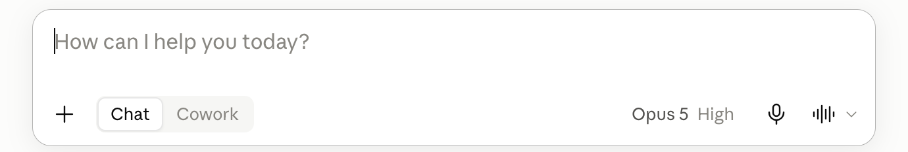{width="88%" fig-align="center" fig-alt="A new, empty claude.ai chat in the light theme: the message box reading How can I help you today, the + button and the Chat / Cowork toggle at its bottom left, the model picker reading Opus 5 High at its bottom right."}

1. **Model picker** (bottom right): which model answers
2. **Message box**: Enter sends, Shift+Enter breaks
3. **+** (bottom left): attach a file it can read
4. **Chat / Cowork**: leave it on Chat

::: {.notes}
There are four things to find on this screen. The fifth, not in the
picture because the sidebar is collapsed, is the one people forget: New
chat, in the left panel. A new question gets a new chat.
:::

:::

::: {.content-hidden when-format="revealjs"}

{fig-align="center" fig-alt="A new, empty claude.ai chat in the light theme: the message box reading How can I help you today, the + button and the Chat / Cowork toggle at its bottom left, the model picker reading Opus 5 High at its bottom right."}

Open [claude.ai](https://claude.ai) and sign in; a new chat opens. Five
things to find.

1. **The model picker**, at the bottom right of the message box. Which
   model answers. The picker shows the model's name (Opus 5 in the
   picture; a free account shows a different default); copy it into your
   disclosure block as it appears.
2. **The message box.** Enter sends; Shift+Enter makes a new line;
   pasting keeps line breaks. Everything in the conversation so far goes
   in with each message.
3. **The + button.** Attach a file it can read. A CSV attaches. A `.R`
   file is not on the accepted list, so paste a script as text.
4. **Chat / Cowork**, next to the +. Leave it on Chat; Cowork is the
   assistant tier, later on this page, and needs Pro.
5. **New chat**, in the left panel (open the panel with the icon at the
   top left). An empty context: nothing from the current chat carries
   over. The left panel lists your earlier chats. Do not reopen a
   finished chat; start a new one.

:::

## What chatbot can (and cannot) do {#chat-uses}

::: {.content-visible when-format="revealjs"}

:::: {.columns}
::: {.column width="50%"}
*For*

- explaining code or an error you paste
- drafting a README, a comment header
- planning an analysis, step by step
- questions about data you describe
:::
::: {.column width="50%"}
*Cannot*

- run your code
- see your files unless you attach them
- carry one chat into the next, reliably
:::
::::

::: {.notes}
Everything on the left is text in, text out. Everything on the right is
a thing it has no access to. Thirty seconds; the demo later shows both
columns live.
:::

:::

::: {.content-hidden when-format="revealjs"}

Chat has four uses. Explaining unfamiliar code or an error message you
paste: try the fix, then decide. Drafting text: a README paragraph, a comment
header. Planning an analysis before you write it: steps in order, one
base R function per step. Answering questions about data you describe,
if you paste `str(d)` and `head(d)`.

Chat has three limits. It cannot run your code: the script may look
right and fail on line one, and you find out when you run it. It cannot see your
files unless you attach or paste them: its idea of your data is whatever
you typed. It cannot be relied on to carry one chat into the next, so do
not build on "as I said yesterday".

One more, which the failure-modes section takes up: an invented argument
reads the same as a real one. Nothing in the reply marks the difference.

:::

## The practice folder {#practice-folder}

Make the folder now (~ a couple of mins). Everything today reads one file,
`gapminder.csv`.

1. RStudio: **File → New Project → New Directory → New Project**.
   Directory name `gapminder-practice`, as a subdirectory of your
   `github` folder. **Create Project**.
2. In the Console, with the new project open, one line at a time. The
   last line is the test:

```r
install.packages("gapminder")
dir.create("data")
dir.create("code")
write.csv(gapminder::gapminder, "data/gapminder.csv", row.names = FALSE)
nrow(read.csv("data/gapminder.csv"))
#> [1] 1704
```

::: {.content-visible when-format="revealjs"}

::: {.notes}
Everything today happens in this folder: one input file and a code
folder the exercises fill. Wait for the 1704 around the room.
`install.packages()` prints a few lines first. `cannot open file` means
the CSV is not in `data/`: run the `write.csv()` line again. A laptop
where the install fails: the page has a download link for the same
file. Windows: the parent folder is typed as
`C:/Users/<username>/github`, not picked with Browse, which opens
Documents.
:::

:::

::: {.content-hidden when-format="revealjs"}

Step 1 makes the RStudio project and opens it. Pick the `github` folder
with Browse (never Desktop or Documents if those sync to a cloud drive);
on Windows type `C:/Users/<your Windows username>/github` as the parent
folder instead. Step 2 installs the `gapminder` package, makes the two
folders, and writes the package's table to `data/gapminder.csv`;
`install.packages()` prints a few lines first, and the `1704` is the
test. The table goes on disk because everything today reads a file: the
scripts, the attach step in claude.ai, and the folder Cowork connects.
If the install fails (no network, a proxy), download
[gapminder.csv](data/gapminder.csv), the same table, with the browser
(right-click the link: *Save link as*, or in Safari *Download Linked
File*) into `github/gapminder-practice/data/`, then run the last line
again. `cannot open file` means the CSV is not in `data/`.

:::

## gapminder.csv, the one input file {#practice-folder-contents}

```
gapminder-practice/           an RStudio project in your github folder
  gapminder-practice.Rproj    open this, so data/gapminder.csv resolves
  data/gapminder.csv          the one input: 1704 rows, 6 columns
  code/                       one script per task (empty for now)
  output/                     appears when a script writes there
```

::: {.content-visible when-format="revealjs"}

- Gapminder: one row per country and year. 142 countries, 1952 to 2007
  every five years. From the `gapminder` R package (Jenny Bryan), data
  from gapminder.org, CC BY 4.0.
- Columns: `country`, `continent`, `year`, `lifeExp`, `pop`, `gdpPercap`.
- Every script starts with `d <- read.csv("data/gapminder.csv")`. Nothing
  ever edits the file; scripts write to `output/`.

::: {.notes}
The column names matter: `lifeExp`, capital E, is the one everyone
mistypes. The file is public, CC BY 4.0, which is why it is the one
file you may attach or connect today.
:::

:::

::: {.content-hidden when-format="revealjs"}

`data/gapminder.csv` is the input: 1,704 rows; the columns `country`,
`continent`, `year` (1952 to 2007 every five years), `lifeExp`, `pop`,
`gdpPercap`; 142 countries, five continents. It comes from the
`gapminder` R package by Jenny Bryan, with data from gapminder.org, CC BY
4.0. `code/` is where the scripts go, one per task; the scripts create
`output/`. Open the project (double-click the `.Rproj`) so
`data/gapminder.csv` resolves without `setwd()`.

`notes.md` is a scrappy notes file that the assistant tier reads later
(Practice 9). File → New File → Text File, paste the lines below, save as
`notes.md` at the top of the project. Thirty seconds, now or before
Practice 9. It is written the way notes are: one open question in it is
something a README should settle from the file.

```{.markdown filename="notes.md"}
gapminder notes
- csv written from the gapminder package, 1704 rows? check
- mean lifeExp by continent 2007: code/1_lifeexp_2007.R (Oceania 80.72)
- todo: weighted version (by pop), trend plot 1952 to 2007
- q: why does Oceania have only 2 countries
- q: does the gap between Europe and Africa close or widen
```

:::

## Explaining an error message {#explain-error}

```{.markdown filename="Prompt to paste into Claude"}
I ran the R line below and got the error under it. Tell me what the
error means and which part of my line caused it. Do not give me a
different approach. Fix only the line I wrote.

tapply(d07$lifeexp, d07$continent, mean)
Error in tapply(d07$lifeexp, d07$continent, mean) :
  arguments must have same length
```

::: {.content-visible when-format="revealjs"}

- The line and the error, pasted exactly. Retyped errors lose the clue.
- "Fix only the line I wrote" closes the scope: one line, not a new
  approach.
- `d07` holds the 2007 rows of `gapminder.csv`. Its column is
  `lifeExp`, capital E.
- Check: run the fixed line.

::: {.notes}
Every prompt has the same shape: what you want, the exact context, and
what not to do. The check is the same as always: run it.
:::

:::

::: {.content-hidden when-format="revealjs"}

The first use, worked: paste the line you ran and the exact error under
it. Retyped errors lose the clue. Here `d07$lifeexp`
(lower-case e) is not a column, so R returns `NULL` for it and the first
argument of `tapply()` has length zero. A good reply names the
column-name case and changes one letter. A reply that proposes a
different approach did not do what the prompt asked. The check is the
same as always: run the fixed line.

:::

## code/1_lifeexp_2007.R, the given script {#given-script}

```{.r filename="code/1_lifeexp_2007.R"}
# 1_lifeexp_2007.R: mean life expectancy by continent in 2007.
# Reads data/gapminder.csv; writes output/lifeexp_2007.csv.
YEAR <- 2007
d <- read.csv("data/gapminder.csv")
stopifnot(nrow(d) == 1704)
d07 <- d[d$year == YEAR, ]
m <- tapply(d07$lifeExp, d07$continent, mean)
print(round(m, 2))
out <- data.frame(continent = names(m), mean_lifeExp = round(m, 2))
dir.create("output", showWarnings = FALSE)
write.csv(out, "output/lifeexp_2007.csv", row.names = FALSE)
```

::: {.content-visible when-format="revealjs"}

- Prints five means; Oceania is `80.72`.
- Each country counts once inside `tapply()`.

::: {.notes}
These eleven lines use only functions you know. One of them does
something you should be able to say in a sentence, and the model will say
a sentence about it. The room checks the sentence.
:::

:::

::: {.content-hidden when-format="revealjs"}

The script you save in Exercise 1. When you Source it from the project
it prints:

```
#>   Africa Americas     Asia   Europe  Oceania
#>    54.81    73.61    70.73    77.65    80.72
```

The script sets a named constant, reads the file with `read.csv()`, and
stops with `stopifnot()` if the file does not have 1,704 rows. It keeps
the 2007 rows with square brackets and takes the mean of `lifeExp`
within each continent with `tapply()`, each country counting once. It
prints the rounded means and writes a data frame to
`output/lifeexp_2007.csv` after `dir.create()` makes the folder. The
page does not explain every line: that is what you ask the model to do
next, and then check.

:::

## The two Oceania rows: a check by hand {#oceania-rows}

| country | lifeExp | pop |
|:--|--:|--:|
| Australia | 81.235 | 20,434,176 |
| New Zealand | 80.204 | 4,115,771 |

- Mean across the two countries: **80.72**.
- Mean across the 24.5 million people: **81.06**.

::: {.content-visible when-format="revealjs"}

::: {.notes}
These two numbers are both right and answer different questions. When a
tool gives you one, you should know which one you asked for.
:::

:::

::: {.content-hidden when-format="revealjs"}

Oceania has two countries in the file, so it is the one continent where
you can check any continent-level number without a computer. The mean
across the two countries is (81.235 + 80.204) / 2 = 80.72. The
population-weighted mean is
(81.235 × 20,434,176 + 80.204 × 4,115,771) / 24,549,947 = 81.06. Both
are legitimate answers to "life expectancy in Oceania"; they answer
different questions (a typical country, or a typical person). Every
check today uses one of these two numbers. Write them down.

:::

## Asking for an explanation of code {#explain-prompt}

```{.markdown filename="Prompt to paste into Claude"}
Explain the R script pasted below one line at a time, in plain words, for
someone new to R. Quote each line, then say what it does and what it
produces. Do not rewrite the script and do not suggest changes. Stop after
the last line.
```

::: {.content-visible when-format="revealjs"}

- Paste the prompt, Shift+Enter, paste the script, Enter.
- What you want, what it will get wrong, what to give back, what not to
  do: every prompt today has the four parts.
- The model has not run this script. It has only the text you pasted.

::: {.notes}
Notice what the prompt forbids. Left alone, the tool rewrites your
script, because rewriting is the most likely continuation.
:::

:::

::: {.content-hidden when-format="revealjs"}

The prompt you paste in Exercise 1, and how: copy the block, paste it
into the message box, press Shift+Enter, paste the script under it,
press Enter. The prompt has the four parts. What you want: an
explanation, one line at a time, at your level. What it will probably
get wrong: rewrite the script instead of explaining it. What to give
back: each line quoted, then a sentence. What not to do: suggest
changes. "For someone new to R" is in
the prompt because the level of the explanation is context too.

:::

## Reading an explanation against the code {#explain-reply}

::: {.content-visible when-format="revealjs"}

:::: {.columns}
::: {.column width="60%"}
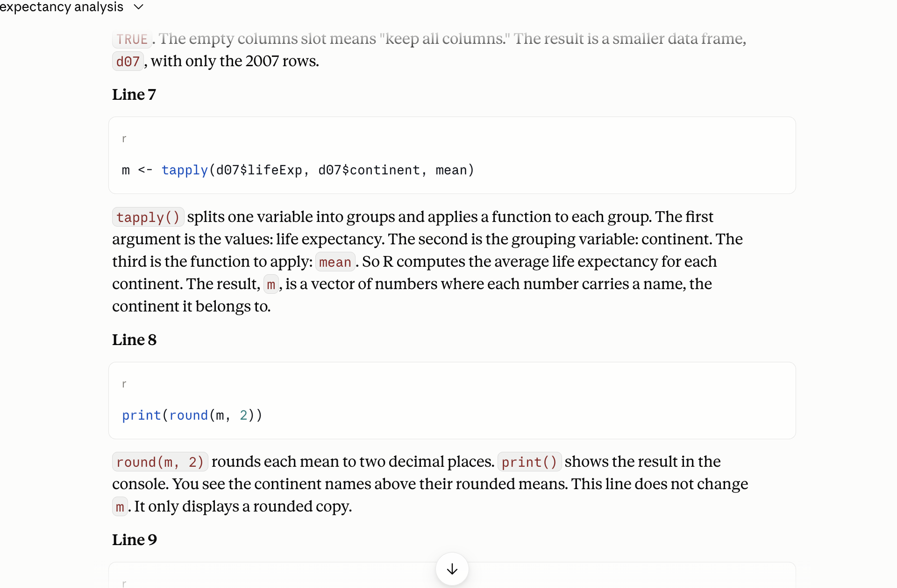{width="100%" fig-alt="A claude.ai reply explaining the script one line at a time: each line in its own code box, its explanation in a paragraph under it."}
:::
::: {.column width="40%"}
1. **The line, quoted**: find it in your script
2. **The sentence**: what the line does, only that?
3. **No line?** Mark the sentence
4. **No sentence?** Mark the line
:::
::::

::: {.notes}
You read this against the code, not on its own. A sentence about your
script that you cannot pin to a line is a sentence to distrust.
:::

:::

::: {.content-hidden when-format="revealjs"}

{fig-align="center" fig-alt="A claude.ai reply explaining the script one line at a time: each line in its own code box, its explanation in a paragraph under it."}

The method. For each sentence, find the line it describes. Ask whether
that is what the line does, and only that. Mark a sentence with no line,
and a line with no sentence.

Two places an explanation of this script tends to drift. The `tapply()`
line: "the average life expectancy of each continent" is not the same
as "the mean across that continent's countries, each once". The first
sounds like people; the second is what the code does. And
`stopifnot()`: "checks that the data loaded" leaves out that the script
stops if the count is not 1,704.

Your reply will differ from the one in the picture (fact 3), so the
method matters more than the example.

:::

## Exercise 1 {#exercise-1 .smaller}

::: {.panel-tabset}

### Exercise

```bash
# Exercise 1 (7 minutes). RStudio open on gapminder-practice; claude.ai
# in your browser, a new chat.
#
# 1. RStudio: File > New File > R Script. Paste the script from the
#    slide "code/1_lifeexp_2007.R, the given script". File > Save As,
#    into the code folder, named 1_lifeexp_2007.R. Click Source. Read
#    the five numbers in the Console.
#
# 2. claude.ai: paste the explain prompt from the slide "Asking for an
#    explanation of code". Shift+Enter. Paste the whole script under
#    it. Enter.
#
# 3. Read the reply one sentence at a time. For each sentence, find the
#    line it describes. Mark any sentence that says something the line
#    does not do, and any line no sentence covers.
#
# 4. Find the sentence about the tapply() line. Does it say what the
#    Oceania number averages over: two countries, or 24.5 million people?
#    Decide from the code and the two rows on the slide.
#
# Two answers to compare with the room: the sentence you marked, and
# whether your explanation said each country counts once (80.72) or
# described the continent's population.
```

::: {.content-hidden when-format="revealjs"}

*No account, or a usage-limit message?* Read a neighbour's reply against
the script on the page, and do steps 3 and 4 on it. *`cannot open file
'data/gapminder.csv'`?* The project is not open, or the file is not in
`data/`: File → Open Project → `gapminder-practice.Rproj`; check the
Files pane; [The practice folder](#practice-folder) has the line
that writes it.

:::

### Solution

::: {.content-visible when-format="revealjs"}

**The `tapply()` line averages the countries, each once: Oceania 80.72.**
A sentence that says "the continent's life expectancy" or "weighted by
population" describes a different computation. `stopifnot()` does more
than "check": it stops the script if the count is not 1,704.

:::

::: {.content-hidden when-format="revealjs"}

What a correct explanation says, line by line, is what you check the
reply against. The `tapply()` line takes the mean of the two Oceania
values, so each country counts once and the result is 80.72. An
explanation that reads "the life expectancy of Oceania" without saying
across what describes the people-weighted number, which the code does
not compute. Replies often describe `stopifnot(nrow(d) == 1704)` as "a
check that the data loaded", when what it does is stop the script if the
row count is anything but 1,704. `d[d$year == YEAR, ]` keeps rows, not
columns. `dir.create()` makes the folder and, with
`showWarnings = FALSE`, says nothing if it exists.

Your explanation differs from your neighbour's: fact 3. The method is
what carries over, not the example. One captured reply, trimmed to the
two lines that matter; yours will differ:

```{.default filename="Claude, captured 2026-09-14"}
Line 5
stopifnot(nrow(d) == 1704)
nrow(d) counts the rows in d. The == operator asks "is this equal to?"
and returns TRUE or FALSE. stopifnot() checks that condition. If it is
TRUE, nothing happens and the script continues. If it is FALSE, R stops
with an error. This is a safety check that the file loaded completely.
...
Line 7
m <- tapply(d07$lifeExp, d07$continent, mean)
tapply() splits one variable into groups and applies a function to each
group. ... So R computes the average life expectancy for each continent.
...
```

The `stopifnot()` sentence passes: it says the script stops. The
`tapply()` sentence is the one to mark: "the average life expectancy for
each continent" never says across what, and the code averages countries,
each once.

:::

:::

::: {.content-visible when-format="revealjs"}

::: {.notes}
Debrief (1 min). Ask for hands: whose explanation said "each country
once" or "the mean across countries"? Whose said "the continent's average
life expectancy" without saying across what? Both rooms exist. The first
is right; the second is not wrong so much as unchecked, and it reads
identically. Then: whose explanation rewrote the script, or suggested a
change, despite the prompt? That is the most likely continuation winning;
say so in the chat when it happens.

When it fails, say:

- The reply rewrote the script or suggested changes: the prompt forbade
  it and the model did it anyway; a prompt is context, not a rule. Reply
  "Explain only; do not rewrite" and read the second reply.
- `Error in file(file, "rt") : cannot open the connection`: the working
  directory is not the project. File → Open Project, then Source again.
- `Error: nrow(d) == 1704 is not TRUE`: the CSV in `data/` is not the
  course file. Run the `write.csv()` line again.
- "You've reached your usage limit": the plan's five-hour window. Read a
  neighbour's reply for steps 3 and 4.
- The paste lost its line breaks: paste into the message box, not the
  browser's address bar; Shift+Enter, not Enter, between the prompt and
  the script.
:::

:::

## Three failure modes and the fact behind each {#failure-modes}

| Failure | Comes from | Gapminder version |
|:--|:--|:--|
| Confident wrongness | Fact 1: plausible before correct | "Oceania's 2007 life expectancy was 80.7 years", from memory |
| Invented references | Fact 2: generates, does not look up | three papers with DOIs, one of which resolves to nothing |
| Plausible-but-wrong recipe | Facts 1 and 2 | a mean over all twelve years when you meant 2007 |

::: {.content-visible when-format="revealjs"}

::: {.notes}
Only the middle one announces itself, and only if you check the DOI. The
other two run clean and read fine.
:::

:::

::: {.content-hidden when-format="revealjs"}

Three ways a reply goes wrong, each traced to a fact. **Confident
wrongness**: a number, a claim or a summary stated flatly with no file
behind it. Fact 1: the tone of a plausible continuation is the same
whether it is right or wrong. **Invented references**: an author, title
and DOI that refer to nothing. Fact 2: it generates text shaped like a
reference. **Plausible-but-wrong recipes**: code that runs without error
and answers a different question, or a function argument that does not
exist. Facts 1 and 2 together: the recipe is the most likely
continuation, not the one your file needs.

Loud failures (R errors) are the easy kind. The first and third are
silent.

:::

## Invented references: three papers, checked {#invented-references}

```{.markdown filename="Prompt to paste into Claude, web search off"}
Give me three peer-reviewed papers that use the Gapminder life
expectancy data to study convergence across continents. For each:
authors, year, journal, title and DOI.
```

::: {.content-visible when-format="revealjs"}

- Captured 2026-09-15: three references with DOIs, each marked
  "unverified" by the model itself.
- One DOI of the three resolves to nothing. The hedge does not say which.
- Next slide: what doi.org says about each.

::: {.notes}
Web search off: the + menu under the message box, untick Web search.
The captured run hedged ("treat every detail, especially the DOIs, as
unverified") and still shipped one DOI that does not exist. Read the
tone of the three references: you cannot tell from it which one, and
neither could the lawyers. Your run will differ; the check does not.
:::

:::

::: {.content-hidden when-format="revealjs"}

The prompt is bare on purpose, and web search is off: click **+** under
the message box and untick **Web search**. With web search on, the
model can look references up, and then the reference is often real; you
check it anyway. Send the prompt and read what comes back. One run,
captured on 2026-09-15 and trimmed:

```{.default filename="Claude, captured 2026-09-15, web search off"}
I cannot give you three papers that I am confident use the Gapminder
life expectancy series specifically. ... I will not invent citations to
fill the request. ...
These three well-known papers study cross-country convergence in life
expectancy using closely related data. Treat every detail, especially
the DOIs, as unverified. ...
1. Chris Wilson (2001). "On the Scale of Global Demographic Convergence
   1950-2000." Population and Development Review 27(1): 155-171.
   DOI: 10.1111/j.1728-4457.2001.00155.x. ...
2. Eric Neumayer (2003). "Beyond Income: Convergence in Living Standards,
   Big Time." Structural Change and Economic Dynamics 14(3): 275-296.
   DOI: 10.1016/S0954-349X(02)00049-7. ...
3. Gary S. Becker, Tomas J. Philipson, and Rodrigo R. Soares (2005). ...
   DOI: 10.1257/0002828053828563. ...
```

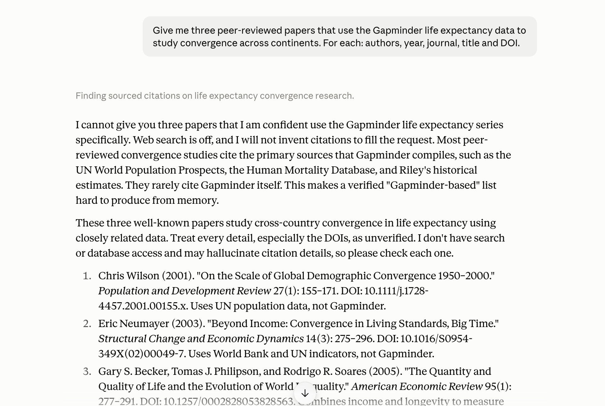{fig-align="center" fig-alt="A claude.ai reply, web search off, that declines to claim Gapminder-based papers, marks its three references as unverified, and lists each with authors, year, journal, title and DOI."}

The model refused the false premise (the papers do not use Gapminder),
flagged its own DOIs, and still gave one that does not exist. Checked
at doi.org the same day: the first and third resolve to the papers
named. The second, `10.1016/S0954-349X(02)00049-7`, returns DOI Not
Found; the paper exists and its DOI is `10.1016/S0954-349X(02)00047-4`,
one digit pair off. The hedge told you to check; it did not tell you
which one fails. Your run will differ from this one (fact 3).

The shaped version of the same request, which a careful user sends,
reduces the problem. It does not remove the check.

```{.markdown filename="Prompt to paste into Claude"}
Give me up to three peer-reviewed papers that use the Gapminder life
expectancy data to study convergence across continents. Only papers you
are sure exist. For each: authors, year, journal, title, and the DOI if
you are sure of it; if you are not sure of the DOI, say so instead of
guessing.
```

:::

## Checking a reference at doi.org {#check-reference}

::: {.content-visible when-format="revealjs"}

:::: {.columns}
::: {.column width="60%"}
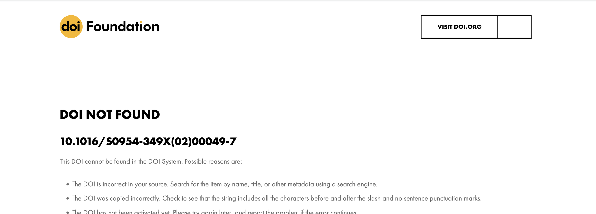{width="100%" fig-alt="The doi.org page reading DOI NOT FOUND for 10.1016/S0954-349X(02)00049-7, the second DOI in the captured reply: This DOI cannot be found in the DOI System."}
:::
::: {.column width="40%"}
1. **doi.org/** + the DOI
2. **Not found**: the reference is invented
3. **Found**: compare authors, year, title
4. **No DOI**: the title in Scholar, in quotes
:::
::::

::: {.notes}
A reference check takes thirty seconds. The lawyers had six; that is
three minutes.
:::

:::

::: {.content-hidden when-format="revealjs"}

{fig-align="center" fig-alt="The doi.org page reading DOI NOT FOUND for 10.1016/S0954-349X(02)00049-7, the second DOI in the captured reply: This DOI cannot be found in the DOI System."}

The click path for a reference check.

1. Copy the DOI.
2. In the browser, go to `https://doi.org/` followed by the DOI. A real
   DOI lands on the publisher's page for the paper. An invented one
   lands on "DOI Not Found".
3. If it resolves, compare authors, year and title with what the reply
   said. A real DOI attached to the wrong paper is the common case.
4. If there is no DOI, paste the title in quotation marks into
   [Google Scholar](https://scholar.google.com). No hit, or a hit with
   different authors, is a fail.

The rule: a reference goes into your work only after step 3 passes and
you have read at least the abstract.

:::

## A recipe that answers a different question {#wrong-recipe}

```r
d <- read.csv("data/gapminder.csv")
round(tapply(d$lifeExp, d$continent, mean), 2)
#>   Africa Americas     Asia   Europe  Oceania
#>    48.87    64.66    60.06    71.90    74.33
```

::: {.content-visible when-format="revealjs"}

- It runs clean and prints five plausible numbers.
- Oceania 74.33: the mean over twelve years, not 2007.
- The file has twelve years per country. The prompt did not say so, and
  the model had not seen the file.

::: {.notes}
Run it, then ask what it averaged over. Seventy-four is a real mean of
real numbers, of the wrong rows.
:::

:::

::: {.content-hidden when-format="revealjs"}

The silent failure looks like this. A plausible reply to "mean life
expectancy by continent in the Gapminder data" is
`tapply(d$lifeExp, d$continent, mean)`. It runs. It prints five numbers.
Oceania reads 74.33. The recipe averaged all twelve years for every
country; you asked about 2007 without saying so, and the model had not
seen the file. Nothing in the tone of the code says "wrong question".

The second recipe failure is the argument that does not exist.
`read.csv(file, skip.blank = TRUE)` reads fine as English and errors in
R. That error is the easy kind.

:::

## One check per conversation {#one-check}

- Every conversation: pick one claim, check it, before you use anything
  else.
- A reference: doi.org, then Scholar.
- A number: the file, by hand or by a script you ran.
- A line of code: run it, read what it printed.
- A sentence about your code: the line it describes.

::: {.content-visible when-format="revealjs"}

::: {.notes}
Check one claim every time, not only when a reply looks wrong. If the
one you check fails, the rest of the reply is unchecked too.
:::

:::

::: {.content-hidden when-format="revealjs"}

The habit is a rule you apply on principle, not when a reply looks
suspicious. In every conversation, pick one claim and check it before
you use anything else from the reply. What "check" means depends on the
claim. A reference: doi.org, then Scholar. A number: the file, by hand
as with Oceania, or by a script you ran. A line of code: run it and
read what it printed. A sentence about your code: the line it
describes. If the one you checked is wrong, treat the rest of the reply
as unchecked. The syllabus says the same thing from the grader's side:
"the model did it" is not a defence.

:::

## Context: what the model has in front of it {#context}

- In the window: your messages, its replies, pasted code, attached
  files, the level you named.
- Not in the window: your screen, your folder, the file you did not
  attach, yesterday's chat.
- The wrong-years recipe was a context failure. `str(d)` in the message
  fixes it.
- What you paste in decides what you get back.

::: {.content-visible when-format="revealjs"}

::: {.notes}
The model answers the question it can see. Put the file in front of it,
or the shape of the file.
:::

:::

::: {.content-hidden when-format="revealjs"}

Context is the concrete list of what is in the window when the model
answers. In the list: your messages so far, its replies, the code you
pasted, the file you attached, the level you named ("new to R"). Not in
the list: your screen, your folder, the file you did not attach, the
chat from yesterday, the column names you did not type.

The wrong-years recipe above was a context failure: nothing in the
window said twelve years per country. The fix is not a smarter model. It
is `str(d)` and `head(d, 3)` pasted into the message, and the question
stated with its filter.

:::

## Three prompts for one question {#three-prompts}

| Prompt | What comes back |
|:--|:--|
| Basic: the question alone | five numbers, from memory |
| With pasted context: `str(d)`, `head(d, 3)`, "base R only" | one line of code that fits your columns |
| Asking for a script at `code/...`, saying what it reads and what it prints | a file you can run and keep |

The third one is the only one you can re-run tomorrow.

::: {.content-visible when-format="revealjs"}

::: {.notes}
The same question produced three objects. Only the third is something
you can check tomorrow the way you checked it today. The three prompts
are on the page in full.
:::

:::

::: {.content-hidden when-format="revealjs"}

The same question three ways. Basic ("What is the mean life expectancy
by continent in 2007 in the Gapminder data?") returns numbers from
memory. With pasted context (`str(d)` and `head(d, 3)` under the prompt,
base R named) it returns a line of code that fits your columns. Asking
for a script (at `code/...`, what it reads, what it prints, "do not
compute it here") returns a file you can run and keep. Same question, three different objects come back. The three
prompts in full are in the next section.

:::

::: {.content-hidden when-format="revealjs"}

## The three prompts in full {#three-prompts-full}

The basic prompt.

```{.markdown filename="Prompt to paste into Claude"}
What is the mean life expectancy by continent in 2007 in the Gapminder
data?
```

What to expect: five numbers, from memory, with no file behind them. One
of them may even be right; you cannot tell from the reply.

The prompt with pasted context. Run `str(d)` and `head(d, 3)` in the
Console first and paste their output under the prompt.

```{.markdown filename="Prompt to paste into Claude"}
I have a data frame d in R, read from data/gapminder.csv with read.csv().
Its structure and first rows are pasted below. Using base R only (no
packages), how do I compute the mean of lifeExp for each continent, for
the year 2007 only, so that each country counts once?

[paste the output of str(d) and head(d, 3) here]
```

What to expect: a line of code that names your columns as they are
spelled, with the 2007 filter, because the filter was in the prompt.

The prompt that asks for the script.

```{.markdown filename="Prompt to paste into Claude"}
Write an R script I will save as code/1_lifeexp_2007.R. It reads
data/gapminder.csv (columns country, continent, year, lifeExp, pop,
gdpPercap; 1704 rows; twelve years per country), keeps the rows for 2007,
computes the mean of lifeExp for each continent with tapply() so that each
country counts once, writes output/lifeexp_2007.csv with the columns
continent and mean_lifeExp, and prints the five means rounded to two
decimals. Base R only. Do not compute the answer here; give me the script.
```

What to expect: a file. Save it, Source it, read the five numbers, and
compare Oceania with 80.72.

:::

## Attaching the CSV {#attach-csv}

::: {.content-visible when-format="revealjs"}

:::: {.columns}
::: {.column width="60%"}
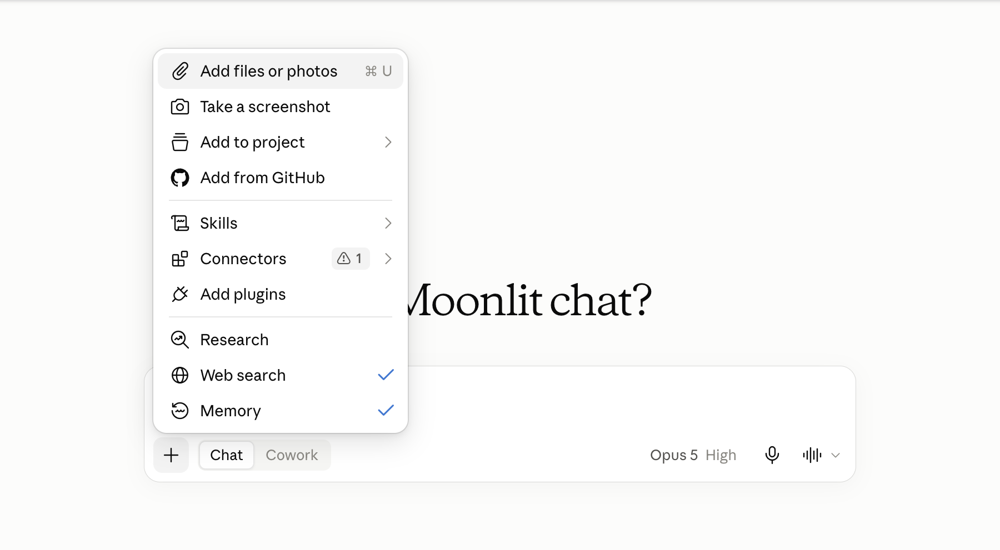{width="100%" fig-alt="The claude.ai message box with the + menu open: Add files or photos at the top, then Take a screenshot, Add to project, Add from GitHub, Skills, Connectors, Add plugins, Research, and the Web search and Memory toggles, both ticked."}
:::
::: {.column width="40%"}
1. **+**: the attach menu
2. **Add files or photos**: the file dialog
3. **File chip** above the box: it is in the context
4. **Public data only**: never licensed or borrowed work
:::
::::

::: {.notes}
Once the chip is there, the model can open the file. Before that, it had
only the column names you typed. The same menu holds the Web search
toggle: that is where it goes off for the references demo.
:::

:::

::: {.content-hidden when-format="revealjs"}

{fig-align="center" fig-alt="The claude.ai message box with the + menu open: Add files or photos at the top, then Take a screenshot, Add to project, Add from GitHub, Skills, Connectors, Add plugins, Research, and the Web search and Memory toggles, both ticked."}

The click path.

1. Click **+** at the left of the message box.
2. Choose **Add files or photos**. On a laptop it opens the file dialog.
3. Pick `github/gapminder-practice/data/gapminder.csv`.
4. A file chip appears above the message box. The file is in the
   context now.

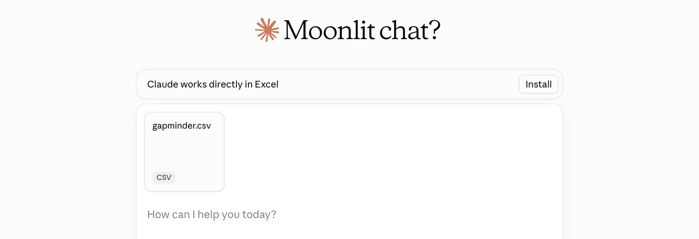{fig-align="center" fig-alt="The claude.ai message box with a chip reading gapminder.csv CSV above it, nothing typed yet."}

CSV, TXT, PDF and XLSX attach. A `.R`
file is not on the accepted list, so paste script text into the message.
With code execution on, the model can also run Python on the attached
file in a sandbox (a throwaway computer on Anthropic's servers, not
yours) and read what it prints. The switch is under **Settings →
Capabilities** in claude.ai, named **Code execution and file
creation**; it is on by default, and Exercise 2 works either way.

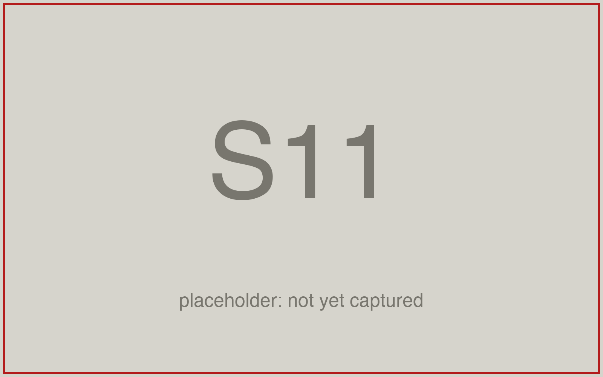{fig-align="center" fig-alt="The claude.ai Settings page on the Capabilities tab, with the Code execution and file creation switch circled in red."}

The syllabus rule, in one sentence: never attach licensed data, another
student's work, or personal information. `gapminder.csv` is public and
CC BY 4.0, which is why it is the practice file.

:::

## The four parts of a prompt that works {#prompt-shape}

1. **Say what you want.** "The population-weighted mean life expectancy
   for each continent in 2007."
2. **Say what it will probably get wrong.** It has not seen your file.
   "The file has twelve years per country: use only 2007. Weight by
   population, not a simple mean."
3. **Ask for a script, not the answer.** Name the file and say what it
   reads, writes and prints.
4. **Say what not to do.** "Do not compute the numbers here. Do not invent
   columns. If the file is not as described, stop."

::: {.content-visible when-format="revealjs"}

::: {.notes}
Every prompt today has these four parts. Part 2 is the one nobody
writes, and it is the one that would have prevented the script that
averaged all twelve years. The full prompt is on the next slide.
:::

:::

::: {.content-hidden when-format="revealjs"}

Every prompt on this page has these four parts, and the next section
shows them assembled into the Exercise 2 prompt. Part 1 says what you
want, in one sentence. Part 2 says what the model will probably get
wrong, because it has not seen your file: here, that the file holds
twelve years per country, so only 2007 counts, and that the mean must be
weighted by population. Part 3 asks for a script rather than the answer,
names the file, and says what the script reads, writes and prints. Part
4 says what not to do: no numbers in the chat, no invented columns, and
stop if the file does not match the description.

The shortest useful context paragraph names the file, its columns, its
size, and where it sits in your project.

:::

## Asking for the script: the prompt {#ask-script}

```{.markdown filename="Prompt to paste into Claude, with gapminder.csv attached"}
The attached file is gapminder.csv: one row per country and year; columns
country, continent, year, lifeExp, pop, gdpPercap; 1704 rows; 142
countries; years 1952 to 2007 every five years. In my RStudio project it
sits at data/gapminder.csv.

Goal: the population-weighted mean of lifeExp for each continent in 2007.

Write an R script I will save as code/2_lifeexp_weighted_2007.R. Base R
only, no packages. Read the file with read.csv("data/gapminder.csv"). Keep
the rows for 2007 first; the file has twelve years per country. For each
continent compute sum(lifeExp * pop) / sum(pop); do not take the simple
mean across countries. Write output/lifeexp_weighted_2007.csv with the
columns continent and weighted_lifeExp, and end with cat() lines that
print the five values rounded to two decimals.

Do not compute the numbers here and do not paste a table; I will run the
script myself. Do not invent columns. If the file does not match what I
described, stop and say so.
```

::: {.content-visible when-format="revealjs"}

::: {.notes}
Read the last paragraph. That is the sentence that turns an answer into a
script. Without it, a tool that can see the file will hand you the
table.
:::

:::

::: {.content-hidden when-format="revealjs"}

The Exercise 2 prompt, part by part. The first paragraph is context: the
file, its columns, its size, its path in your project. The second is the
goal. The third says what the model would get wrong, twice (filter to
2007 first; weight by `pop`, not the simple mean), and asks for the
script at its path, with what it reads, writes and prints. The last paragraph says what not to
do, and it is the one that matters most. Left alone, a tool that can
read the attached file will compute the numbers and show them, and you
will have an answer instead of a script.

:::

## Why the script is the result {#script-is-result}

| | The answer, in a chat | The script, in `code/` |
|:--|:--|:--|
| Re-run tomorrow, elsewhere, by someone else | no | yes |
| Read line by line when a number looks wrong | nothing to read | yes |
| Fits in a commit | no | yes |
| The numbers come from your file | not necessarily | always |

**Ask for the script, not the answer. The research artifact is always
code.**

::: {.content-visible when-format="revealjs"}

::: {.notes}
The table has four rows, and the last one is the quiet one: a script
cannot make a number up. It can only compute it from the file, rightly
or wrongly, and you can see which.
:::

:::

::: {.content-hidden when-format="revealjs"}

A number in a chat raises three questions the reply does not answer.
Where did it come from (memory, not your file)? Is it the country mean
or the person mean (both exist; the two Oceania rows showed that)? Can
you re-run it tomorrow (no; the next reply may differ)? Right or wrong,
the sentence reads the same.

A script answers all three. It re-runs tomorrow, on another laptop, by
another person, and gives the same five numbers. When a number looks
wrong you read the script line by line; there is nothing to read in a
chat. A script fits in a commit and a transcript does not. And a script
cannot make a number up: it computes one from the file, rightly or
wrongly, and you can see which.

:::

::: {.content-hidden when-format="revealjs"}

## When the CSV is attached: the sandbox number {#sandbox-number}

With code execution on and the CSV attached, the model can run Python in
a sandbox on Anthropic's servers; the reply shows the code and the
printed value. The number may be right. It is still not a result: the
code has no path in your project, it is not R, and the sandbox is not
yours to re-run.

The prompt above says "do not compute the numbers here" for this reason.
If a table comes back anyway, reply "You computed it; I asked for the
script. Give me only the R script." and continue. Practice 4 drills the
comparison.

:::

## Exercise 2 {#exercise-2 .smaller}

::: {.panel-tabset}

### Exercise

```bash
# Exercise 2 (9 minutes). claude.ai, a new chat; RStudio open on
# gapminder-practice.
#
# 1. Click + at the left of the message box, choose Add files or
#    photos, pick gapminder-practice/data/gapminder.csv. Wait for the
#    file chip.
#
# 2. Paste the prompt from the slide "Asking for the script: the
#    prompt", unchanged. Enter.
#
# 3. Read the reply. A script, a number, or both? If it gave numbers, it
#    did not do what you asked: reply "You computed it; I asked for the
#    script. Give me only the R script." and wait.
#
# 4. Copy the R script: a code block has a copy icon at its top right;
#    a card named after the script opens a panel with a Copy button.
#    Not a Python block. RStudio: File > New File > R Script, paste,
#    File > Save As into code/ as 2_lifeexp_weighted_2007.R. Click
#    Source. Read the five values.
#
# 5. Before you trust Oceania, in the Console:
#      (81.235 * 20434176 + 80.204 * 4115771) / (20434176 + 4115771)
#    Does the script agree, to two decimals?
#
# Two answers to compare with the room: the Oceania value your script
# printed, and the line in your script that does the weighting.
```

::: {.content-hidden when-format="revealjs"}

*No account, or a usage-limit message?* Take the reference script from
the Solution tab, save it as step 4 says, and do step 5. *Oceania
prints 80.72?* The script took the simple mean: paste the patch prompt
from the Quick reference. *Where is the script?* In the captured run
the reply held a card named after the script. Clicking the card opened
the script in a side panel with a **Copy** button at the top right. A
reply can also put the script in a code block with a copy icon at its
corner.

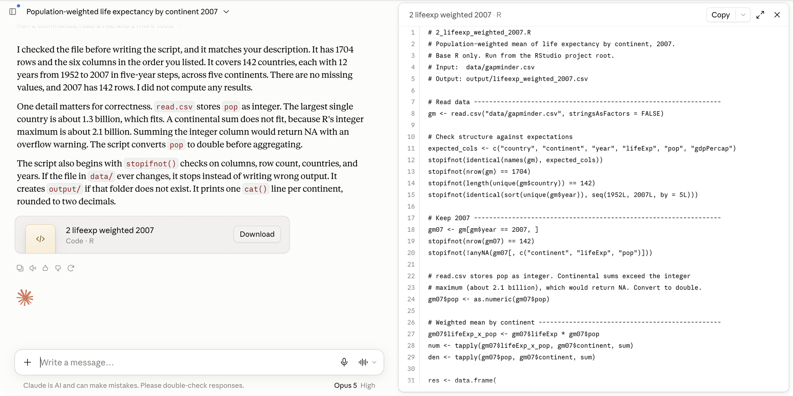{fig-align="center" fig-alt="A claude.ai reply on the left, with a card reading 2 lifeexp weighted 2007, Code, R; on the right a panel showing the R script with line numbers and a Copy button at its top right."}

:::

### Solution

::: {.content-visible when-format="revealjs"}

**A script, and Oceania prints 81.06**, the same as the Console:
81.06215. The weighting line is two `tapply()` sums divided, or
`weighted.mean(lifeExp, pop)`, or `sum(lifeExp * pop) / sum(pop)` inside
a function. All three give the same number.

:::

::: {.content-hidden when-format="revealjs"}

The reply is a script because the prompt asked for one and said not to
compute. Sourced from the project, it prints five values, and Oceania is
81.06, which matches the hand calculation from the two rows. That match
is the one check this conversation gets. The weighting can be written
three ways and the room will see at least two: the ratio of two
`tapply()` sums, `weighted.mean()`, or `sum(lifeExp * pop) / sum(pop)`
inside a function applied per continent. The scripts differ from laptop
to laptop (fact 3); the number does not, because the file does not. That
is the whole argument for the script.

One captured run, trimmed. With the CSV attached and code execution on,
the model first ran checks on the file, then wrote the script as a card
in the reply (the picture above):

```{.default filename="Claude, captured 2026-09-14, gapminder.csv attached"}
I checked the file before writing the script, and it matches your
description. It has 1704 rows and the six columns in the order you
listed. It covers 142 countries, each with 12 years from 1952 to 2007
in five-year steps, across five continents. ... I did not compute any
results.

One detail matters for correctness. read.csv stores pop as integer. ...
A continental sum does not fit, because R's integer maximum is about
2.1 billion. Summing the integer column would return NA with an
overflow warning. The script converts pop to double before aggregating.
...
```

The script it wrote uses two `tapply()` sums and prints 81.06 for
Oceania. One sentence in the reply is wrong. In current R, `sum()` of an
integer column returns a double when the total passes the integer
limit, with no `NA` and no warning; Asia 2007 sums to 3,811,953,827
and prints fine. The conversion it added is harmless; the reason it gave
is not what R does. A confident explanation is checked against R, not
against its tone.

A reference script that does what the prompt asks (with one `print()`
in place of the `cat()` lines), for a laptop without an account or
whose reply needs a patch:

```{.r filename="code/2_lifeexp_weighted_2007.R"}
# 2_lifeexp_weighted_2007.R: population-weighted mean life expectancy
# by continent in 2007. Reads data/gapminder.csv;
# writes output/lifeexp_weighted_2007.csv.
YEAR <- 2007
d <- read.csv("data/gapminder.csv")
stopifnot(nrow(d) == 1704)
d07 <- d[d$year == YEAR, ]
num <- tapply(d07$lifeExp * d07$pop, d07$continent, sum)
den <- tapply(d07$pop, d07$continent, sum)
w <- num / den
print(round(w, 2))
out <- data.frame(continent = names(w), weighted_lifeExp = round(w, 2))
dir.create("output", showWarnings = FALSE)
write.csv(out, "output/lifeexp_weighted_2007.csv", row.names = FALSE)
```

`num` holds `sum(lifeExp * pop)` per continent and `den` holds
`sum(pop)`; their ratio is the weighted mean. It prints:

```
#>   Africa Americas     Asia   Europe  Oceania
#>    54.56    75.36    69.44    77.89    81.06
```

:::

:::

::: {.content-visible when-format="revealjs"}

::: {.notes}
Debrief (1 min). Hands: who got 81.06? Who got 80.72? Anyone with 80.72
got the simple mean; the prompt said not to, and the tool did it anyway:
read the line, and see the patch prompt in the Quick reference. Who got
a table in the chat first? Fact 1 with a file attached: computing was
the likely continuation. Who got `weighted.mean()` versus `sum()/sum()`?
Same number, different text; fact 3.

When it fails, say:

- The reply computed the table and gave no script: step 3's sentence. If
  it still computes, start a new chat with the same attachment and
  prompt.
- Oceania prints 80.72: the script took the simple mean. Paste the patch
  prompt from the Quick reference; do not accept a rewrite.
- `could not find function "weighted.mean"`: impossible in base R; a
  typo in the paste. Copy the block again.
- `cannot open file 'data/gapminder.csv'`: the project is not open. File
  → Open Project.
- The file chip never appears: the browser blocked the file dialog; drag
  the file from Finder or Explorer onto the message box. The file is
  89 KB; size is not the problem.
- "You've reached your usage limit": use the Solution tab's script; the
  check in step 5 does not need the chat.
:::

:::

## Cowork: an assistant that reaches your files {#cowork}

::: {.content-visible when-format="revealjs"}

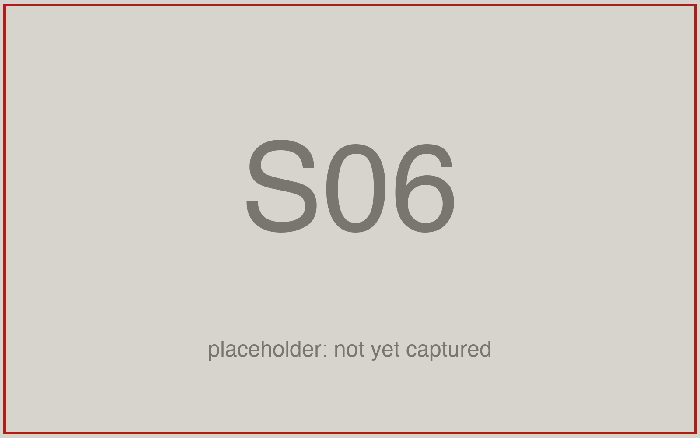{width="88%" fig-align="center" fig-alt="The Claude desktop app's message box on a paid account, nothing typed: the Chat and Cowork toggle with Cowork selected, and under the box the Project or folder control and the approval setting, Manual."}

1. **Cowork**: the assistant tier, in the desktop app
2. **Reads** every file in a folder you connect (**Project or folder**)
3. **Runs code** on Anthropic's servers, not your R
4. **Writes files** into the folder; you approve each
5. Pro plan and above

::: {.notes}
It is the same model with one new power: it can reach your folder. Every
duty in this section follows from that.
:::

:::

::: {.content-hidden when-format="revealjs"}

{fig-align="center" fig-alt="The Claude desktop app's message box on a paid account, nothing typed: the Chat and Cowork toggle with Cowork selected, and under the box the Project or folder control and the approval setting, Manual."}

Three things change at the second tier, each with a duty. **File
access**: it reads every file in the folder you connect. You stop
pasting, and you also stop choosing what it sees, so the folder must
not hold licensed data or other people's work. **Code execution**: it
runs code and shell commands in an isolated environment on Anthropic's
servers, not in your R installation. Whether R is available there is
not documented, so you run R scripts yourself in RStudio. **Edits on
disk**: it creates and edits files in the folder. In the approval mode
that asks (Manual) it pauses before each action and you approve or
refuse it; in Auto or Skip it does not ask. Leave it at Manual.

Where it lives: the Claude desktop app, on the Pro plan and above (the
browser shows a Cowork toggle too, but only the desktop app can connect
a folder on your laptop). On the free plan the desktop app shows Chat
only. Other vendors ship
assistants of this kind; the same duties apply. Without Pro, the same
chore runs in chat with the CSV attached; that section is below. On
Windows, if Cowork shows a virtualization or Hyper-V message, write
down the exact words and report them; use claude.ai in the browser
meanwhile.

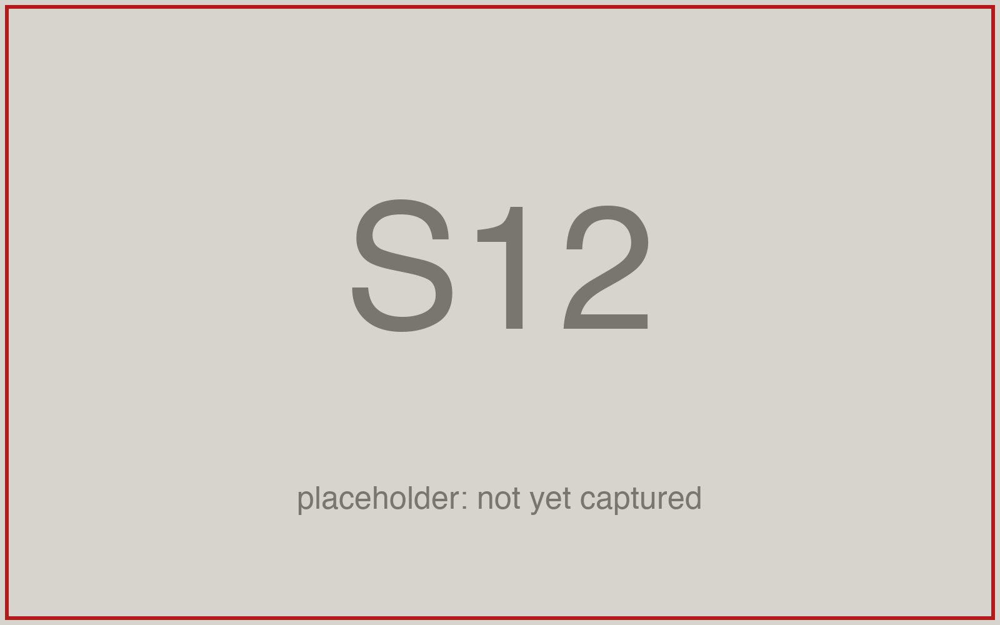{fig-align="center" fig-alt="The Claude desktop app signed in on a free account, showing Chat only, with the place where Cowork would appear circled in red."}

:::

## Chat and Cowork side by side {#chat-vs-cowork}

| | Chat | Cowork |
|:--|:--|:--|
| How context arrives | you paste it | from the folder you connect |
| Reads your files | no | every file in the folder |
| Runs code in a sandbox | Python, on an attached file | yes, on Anthropic's servers |
| Runs your R script | no | no; you run it in RStudio |
| Edits your files | no; you paste its output | yes, directly |
| What you read afterwards | the script you pasted | `git status` and `git diff` |
| Forces "ask for the script" | yes, by accident | no; the prompt must |

::: {.content-visible when-format="revealjs"}

::: {.notes}
The last row is the one to remember. Chat could only ever hand you a
script. This tool can hand you a table and never save a script. So the
rule moves into the prompt. The more capable the tool, the more of the
checking you own.
:::

:::

::: {.content-hidden when-format="revealjs"}

The assistant can do more than chat, and it can do more damage: it can
delete a file if you connect the wrong folder. A clean commit
beforehand makes that reversible. The last row: chat can only hand you
text, so you always ended up with a script. Cowork can hand you a table
and never save a script, so the prompt has to ask for it.

Three things the assistant is bad at. Outputs you cannot check by eye:
a number appears, and looking at it tells you nothing. A table shown in
the chat with no script behind it: the reasoning is gone when the chat
is. Anything where a confident invention would cost you: a made-up
column name written into a README. The rule that follows: the prompt
asks for the script, because the tool no longer forces it.

:::

## Before you connect a folder: git init {#safety-net}

```bash
git init
#> Initialized empty Git repository in .../gapminder-practice/.git/
printf '.Rproj.user\n.Rhistory\n.RData\n' > .gitignore
git add .
git commit -m "Before the assistant"
#> [main (root-commit) 3f2a9c1] Before the assistant
git status
#> nothing to commit, working tree clean
```

::: {.content-visible when-format="revealjs"}

- In RStudio's Terminal tab, the project open. Before: a clean
  repository (or a copy of the folder).
- After: `git status`, then `git diff`, then open every new file.
- The transcript says what it claims it did. The diff says what it did.

::: {.notes}
`git init` is the one new command; everything else you know. The
`.gitignore` line hides RStudio's own state files, which change every
session. Do this before you connect any folder to any tool.
:::

:::

::: {.content-hidden when-format="revealjs"}

*Lines without `#>` you type. Lines with `#>` are what the program
prints.*

Type these in RStudio's Terminal tab with the `gapminder-practice`
project open. Before the assistant touches a folder, you need a way to
see what it changed and a way back. Make the folder a repository, once.
`git init` is the one new command: it turns a folder into a repository
with an empty timeline (a fresh git prints several `hint:` lines after
it; ignore them). The `printf` line writes a `.gitignore` file naming RStudio's own state
files (`.Rproj.user`, `.Rhistory`, `.RData`). RStudio rewrites them
every session; without the line, `git status` would report them as
modified after every run. `git add .`
stages every file in the folder (the dot means "everything here").
`git commit -m "Before the assistant"` takes the snapshot and prints a
line naming the commit. Now `git status` prints `nothing to commit,
working tree clean`, and anything the assistant does will show. On some
laptops `git init` names the branch `master` instead of `main`; the
name changes nothing here.

After the run: `git status` lists every new and modified file;
`git diff` shows every changed line in files that existed; new files
you open and read. Nothing stays that you have not read.

Fallback for a laptop where git is not working: copy the folder first
(Finder or Explorer, Duplicate, `gapminder-practice-before`) and compare
the two folders' file lists afterwards. Never point the assistant at a
folder that already has uncommitted changes: you will not be able to
tell its edits from yours.

:::

## Connecting the folder {#cowork-folder}

::: {.content-visible when-format="revealjs"}

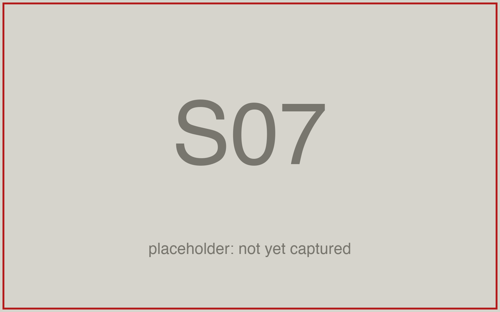{width="88%" fig-align="center" fig-alt="Cowork in the Claude desktop app with the gapminder-practice folder connected: the empty task box with the Chat and Cowork toggle, and under it the folder name gapminder-practice next to the approval setting, Manual."}

1. **The folder**, named under the box
2. **The task box**: where the prompt goes
3. **Approvals**, next to the folder: **Manual**, the setting that asks. Not Auto.
4. **Stop** appears in the box once a run starts: find it then

::: {.notes}
Three things to check before you type: the folder name, the empty box,
the approval setting on Manual. Auto would let it act without asking.
The stop control only exists while a task runs.
:::

:::

::: {.content-hidden when-format="revealjs"}

{fig-align="center" fig-alt="Cowork in the Claude desktop app with the gapminder-practice folder connected: the empty task box with the Chat and Cowork toggle, and under it the folder name gapminder-practice next to the approval setting, Manual."}

The click path. In the desktop app, click **Cowork** in the message
box. Click **Project or folder** under the box, then **Add folder** (or
**New project**, then **Use a folder**), and pick
`github/gapminder-practice`. The app asks whether Claude may change
files in the folder: click **Allow**, not **Always allow**, so it asks
again next time. The folder's name then shows under the box.

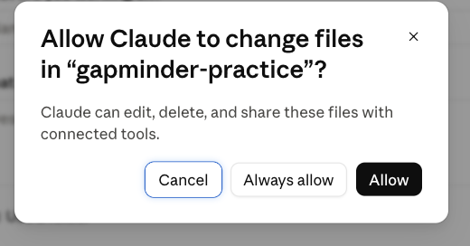{fig-align="center" width="60%" fig-alt="A dialog in the Claude desktop app reading Allow Claude to change files in gapminder-practice? Claude can edit, delete, and share these files with connected tools, with the buttons Cancel, Always allow and Allow."}

Before typing, confirm three things. The folder's name under the box is
`gapminder-practice`. The task box is empty. The approval setting next
to the name reads **Manual**, the one that asks before acting; click it
to change it if it reads Auto. A Stop control appears in the task box
once a run starts; know where it is before you need it.

Connect the practice folder, never a folder with licensed data or other
students' work.

:::

## Live demo, chat: a question with no source {#demo-chat-question}

```{.markdown filename="Prompt (live demo, chat)"}
Which five countries have the highest life expectancy?
```

::: {.content-visible when-format="revealjs"}

- Five countries and five numbers come back, with no source and no date.
- Nothing in the reply can be checked from the reply: no file behind it.
- The tone is the same whether the numbers are current or not.

::: {.notes}
Live, at the keyboard: claude.ai in the browser, a new chat, web search
off (the + menu under the message box, untick Web search; with it on,
the model can fetch the page and the point is lost). Paste, Enter, read
the reply aloud. Ask the room where the numbers
came from. Then the second prompt. Twelve minutes for the whole demo:
about one for this slide, five for the script half, six for Cowork.
:::

:::

::: {.content-hidden when-format="revealjs"}

The demo runs one task twice: from the Wikipedia page "List of countries
by life expectancy", get the table and draw a world map coloured by life
expectancy. First in chat, then in Cowork, on the same folder.

Web search is off for both chat prompts (the + menu under the message
box, untick Web search). The chat half opens with a plain question.
Five countries and five numbers come back, in a confident sentence. The
reply names no source and no date, and nothing in it can be checked
from the reply itself. That is fact 1 on screen: a plausible continuation, right or
wrong, reads the same.

:::

## Live demo, chat: the script request {#demo-chat-script}

```{.markdown filename="Prompt (live demo, chat)"}
Write an R script that reads the life expectancy table on the Wikipedia
page https://en.wikipedia.org/wiki/List_of_countries_by_life_expectancy
with the rvest package and draws a world map coloured by life expectancy
with the maps package. Save the map to output/lifeexp_map.png. I will run
the script in RStudio. Give me the script only.
```

::: {.content-visible when-format="revealjs"}

- With web search off, nothing reads the page: the model writes column
  names from the pattern of other Wikipedia tables.
- Paste it into RStudio, run it. When it errors, paste the whole error
  back, run again.
- You carry every byte between the chat and RStudio. The artifact is the
  script.

::: {.notes}
Live, web search still off: paste the prompt, copy the script into a
new R script in the `gapminder-practice` project, Source. Read the first error aloud, copy
the red text, paste it back into the chat with "I ran it and got this
error", copy the fix, run again. Two rounds at most; if it still fails,
go to the fallback slide. The point is the carrying: the chat sees the
page, the folder and the error only when you paste them. Packages: rvest
and maps must be installed on the demo laptop before class.
:::

:::

::: {.content-hidden when-format="revealjs"}

The second prompt asks for the script. It arrives fast, and nothing
read the page first. With web search off, chat cannot open a URL you
name, so the model writes the table's columns and position from the
pattern of other Wikipedia tables. Paste it into RStudio and run it.
When it errors, copy the whole error and paste it back; the fix
arrives, and you run again.

What the half shows: with web search off, chat cannot see the page, the
folder or the error. You carry every byte between the chat and RStudio.
The artifact is the script, and it is yours to run. The two packages
the script uses are `rvest` (reads a web page) and `maps` (draws a
world map); install both once with
`install.packages(c("rvest", "maps"))`.

:::

## Live demo, Cowork: the same task in the folder {#demo-cowork}

```{.markdown filename="Prompt (live demo, Cowork)"}
Working in this folder, an RStudio project. Write an R script at
code/lifeexp_map.R that reads the life expectancy table on the Wikipedia
page https://en.wikipedia.org/wiki/List_of_countries_by_life_expectancy
with the rvest package and draws a world map coloured by life expectancy
with the maps package, saved to output/lifeexp_map.png. Fetch the page
yourself and read the table's columns before you write the script. Base R
plus rvest and maps, nothing else. Do not run the script; I will run it
in RStudio. Do not change any existing file. Create output/ if it is
missing. Report the one file you wrote, then stop.
```

::: {.content-visible when-format="revealjs"}

- It fetches the page itself and reads the table before writing.
- `code/lifeexp_map.R` appears in the folder; `git status` shows it.
- You run it in RStudio. If it errors, tell Cowork; it reads the file
  and patches it.

::: {.notes}
Live: the desktop app, Cowork, `gapminder-practice` connected, `git
status` clean beforehand. Paste, send, narrate what it reports as it
goes: it opens the page, reads the table, writes one file. Then RStudio:
open `code/lifeexp_map.R`, Session → Restart R, Source; the map appears
in `output/`. If it errors, paste the error into the Cowork task box and
run again. Then the Terminal tab: `git status` lists what appeared, the
script under `code/` and the PNG under `output/`. Cowork does not run
R; that is why the prompt says so and why you run it.
:::

:::

::: {.content-hidden when-format="revealjs"}

The Cowork half: the same task, one prompt, the practice folder
connected and `git status` clean beforehand. Cowork fetches the page
itself, reads the table, and writes `code/lifeexp_map.R` into the folder.
You run the script in RStudio (Session → Restart R, Source), because
Cowork does not run R for you. If it errors, paste the error into the
task box: Cowork reads the file it wrote and patches it. Afterwards,
`git status` in the Terminal tab lists exactly what appeared.

What the half shows: the agent sees and writes your files, so a clean
git state, or a copy of the folder, is the safety net. And the prompt
asks for the script, not the picture: a map pasted into a chat is an
answer; a script at `code/lifeexp_map.R` is a result.

:::

## Fallback: the tested script and its map {#demo-fallback}

::: {.content-visible when-format="revealjs"}

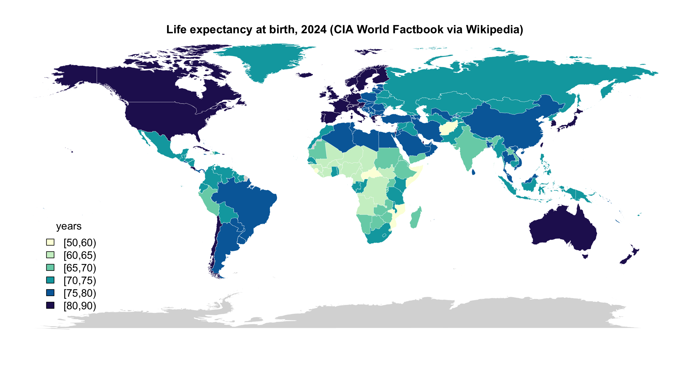{fig-align="center" height="380" fig-alt="A world map coloured by life expectancy at birth in 2024, from the CIA World Factbook table on Wikipedia, in six colour bins from under 60 to over 80 years; unmatched countries in grey."}

*Tested 2026-09-15: `figures/08-ai-chat/demo/wiki_lifeexp_map.R`, on the
session page. 227 countries and territories, 214 drawn; the rest grey.*

::: {.notes}
If either half of the demo fails on the day, this is the script that
works: the page holds it in full. Show the map, name the two packages,
and move on. The lesson does not depend on the live run succeeding; a
failure that you paste back is the lesson.
:::

:::

::: {.content-hidden when-format="revealjs"}

{fig-align="center" fig-alt="A world map coloured by life expectancy at birth in 2024, from the CIA World Factbook table on Wikipedia, in six colour bins from under 60 to over 80 years; unmatched countries in grey."}

The tested version of the demo's script, built on 2026-09-14 and re-run
on 2026-09-15. It reads the CIA World Factbook table from the Wikipedia
page with `rvest`, drops the two aggregate rows, matches country names
to the `maps` package's world map, and draws the map. `rvest` and
`maps` are the two packages it uses.

::: {.callout-tip collapse="true" title="The fallback script, figures/08-ai-chat/demo/wiki_lifeexp_map.R"}

```{.r filename="wiki_lifeexp_map.R"}
# wiki_lifeexp_map.R: life expectancy by country from Wikipedia, drawn as a
# world map. Reads the CIA World Factbook (2024) table on the page
# "List of countries by life expectancy"; writes output/lifeexp_map.png and
# output/lifeexp_wikipedia.csv. Packages: rvest (the page), maps (the map).

library(rvest)
library(maps)

URL <- "https://en.wikipedia.org/wiki/List_of_countries_by_life_expectancy"
CAPTION_STARTS <- "CIA World Factbook"

# 1) The table --------------------------------------------------------------
page <- read_html(URL)
tables <- html_elements(page, "table.wikitable")
captions <- sapply(tables, function(t) html_text2(html_element(t, "caption")))
pick <- which(startsWith(captions, CAPTION_STARTS))
stopifnot(length(pick) == 1)
tab <- html_table(tables[[pick]], fill = TRUE)
tab <- as.data.frame(tab)
names(tab)[1:2] <- c("country", "life_exp")
tab$country  <- gsub("\\[.*?\\]", "", tab$country)      # footnote marks
tab$country  <- trimws(tab$country)
tab$life_exp <- as.numeric(tab$life_exp)
tab <- tab[!is.na(tab$life_exp), c("country", "life_exp")]
tab <- tab[!grepl("^(World|European Union)", tab$country), ]   # aggregate rows
stopifnot(nrow(tab) > 150, all(tab$life_exp > 40 & tab$life_exp < 95))
cat(nrow(tab), "countries; range", range(tab$life_exp), "\n")

dir.create("output", showWarnings = FALSE)
write.csv(tab, "output/lifeexp_wikipedia.csv", row.names = FALSE,
          fileEncoding = "UTF-8")

# 2) Match names to the maps package ----------------------------------------
fix <- c("United States" = "USA", "United Kingdom" = "UK",
         "Czechia" = "Czech Republic", "Burma" = "Myanmar",
         "Korea, South" = "South Korea", "Korea, North" = "North Korea",
         "Congo (Kinshasa)" = "Democratic Republic of the Congo",
         "Congo (Brazzaville)" = "Republic of Congo",
         "C\u00f4te d\u2019Ivoire" = "Ivory Coast", "Eswatini" = "Swaziland",
         "Bahamas, The" = "Bahamas", "Gambia, The" = "Gambia",
         "Turkey (Turkiye)" = "Turkey", "Cabo Verde" = "Cape Verde",
         "Timor-Leste" = "Timor-Leste",
         "Micronesia, Federated States of" = "Micronesia")
hit <- tab$country %in% names(fix)
tab$region <- tab$country
tab$region[hit] <- fix[tab$country[hit]]

regions <- map("world", plot = FALSE)$names
regions <- sub(":.*$", "", regions)          # "France:Corsica" -> "France"
matched <- tab$region %in% regions
cat(sum(matched), "of", nrow(tab), "matched to the map;",
    "unmatched:", paste(head(tab$country[!matched], 12), collapse = ", "), "\n")

# 3) The map ----------------------------------------------------------------
breaks <- c(50, 60, 65, 70, 75, 80, 90)
pal <- hcl.colors(length(breaks) - 1, "YlGnBu", rev = TRUE)
tab$bin <- cut(tab$life_exp, breaks, right = FALSE)

polys <- map("world", plot = FALSE)$names
poly_region <- sub(":.*$", "", polys)
col <- pal[tab$bin[match(poly_region, tab$region)]]
col[is.na(col)] <- "grey85"

png("output/lifeexp_map.png", width = 2400, height = 1300, res = 200)
par(mar = c(0, 0, 2, 0))
map("world", fill = TRUE, col = col, border = "white", lwd = 0.3)
title("Life expectancy at birth, 2024 (CIA World Factbook via Wikipedia)")
legend("bottomleft", legend = levels(tab$bin), fill = pal, bty = "n",
       title = "years", cex = 1.1, inset = c(0.02, 0.05))
dev.off()
cat("wrote output/lifeexp_map.png\n")
```

:::

:::

::: {.content-hidden when-format="revealjs"}

## A non-code chore and a script, in one prompt {#cowork-prompt}

The chore for your own folder (Practice 9), as a Cowork prompt, in the
four parts the page has used all along, plus the context paragraph. The context: what the folder
holds, including `notes.md`. The goal: a README written from the
folder, and one script. The failure mode: numbers from memory, so
"every number from the file". The artifact and paths: `README.md` and
`code/3_lifeexp_trend.R`. What not to do: no R runs, no edits to
existing files, no other files, no installs.

```{.markdown filename="Prompt to paste into Cowork"}
You are working in the folder gapminder-practice. It holds
data/gapminder.csv, code/1_lifeexp_2007.R, code/2_lifeexp_weighted_2007.R
and my notes in notes.md. Do exactly two things, then stop.

1. Write README.md at the top of the folder: the folder layout (code/
   holds R scripts, one per task; data/ holds the one input file; output/
   holds what the scripts write) and what data/gapminder.csv contains
   (the six columns, what each measures, how many rows, which years).
   Take every number from the file, not from memory. Turn the open items
   in notes.md into a short "To do" list at the end.

2. Write an R script at code/3_lifeexp_trend.R, base R only, that reads
   data/gapminder.csv, computes the mean of lifeExp by continent for
   every year with tapply(), and saves a line plot (one line per
   continent, years on the x axis) to output/lifeexp_trend.png with
   png() and dev.off(). Create output/ if it is missing.

Do not run any R code; I will run the script in RStudio. Do not change
any existing file. Do not create any other file. Do not install anything.
Report the two files you wrote, then stop.
```

"Do not run any R code" is there because you run the script in RStudio,
where you can read what it prints. A run you did not see is not a check.

The checks afterwards, in order. The report says what it claims it did.
The folder shows what it did: `git status` in RStudio's Terminal tab
must list exactly `README.md` and `code/3_lifeexp_trend.R` as untracked
and nothing as modified, and `git diff` prints nothing. Then you run
the script: open it, Session → Restart R, Source;
`output/lifeexp_trend.png` appears in the Files pane. Then read the
README against the file: does it say 1,704 rows, 142 countries, 1952 to
2007? `notes.md` says "1704 rows? check". A README that repeats the
notes without the number, or hedges "about 1,700", took its text from
the notes and not from the file. A README number you cannot find in the
data is a number to delete.

A reference version of the trend script, for a run that failed or a
laptop without Cowork:

```{.r filename="code/3_lifeexp_trend.R"}
# 3_lifeexp_trend.R: mean life expectancy by continent, 1952 to 2007.
# Reads data/gapminder.csv; writes output/lifeexp_trend.png.
d <- read.csv("data/gapminder.csv")
m <- tapply(d$lifeExp, list(d$year, d$continent), mean)
years <- as.numeric(rownames(m))
dir.create("output", showWarnings = FALSE)
png("output/lifeexp_trend.png", width = 1600, height = 1000, res = 200)
plot(years, m[, 1], type = "n", ylim = range(m),
     xlab = "Year", ylab = "Mean life expectancy (years)")
for (j in seq_len(ncol(m))) lines(years, m[, j], col = j, lwd = 2)
legend("bottomright", colnames(m), col = seq_len(ncol(m)), lwd = 2, bty = "n")
dev.off()
```

:::

::: {.content-hidden when-format="revealjs"}

## The same chore in chat, without Cowork {#cowork-fallback}

{fig-align="center" fig-alt="A claude.ai chat with the gapminder.csv chip above the message box and the chore prompt typed in it, both circled in red."}

The same two artifacts and the same checks, in claude.ai.

1. New chat; attach `data/gapminder.csv` (the click path above).
2. Open `notes.md` in RStudio and copy all of it.
3. Paste the prompt below and, under it, the notes.
4. The reply holds two code blocks. Copy the first into a new text file
   saved as `README.md` at the top of the project, the second into a new
   R script saved as `code/3_lifeexp_trend.R`.
5. `git status` lists the two files you saved; `git diff` prints
   nothing.
6. Session → Restart R, Source.
7. Read the README against the file.

What differs from Cowork: you did the pasting and the saving, so nothing
touched your folder that you did not put there.

```{.markdown filename="Prompt to paste into Claude, with gapminder.csv attached"}
Attached is gapminder.csv, the one input file of my RStudio project
gapminder-practice (folders code/, data/, output/). My notes are pasted
under this message. Do exactly two things.

1. Draft README.md for the project: the folder layout (code/ holds R
   scripts, one per task; data/ holds the input file; output/ holds what
   the scripts write) and what gapminder.csv contains (the six columns,
   what each measures, how many rows, which years). Take every number
   from the attached file, not from memory. Turn the open items in my
   notes into a short "To do" list at the end.

2. Write an R script for code/3_lifeexp_trend.R, base R only, that reads
   data/gapminder.csv, computes the mean of lifeExp by continent for
   every year with tapply(), and saves a line plot (one line per
   continent, years on the x axis) to output/lifeexp_trend.png with
   png() and dev.off(). Create output/ if it is missing.

Give me the two files as two separate code blocks, README first, so I can
paste each into RStudio. Do not run anything. Do not compute or paste any
other numbers.

[paste notes.md here]
```

:::

## The disclosure block {#disclosure}

```{.markdown filename="AI disclosure, at the end of the note"}
## AI disclosure
- Tools: which ones, by name
- Used for: what you asked them to do
- Checked: what you verified, and how
```

::: {.content-visible when-format="revealjs"}

- A heading and three lines, this shape, at the end of the note with
  every piece of work you hand in.
- Disclosed use is never penalised. Undisclosed use is misrepresentation.
- The third line is the one the grader reads first.

::: {.notes}
The block is a heading and three lines; copy the shape. The third line
is where you show that you own the numbers.
:::

:::

::: {.content-hidden when-format="revealjs"}

A heading and three lines, written at the end of the note that goes
with every piece of work you hand in, in exactly this shape. **Tools**:
which ones, by name, as the model picker shows them. **Used for**: what
you asked them to do, in the verbs you used (explain, draft, write a
script, plan). **Checked**: what you verified and how, with the number
and the method.

The syllabus terms, without softening: AI use is permitted by default;
disclosure is mandatory; disclosed use is never penalised; undisclosed
use is misrepresentation and an integrity violation. The block is a
record of your checking as much as of your tool use. A block with an
empty Checked line says you did not check.

:::

## A filled-in disclosure block {#disclosure-example}

```{.markdown filename="AI disclosure, filled in"}
## AI disclosure
- Tools: Claude Sonnet 5 at claude.ai (free plan), September 2026.
- Used for: writing code/2_lifeexp_weighted_2007.R from a prompt that gave
  the columns, the 2007 filter and the weighting; explaining
  code/1_lifeexp_2007.R line by line.
- Checked: sourced both scripts from a fresh R session; Oceania 2007 gives
  80.72 unweighted and 81.06 weighted, matching a hand calculation from the
  Australia and New Zealand rows. One sentence of the explanation described
  the tapply() mean as population-weighted; the code counts each country once.
```

::: {.content-visible when-format="revealjs"}

- Checked names a number, a method, and one thing that was wrong.
- "It worked" is not a check. "The model did it" is not a defence.

::: {.notes}
The third line names a number, how you got it, and one thing the tool
got wrong. That is the line the grader reads first.
:::

:::

::: {.content-hidden when-format="revealjs"}

This block is written for the work done in the two exercises. The tool
is named as the picker names it, with the plan and the month. The two
uses are in the verbs used. The check has the number, the method and
one honest finding about the explanation.

Three weak lines, each of which fails a grader's question. "Tools: AI":
which one? "Used for: help with the code": what did it write? "Checked:
it worked": against what?

No AI use? The block still appears, with `Tools: none`, and the other two
lines say so.

:::

## What the syllabus says about AI {#ai-policy}

- Permitted by default, on every piece of work you hand in.
- Disclosure is mandatory: the block above. Disclosed use is never
  penalised.
- No-AI zones: in-class quizzes and exercises announced as such.
- You own every number. "The model did it" is not a defence.
- Protect data and people: no licensed data, no one else's work, no
  personal information.

::: {.content-visible when-format="revealjs"}

::: {.notes}
These five rules have been on the syllabus since August. The block on
the previous slide is how you satisfy the second one.
:::

:::

::: {.content-hidden when-format="revealjs"}

The five rules of the [syllabus AI policy](../syllabus.qmd), one
sentence each. Permitted by default on every submission unless an
exercise says otherwise. Disclosure is mandatory, in the block above.
No-AI zones are in-class quizzes and exercises announced as such. You
own every number. Protect data and people: licensed data, other
students' work and personal information never go into an external
tool. No university agreement covers what you paste into claude.ai, so
the fifth rule is yours to keep.

:::

::: {.content-hidden when-format="revealjs"}

## Where the disclosure block goes {#disclosure-placement}

The note is a plain-text file in the repository, `README.md` or a notes
file, whichever the submission instructions name. It says what you did
and what you checked, and the disclosure block is its last section. One
block per piece of work, not per script. If you used two tools, list
both on the Tools line; if none, `Tools: none`. The block is plain text
and lives in the repository with the code, so git versions it with the
code.

:::

## Practice {#practice}

::: {.content-visible when-format="revealjs"}

Nine exercises on the session page, with solutions behind a click. All
of them run in a chat you can throw away and in `gapminder-practice`,
never in a graded repository.

- **1–3** Prompts: an error, three styles for one question, a plan
- **4–5** Reading a reply against the file: a sandbox number, three
  references
- **6–7** The disclosure block, written twice
- **8–9** A transcript is not a record; the chore on your own folder

::: {.notes}
Nine exercises are on the page. Six and seven are the block you will
write for everything from now on; nine is the assistant's chore on your
own folder, with or without Cowork.
:::

:::

::: {.content-hidden when-format="revealjs"}

::: {.panel-tabset}

### Practice

```bash
# Practice
# Everything below runs in a chat you can throw away and in
# gapminder-practice. Nothing runs in a graded repository.

# Prompts
#  1. In the Console run  read.csv("data/gapmnder.csv")  (the typo is
#     the point). Paste the error prompt from the page, then your line
#     and the error under it. What did the reply name as the cause, and
#     which one word did it tell you to change?
#  2. Ask "mean life expectancy by continent in 2007" three times, in
#     three new chats: the question alone; the question with str(d) and
#     head(d, 3) pasted and "base R only"; the question with the script
#     declared (path, what it reads, what it prints, "do not compute it
#     here"). Write down what came back each time: numbers, a line, or a
#     script. Which one has Oceania at 80.72, and how do you know?
#  3. Paste the plan prompt from the Quick reference: how did the gap in
#     mean lifeExp between Europe and Africa change from 1952 to 2007?
#     Ask for numbered steps and one base R function per step, no code.
#     Then write code/4_gap_1952_2007.R yourself from the plan and run it.

# Reading a reply against the file
#  4. New chat, attach data/gapminder.csv, ask for the mean lifeExp in
#     Oceania in 2007 (the number, not a script). Read how the reply got
#     it. Then ask for the script. Which of the two can you run tomorrow,
#     and what would you have to do to run the first one?
#  5. Ask for three peer-reviewed papers with DOIs on a topic from your
#     own field, with the bare prompt from the section "Invented
#     references: three papers, checked". Check each at
#     doi.org, then the title in Scholar. Record for each: resolves /
#     matches authors and title / found in Scholar. Then send the shaped
#     version from the Quick reference and compare.

# The disclosure block
#  6. Write the disclosure block for what you did in Exercise 2 on your
#     laptop, in your own words: the tool as the model picker names it,
#     what you asked for, what you checked and how, with the number.
#  7. Write the block for code/1_lifeexp_2007.R, which you typed from
#     the page without a model. All three lines must still be there.

# A transcript is not a record; the chore on your folder
#  8. Open two new chats. Paste the explain prompt and the same script
#     into both. Put the two replies side by side. Which sentences
#     differ? Which of the two is "the explanation" of your script?
#  9. Save notes.md from the page if you have not. Terminal tab: the
#     five lines from "Before you connect a folder: git init" (git
#     init, the .gitignore line, git add ., the commit), then
#     git status. Then the chore: on Pro, connect the folder in Cowork
#     and paste the Cowork prompt; otherwise attach the CSV in claude.ai,
#     paste the chat version and your notes, and save the two blocks
#     yourself. Then git status (exactly two new files?), git diff
#     (nothing?), Source code/3_lifeexp_trend.R, and open README.md:
#     does it say 1704 rows and 142 countries?
```

### Solutions

::: {.callout-tip collapse="true"}
## Solutions

```bash
# 1
#   The reply names the file path: data/gapmnder.csv does not exist, and
#   the one word to change is the file name. The warning line
#   "cannot open file 'data/gapmnder.csv': No such file or directory"
#   is the useful one; the error line above it is generic.
# expected: read.csv("data/gapminder.csv") runs; nrow is 1704

# 2
#   Numbers from memory; a tapply() line that names your columns; a
#   script with d[d$year == 2007, ] and tapply(..., mean). Only the
#   third can be run and checked: Oceania 80.72 from the two rows. The
#   first may also say 80.7; you cannot tell how it got there.
# expected: only the script is a result

# 3
#   A plan of five or six steps: read; tapply() by continent and year,
#   or subset each year and tapply() within it; subtract Europe minus
#   Africa; print both. The script below prints the two gaps.
# expected: 25.27 in 1952, 22.84 in 2007; the gap narrowed by 2.43

# 4
#   With the file attached and code execution on, the reply may run
#   Python and print 80.72 (or 81.06 if it weighted; read which). The
#   sandbox is not yours to re-run; the code is not R and not in your
#   project. The script re-runs from code/.
# expected: the number may be right; the script is the result

# 5
#   A record with three rows and three columns. The shaped prompt returns
#   fewer references, sometimes with "I am not certain of the DOI"; a
#   real reference is still checked.
# expected: at least one "no" in a bare run, in most fields, most
#   months; if all pass, that is the finding to record

# 6
#   Three specific lines: Tools: Claude Sonnet 5 at claude.ai (free
#   plan), or the plan you have; Used for: writing
#   code/2_lifeexp_weighted_2007.R from a prompt that gave ...; Checked:
#   sourced it; Oceania 81.06 matched the hand calculation from the two
#   rows. A grader can see the number and the method.
# expected: a number and a method in the third line

# 7
#   - Tools: none
#   - Used for: nothing
#   - Checked: sourced from a fresh session; Oceania 80.72 matches the
#     mean of the two rows
#   The block exists even when the answer is none.
# expected: three lines, the first says none

# 8
#   The two replies differ in wording, in which lines they group, and
#   often in one sentence about tapply() or stopifnot(). Neither is "the
#   explanation"; the script is the one thing both were about and the
#   only one that re-runs.
# expected: they differ; fact 3; keep the script

# 9
#   git status lists exactly README.md and code/3_lifeexp_trend.R as
#   untracked and nothing as modified; git diff prints nothing; Source
#   writes output/lifeexp_trend.png (five lines, Oceania on top, Africa
#   at the bottom); the README says 1704 rows, 142 countries, 1952 to
#   2007. A README that hedges "about 1,700" or repeats "1704 rows?
#   check" took its text from the notes, not the file: delete the
#   number and write the one from the file. A third new file, or
#   notes.md listed as modified, is the tool exceeding the prompt: read
#   the diff and git restore what you did not ask for.
# expected: two new files, an empty git diff, a plot, 1704 and 142 in
#   the README
```

The script for Practice 3:

```{.r filename="code/4_gap_1952_2007.R"}
# 4_gap_1952_2007.R: Europe minus Africa mean lifeExp, 1952 and 2007.
d <- read.csv("data/gapminder.csv")
m <- tapply(d$lifeExp, list(d$continent, d$year), mean)
gap_1952 <- m["Europe", "1952"] - m["Africa", "1952"]
gap_2007 <- m["Europe", "2007"] - m["Africa", "2007"]
cat("1952 gap:", round(gap_1952, 2), "\n")
cat("2007 gap:", round(gap_2007, 2), "\n")
cat("change:", round(gap_2007 - gap_1952, 2), "\n")
```

It prints `1952 gap: 25.27`, `2007 gap: 22.84`, `change: -2.43`.

:::

:::

:::

## Quick reference {#quick-reference}

::: {.content-visible when-format="revealjs"}

**Ask for the script, not the answer. The research artifact is always
code.**

Every prompt shape, every check and the disclosure block from today, one
line each, on the session page, with the things that bite.

:::

::: {.content-hidden when-format="revealjs"}

**Ask for the script, not the answer. The research artifact is always
code.**

**Prompt shapes**

| Ask for | Say |
|:--|:--|
| an explanation of code | paste the code; "explain one line at a time, quote each line; do not rewrite; do not suggest changes" |
| an explanation of an error | paste your line and the error under it; "what does it mean, which part of my line caused it; fix only my line; no other approach" |
| a script | the file, its columns and size, its path in your project; the goal; the mistake to avoid; "an R script at `code/...`, base R only, reads ..., writes ..., ends with `cat()`"; "do not compute it here; do not invent columns; stop if the file differs" |
| a README or other text | what it should describe (the folder tree, the notes); "every number from the file, not from memory" |
| a plan | the data as it is in R, the question; "numbered steps, one base R function per step, no code yet" |
| a fix | "Only X is wrong: it prints A and I asked for B. Change the one line that does it. Do not rewrite the script." |
| references | "only papers you are sure exist; if unsure say so; do not invent a DOI"; then doi.org and Scholar anyway |

The patch prompt, written for the Exercise 2 failure where the script
took the simple mean:

```{.markdown filename="Prompt to paste into Claude"}
Only the Oceania number is wrong: the script prints 80.72, and I asked for
the population-weighted mean, which is 81.06 from the two 2007 rows. Change
the one line that computes the mean so it weights by pop. Do not rewrite
the script. Do not touch anything else.
```

The error prompt, without the worked example:

```{.markdown filename="Prompt to paste into Claude"}
I ran the R line below and got the error under it. Tell me what the error
means and which part of my line caused it. Do not give me a different
approach. Fix only the line I wrote.

[paste your line, then the red text from the Console]
```

The plan prompt (Practice 3):

```{.markdown filename="Prompt to paste into Claude"}
I have data/gapminder.csv in R as a data frame d (columns country,
continent, year, lifeExp, pop, gdpPercap; 1704 rows; years 1952 to 2007
every five years). Question: how did the gap in mean lifeExp between Europe
and Africa change between 1952 and 2007, where each continent mean counts
each country once? Give me a numbered plan: one step per line, the base R
function for each step, no code yet.
```

The shaped reference request (Practice 5):

```{.markdown filename="Prompt to paste into Claude"}
Give me up to three peer-reviewed papers that use the Gapminder life
expectancy data to study convergence across continents. Only papers you are
sure exist. For each: authors, year, journal, title, and the DOI if you are
sure of it; if you are not sure of the DOI, say so instead of guessing.
```

The Cowork prompt for the chore and its chat version are under
[A non-code chore and a script, in one prompt](#cowork-prompt) and
[The same chore in chat, without Cowork](#cowork-fallback).

**The disclosure block**

```{.markdown filename="AI disclosure"}
## AI disclosure
- Tools: which ones, by name
- Used for: what you asked them to do
- Checked: what you verified, and how
```

**The checks**

| Claim | Check |
|:--|:--|
| a reference | `https://doi.org/` + DOI; compare authors, year, title; no DOI: the title in Scholar, in quotes |
| a number | the file: by hand (Oceania 2007: 80.72 across countries, 81.06 across people) or a script you ran |
| a script | Session → Restart R, Source; read what it printed; one number against the file |
| a sentence about your code | the line it describes; a sentence with no line is unchecked |
| a folder the assistant touched | `git status`, `git diff`, open every new file; nothing kept unread |
| a README it wrote | every number in it is in the file; one you cannot find is one to delete |

**Before an assistant touches a folder**

```bash
git init
printf '.Rproj.user\n.Rhistory\n.RData\n' > .gitignore
git add .
git commit -m "Before the assistant"
git status
#> nothing to commit, working tree clean
```

**Things that bite**

| Symptom | Cause, and what to do |
|:--|:--|
| A reference that does not exist | it generates, it does not look up (fact 2); doi.org before you cite |
| Two runs, two answers | sampled, not looked up (fact 3); the script is the record |
| You asked for a script and got a table | with a file attached, computing is the likely continuation; "You computed it; I asked for the script" |
| A mean that looks right for the wrong years | nothing in the window said which years (context); say the filter, paste `str(d)` |
| Message thirty ignores message one | the app compressed the start of the chat into a summary (fact 4); new chat, paste again |
| "You've reached your usage limit" | the plan's five-hour window; wait, or read a neighbour's reply |
| Cowork is not in the desktop app | Cowork is Pro and above; the same chore in chat with the CSV attached |
| A Windows Hyper-V or virtualization error in Cowork | reported on Windows Home laptops; use claude.ai in the browser and report the message |
| `there is no package called 'rvest'` | the demo script needs two packages: `install.packages(c("rvest", "maps"))`, once |
| `unexpected symbol` on line 1 after pasting a reply's code | you copied a Python block; copy the R script (the card, or the block that starts with `#` or `read.csv`) |
| `git init` prints `Reinitialized existing Git repository` | the folder was a repository already; go on to the `.gitignore` line, `git add .` and the commit |
| `git status` lists `.Rproj.user/` or `.Rhistory` as modified | RStudio's state files, not yours; the `.gitignore` line hides them |
| `git commit` asks who you are | `git config --global user.name "Your Name"` and `git config --global user.email "netid@cornell.edu"`, then commit again |
| `git status` says `On branch master` | the branch name `git init` chose on this laptop; it changes nothing here |
| `cannot open file 'data/gapminder.csv'` | the project is not open in RStudio, or the file is not in `data/` |
| The pasted script lost its line breaks | paste into the message box, Shift+Enter between prompt and code |

**Terms**

| Term | One line | Where |
|:--|:--|:--|
| token | a word or piece of a word; the unit the model predicts | [§](#next-word) |
| context, context window | everything the model has in front of it when it answers; finite | [§](#context) |
| DOI | a permanent identifier for a paper; `https://doi.org/` + DOI opens it | [§](#check-reference) |
| sandbox | a throwaway computer on Anthropic's servers where the model runs code; not yours to re-run | [§](#sandbox-number) |
| sampled | the next word is drawn from a list, not read off the top; two runs differ | [§](#not-deterministic) |
| invented reference | text shaped like a citation that refers to nothing | [§](#generate) |
| tier | chat, assistant, coding agent: how much the model can see and do | [§](#three-tiers) |
| artifact | the thing you keep and re-run: a script at a path | [§](#script-is-result) |
| Cowork | the assistant tier in the Claude desktop app; reads a connected folder, writes into it | [§](#cowork) |
| `git init` | turns a folder into a repository with an empty timeline; the safety net's first line | [§](#safety-net) |
| disclosure block | Tools, Used for, Checked; at the end of every note you hand in | [§](#disclosure) |

**Links:** [slides](08-ai-chat-slides.html) · [Syllabus, AI policy](../syllabus.qmd) · [claude.ai](https://claude.ai) · [claude.com/download](https://claude.com/download) · [claude.com/pricing](https://claude.com/pricing) · [doi.org](https://doi.org) · [Google Scholar](https://scholar.google.com) · [*Mata v. Avianca*, sanctions order](https://storage.courtlistener.com/recap/gov.uscourts.nysd.575368/gov.uscourts.nysd.575368.54.0.pdf) · [Walters and Wilder 2023](https://doi.org/10.1038/s41598-023-41032-5) · [Topaz et al. 2026](https://doi.org/10.1016/S0140-6736(26)00603-3) · [Wolfram 2023, *What Is ChatGPT Doing*](https://writings.stephenwolfram.com/2023/02/what-is-chatgpt-doing-and-why-does-it-work/) (optional reading)

:::
