::: {.content-hidden when-format="revealjs"}

[Slides](09-ai-code-slides.html) · [Source](https://github.com/ArielOrtizBobea/aem6850/blob/main/fall-2026/sessions/09-ai-code.qmd)

What a coding agent in your terminal has in front of it that a chat
window or Cowork does not; how to hand it one function; and how to know
whether what came back is right. State the goal and the mistake to
avoid; work out the answer by hand on a small case; run it, read the
diff, and leave the check in the script. Every step runs in RStudio's
Terminal tab inside a git repository.

:::

::: {.content-hidden when-format="revealjs"}

::: {#before-class .callout-important title="Before class: install Claude Code, log in, and make the practice repository"}

About twenty-five minutes, once, on the laptop you bring. Claude Code
is not on the free plan; it needs a paid Claude plan. Do all six steps;
step 6 is the test.

**1. Subscribe to Claude Pro.** You will get a lot out of it this
semester; it is worth the investment. Cornell is working on access for
students; until that exists, plan on Pro: choose it on the [pricing
page](https://claude.com/pricing). If you decide not to subscribe,
follow the captured run on the slides in class and pair with a
neighbour for the two exercises.

**2. Install Claude Code.** *Mac:* in RStudio, **Tools → Terminal → New
Terminal**, paste this line, Enter:

```bash
curl -fsSL https://claude.ai/install.sh | bash
```

*Windows:* use PowerShell, not RStudio (Start, type `PowerShell`, open
it), paste this line, Enter:

```powershell
irm https://claude.ai/install.ps1 | iex
```

When it finishes, **quit and reopen RStudio**: the terminal you
installed from does not see the new program.

**3. Check the install.** **Tools → Terminal → New Terminal**, type
`claude --version`, Enter. It prints a version number followed by
`(Claude Code)`. `command not found`: quit
and reopen RStudio. Windows, still not found: add
`%USERPROFILE%\.local\bin` to your user PATH, then quit and reopen
RStudio. Windows, and `claude` opens the Claude desktop app instead:
update the desktop app, then retry.

**4. Open or make the practice repository.** If a folder
`github/gapminder-practice` already exists on your laptop, open it
(**File → Open Project**, then its `.Rproj` file) and go to step 5.
Otherwise make it: **File → New Project → New Directory → New Project.**
Directory name `gapminder-practice`; *Create project as subdirectory of*
`~/github`; tick **Create a git repository**; **Create Project**. On Windows type `C:/Users/<your Windows username>/github` for
the parent folder; do not click Browse, which opens Documents, a folder
OneDrive often syncs. Then, in RStudio's **Console** (not the Terminal),
Enter after each line:

```r
install.packages("gapminder")
dir.create("data")
write.csv(gapminder::gapminder, "data/gapminder.csv", row.names = FALSE)
nrow(read.csv("data/gapminder.csv"))
#> [1] 1704
```

`install.packages()` prints a few lines first; the `1704` is the test.

**5. Commit once.** **Tools → Terminal → New Terminal**; the prompt ends
in `gapminder-practice`. Enter after each line:

```bash
git status
#> Untracked files:
#>         .gitignore
#>         data/
#>         gapminder-practice.Rproj
git add -A
git commit -m "Add the Gapminder table"
git status
#> On branch main
#> nothing to commit, working tree clean
```

If the first `git status` says `fatal: not a git repository`, run
`git init` and start the block again. If it prints `nothing to commit,
working tree clean`, the folder is already committed: go to step 6.

*Lines without `#>` you type. Lines with `#>` are what the program
prints.* `main` may read `master` on your laptop; both are fine. If git
asks who you are, run `git config --global user.name "Your Name"` and
`git config --global user.email "netid@cornell.edu"`, then commit again.

**6. Log in (the test).** In the same Terminal tab, type `claude`, Enter.
The first run asks a few set-up questions; take the default text style.
When it asks how to log in, choose the subscription login. Your browser
opens a Claude sign-in page: sign in with the account from step 1 and
follow the prompts back to the Terminal. When it asks whether you trust
this folder, **No, exit** is highlighted: press the down arrow once to
*Yes, I trust this folder*, Enter. A welcome screen names the version,
the model and your plan, and a folder ending in `gapminder-practice`.
Type `/exit`, Enter. That is a pass. Anything else: the "Things that
bite" table at the end of this page lists the fixes; still stuck, bring
the laptop to class ten minutes early. Commit anything else you add to
the folder before class, so that `git status` prints clean.

:::

:::

## Objectives {#objectives .smaller}

By the end of this session you can:

- Explain what Claude Code has in front of it that a chat window does
  not: every file in the folder, a terminal, git, and `CLAUDE.md`.
- Start Claude Code in manual mode inside an RStudio project, read the
  trust question and the status line, and send a read-only prompt.
- Delegate one function in one file: state the goal and the mistake to
  avoid, work out one case by hand, run the script, and compare.
- Read the approval box and `git diff` before accepting an edit, and
  answer the five questions about it.
- Write the hand check into the script and commit it with a message
  that says who wrote what.

::: {.content-visible when-format="revealjs"}

::: {.notes}
Five things, and you do each of them on your own laptop in the two
exercises.
:::

:::

## Plan for today {#plan}

1. Chat, Cowork, Claude Code: one model, three harnesses
2. Starting Claude Code in the repository
3. The five-step loop and the four-part prompt
4. Delegating one function
5. Reading the diff, the patch, the check
6. Version control from inside the agent
7. CLAUDE.md: standing instructions and your style
8. A clean run that is wrong

::: {.content-visible when-format="revealjs"}

::: {.notes}
The projector shows a captured run. The typing happens on your laptop,
in the two exercises.
:::

:::

## Chat, Cowork, Claude Code: one model, three harnesses {#harnesses}

| | Chat | Cowork | Claude Code |
|:--|:--|:--|:--|
| Where it runs | a web page | the desktop app | your terminal, in one folder |
| How context arrives | you paste or attach it | from the folder you connect | from the folder, plus `CLAUDE.md` |
| Reads your files | no | every file in the folder | every file in the repository |
| Edits your files | no; you paste its output | yes, directly | yes; each edit shown as a diff first |
| Runs commands | on Anthropic's servers, on an attached file | on Anthropic's servers | on your laptop: R, git, anything in the terminal |
| Runs your R script | no; you run it | no; you run it | it can; today you run it yourself |
| What you read afterwards | the script you pasted | `git status`, `git diff` | the approval box, then `git diff` |

::: {.content-visible when-format="revealjs"}

::: {.notes}
Same model in all three. The app around it, the harness, decides what
it can see and do. The last column is the only one that acts on your
laptop, which is why it asks first and why git is the safety net.
:::

:::

::: {.content-hidden when-format="revealjs"}

Claude Code is the same Claude model as the chat window and Cowork, in
a third harness: a program in your terminal that runs in one folder.
The harness decides what the model can see and do. In a chat you paste
context in and copy text out. Cowork reads and writes the files in a
folder you connect and runs code in a sandbox on Anthropic's servers,
not on your laptop. Claude Code reads every file in the repository,
edits files after showing each edit as a diff, and runs commands in
your terminal: R, git, anything you could type there. That row is the
difference that matters. The other two never touch your machine; this
one does, which is why it asks before acting and why git is the safety
net.

Two other kinds of tool are not this page's subject. An inline tool
such as [GitHub Copilot in
RStudio](https://docs.posit.co/ide/user/ide/guide/tools/copilot.html)
proposes the next few lines in the editor and sees only the open file.
Terminal agents from other vendors work like Claude Code; the habits
on this page transfer to them.

:::

## How Claude Code works: the loop inside the tool {#tool-loop}

::: {.content-visible when-format="revealjs"}

{fig-align="center" height="195" fig-alt="Five boxes left to right: 1 Prompt, your text plus CLAUDE.md; 2 Read, files, folders, command output; 3 Act, edit a file, run a command; 4 Check, read the result, decide the next step; 5 Reply, when nothing is left to do. A dashed red arrow from box 4 back to box 2 reads: again, until the task is done; in manual mode, step 3 asks you first."}

- It picks a tool: read, search, run a command, edit a file. The result
  comes back to it. Again, until done.
- Manual mode: an edit, or a command that changes something, asks you
  first. Reading never asks.
- A session starts empty. What carries over is on disk: files, commits,
  `CLAUDE.md`.

::: {.notes}
The model writes text only. Every read, run and edit is a request the
harness carries out and reports back. In manual mode the requests that
change something come to you as approval boxes.
:::

:::

::: {.content-hidden when-format="revealjs"}

{fig-align="center" fig-alt="Five boxes left to right: 1 Prompt, your text plus CLAUDE.md; 2 Read, files, folders, command output; 3 Act, edit a file, run a command; 4 Check, read the result, decide the next step; 5 Reply, when nothing is left to do. A dashed red arrow from box 4 back to box 2 reads: again, until the task is done; in manual mode, step 3 asks you first."}

Inside the tool runs a loop. Your prompt goes to the model together
with a hidden system prompt and, if the folder has one, `CLAUDE.md`.
The model writes text and nothing else; it cannot open a file or run a
command itself. So it writes a request for a tool, and the harness
carries it out: read a file, search the folder, run a command in the
terminal, edit a file. The tool's result comes back to the model as
text, and the model decides the next step. That repeats until nothing
is left to do; then you get a reply. Anthropic's page [How Claude Code
works](https://code.claude.com/docs/en/how-claude-code-works) describes
the same loop in three phases: gather context, take action, verify
results. Today the third phase is yours: every delegation on this page
tells the tool not to run the script, in the prompt or in `CLAUDE.md`,
and you run it in RStudio.

In manual mode the loop stops at every edit and at every command that
changes something and asks you; reading is free. You can stop it too:
Esc interrupts. Everything the model has in front of it at a given
moment is its context: the system prompt, `CLAUDE.md`, your prompts,
every file it read and every command output so far. A new session
starts with an empty context. What carries over is what is on disk:
the files, the commits, and `CLAUDE.md`.

:::

## What changes when a tool can edit your files {#what-changes}

- It can read any file in the repository. Nothing private goes in that folder.
- Its edits land on disk, not in a chat.
- It can run commands, including git.
- It shows every edit as a diff before it lands. You accept or refuse.
- What is right is still your call.

::: {.content-visible when-format="revealjs"}

::: {.notes}
Each of these needs a habit; git and reading the diff are the two.
:::

:::

::: {.content-hidden when-format="revealjs"}

Four things change. It can read any file in the repository, so what it
sees is not what you pasted but what is on disk. Its edits land on disk,
not in a chat window. It can run commands, including scripts and git.
Every edit appears as a diff before it lands; that diff is the one thing
you must read. The verification is yours; the tool has no way to compare
the number it produced with the number you meant.

:::

## Two rules: a clean git state, and the diff over the transcript {#two-rules}

- **Start from a clean git state.** `git status` clean before the
  prompt; afterwards the diff is exactly what the model did.
- **Trust the diff, not the transcript.** What it did, not what it says
  it did.
- You read every diff before you commit.

::: {.content-visible when-format="revealjs"}

::: {.notes}
Rule one is why rule two works. A dirty tree mixes your edits with its
edits, and the diff no longer shows what the model did. The diff-reading
habit from the git session is the whole reason rule two is usable.
:::

:::

::: {.content-hidden when-format="revealjs"}

Rule one: start from a clean git state. `git status` prints `nothing to
commit, working tree clean` before you type a prompt; then every line
the diff shows afterwards is the model's, and none is yours. Rule two:
trust the diff, not the transcript. The transcript says what the tool
claims it did. The diff shows what it did. When they disagree, the diff
wins.

:::

## Claude Code in RStudio's Terminal tab {#where-it-lives}

::: {.content-visible when-format="revealjs"}

:::: {.columns}
::: {.column width="60%"}
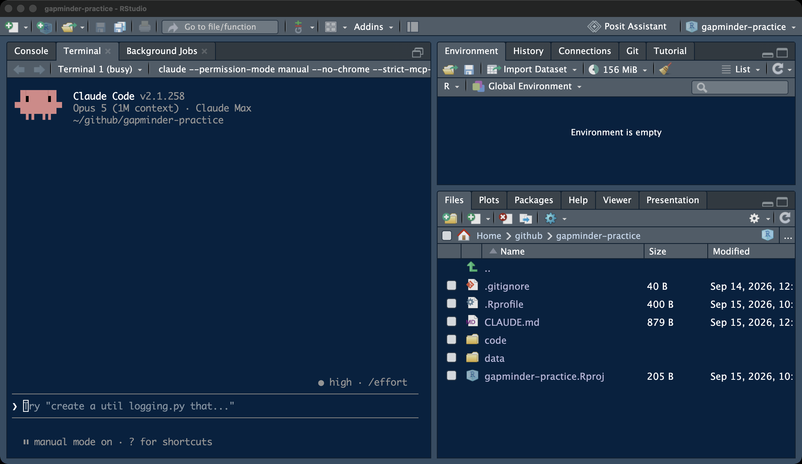{width="100%" fig-alt="The RStudio window with the gapminder-practice project open: the Terminal tab showing the Claude Code welcome screen, the Console beside it, and the Files pane, each circled in red."}
:::
::: {.column width="40%"}
1. **Terminal tab**: where Claude Code runs
2. **`❯` prompt**: where the delegation goes
3. **Console**: where you run the script
4. **Files pane**: what it wrote
:::
::::

::: {.notes}
It runs in the Terminal tab, inside the project, so the paths are the
project's paths. The Console stays free for running the script. This is
the same tab they used for git; say so here, not on the page.
:::

:::

::: {.content-hidden when-format="revealjs"}

{fig-align="center" fig-alt="The RStudio window with the gapminder-practice project open: the Terminal tab showing the Claude Code welcome screen, the Console beside it, and the Files pane, each circled in red."}

Claude Code runs in RStudio's Terminal tab, the tab where git commands
go, opened inside the project so the folder it sees is the repository.
The Console stays free, so the script it writes runs where scripts
always run: Session → Restart R, then Source. The Files pane shows what
it wrote. Enlarge the Terminal pane before a prompt: drag the divider
up, or use the maximize icon in the pane's corner. An approval box for a
twenty-line file does not fit the default pane.

:::

## git status before you start {#clean-start}

```bash
git status
#> On branch main
#> nothing to commit, working tree clean
git log --oneline
#> 4993e56 Add the Gapminder table
```

::: {.content-visible when-format="revealjs"}

- Clean tree, one commit. Anything listed: commit it first.
- Claude Code can read everything in this folder.
- Never in that folder: licensed data, other students' work, personal
  information.

::: {.notes}
Rule one, applied. The hash on your screen is yours; the message is the
same. Before you type `claude`, look at the Files pane: everything in it
is what you are about to show the tool.
:::

:::

::: {.content-hidden when-format="revealjs"}

Open the project (File → Recent Projects →
`gapminder-practice`), then Tools → Terminal → New Terminal. The prompt
ends in the project name. `git status` must be clean, and `git log
--oneline` shows the commits made so far (the hashes on your laptop
differ). If `git status` lists anything, commit it first; a
prompt sent to a dirty tree means you cannot tell later which lines were
yours.

The folder is the tool's entire view, and it can read everything in it.
The syllabus rule applies with no exceptions: no licensed data, no other
students' work, no personal information in a folder you open Claude
Code in. A practice repository with a public file is the right place to
learn. `gapminder.csv` is CC BY 4.0 (gapminder.org via the
[`gapminder`](https://cran.r-project.org/package=gapminder) R package);
anyone may read it. A graded repository is the right place only once
the routine is automatic and the data is public.

:::

## Launching Claude Code in manual mode {#launch}

```bash
claude --permission-mode manual
```

::: {.content-visible when-format="revealjs"}

- Manual mode: it asks before every edit and every command that changes something.
- The status line must read `⏸ manual mode on`.
- Any other mode: `/exit`, then this line again.

::: {.notes}
Use this line, not bare `claude`, until reading diffs is a habit.
:::

:::

::: {.content-hidden when-format="revealjs"}

One line in the Terminal tab launches it in manual mode, where it reads
freely but asks before every edit and every command that changes
something. Depending on the plan, a session may otherwise start in
auto mode, where a second model reviews actions instead of you. The
status line above the prompt says which mode you are in; it must read
`⏸ manual mode on` for everything today. Shift+Tab cycles the modes; if
the keystroke does not reach the tool inside RStudio's terminal, quit
with `/exit` and relaunch with the line above. The mode's configuration
name is `default`, so `--permission-mode default` launches the same
mode.

:::

## The trust question {#trust}

::: {.content-visible when-format="revealjs"}

:::: {.columns}
::: {.column width="60%"}
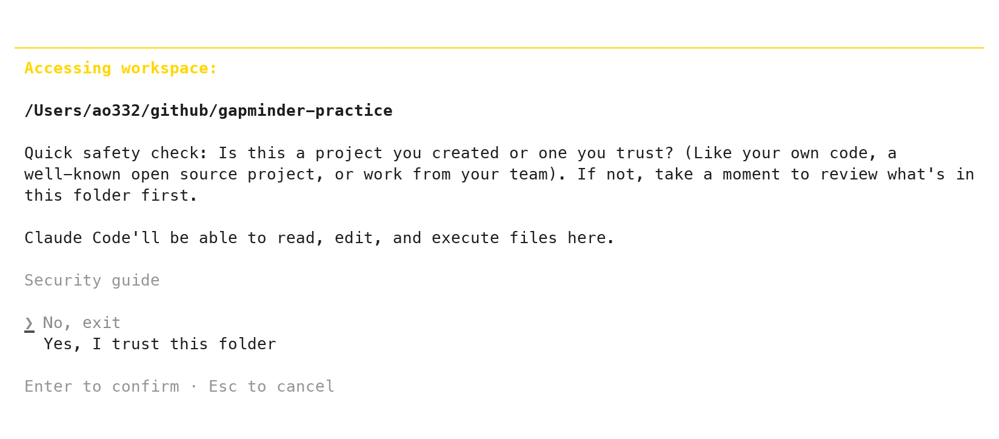{width="100%" fig-alt="Claude Code's first screen in a folder: Accessing workspace, the folder path /Users/ao332/github/gapminder-practice, a quick safety check paragraph, and the two answers No, exit (highlighted) and Yes, I trust this folder."}
:::
::: {.column width="40%"}
1. **The path**: must end in `gapminder-practice`
2. **No, exit** is highlighted
3. **↓ once, then Enter**
4. Asked once per folder
:::
::::

::: {.notes}
Read the path before you press anything. If it is your home folder, you
are about to trust a tool with everything in it.
:::

:::

::: {.content-hidden when-format="revealjs"}

{fig-align="center" fig-alt="Claude Code's first screen in a folder: Accessing workspace, the folder path /Users/ao332/github/gapminder-practice, a quick safety check paragraph, and the two answers No, exit (highlighted) and Yes, I trust this folder."}

The first launch in a folder asks whether you trust it. The highlighted
answer is **No, exit**. Press the down arrow once to **Yes, I trust this
folder**, then Enter. It asks once per folder. If it asks on every
launch, you opened the terminal outside the project; Tools → Terminal →
New Terminal from inside the project fixes it.

:::

## Reading the welcome screen {#welcome}

::: {.content-visible when-format="revealjs"}

:::: {.columns}
::: {.column width="60%"}
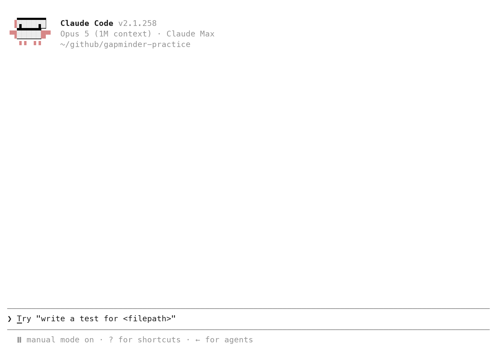{width="100%" fig-alt="The Claude Code welcome screen: Claude Code v2.1.258, the model and plan line, the folder ~/github/gapminder-practice, the prompt box, and the status line reading manual mode on."}
:::
::: {.column width="40%"}
1. **Version**: the number varies; any current one
2. **Model · plan**: the model in use and your plan; wording varies
3. **Folder**: ends in `gapminder-practice`
4. **`❯`**: type here, Enter sends
5. **Status line**: `⏸ manual mode on`
:::
::::

::: {.notes}
Line three and the status line. If either is wrong, exit and relaunch;
nothing else on this screen matters yet.
:::

:::

::: {.content-hidden when-format="revealjs"}

{fig-align="center" fig-alt="The Claude Code welcome screen: Claude Code v2.1.258, the model and plan line, the folder ~/github/gapminder-practice, the prompt box, and the status line reading manual mode on."}

Four lines matter: the version; the model and plan (yours differ from
the captured account's); the folder; and
the status line, `⏸ manual mode on`. The folder must end in
`gapminder-practice` (on Windows it starts with `C:/Users/`). The `❯` is
where a prompt goes; Enter sends it.

Every Claude Code screen on this page comes from real runs, captured in
September 2026 with the version the welcome screen shows; the RStudio
screens are separate captures. The interface changes between versions,
and replies vary from run to run: the wording of a summary, sometimes
the code. The steps do not.

:::

## Two read-only first prompts {#first-prompt}

```{.markdown filename="Prompt 1, to paste into Claude Code"}
List every file in this repository, folder by folder, with its size.
Do not edit anything.
```

```{.markdown filename="Prompt 2, to paste into Claude Code"}
How many rows does data/gapminder.csv have, and what are its columns?
Do not edit anything.
```

::: {.content-visible when-format="revealjs"}

- Prompt 1: it reads the folder. No edit box. Compare with the Files pane.
- Prompt 2: it opens the file itself. A box for `head` or `wc` may
  appear: a tool call. Read it, `1. Yes`.
- The reply: 1704 rows; country, continent, year, lifeExp, pop, gdpPercap.

::: {.notes}
Reading never asks. Anything that changes a file stops and asks first.
Prompt 2 is the loop from the diagram, in one turn: a read, the result
back to the model, the reply.
:::

:::

::: {.content-hidden when-format="revealjs"}

The first prompt changes nothing; it proves the tool sees the
repository. A prompt that ends with "Do not edit anything" does not
trigger an edit box, because reading is free in manual mode. A box may
still appear for a listing command such as `ls` or `find`; read the
command, then `1. Yes`. The reply lists at least `.gitignore`,
`gapminder-practice.Rproj` and `data/gapminder.csv` with their sizes
(often `.git/` and `.Rproj.user/` too), in whatever layout that run
chose. Paste into the Terminal tab with Cmd+V on a Mac, Ctrl+V on
Windows. A long prompt may collapse to one line, `[Pasted text #1 +N
lines]`; that is the whole prompt. Compare the reply with the Files
pane: same files, same folders.

The second prompt is the loop of the previous section in one turn. The
model cannot see the file until a tool opens it, so it reads the file
or asks to run `head` and `wc -l` on it; a *Bash command* box with such
a command is a tool call, and `1. Yes` lets it run. The result comes
back to the model and the reply follows: 1704 rows and six columns,
country, continent, year, lifeExp, pop and gdpPercap. Both are
checkable against what you printed before class. Then `git status` in a
second Terminal tab (next section) prints clean, which is the proof
that two read-only prompts read only.

:::

## Keys, commands, and a second Terminal tab {#keys}

| Key or command | Does |
|:--|:--|
| Enter | sends the prompt |
| Esc | interrupts; on a question, declines |
| ↑ | brings back the previous prompt |
| `/clear` | new conversation, same folder |
| `/exit` (or Ctrl+C twice) | leaves Claude Code |
| Tools → Terminal → New Terminal | a second tab for git |

::: {.content-visible when-format="revealjs"}

::: {.notes}
Esc interrupts whatever it is doing. Open a second Terminal tab for git,
so you can read what it did without leaving the tool.
:::

:::

::: {.content-hidden when-format="revealjs"}

Five keys a novice needs, and one RStudio habit: Claude Code occupies
its Terminal tab, so git commands go in a second one.
Tools → Terminal → New Terminal opens *Terminal 2*; the dropdown at the
top of the Terminal pane switches between them. Leave Claude Code in
Terminal 1 and type git in Terminal 2. If the Terminal shows R's `>`
prompt instead of `❯`, you typed `claude` in the Console: Tools →
Terminal → New Terminal, then again.

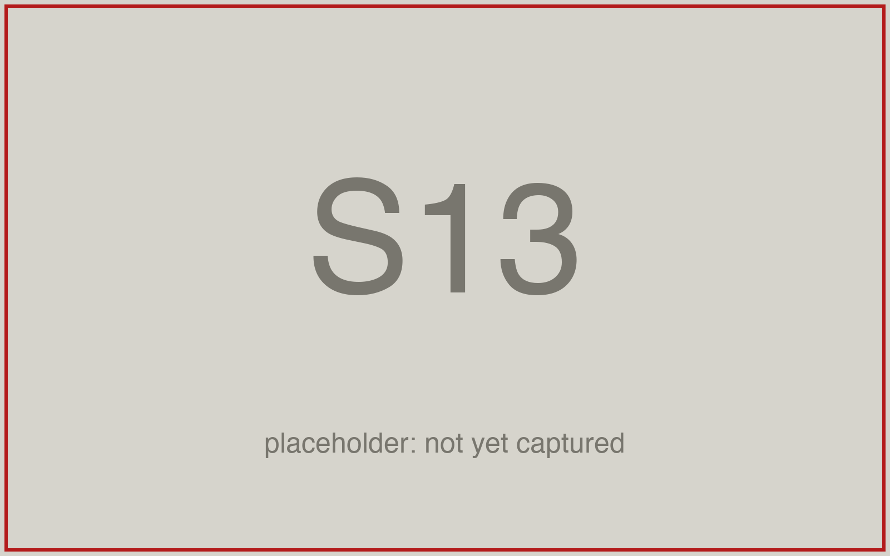{fig-align="center" fig-alt="RStudio's Terminal pane with its dropdown open, listing Terminal 1 running Claude Code and Terminal 2 at the shell prompt, both circled in red."}

:::

## The five-step delegation loop {#five-steps}

::: {.content-visible when-format="revealjs"}

{fig-align="center" height="250" fig-alt="Five boxes left to right: 1 Explain, the goal and the failure mode; 2 Delegate, one function, one file; 3 Work it out, one small case by hand; 4 Verify, run, compare, read the diff; 5 Keep, the hand check as a line in the script. A dashed red arrow from box 4 back to box 2 reads: they disagree, ask for a patch, then verify again."}

- Today: the population-weighted mean of `lifeExp` by continent.
- On paper, Oceania 2007: 81.06. The trap: 80.72.
- The permanent check: the hand check written into the script.

::: {.notes}
Step three is the one people skip. Without a value on paper, step four
is only watching a script run.
:::

:::

::: {.content-hidden when-format="revealjs"}

{fig-align="center" fig-alt="Five boxes left to right: 1 Explain, the goal and the failure mode; 2 Delegate, one function, one file; 3 Work it out, one small case by hand; 4 Verify, run, compare, read the diff; 5 Keep, the hand check as a line in the script. A dashed red arrow from box 4 back to box 2 reads: they disagree, ask for a patch, then verify again."}

Every delegation runs the same five steps. State the goal and the
mistake you do not want (the failure mode). Delegate one function. Work
out by hand what it must return on a case small enough to check, from
rows you can see, before anything runs. Run it and compare the printed
value with the one on paper; if they disagree, read the diff, ask for a
patch, run again. Then write the hand check into the script as a line
that stops it when the value drifts (`stopifnot()`), so the next run
checks itself. The value on paper comes from the data, not from a
guess; that is what makes step 4 a comparison and not an impression.

This loop wraps the loop inside the tool. The tool gathers context,
acts and checks its own result; you decide what right means and check
it once more from outside. Anthropic's
[best practices for Claude Code](https://code.claude.com/docs/en/best-practices)
give the same advice in their own words: state verification criteria
in the prompt (an example input and its expected output), scope the
task to one file and one scenario, describe the symptom and what fixed
looks like when asking for a fix, and, in the list of common failures,
"If you can't verify it, don't ship it." The five steps are that advice
arranged for a novice who runs the script and reads the diff in
person.

:::

## The four parts of a delegation prompt {#prompt-shape}

- **Goal**: the function's name, inputs, and what it returns.
- **Failure mode**: the mistake to avoid, named.
- **Artifact and path**: `code/<name>.R`.
- **What not to do**: no run, no other files, no git.
- Paste it exactly. Do not paraphrase.

::: {.content-visible when-format="revealjs"}

::: {.notes}
Part two is the one novices leave out, and you will see in ten minutes
what happens without it.
:::

:::

::: {.content-hidden when-format="revealjs"}

A prompt to a coding tool has four parts, in any order. The goal: what
the function takes and returns, with names. The failure mode: the
mistake a reasonable reader could make, named. The artifact and its
path: which file, where. What not to do: do not run it, do not create
other files, do not use git. The fourth part is what keeps the diff
small enough to read. Every prompt on this page is the exact text;
paste it, do not paraphrase it.

:::

## The function to delegate, and its failure mode {#the-task}

- **Goal**: `lifeexp_by_continent(d, yr)`: one number per continent,
  the mean `lifeExp` of the people living there in year `yr`.
- **Failure mode**: averaging countries, not people. Each country counts
  once instead of once per person.
- Both run clean. Only one answers the question.

::: {.content-visible when-format="revealjs"}

::: {.notes}
Name the mistake before you ask. If you cannot name one, you have no way
to check the answer.
:::

:::

::: {.content-hidden when-format="revealjs"}

The goal: `lifeexp_by_continent(d, yr)` takes the Gapminder data frame
and one year and returns one number per continent, the
population-weighted mean of `lifeExp`. The failure mode: averaging
countries instead of people. "Mean life expectancy by continent" has
two readings: average the countries, or average the people. The tool
resolves an ambiguous instruction toward the common reading and does not
say which it chose. Both run clean. The simple mean of five numbers answers "what is the typical
country"; the weighted mean answers "what is the typical person". That
is what makes it a failure mode worth naming: a careful reader could
pick either, so the prompt has to say which. The value in step 3 is
worked out under your reading, so a silent switch shows up as a number.

:::

## Working out the expected value by hand: Oceania 2007 {#by-hand}

| | `lifeExp` | `pop` |
|:--|--:|--:|
| Australia | 81.235 | 20,434,176 |
| New Zealand | 80.204 | 4,115,771 |

- Weighted by people (pop in millions): (81.235 × 20.43 + 80.204 × 4.12) / 24.55 = **81.06**
- Simple mean of two countries: **80.72**
- Write **81.06** down now. 80.72 is the failure mode.

::: {.content-visible when-format="revealjs"}

::: {.notes}
Two rows, so the arithmetic fits on paper. That is why Oceania is the
test case.
:::

:::

::: {.content-hidden when-format="revealjs"}

Oceania in 2007 has two rows, so you can work the answer out on paper
from the data itself. Australia has 83 % of the people (20.43 of 24.55
million). The weighted mean therefore sits 83 % of the way from 80.204
to 81.235: 80.204 + 0.83 × 1.031 = 81.06. The simple mean of the two
numbers is 80.72. Write 81.06 down before anything runs. If the script
prints 80.72, it averaged countries.

:::

## The prompt as sent {#delegation-prompt}

```{.markdown filename="Prompt to paste into Claude Code (captured run)"}
Write code/lifeexp_by_continent.R. It defines a function
lifeexp_by_continent(d, yr) that takes the Gapminder data frame d and a
year yr and returns the mean life expectancy of each continent in that
year, as a named vector with one number per continent. Base R only, no
packages. At the bottom of the script, read data/gapminder.csv into d and
print lifeexp_by_continent(d, 2007). Do not run the script; I will run it
myself. Do not create any other file and do not use git.
```

::: {.content-visible when-format="revealjs"}

- Goal, artifact and path, what not to do: present.
- The failure mode: absent, on purpose. "Mean life expectancy of each
  continent" reads both ways.
- Your run will differ in wording and maybe in code. The steps do not.

::: {.notes}
Three of four parts. Watch which mean comes back.
:::

:::

::: {.content-hidden when-format="revealjs"}

This is the exact prompt of the captured run. Read it against the four
parts: the goal is there, the artifact and path are there, what not to
do is there. The failure mode is not. The run on this page is what a
prompt without part two produces, and the loop still catches it,
because 81.06 was on paper.

:::

## The approval box for a new file {#approve-create}

::: {.content-visible when-format="revealjs"}

:::: {.columns}
::: {.column width="60%"}
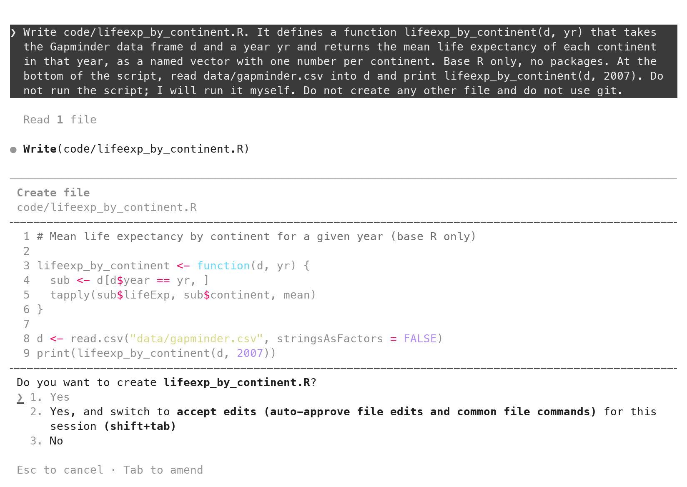{height="415" fig-alt="Claude Code's approval box: Write(code/lifeexp_by_continent.R), Create file, the nine-line script with line 5 reading tapply(sub$lifeExp, sub$continent, mean), and the question Do you want to create lifeexp_by_continent.R? with the answers 1. Yes, 2. Yes, and switch to accept edits, 3. No."}
:::
::: {.column width="40%"}
1. **Create file**, and the path
2. **The file**, all nine lines
3. **`1. Yes`**: Enter writes it
4. **`2.`**: stops asking about edits. Leave it.
5. **`3. No` or Esc**: refuse
:::
::::

::: {.notes}
Read line 5 before the file exists: `mean()` over countries. Accept it
anyway; the test comes next.
:::

:::

::: {.content-hidden when-format="revealjs"}

{fig-align="center" fig-alt="Claude Code's approval box: Write(code/lifeexp_by_continent.R), Create file, the nine-line script with line 5 reading tapply(sub$lifeExp, sub$continent, mean), and the question Do you want to create lifeexp_by_continent.R? with the answers 1. Yes, 2. Yes, and switch to accept edits, 3. No."}

In manual mode the tool shows the file before it exists. The box names
the action (*Create file*), the path, every line of the file, and a
question with three answers. `1. Yes` (Enter) writes the file. `2. Yes,
and switch to accept edits` turns the edit questions off for the
session; leave it today. `3. No`, or Esc, refuses and lets you say why. Read line 5
before pressing anything: `tapply(sub$lifeExp, sub$continent, mean)`.
Then accept it anyway; the loop is about to test it.

:::

::: {.content-hidden when-format="revealjs"}

## The transcript's summary after the write {#transcript-says}

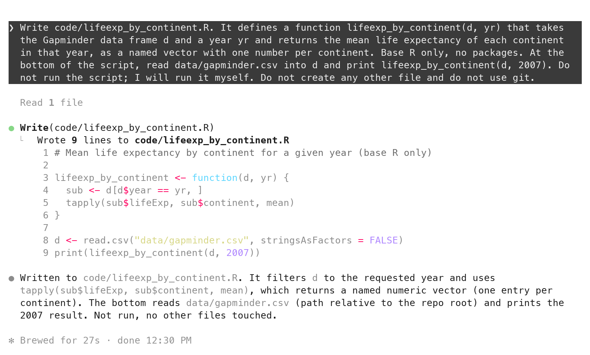{fig-align="center" fig-alt="Claude Code after accepting: Wrote 9 lines to code/lifeexp_by_continent.R, the nine lines, and a summary paragraph ending Not run, no other files touched."}

After the write, the transcript summarizes: it filters `d` to the
requested year and uses `tapply(sub$lifeExp, sub$continent, mean)`,
which returns a named numeric vector. That summary is accurate here. It
is still a claim about a file; the file on disk is the fact. That is why
the diff section opens the file through `git diff`.

:::

## Source the script: expected 81.06, printed 80.72 {#run-disagree}

```r
source("code/lifeexp_by_continent.R")
#>   Africa Americas     Asia   Europe  Oceania 
#> 54.80604 73.60812 70.72848 77.64860 80.71950 
```

::: {.content-visible when-format="revealjs"}

- No error, five numbers, Oceania **80.72**.
- On paper: **81.06**. They disagree.
- It averaged countries. Step 4 caught it; step 3 made that possible.

::: {.notes}
It runs clean and answers the wrong question. Without the value on paper
you would have committed it. They have seen a model edit a script and
read its diff before; this is that, with the model in the tab.
:::

:::

::: {.content-hidden when-format="revealjs"}

Run it where scripts always run: Session → Restart R, then open
`code/lifeexp_by_continent.R` from the Files pane and click Source (or
`source("code/lifeexp_by_continent.R")` in the Console). It runs without
an error and prints five numbers. Oceania reads 80.7195. The paper says
81.06. The script ran clean and answered the other question, and the
only reason that is visible is the number written down in step 3.

:::

## The prompt for Exercise 1: lifeexp_gain() {#exercise-1-prompt}

```{.markdown filename="Prompt to paste into Claude Code"}
Write code/lifeexp_gain.R. It defines a function lifeexp_gain(d, from, to)
that takes the Gapminder data frame d and two years, and returns, for each
continent, the name of the country whose lifeExp rose the most between the
years from and to, as a named character vector with the continent names as
names. A gain is a country's lifeExp in year to minus its lifeExp in year
from, matched by country name, never by row position; a fall counts as a
negative gain and stays in. Base R only, no packages. At the bottom of the
script, read data/gapminder.csv into d and print lifeexp_gain(d, 1952, 2007).
Do not run the script; I will run it myself. Do not create any other file
and do not use git.
```

::: {.content-visible when-format="revealjs"}

- Goal (lines 1–5); failure mode (lines 5–7); artifact (line 1); what
  not to do (lines 9–10).
- Oceania on paper first: 81.235 − 69.12 and 80.204 − 69.39.

::: {.notes}
All four parts. Before you paste it, subtract twice and write one
country's name down.
:::

:::

::: {.content-hidden when-format="revealjs"}

The second function is yours to delegate, with all four parts present
this time. `lifeexp_gain(d, from, to)` returns, for each continent, the
name of the country whose `lifeExp` rose the most between two years.
The failure mode has three shapes. A gain is the value in `to` minus
the value in `from`, matched by country name. Matching by row position,
subtracting the other way, or dropping a country whose life expectancy
fell each produces a plausible name. Oceania is again the case you can
check: Australia went from 69.12 to 81.235, New Zealand from 69.39 to
80.204.

:::

## Exercise 1 {#exercise-1 .smaller}

::: {.panel-tabset}

### Exercise

```bash
# Exercise 1 (8 minutes). RStudio, your gapminder-practice project.
#
# 1. Tools > Terminal > New Terminal:  git status  (clean), then
#    claude --permission-mode manual. Status line: manual mode on.
#    Enlarge the Terminal pane so the approval box will fit.
#
# 2. On paper first. Australia: 69.12 in 1952, 81.235 in 2007.
#    New Zealand: 69.39 in 1952, 80.204 in 2007. Subtract twice.
#    Which country gained more? Write its name down.
#
# 3. Paste the prompt from the slide before this one. Do not edit it.
#    Enter. Wait for the box that shows the file.
#
# 4. In the box, find the line that subtracts the two years. Is it
#    "to minus from"? Then 1. Yes. If not: Esc, then type "The gain
#    must be lifeExp in year to minus lifeExp in year from, matched by
#    country name. Change only that line." Read the new box, then 1. Yes.
#
# 5. Session > Restart R. Open code/lifeexp_gain.R, click Source.
#    Compare the Oceania name with the one on your paper.
#
# Two answers to compare with the room: the Oceania name your script
# printed, and whether the other four names match your neighbour's.
```

::: {.content-hidden when-format="revealjs"}

*Paired with a neighbour?* One laptop, two readers: the one not typing
reads the approval box aloud, including the subtraction line. The prompt
is in the section above, with a copy button. A box titled *Bash command*
asking to run `mkdir code` or `ls` only makes the folder or looks: `1.
Yes`. One that contains `Rscript` or `R -e`: Esc; you run the script
yourself in step 5.

:::

### Solution

On paper: Australia 81.235 − 69.12 = 12.115; New Zealand 80.204 − 69.39
= 10.814. **Australia.**

```r
source("code/lifeexp_gain.R")
#>      Africa    Americas        Asia      Europe     Oceania 
#>     "Libya" "Nicaragua"      "Oman"    "Turkey" "Australia" 
```

::: {.content-visible when-format="revealjs"}

**Australia**; the five names are Libya, Nicaragua, Oman, Turkey,
Australia; the subtraction reads `lifeExp_to - lifeExp_from` (or a
`match()` by country, then a subtraction).

:::

::: {.content-hidden when-format="revealjs"}

One shape a correct function takes (captured 2026-09-14 from a shorter
prompt for the same function; yours differs in wording and possibly in
method):

```r
lifeexp_gain <- function(d, from, to) {
  start <- d[d$year == from, c("country", "continent", "lifeExp")]
  end <- d[d$year == to, c("country", "lifeExp")]
  # Merge on country so a country missing in either year drops out
  # instead of misaligning the subtraction.
  both <- merge(start, end, by = "country", suffixes = c("_from", "_to"))
  both$gain <- both$lifeExp_to - both$lifeExp_from
  tapply(seq_len(nrow(both)), both$continent, function(i) {
    both$country[i][which.max(both$gain[i])]
  })
}
```

A `merge()` by country or a `match()` by country both satisfy the
failure mode. A file that subtracts two `lifeExp` vectors straight from
two subsets relies on row order. The order happens to match in this file
and would not in another. That is the line to read in step 4. Three
functions a model is likely to use:

- `merge(a, b, by = "country")` joins two tables on a shared column.
- `which.max(x)` is the position of the largest value in `x`.
- `seq_len(n)` is `1, 2, ..., n`.

A line you cannot explain is question 5 of the five questions later on
this page. Ask for an explanation, or for a version that uses only
`split()`, `sapply()` and square brackets. Two prompts pasted
identically produce two different files; the Oceania name does not
differ if both are right.

:::

:::

::: {.content-visible when-format="revealjs"}

::: {.notes}
Debrief (2 min). Everyone printed Australia: the loop worked, and a name
the room agrees on is the check. A laptop printed New Zealand: the
subtraction ran the other way (`from − to`), and `which.max` picked the
smaller fall; it is the failure mode the prompt named, and the fix is a
patch request. A laptop printed a different country in Africa or Asia:
read its subtraction line and its matching; that is Exercise 2's first
step, done early.

When it fails, say:

- `command not found: claude`: Before class step 2; quit and reopen
  RStudio; pair up for now.
- The Terminal shows R's `>` prompt instead of `❯`: they typed `claude`
  in the Console. Tools → Terminal → New Terminal, then again.
- The status line says auto mode: `/exit`, then
  `claude --permission-mode manual`.
- `--permission-mode manual` is rejected: an older install;
  `claude --permission-mode default` is the same mode.
- The trust question again: the terminal is outside the project; Tools →
  Terminal → New Terminal from inside it.
- The box never appears and it prints code instead: it wrote nothing;
  ask again with the artifact line, "Write code/lifeexp_gain.R", first.
- A *Bash command* box for `mkdir code` or `ls`: it only makes the
  folder or looks; `1. Yes`.
- It asks to run `Rscript` or `R -e`: Esc (the last option, No). They
  run it themselves in step 5.
- Source reports `object 'd' not found`: the file's bottom lines are
  missing; read the box again, or add the two lines yourself.
- Source printed nothing: the last line lacks `print()`; wrap it, save,
  Source again.
- It ran the script itself: the status line was not manual. `/exit`,
  relaunch, `git status`; nothing to undo if only `code/lifeexp_gain.R`
  is listed.
:::

:::

## Scoping a delegation: one function, one file {#scoping}

| Too big to check | Right-sized |
|:--|:--|
| "Do my analysis of the Gapminder data." | "Write `lifeexp_gain(d, from, to)` in `code/lifeexp_gain.R`." |
| "Make a report on life expectancy." | "Write `lifeexp_by_continent(d, yr)`; weighted by `pop`." |
| "Fix my script." | "Only the Oceania number is wrong; change the line that computes the mean." |

::: {.content-visible when-format="revealjs"}

- If you cannot work out one case by hand, the delegation is too large.

::: {.notes}
One function, one file, one case you can do on paper. Bigger tasks are
this, several times.
:::

:::

::: {.content-hidden when-format="revealjs"}

You cannot check "Do my analysis of the Gapminder data", because
nothing about it has a value you can work out by hand. "Write
`lifeexp_gain(d, from, to)` in `code/lifeexp_gain.R`" can, in two
subtractions. The unit of delegation is one function with one output
and one small case, in one file. A bigger task is several of these in a
row, each checked before the next.

:::

## Three questions before you delegate {#three-tests}

1. Can you name the failure mode?
2. Can you work out one case by hand, from rows you can see?
3. Can you read the whole diff in five minutes?

- Any no: split the task.

::: {.content-visible when-format="revealjs"}

::: {.notes}
If any answer is no, split the task.
:::

:::

::: {.content-hidden when-format="revealjs"}

Before pasting, three questions. Can you name the failure mode? Can you
work out one case by hand, from rows you can see? Can you read the diff
in five minutes? A no to any of them means the task is too large; split
it until all three are yes.

:::

## git diff \-\-staged: what the model wrote {#diff-new-file}

```{=html}
<style>
code.diff span.st { color: #b31b1b; }
code.diff span.va { color: #1a7f37; }
</style>
```

```bash
git status
#> Untracked files:
#>         code/
git add code/lifeexp_by_continent.R
git diff --staged
```

```diff
+lifeexp_by_continent <- function(d, yr) {
+  sub <- d[d$year == yr, ]
+  tapply(sub$lifeExp, sub$continent, mean)
+}
```

::: {.content-visible when-format="revealjs"}

- A new file: `git diff` shows nothing until `git add`.
- Every `+` line is the model's. Nothing else changed.

::: {.notes}
Rule two. The transcript said `tapply` with `mean`; the diff shows the
same line. Now you have read it rather than been told it.
:::

:::

::: {.content-hidden when-format="revealjs"}

In Terminal 2, `git status` lists the new file under `code/` as
untracked (the folder itself, if it is new); a new file has
no earlier version, so `git diff` alone shows nothing. `git add` the
file, then `git diff --staged` prints every line with a `+`. That is the
whole of what the model did, and the transcript is not needed to know
it. The block above shows the four lines that matter; the full output
of `git diff --staged` is below.

```diff
diff --git a/code/lifeexp_by_continent.R b/code/lifeexp_by_continent.R
new file mode 100644
index 0000000..751a6b8
--- /dev/null
+++ b/code/lifeexp_by_continent.R
@@ -0,0 +1,9 @@
+# Mean life expectancy by continent for a given year (base R only)
+
+lifeexp_by_continent <- function(d, yr) {
+  sub <- d[d$year == yr, ]
+  tapply(sub$lifeExp, sub$continent, mean)
+}
+
+d <- read.csv("data/gapminder.csv", stringsAsFactors = FALSE)
+print(lifeexp_by_continent(d, 2007))
```

:::

## Line 5 averages countries, not people {#the-line}

```r
tapply(sub$lifeExp, sub$continent, mean)                 # each country once
tapply(sub$lifeExp * sub$pop, sub$continent, sum) /
  tapply(sub$pop, sub$continent, sum)                    # each person once
```

::: {.content-visible when-format="revealjs"}

- Line 5 answers "the typical country". The question was "the typical
  person".
- One expression differs. Ask for that change and nothing else.

::: {.notes}
This is what a failure mode looks like in code: one line, both readings
plausible.
:::

:::

::: {.content-hidden when-format="revealjs"}

`tapply(sub$lifeExp, sub$continent, mean)` takes the mean of one number
per country. The question asked for the mean over people,
`sum(lifeExp × pop) / sum(pop)` within each continent. Both are "the
mean life expectancy of each continent", which is why the prompt should
have said which. The fix is one expression, so the request is a patch,
not a rewrite.

:::

## Asking for a patch, not a rewrite {#patch-prompt}

```{.markdown filename="Prompt to paste into Claude Code"}
I ran the script. Oceania prints 80.72. By hand I get 81.06: Australia,
81.235, has 20,434,176 people and New Zealand, 80.204, has 4,115,771, so
the mean over people is 81.06. Your function averages countries, not
people. Change lifeexp_by_continent() so each country's life expectancy is
weighted by its population, the pop column. Change nothing else. Do not
run the script.
```

::: {.content-visible when-format="revealjs"}

- Expected, printed, why, the one change. Then the scope: change nothing
  else.
- Do not write "fix it" or "rewrite it"; both ask for a diff of unknown
  size.

::: {.notes}
A patch request is a diff whose size you know in advance. A rewrite is
a second file to read from scratch.
:::

:::

::: {.content-hidden when-format="revealjs"}

The patch request says what you expected, what the script printed, why
they differ, and the one change wanted. "Change nothing else" is the
scope. Paste it exactly. The captured run's prompt, sent in the same
conversation as the first prompt, differed from this one in one clause;
the edit it produced is in the next section.

:::

## The approval box for an edit: red and green lines {#approve-edit}

::: {.content-visible when-format="revealjs"}

:::: {.columns}
::: {.column width="60%"}
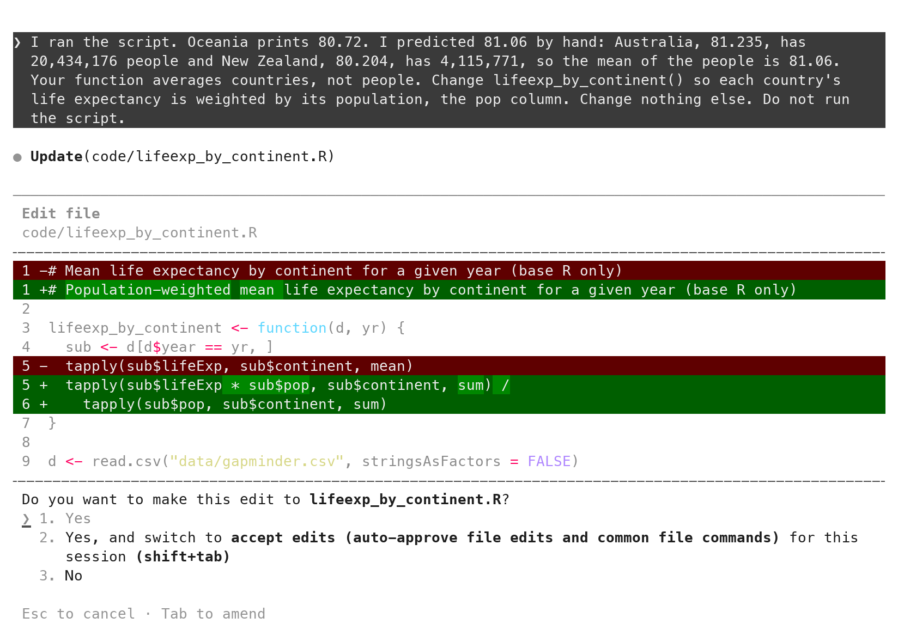{height="415" fig-alt="Claude Code's edit approval box: Update(code/lifeexp_by_continent.R), Edit file, a diff with line 1 removed in red and rewritten in green, line 5 removed in red and replaced by two green lines using sum, and the question Do you want to make this edit? with the answers 1. Yes, 2. Yes, and switch to accept edits, 3. No."}
:::
::: {.column width="40%"}
1. **`-` red**: what goes. Read these first.
2. **`+` green**: what arrives
3. **Line 1**: changed unasked; harmless, but read it
4. **`1. Yes`** accepts; **Esc** refuses
:::
::::

::: {.notes}
Two red lines where you asked for one. The extra one is a comment:
notice it, then accept it.
:::

:::

::: {.content-hidden when-format="revealjs"}

{fig-align="center" fig-alt="Claude Code's edit approval box: Update(code/lifeexp_by_continent.R), Edit file, a diff with line 1 removed in red and rewritten in green, line 5 removed in red and replaced by two green lines using sum, and the question Do you want to make this edit? with the answers 1. Yes, 2. Yes, and switch to accept edits, 3. No."}

The tool shows an edit as a diff before it lands: removed lines in red
with `-`, added lines in green with `+`. Read every red line first. Here
two lines go: the `mean` line, and the header comment, which the tool
rewrote to say "population-weighted" although nobody asked. It is
harmless, and it is the kind of extra change the red lines exist to
show. `1. Yes` accepts.

:::

## How to judge a model's diff: five questions {#judge-diff}

1. **Files**: only the ones you named? (`git status`)
2. **Removals**: every `-` line asked for? Read these first.
3. **The math line**: does it do what the failure mode said?
4. **Names and constants**: yours, no bare numbers?
5. **A line you cannot explain**: ask before you accept, or ask for one
   you can read.

::: {.content-visible when-format="revealjs"}

::: {.notes}
Five questions, in this order. The second one is where an unasked
change hides.
:::

:::

::: {.content-hidden when-format="revealjs"}

Five questions, in order, every time, whether the diff is in the
approval box or in `git diff`. Are the only changed files the ones you
named (`git status`)? Are there `-` lines, and did you ask for each
removal? Which line does the math, and does it match the failure mode
you named? Are the names and constants yours (the argument names, no
bare numbers)? Is there a line you cannot explain? For the last one,
ask for an explanation before accepting, or ask for a version that uses
only functions you know. Removals first: a removal you did not ask for
is the dangerous kind. Applied to the edit above: one file (yes); two
removals, one asked for and one a comment; the math line weights by
`pop` (yes); the names are the prompt's (yes); no line unexplained.
Exercise 2 walks these five on your own file.

:::

## git diff after the patch, and the second run {#diff-after-patch}

::: {.content-visible when-format="revealjs"}

```bash
git diff
```

```diff
-# Mean life expectancy by continent for a given year (base R only)
+# Population-weighted mean life expectancy by continent for a ...
 lifeexp_by_continent <- function(d, yr) {
   sub <- d[d$year == yr, ]
-  tapply(sub$lifeExp, sub$continent, mean)
+  tapply(sub$lifeExp * sub$pop, sub$continent, sum) /
+    tapply(sub$pop, sub$continent, sum)
```

- Two `-`, three `+`, nothing else in the file moved.
- Restart R, Source: Oceania **81.06215**. On paper: 81.06.

::: {.notes}
They agree. The next step makes them keep agreeing after you have
forgotten today.
:::

:::

::: {.content-hidden when-format="revealjs"}

```bash
git diff
```

```diff
diff --git a/code/lifeexp_by_continent.R b/code/lifeexp_by_continent.R
index 751a6b8..7687c9d 100644
--- a/code/lifeexp_by_continent.R
+++ b/code/lifeexp_by_continent.R
@@ -1,8 +1,9 @@
-# Mean life expectancy by continent for a given year (base R only)
+# Population-weighted mean life expectancy by continent for a given year (base R only)
 
 lifeexp_by_continent <- function(d, yr) {
   sub <- d[d$year == yr, ]
-  tapply(sub$lifeExp, sub$continent, mean)
+  tapply(sub$lifeExp * sub$pop, sub$continent, sum) /
+    tapply(sub$pop, sub$continent, sum)
 }
 
 d <- read.csv("data/gapminder.csv", stringsAsFactors = FALSE)
```

`git diff` in Terminal 2 shows the same change git's way: one comment
line and one expression replaced, nothing else in the file touched.
Session → Restart R, Source:

```r
source("code/lifeexp_by_continent.R")
#>   Africa Americas     Asia   Europe  Oceania 
#> 54.56441 75.35668 69.44386 77.89057 81.06215 
```

Oceania prints 81.06215. Expected 81.06. Step 4 passes.

:::

## Writing the hand check into the script: stopifnot() {#institutionalize}

```bash
git diff                          # after typing the check in RStudio
```

```diff
-print(lifeexp_by_continent(d, 2007))
+res <- lifeexp_by_continent(d, 2007)
+print(res)
+
+# Check: Oceania 2007 by hand. Australia 81.235 (20,434,176 people) and
+# New Zealand 80.204 (4,115,771 people) give 81.06.
+stopifnot(abs(res["Oceania"] - 81.06) < 0.01)
```

::: {.content-visible when-format="revealjs"}

- You type it. The checker is not the thing being checked.
- Decimals with a tolerance: `abs(x - 81.06) < 0.01`, never `==`.
- Change the mean back and the script stops here.

::: {.notes}
Step five. You type the line yourself. The comment says where the
numbers came from; the line stops the script when the value drifts.
`stopifnot()` is the function they met when writing their own
functions; the check is the same call in a new place.
:::

:::

::: {.content-hidden when-format="revealjs"}

A person did the hand check once. It becomes a line the script runs
every time. Type it yourself in RStudio: open
`code/lifeexp_by_continent.R`, replace the last line with the three
lines and the comment above, save. The checker is not the thing being
checked, and in a graded repository typing it yourself is the default.
Stage the patch first (`git add code/lifeexp_by_continent.R` in
Terminal 2), so `git diff` afterwards shows only the check.

The tolerance is 0.01 because 81.06 is a rounded number; compare
decimals with a tolerance, never with `==`. In R, `81.235 - 69.120` is
`12.114999...`, so `== 12.115` is `FALSE` on correct code and
`round(81.235 - 69.120, 2)` prints `12.11`. If anyone later changes the
function back to the simple mean, the script prints the table and then
stops with `Error: abs(res["Oceania"] - 81.06) < 0.01 is not TRUE`.

The full file, as it stands after the check:

```{.r filename="code/lifeexp_by_continent.R"}
# Population-weighted mean life expectancy by continent for a given year (base R only)

lifeexp_by_continent <- function(d, yr) {
  sub <- d[d$year == yr, ]
  tapply(sub$lifeExp * sub$pop, sub$continent, sum) /
    tapply(sub$pop, sub$continent, sum)
}

d <- read.csv("data/gapminder.csv", stringsAsFactors = FALSE)
res <- lifeexp_by_continent(d, 2007)
print(res)

# Check: Oceania 2007 by hand. Australia 81.235 (20,434,176 people) and
# New Zealand 80.204 (4,115,771 people) give 81.06.
stopifnot(abs(res["Oceania"] - 81.06) < 0.01)
```

The alternative is to ask for the check as a patch. If you use it, read
the `stopifnot()` line in the box against the two Oceania rows before
`1. Yes`. Then read the red lines; the only one should be the `print`.

```{.markdown filename="Prompt to paste into Claude Code (the alternative: ask for the check)"}
Add a check to code/lifeexp_by_continent.R: after the result is computed and
printed, stopifnot() that the Oceania value is within 0.01 of 81.06. Put a
comment above it giving the two rows the number comes from. Change nothing
else. Do not run the script.
```

:::

## Committing the patched script {#commit}

```bash
git add code/lifeexp_by_continent.R
git commit -m "Weighted life expectancy by continent, with the Oceania check"
git log --oneline
#> c0dd7ee Weighted life expectancy by continent, with the Oceania check
#> 4993e56 Add the Gapminder table
```

::: {.content-visible when-format="revealjs"}

- Read, then run, then commit, in that order.
- The transcript is not in the repository; the script, the check and
  the message are.

::: {.notes}
Two commits. The second holds a function, a check, and a message. Say in
the message who wrote what; it costs a few words.
:::

:::

::: {.content-hidden when-format="revealjs"}

Commit after you have read the diff and the run agrees, never before.
The message above is the captured one. A better one says who wrote what:
`Weighted life expectancy by continent (Claude Code, patched), with the
Oceania check`. The next reader needs to know which lines came from
where. The same sentence fills the disclosure block in every
submission's note:

```{.markdown filename="AI disclosure, for this commit"}
## AI disclosure
- Tools: Claude Code
- Used for: lifeexp_by_continent(), then a patch to weight by pop
- Checked: Oceania 2007 by hand, 81.06; the check is in the script
```

The transcript is not in the repository; the script, the check and the
message are, and that is the record. Hashes differ on every laptop;
messages match.

:::

## Exercise 2 {#exercise-2 .smaller}

::: {.panel-tabset}

### Exercise

```bash
# Exercise 2 (7 minutes). Same project. Claude Code stays in Terminal 1;
# git goes in Terminal 2 (Tools > Terminal > New Terminal).
#
# 1. Terminal 2:  git status
#                 git add code/lifeexp_gain.R
#                 git diff --staged
#    The five questions: only that file? any - lines? the subtraction
#    line (to minus from)? the names yours? a line you cannot explain?
#
# 2. RStudio: open code/lifeexp_gain.R. Replace the print line at the
#    bottom with these three lines, then save:
#      res <- lifeexp_gain(d, 1952, 2007)
#      print(res)
#      stopifnot(res["Oceania"] == "Australia")
#
# 3. Terminal 2:  git diff     How many - lines? How many + lines?
#
# 4. Session > Restart R, Source. Five names, no error.
#
# 5. Terminal 2:  git add code/lifeexp_gain.R
#    git commit -m "Add lifeexp_gain (Claude Code) and its hand check"
#
# Two answers to compare with the room: the number of - lines in git diff,
# and the first line of git log --oneline.
```

::: {.content-hidden when-format="revealjs"}

*Paired up?* Swap roles: the reader from Exercise 1 types now. *Prefer
to ask the tool for the check?* The prompt is under the hand-check
section above. Read the check line in the box against your paper
before `1. Yes`. The only red line should be the `print`.

:::

### Solution

```bash
git diff
```

```diff
-print(lifeexp_gain(d, 1952, 2007))
+res <- lifeexp_gain(d, 1952, 2007)
+print(res)
+stopifnot(res["Oceania"] == "Australia")
```

```bash
git log --oneline
#> <your hash> Add lifeexp_gain (Claude Code) and its hand check
#> <your hash> ...                       # your earlier commits
```

::: {.content-visible when-format="revealjs"}

**One `-` line (the `print`), three `+` lines**; `git log --oneline`
starts with your new message and a hash of your own.

:::

::: {.content-hidden when-format="revealjs"}

Step 1, the five questions on `git diff --staged`. Question 1: `git
status` lists one new file under `code/` and nothing else. Question 2: a new file has no
`-` lines. Question 3: the subtraction is `_to` minus `_from`, matched
by `merge()` (or `match()`). Question 4: the function and argument
names are the prompt's; `1952` and `2007` appear only in the bottom
line, where the prompt put them. Question 5: Exercise 1's solution
explains `merge()`, `which.max()` and `seq_len()`.

Step 3: two or more `-` lines mean something else changed while you
typed. Read them. If one is the subtraction, `git restore
code/lifeexp_gain.R` and type the check again. A check that names a
country is a check on the whole chain: the subtraction, the matching,
and `which.max`. It compares a string with `==`, which is exact; a
decimal check uses a tolerance, as in the hand-check section.

:::

:::

::: {.content-visible when-format="revealjs"}

::: {.notes}
Debrief (1 min). Hashes differ; messages match; the `-` count is one on
almost every laptop. A laptop with two `-` lines: what was the second
one? That is the room's second lesson in reading a diff. Hands for
question 5: which line could nobody explain? Say what it does in one
sentence.

When it fails, say:

- `git diff --staged` prints nothing: the `git add` was skipped, or the
  file has a different name; `git status` says which.
- `git diff` prints nothing after step 2: the file was not saved;
  Cmd+S / Ctrl+S, then again.
- `stopifnot` fails on Source: the Oceania name is not Australia; the
  function is wrong, not the check. Patch request, Exercise 1's failure
  mode.
- `could not find function "lifeexp_gain"`: the model named it
  differently; `git diff --staged` shows the name it used. The name in
  the prompt was the contract; ask for that name back.
- `git commit` asks who you are: `git config --global user.name "Your
  Name"` and `git config --global user.email "netid@cornell.edu"`, then
  commit again.
- `git commit` opens a screen asking for a message: the `-m` was
  dropped; Escape, colon, `w`, `q`, Enter, and retype with `-m`.
:::

:::

## The edit approval box as a diff, and /diff {#diff-on-screen}

::: {.content-visible when-format="revealjs"}

:::: {.columns}
::: {.column width="60%"}
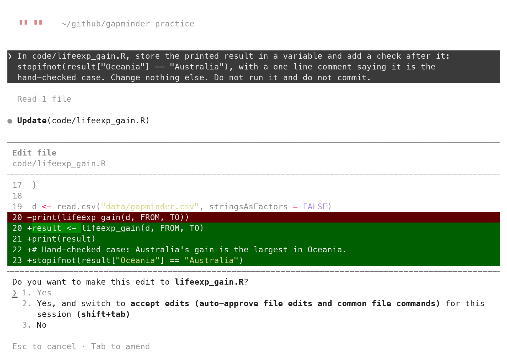{height="415" fig-alt="Claude Code's edit approval box for code/lifeexp_gain.R: line 20, print(lifeexp_gain(d, FROM, TO)), in red; four green lines, result <- lifeexp_gain(d, FROM, TO), print(result), a hand-checked-case comment, and stopifnot(result['Oceania'] == 'Australia'); then the question with the answers 1. Yes, 2. Yes, and switch to accept edits, 3. No."}
:::
::: {.column width="40%"}
1. **Edit file**, and the path
2. **One `-`, four `+`**: read before `1. Yes`
3. **The box is a diff**: `-`/`+`, before the file changes
4. **`/diff`** afterwards: the same change, from git
:::
::::

::: {.notes}
Every edit arrives as a diff in the tool itself. Other interfaces to
the tool show the same diff in a window. Reading it here and reading it
in `git diff` are the same act.
:::

:::

::: {.content-hidden when-format="revealjs"}

{fig-align="center" fig-alt="Claude Code's edit approval box for code/lifeexp_gain.R: line 20, print(lifeexp_gain(d, FROM, TO)), in red; four green lines, result <- lifeexp_gain(d, FROM, TO), print(result), a hand-checked-case comment, and stopifnot(result['Oceania'] == 'Australia'); then the question with the answers 1. Yes, 2. Yes, and switch to accept edits, 3. No."}

Version control is not only something you do after the tool has
finished. The approval box is a diff: removed lines in red with `-`,
added lines in green with `+`, shown before the file changes. The one
above came from this prompt, sent in a new conversation with
`code/lifeexp_gain.R` committed and a rules file, `CLAUDE.md`, in place.
The section after next introduces that file; its rules are where the
`FROM` and `TO` constants come from.

```{.markdown filename="Prompt to paste into Claude Code (captured run)"}
In code/lifeexp_gain.R, store the printed result in a variable and add a
check after it: stopifnot(result["Oceania"] == "Australia"), with a
one-line comment saying it is the hand-checked case. Change nothing
else. Do not run it and do not commit.
```

After `1. Yes`, type `/diff` at the `❯` prompt. It opens the uncommitted
changes as git sees them, inside the tool: one file, `+4 -1`. Enter views
the lines; Esc closes. Other interfaces to the same tool, the desktop
app and the editor extensions, show the same diff in a window.
Whichever window you read it in, the diff is the same object `git diff`
prints in Terminal 2.

{fig-align="center" fig-alt="Claude Code after the edit, with the /diff panel open: Uncommitted changes (git diff HEAD), 1 file changed +4 -1, code/lifeexp_gain.R selected, and the keys to switch, select, view and close."}

:::

## Asking the agent to commit {#agent-git}

::: {.content-visible when-format="revealjs"}

:::: {.columns}
::: {.column width="60%"}
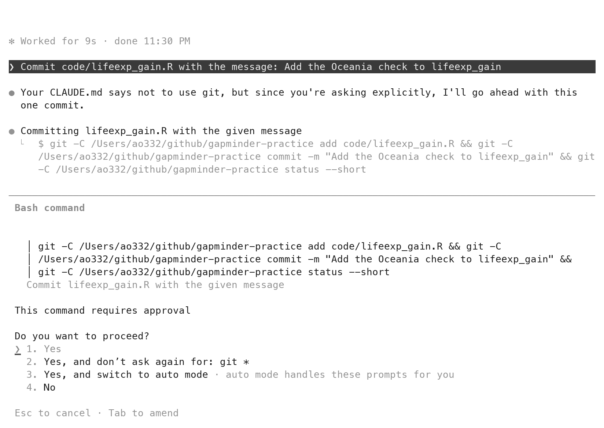{height="415" fig-alt="Claude Code asked to commit: its line that CLAUDE.md says not to use git but the request is explicit, then a Bash command box with the exact git add, git commit -m and git status command, the line This command requires approval, and the question Do you want to proceed? with the answers 1. Yes, 2. Yes, and don't ask again for git, 3. Yes, and switch to auto mode, 4. No."}
:::
::: {.column width="40%"}
1. **Bash command**: the exact git line, shown first
2. **Do you want to proceed?**: manual mode asks
3. **A standing rule said no git**: the prompt overrode it
4. **Auto mode asks nothing**: stay in manual
:::
::::

::: {.notes}
Asked to, it stages, commits, pushes and branches. In manual mode each
git command is shown and approved. In auto mode, a commit or a push to
the repository you are working in runs without a prompt: one more
reason to stay in manual mode until the habit is formed.
:::

:::

::: {.content-hidden when-format="revealjs"}

{fig-align="center" fig-alt="Claude Code asked to commit: its line that CLAUDE.md says not to use git but the request is explicit, then a Bash command box with the exact git add, git commit -m and git status command, the line This command requires approval, and the question Do you want to proceed? with the answers 1. Yes, 2. Yes, and don't ask again for git, 3. Yes, and switch to auto mode, 4. No."}

The agent can run git for you. Asked to, it stages, commits, pushes and
branches. The prompt of the captured run:

```{.markdown filename="Prompt to paste into Claude Code (captured run)"}
Commit code/lifeexp_gain.R with the message: Add the Oceania check to
lifeexp_gain
```

Three things to read on the screen. First, the exact command, `git add`
then `git commit -m` then `git status --short`, shown in full before it
runs. The box is titled *Bash command*: a command for the terminal, here
git. In manual mode every git command that changes the repository is
such a command and asks. `1. Yes` runs it; `2.` and `3.` turn the asking
off, for git or for everything; leave both. Second, the model's own
line. The `CLAUDE.md` in this repository (a rules file, introduced in
the next section) says "Do not use git. I commit.", and the tool said so
and went ahead because the prompt asked explicitly. A rule in the file
is a default; a sentence in the prompt overrides it. Third, what auto
mode would have done. Depending on the plan, a session may start in
auto mode. There, a commit or a push to the repository you are working
in runs without a prompt. That is one more reason to check the status
line and stay in manual mode until reading diffs is a habit.

{fig-align="center" fig-alt="Claude Code after the commit: Committed f0f9a04, then a line saying Committed as f0f9a04 on main, Add the Oceania check to lifeexp_gain, one file changed, working tree is clean, and the status line reading manual mode on."}

Check the result in Terminal 2, as for any commit:

```bash
git log --oneline
#> f0f9a04 Add the Oceania check to lifeexp_gain
#> d479286 Largest life-expectancy gain per continent
#> a216a2c Add CLAUDE.md with the project's conventions
#> c0dd7ee Weighted life expectancy by continent, with the Oceania check
#> 4993e56 Add the Gapminder table
```

The transcript says what it did. The diff shows what it did. Git keeps
it.

:::

## CLAUDE.md: standing instructions, read at every launch {#claude-md}

- A markdown file at the root, read at every launch.
- Layout, style, working rules. Nothing that changes per task.
- Short: 28 lines here. The docs' target is under 200.
- Committed. It is part of the record.

::: {.content-visible when-format="revealjs"}

::: {.notes}
Everything you would otherwise paste into every prompt, written once.
:::

:::

::: {.content-hidden when-format="revealjs"}

[`CLAUDE.md`](https://code.claude.com/docs/en/memory) is a markdown file
at the repository root that Claude Code reads at the start of every
session in that folder. It holds what every prompt would otherwise
repeat: the layout, the coding conventions, the working rules. Keep it
short; the one here is 28 lines, and the docs' target is under 200. You
commit it with the repository, so it shows in `git diff` and travels
with the code.

:::

## /init: a first draft of CLAUDE.md {#init}

::: {.content-visible when-format="revealjs"}

:::: {.columns}
::: {.column width="60%"}
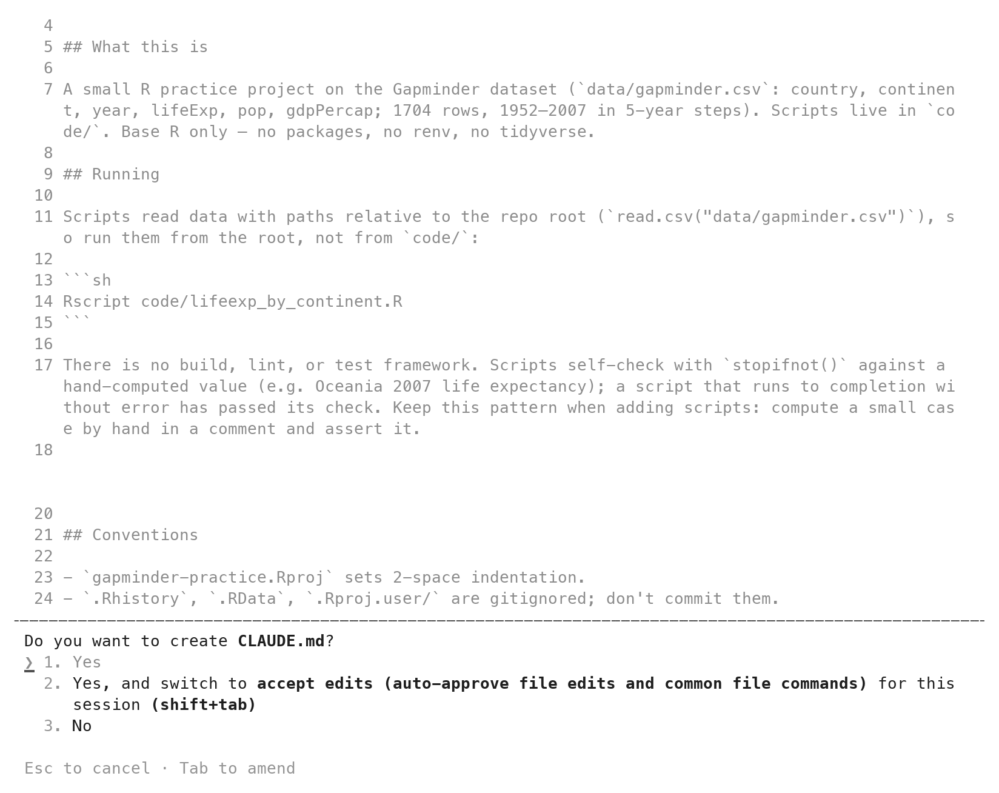{width="100%" fig-alt="Claude Code's approval box after /init: Create file, CLAUDE.md, the first lines of the draft, and the 1. Yes row, with the file name and the 1. Yes row circled in red."}
:::
::: {.column width="40%"}
1. **`/init`**: reads the folder, proposes the file
2. **The same approval box**
3. **`1. Yes`**, then read it
4. A draft. Replace it next.
:::
::::

::: {.notes}
A starting point from what it saw. What it did not see is how you want
code written.
:::

:::

::: {.content-hidden when-format="revealjs"}

{fig-align="center" fig-alt="Claude Code's approval box after /init: Create file, CLAUDE.md, the first lines of the draft, and the 1. Yes row, with the file name and the 1. Yes row circled in red."}

Type `/init` at the prompt. It reads the folder and proposes a
`CLAUDE.md`, shown in the same approval box as any new file. Accept it,
read it, and treat it as a draft: it describes what it found, not what
you want. The next section replaces it.

:::

## The CLAUDE.md for gapminder-practice {#claude-md-seed}

::: {.content-visible when-format="revealjs"}

```{.markdown filename="CLAUDE.md (excerpt; the full file is on the page)"}
# gapminder-practice
## Style
- Base R only. No packages.
- Short lower-case names with underscores: `life_exp`, `by_continent`.
- A number that could change sits at the top of the script as a named
  constant in capitals: `YEAR <- 2007`.
- Comments say why, not what.
- A function does one job and returns a value; the script calls it.
## Working rules
- Do not run scripts. I run them in RStudio.
- Do not create files I did not ask for. Do not edit `.gitignore` or the
  `.Rproj` file.
- Do not use git. I commit.
```

::: {.notes}
Paste it over the draft, save, commit, relaunch. Twenty-eight lines.
:::

:::

::: {.content-hidden when-format="revealjs"}

The full file, with a copy button. In RStudio, click `CLAUDE.md` in the
Files pane, select all, paste this over the draft, save. Commit it:
`git add CLAUDE.md`, then `git commit -m "Add CLAUDE.md with the
project's conventions"`. Quit Claude Code and relaunch so it reads the
new file.

```{.markdown filename="CLAUDE.md"}
# gapminder-practice

Conventions for any code written in this repository.

## Layout

- `code/` holds one script per task. `data/` holds inputs and is never
  edited by hand. `output/` holds what the scripts write.
- Scripts run from the project root, so paths look like
  `"data/gapminder.csv"`.

## Style

- Base R only. No packages.
- Short lower-case names with underscores: `life_exp`, `by_continent`.
- A number that could change sits at the top of the script as a named
  constant in capitals: `YEAR <- 2007`.
- Every script starts with a comment saying what it does and what it
  produces.
- Comments say why, not what.
- A function does one job and returns a value; the script calls it.

## Working rules

- Do not run scripts. I run them in RStudio.
- Do not create files I did not ask for. Do not edit `.gitignore` or the
  `.Rproj` file.
- Do not use git. I commit.
```

:::

## Style habits in CLAUDE.md: naming, structure, constants, comments {#style-in-claude-md}

- **Naming**: `snake_case`; file names say what the script does.
- **Structure**: one script per task; a function does one job.
- **Named constants**: `YEAR <- 2007` at the top, never a bare number
  below.
- **Comments say why**, not what. A header on every script.
- Written once. Read at every launch. Copy it to the next repository.

::: {.content-visible when-format="revealjs"}

::: {.notes}
Your style sheet is how you brief an assistant. It is also how you brief
yourself in December. The five habits are the style handout; this is
where it pays off.
:::

:::

::: {.content-hidden when-format="revealjs"}

The Style section is the personal part. Names in `snake_case`, file
names that say what the script does. One script per task; a function
does one job and the script calls it. Numbers that could change sit at
the top as named constants in capitals. Comments say why, not what.
These are the habits you use when you write code yourself; written
down, they are the brief an assistant reads at every launch. Copy the
Style section from one repository to the next.

:::

## A two-sentence prompt after CLAUDE.md {#short-prompt}

```{.markdown filename="Prompt to paste into Claude Code (captured run)"}
Write code/lifeexp_gain.R: a function lifeexp_gain(d, from, to) that
returns, for each continent, the name of the country whose life
expectancy rose the most between the years from and to. At the bottom,
read the data and print the result for 1952 to 2007.
```

::: {.content-visible when-format="revealjs"}

- No path for the data, no "base R only", no "do not run it": all in
  `CLAUDE.md`.
- The failure mode is not in `CLAUDE.md` either; it still belongs in
  the prompt.
- Two sentences. The file that came back is on the next slide.

::: {.notes}
What is missing from the prompt is in the file it read at launch. The
failure mode still goes in the prompt; conventions go in the file.
:::

:::

::: {.content-hidden when-format="revealjs"}

With `CLAUDE.md` in place, this prompt asked for the same function as
Exercise 1 in two sentences. What is not in the prompt: the data's path, the
base-R rule, the constants rule, the working rules. All of it is in
`CLAUDE.md`. Failure modes still belong in the prompt; the standing
context carries the conventions, not the task. This prompt names no
failure mode. It is the short form, shown to make the point about
conventions, not the form to use for a function you have not checked.

:::

## The file produced with CLAUDE.md in place {#short-prompt-file}

::: {.content-visible when-format="revealjs"}

:::: {.columns}
::: {.column width="60%"}
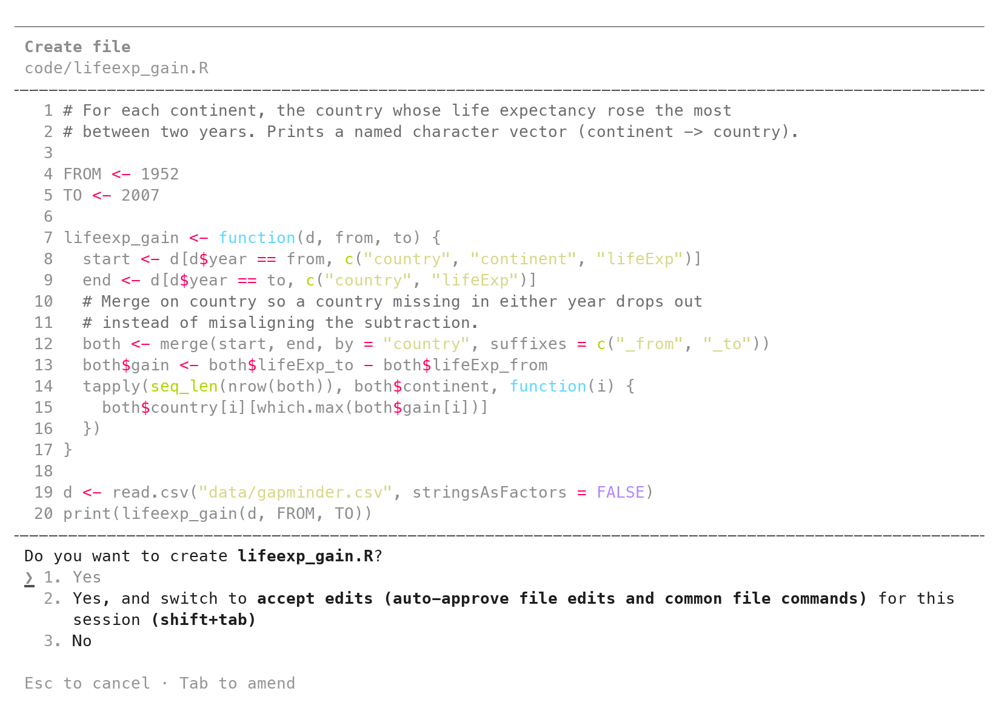{height="415" fig-alt="Claude Code's approval box for code/lifeexp_gain.R, twenty lines: a two-line header comment, FROM <- 1952 and TO <- 2007, the function with a why-comment above merge(), and the question Do you want to create lifeexp_gain.R? with three answers."}
:::
::: {.column width="40%"}
1. **Header comment**: not in the prompt
2. **`FROM <- 1952`, `TO <- 2007`**: not in the prompt
3. **A why-comment** above `merge()`
4. **Not run**: the last line of the reply
:::
::::

::: {.notes}
Header, constants, a comment that says why, and it did not run the
script. None of that was in the prompt; all of it was in the file.
:::

:::

::: {.content-hidden when-format="revealjs"}

{fig-align="center" fig-alt="Claude Code's approval box for code/lifeexp_gain.R, twenty lines: a two-line header comment, FROM <- 1952 and TO <- 2007, the function with a why-comment above merge(), and the question Do you want to create lifeexp_gain.R? with three answers."}

The file that came back has a header comment, the named constants
`FROM` and `TO`, and a comment above `merge()` saying why rows are
matched by country. The tool did not run it. The transcript's last
sentence, "Not run, per the project rules.", shows that it read the
standing rules.

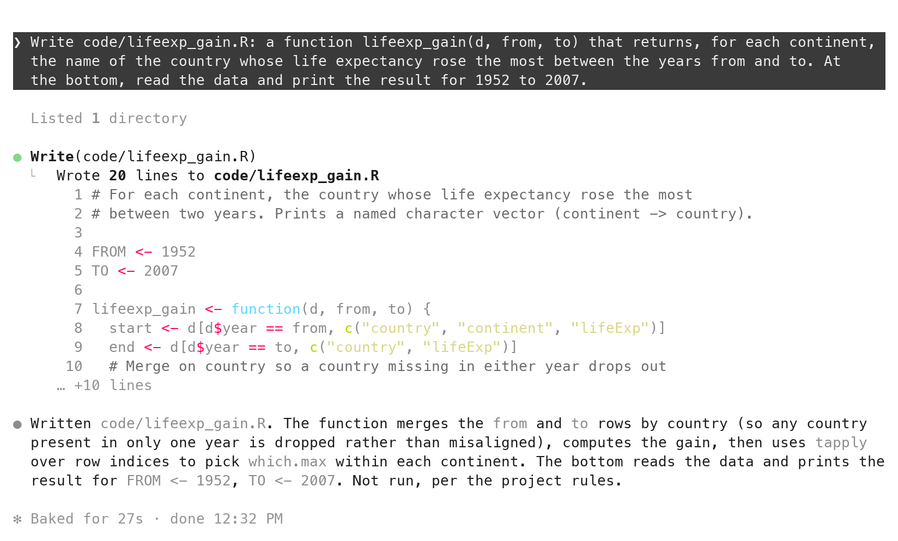{fig-align="center" fig-alt="Claude Code after accepting: Wrote 20 lines to code/lifeexp_gain.R, the file, and a summary paragraph ending Not run, per the project rules."}

Sourced, it prints five names:

```r
source("code/lifeexp_gain.R")
#>      Africa    Americas        Asia      Europe     Oceania 
#>     "Libya" "Nicaragua"      "Oman"    "Turkey" "Australia" 
```

The full file, for a laptop that fell behind:

```{.r filename="code/lifeexp_gain.R"}
# For each continent, the country whose life expectancy rose the most
# between two years. Prints a named character vector (continent -> country).

FROM <- 1952
TO <- 2007

lifeexp_gain <- function(d, from, to) {
  start <- d[d$year == from, c("country", "continent", "lifeExp")]
  end <- d[d$year == to, c("country", "lifeExp")]
  # Merge on country so a country missing in either year drops out
  # instead of misaligning the subtraction.
  both <- merge(start, end, by = "country", suffixes = c("_from", "_to"))
  both$gain <- both$lifeExp_to - both$lifeExp_from
  tapply(seq_len(nrow(both)), both$continent, function(i) {
    both$country[i][which.max(both$gain[i])]
  })
}

d <- read.csv("data/gapminder.csv", stringsAsFactors = FALSE)
print(lifeexp_gain(d, FROM, TO))
```

:::

## Tasks not to give Claude Code {#bad-at}

- Outputs you cannot check by hand.
- Questions that do not touch the repository. Use a chat.
- A folder with data you must not share. It can read everything.
- Long stretches without reading: accept-edits mode, until reading
  diffs is a habit.

::: {.content-visible when-format="revealjs"}

::: {.notes}
Every one of these is a case where the diff is not enough, or you would
not read it.
:::

:::

::: {.content-hidden when-format="revealjs"}

Four kinds of work do not belong in it. Outputs you cannot check by eye
or by hand; it will produce a plausible number in a script that runs.
Questions that do not touch the repository; open a chat instead. A
folder holding data you must not share; it can read everything. Long
stretches without reading; accept-edits mode exists, and it is not for
the weeks in which reading diffs becomes a habit.

If a model ever produces a value inside a script rather than writing
the script, five more duties apply. Write down the model and its version
(pin it). Set its randomness, the temperature, to zero. Call the model
once and reuse the saved replies on later runs (cache them). Save every
raw reply to a file and commit it, not only the label you took from it.
Write the model and the prompt in the README. If you cannot do all five,
use a rule you can write down instead.

:::

## A script that runs without error can still be wrong {#runs-clean}

- The first script ran without error, printed five plausible numbers,
  and answered the wrong question.
- The number on paper caught it and the diff showed why; the check in
  the script keeps it caught.
- The bottleneck is verification, not typing. A faster tool moves it to
  where it is easiest to skip.

::: {.content-visible when-format="revealjs"}

::: {.notes}
A clean run is not a right answer.
:::

:::

::: {.content-hidden when-format="revealjs"}

The first script ran without an error and printed five reasonable
numbers. It answered a different question. Only the value on paper and
the diff made that visible, and only the check in the script keeps it
visible. The bottleneck is no longer typing; it is verification. Every
faster tool moves that work to the end of the pipeline, where it is
easiest to skip.

:::

## Practice {#practice}

::: {.content-visible when-format="revealjs"}

Eight exercises on the session page, with solutions behind a click. All
of them run in `gapminder-practice`, never in a graded repository.

- **1–3** Read-only prompts, and scoping "analyze the data" down to one function
- **4–5** The loop again: `gdpPercap` weighted by people; countries per continent
- **6** Break the check on purpose, read the error, `git restore`
- **7–8** CLAUDE.md: add a rule; an approval box read against `git diff`

:::

::: {.content-hidden when-format="revealjs"}

::: {.panel-tabset}

### Practice

```bash
# Practice
# Everything below runs in gapminder-practice, Claude Code in manual
# mode, git status clean before each task. Never in a graded repository.

# Read-only prompts, and scoping
#  1. Ask for a line-by-line explanation of code/lifeexp_gain.R with
#     "Do not edit anything." Read it against the file. Mark every line
#     where the explanation is a description ("computes the gain") rather
#     than a fact ("lifeExp_to minus lifeExp_from").
#  2. Ask what code/lifeexp_gain.R prints for Oceania, "without running
#     it". Does the reply give a name, a method, or both? Which can you
#     trust?
#  3. Ask, without editing anything, which files it WOULD create to
#     "analyze the Gapminder data". Count them. Then write the scoped
#     version of the first one as a delegation in the four-part shape
#     (goal, failure mode, artifact and path, what not to do). Do not
#     send it yet.

# The loop again
#  4. Delegate gdp_by_continent(d, yr): the population-weighted mean of
#     gdpPercap by continent. Oceania 2007 on paper first (Australia
#     34,435.37, New Zealand 25,185.01; the two pop values are in the
#     "by hand" section). Run, compare, type the check, commit.
#  5. Delegate n_countries(d, yr): the number of countries per continent
#     in year yr. On paper: Oceania is 2 and the five numbers sum to 142.
#     Type both as conditions of one check. Commit.

# Breaking the check
#  6. In RStudio, reverse the subtraction in code/lifeexp_gain.R (swap
#     the two names, whatever they are). Source. Read the error. Then
#     git restore code/lifeexp_gain.R and git status.

# CLAUDE.md
#  7. Add one Style rule to CLAUDE.md: "Every function has a one-line
#     comment above it saying what it returns." Commit. Relaunch. Ask
#     for a small function (median lifeExp by continent in a year). Was
#     the rule followed? Where in the diff?
#  8. Ask: "Add a comment header to code/lifeexp_gain.R saying what it
#     reads and what it prints. Change nothing else." Read the approval
#     box: any red line? Accept. Then git diff. Do the box and git diff
#     agree line for line?
```

### Solutions

::: {.callout-tip collapse="true"}
## Solutions

```bash
# 1
#   The which.max line is where explanations go vague: "picks the
#   country with the largest gain" is a fact; "finds the best country"
#   is a description. Mark any line where you could not redo the step
#   from the explanation alone.
# expected: at least one line marked; the merge() line is the usual one

# 2
#   Without running it the tool has only the code to go on; it may
#   give "Australia" with the method (largest gain of two). Trust the
#   method you can follow; the name only after Source prints it.
# expected: a method you can check against the four rows; a name you then verify

# 3
#   A typical answer lists three to six files (a script, a figure, a
#   summary, sometimes a README). None of them has a value you can work
#   out by hand. The scoped version names one function, one failure
#   mode, one path, and what not to do. One shape is below.
# expected: a count, and one prompt in the four-part shape; Oceania on
#           paper: 80.72 in 2007 and 69.255 in 1952 (simple means)

# 4
#   On paper, the same form as the lifeExp case (pop in millions):
#   (34,435 x 20.43 + 25,185 x 4.12) / 24.55 = 32,883 (unweighted:
#   29,810). A hand result from rounded inputs needs a loose tolerance:
#   stopifnot(abs(res["Oceania"] - 32883) < 50)
# expected: Oceania 32884.56 printed; 29810.19 means countries were averaged

# 5
#   tapply(sub$country, sub$continent, length) or table(sub$continent).
#   stopifnot(res["Oceania"] == 2, sum(res) == 142)
# expected: Africa 52, Americas 25, Asia 33, Europe 30, Oceania 2

# 6
#   Error: res["Oceania"] == "Australia" is not TRUE
#   (the reversed subtraction makes New Zealand the largest). Then
#   git restore code/lifeexp_gain.R; git status prints clean.
# expected: five names printed, then the stop; git restore puts the
#           committed file back

# 7
#   A one-line comment sits directly above the function in the + block,
#   and it says what the function returns, not what it does line by
#   line.
# expected: the rule appears in the diff without being in the prompt

# 8
#   The approval box shows only + lines above the function; git diff
#   shows the same lines. A red line in either means the scope was not
#   held: Esc, or git restore, and ask again.
# expected: box and git diff agree line for line
```

```{.markdown filename="Prompt to paste into Claude Code (task 3, one scoped delegation)"}
Write code/lifeexp_trend.R. It defines lifeexp_trend(d, cont): for one
continent cont, the simple mean of lifeExp across its countries in each
year, as a named numeric vector with the years as names. Each country
counts once; do not weight by population. Base R only. At the bottom,
read data/gapminder.csv into d and print lifeexp_trend(d, "Oceania").
Do not run it. No other files. Do not use git.
```

```{.markdown filename="Prompt to paste into Claude Code (task 4)"}
Write code/gdp_by_continent.R. It defines gdp_by_continent(d, yr): for each
continent, the population-weighted mean of gdpPercap in year yr, as a named
numeric vector. Weight by the pop column; do not average countries. Base R
only. At the bottom, read data/gapminder.csv into d and print
gdp_by_continent(d, 2007). Do not run it. No other files. Do not use git.
```

:::

:::

:::

## Quick reference {#quick-reference}

::: {.content-visible when-format="revealjs"}

**Know the value before you run it, read the diff before you accept it, and keep the check in the script.**

Every command, key, prompt shape and check from today, one line each, on
the session page, with the things that bite.

:::

::: {.content-hidden when-format="revealjs"}

**Know the value before you run it, read the diff before you accept it,
and keep the check in the script.**

**Commands and keys**

| Do | Type |
|:--|:--|
| Launch, asking before every edit | `claude --permission-mode manual` (Terminal tab, inside the project) |
| The trust question | ↓ once to *Yes, I trust this folder*, Enter; once per folder |
| Check the mode | the status line reads `⏸ manual mode on` |
| Send a prompt | type at `❯`, Enter |
| Accept an edit / refuse it | `1` then Enter / Esc |
| Interrupt | Esc |
| Previous prompt | ↑ |
| New conversation, same folder | `/clear` |
| The uncommitted changes, inside the tool | `/diff` |
| First draft of CLAUDE.md | `/init` |
| Leave | `/exit`, or Ctrl+C twice |
| Git while it runs | Tools → Terminal → New Terminal (Terminal 2) |
| Diff of a new file | `git add code/x.R`, then `git diff --staged` |
| Diff of an edited file | `git diff` |
| Run the script | Session → Restart R, then Source |

**Prompt shapes**

| Ask for | Say |
|:--|:--|
| A look, no change | "... Do not edit anything." |
| One function | goal with names; the failure mode; `code/<name>.R`; "Do not run it. No other files. Do not use git." |
| A patch | "X prints A; by hand I get B because ...; change the line that ...; change nothing else." |
| The permanent check | type it yourself; or "Add a check: stopifnot() that ...; change nothing else." and read the line before `1. Yes` |
| A commit by the agent | "Commit code/x.R with the message: ..."; read the command in the box before `1. Yes`; manual mode only |
| A function under CLAUDE.md | two or three sentences: name, what it returns, what to print at the bottom; the failure mode still stated |

**The loop**

| Step | You do | It looks like |
|:--|:--|:--|
| 1 | state the goal and the failure mode | the prompt's first and second parts |
| 2 | delegate one function | `1. Yes` on an approval box you read |
| 3 | work out one case by hand | 81.06 on paper, from two rows |
| 4 | verify | Source; compare; `git diff --staged`; the five questions |
| 5 | keep the check | `stopifnot(abs(res["Oceania"] - 81.06) < 0.01)`; decimals with a tolerance, never `==` |

**The five questions for any diff**

| # | Question |
|:--|:--|
| 1 | Files: only the ones you named? (`git status`) |
| 2 | Removals: every `-` line asked for? Read these first. |
| 3 | The math line: does it do what the failure mode said? |
| 4 | Names and constants: yours, no bare numbers? |
| 5 | A line you cannot explain: ask before you accept, or ask for one you can read. |

**Things that bite**

| Symptom | Cause, fix |
|:--|:--|
| `command not found: claude` | the terminal predates the install; quit and reopen RStudio |
| the Terminal shows `>` instead of `❯` | you typed `claude` in the Console; Tools → Terminal → New Terminal |
| the trust question on every launch | the terminal opened outside the project; New Terminal from inside it |
| status line says `auto mode` | `/exit`, then relaunch with `--permission-mode manual` |
| `--permission-mode manual` is rejected | an older install; `--permission-mode default` is the same mode |
| `git diff` shows nothing after a new file | untracked; `git add` it, then `git diff --staged` |
| it wrote a file and ran it | not manual mode; `/exit`, relaunch, read `git status` |
| it committed or pushed without asking | Auto mode; `git log --oneline` to see what, then relaunch in manual mode |
| it asks to run `Rscript` or `R -e` | Esc (the last option, No); you run the script yourself in RStudio |
| the reply is a code block, no approval box | it did not write a file; say "Write code/x.R" first |
| a clean run, a wrong number | the prompt left a reading open; name the failure mode; the value on paper is what caught it |
| `stopifnot(x == 12.115)` fails on correct code | decimals: `round(81.235 - 69.120, 2)` is `12.11` in R; compare with `abs(x - 12.115) < 0.01` |
| a red line you did not ask for | read it; Esc if it matters; put "change nothing else" in the next prompt |
| `git commit` asks who you are | `git config --global user.name "Your Name"` and `git config --global user.email "netid@cornell.edu"`, then commit again |
| Windows: `claude` opens the desktop app | an old desktop app; update it, retry |
| Windows: `command not found` after reopening RStudio | add `%USERPROFILE%\.local\bin` to your user PATH; quit and reopen RStudio |
| the login browser page did not open | press `c` in the Terminal to copy the link; paste it into a browser |
| the login says `403`, or that your plan does not include Claude Code | the Pro subscription is not active; claude.ai → Settings → Billing, then `/login` |
| you chose the Console login by mistake | `/login`, then the subscription login |
| a *Bash command* box for `mkdir code` or `ls` | it only makes the folder or looks; `1. Yes` |

**Terms**

| Term | One line | Where |
|:--|:--|:--|
| delegation | one function handed to the tool, with a case you can check | [§](#scoping) |
| failure mode | the plausible mistake, named in the prompt | [§](#the-task) |
| expected value | the value worked out by hand before the run | [§](#by-hand) |
| manual mode | it asks before every edit and every command that changes something | [§](#launch) |
| approval box | the diff shown before it lands; `1. Yes` or Esc | [§](#approve-create) |
| the five questions | files, removals, the math line, names, a line you cannot explain | [§](#judge-diff) |
| patch | the smallest change that fixes the one failure | [§](#patch-prompt) |
| the check | the hand check written as `stopifnot()` in the script | [§](#institutionalize) |
| `/diff` | the uncommitted changes, from git, inside the tool | [§](#diff-on-screen) |
| standing context | `CLAUDE.md`, read at every launch | [§](#claude-md) |
| scope | what the prompt says not to do | [§](#prompt-shape) |
| harness | the app around the model: a chat window, Cowork, Claude Code | [§](#harnesses) |
| tool call | the model's request to read, search, run or edit; in manual mode the ones that change something ask first | [§](#tool-loop) |
| context | what the model has in front of it: the system prompt, `CLAUDE.md`, your prompts, every file it read and every command output | [§](#tool-loop) |

**Links:** [slides](09-ai-code-slides.html) · [Claude Code docs](https://code.claude.com/docs/en/quickstart) · [How Claude Code works](https://code.claude.com/docs/en/how-claude-code-works) · [best practices](https://code.claude.com/docs/en/best-practices) · [Syllabus](../syllabus.qmd) · [data/gapminder.csv](data/gapminder.csv)

:::
