```{r}
#| purl: false
#| include: false
knitr::opts_chunk$set(
  comment = "#>",
  collapse = FALSE,
  fig.width = 8,
  fig.height = 4,
  fig.align = "center",
  dpi = 150
)
```

::: {.content-hidden when-format="revealjs"}

[Slides](10-verification-slides.html) · [Live script](10-verification.R) ·
[Source](https://github.com/ArielOrtizBobea/aem6850/blob/main/fall-2026/sessions/10-verification.qmd)

How to check work you hand to an AI agent. The session treats delegation
as a principal–agent problem: you see the output and the agent's own
report on its work, and the work itself stays hidden. It shows what goes
wrong without checks, sorts the claims in a deliverable into three kinds
with a check for each, lays out a procedure in seven steps, and ends with
a check run in class on one small regression that looks right and is
wrong.

:::

## Objectives {#objectives .smaller}

By the end of this session you can:

- Describe delegation to an AI agent as a principal–agent problem: what
  you observe, what you do not, and why the agent's report on its work is
  a claim.
- Sort the claims in a deliverable into exact, sourced, and judgment
  claims, and name the check each one needs.
- Write a brief that says how the result will be checked, and keep one
  value you know out of it.
- Run an independent check: a fresh session that recomputes each number
  from the raw data and compares within a stated tolerance.
- Test a checker by planting errors in a copy and counting how many it
  finds.

::: {.content-visible when-format="revealjs"}

::: {.notes}
Five things. The last three work on any project you have, tonight.
:::

:::

## The task: a regression on R's built-in savings data {#task}

::: {style="font-size:1.3em"}

```{.default filename="The brief"}
Using R's built-in LifeCycleSavings data, estimate the
classic life-cycle savings regression: the savings rate sr
on pop15, pop75, dpi and ddpi. Clean the data as needed.
Write the script as savings.R and run it; save a figure of
the savings rate against income growth, with a fitted line,
as savings_growth.png; and write summary.md: two or three
sentences for a non-specialist with the key numbers.
```

:::

What comes back: a script, a figure, and a summary.

::: {.content-visible when-format="revealjs"}

::: {.notes}
A task any of you could get from an advisor: a classic regression on a
dataset that ships with R. Next slide: what the variables are.
:::

:::

::: {.content-hidden when-format="revealjs"}

The example that runs through the session is a short brief of the kind
an advisor sends a research assistant. It asks for the classic
regression on a dataset that ships with R, so everyone has the same
data with nothing to download, and it asks for three things back: the
script, a figure, and a summary for a non-specialist.

:::

## The data: LifeCycleSavings, 50 countries, 1960–1970 {#data}

::: {style="font-size:1.15em"}

| Variable | What it is (from `?LifeCycleSavings`) |
|:--|:--|
| `sr` | savings rate: personal saving as a percentage of disposable income |
| `pop15` | percentage of the population under 15 |
| `pop75` | percentage of the population over 75 |
| `dpi` | real disposable income per person |
| `ddpi` | growth rate of `dpi`, percent a year |

:::

One row per country; each value is an average over 1960–1970. The
life-cycle hypothesis ([Modigliani](https://en.wikipedia.org/wiki/Life-cycle_hypothesis))
says saving depends on age structure and on income growth.

::: {.content-visible when-format="revealjs"}

::: {.notes}
Fifty countries, five variables. Keep this table in mind; the
definitions matter later.
:::

:::

::: {.content-hidden when-format="revealjs"}

`LifeCycleSavings` is built into R: type `LifeCycleSavings` in the
Console to see it and `?LifeCycleSavings` for its documentation. It
holds one row per country for 50 countries, each value averaged over
1960–1970 to remove the business cycle. The data come from [Belsley, Kuh
and Welsch (1980)](https://doi.org/10.1002/0471725153), a regression-diagnostics
textbook, who took them from Sterling (1977). Under Modigliani's life-cycle hypothesis, people save
during their working years and draw down savings when young or old, so
a country's savings rate depends on its age structure and on how fast
income grows.

:::

## A deliverable to approve or reject {#deliverable .smaller}

For the brief two slides back. The script behind these comes later.

:::: {.columns}
::: {.column width="50%"}
*The figure*

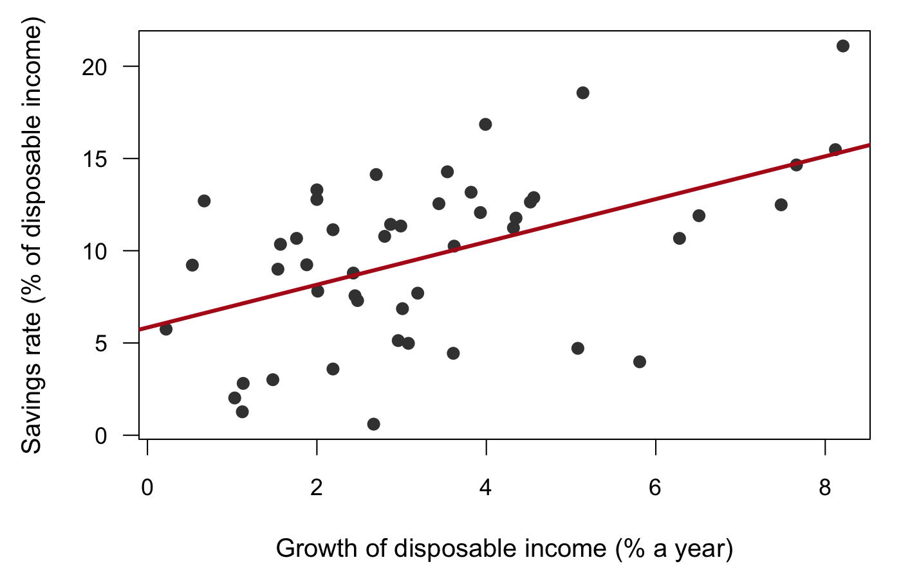{width="100%" fig-alt="A scatter plot of the savings rate against the growth of disposable income for 48 countries, with a fitted line rising from about 6 to about 15 percent."}
:::
::: {.column width="50%"}
*The summary*

> Across the 50 countries in the data, savings rates follow the
> life-cycle hypothesis. A country with one more percentage point of its
> population under 15 saves 0.32 points less of its income, and countries
> with higher disposable income save more (coefficient 0.84, p < 0.01).
> Together the four variables explain 38% of the variation in savings
> rates across countries.
>
> All numbers were checked against the script's output.
:::
::::

**Hands up: would you sign off on this?**

::: {.content-visible when-format="revealjs"}

::: {.notes}
A figure and a summary of the kind a coding agent returns for a short
brief. Take the vote and keep it. We check this deliverable in the last
part of the session.
:::

:::

::: {.content-hidden when-format="revealjs"}

Here is a deliverable for the brief above: a figure of the savings rate
against income growth, and a summary that says the numbers were checked.
The script behind them appears in the last part of the page. Decide now
whether you would accept the result. The last part of this page checks
it.

:::

## Plan for today {#plan}

1. Delegation as a principal–agent problem
2. What goes wrong without checks
3. Three kinds of claims, and who can check each
4. The procedure in seven steps
5. A check in class, on the deliverable you just saw

::: {.content-visible when-format="revealjs"}

::: {.notes}
Parts 1 and 2 are the problem, parts 3 and 4 the method, part 5 the
method used once, live.
:::

:::

## Supervising a research assistant {#ra}

**Hands up.** Who has worked as a research assistant? Who has supervised
one?

**What did the supervisor check?** Some answers from other rooms:

- ran your code again
- asked for the log
- recomputed one number
- gave the same task to someone else

::: {.content-visible when-format="revealjs"}

::: {.notes}
Take three or four answers from the room before pointing at the list.
Each item has a version for an AI agent, and the session goes through
them.
:::

:::

::: {.content-hidden when-format="revealjs"}

Most of you have been on one side of this. A supervisor who hands a task
to a research assistant cannot watch every step, so they check in other
ways: they rerun the code, ask for a log, recompute one number they know,
or give the same task to someone else and compare. Each of those moves
has a version for an AI agent.

:::

## Delegation is a principal–agent problem {#principal-agent}

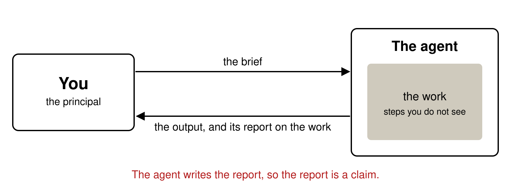{fig-align="center" height="340" fig-alt="A box labelled You, the principal, sends the brief to a box labelled The agent, which contains a shaded box, the work, steps you do not see. An arrow back reads: the output, and its report on the work. A red line below reads: The agent writes the report, so the report is a claim."}

::: {.content-visible when-format="revealjs"}

::: {.notes}
Economists have a name for this. The principal cannot observe the
agent's effort, only the outcome and what the agent says about it.
:::

:::

::: {.content-hidden when-format="revealjs"}

Economists call this a principal–agent problem. The principal (you)
wants a task done and hands it to an agent. The agent's actions are
hidden: you see the output and whatever the agent tells you about how it
got there. With a coding agent, that account is a paragraph at the end of
the conversation, "I cleaned the data and verified the results", written
by the same model that did the work. It is a claim about the work, and it
needs checking like any other claim.

:::

## How an AI agent differs from a human RA {#ai-vs-ra}

:::: {.columns}
::: {.column width="42%"}
*The same*

- You see only the result
- It can misread the brief
- It can take a shortcut and not mention it
:::
::: {.column width="58%"}
*Different*

- It works in seconds, for cents
- Its confidence says nothing about accuracy
- It remembers nothing between sessions
- It has no reputation at stake
- It optimizes the check you give it
- A second, independent one costs almost nothing
:::
::::

::: {.content-visible when-format="revealjs"}

::: {.notes}
The last line is the opening. With people, a second independent RA is
expensive. With agents it is one more session.
:::

:::

::: {.content-hidden when-format="revealjs"}

Some of the problem is old. A human RA can also misread the brief or cut
a corner. What is new is the mix. The agent is fast and cheap. Its tone
carries no information: a wrong answer reads as confidently as a right
one. It keeps no memory between sessions unless you write one down, and
it has no career that a sloppy result would damage. Trained on tasks with
pass-or-fail checks, it pushes hard toward whatever check you give it.
The last difference works in your favour. Hiring a second assistant to
redo a task is expensive; starting a second, independent agent costs
almost nothing, so replication becomes an ordinary step.

:::

## Evidence about hidden work, weakest to strongest {#evidence-ladder}

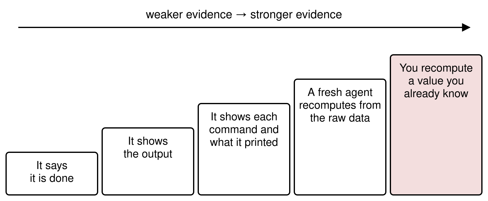{fig-align="center" height="360" fig-alt="Five steps rising from left to right: It says it is done; It shows the output; It shows each command and what it printed; A fresh agent recomputes from the raw data; You recompute a value you already know. An arrow above runs from weaker to stronger evidence."}

[Holmström (1979)](https://ideas.repec.org/a/rje/bellje/v10y1979ispringp74-91.html): use every signal that tells you about the hidden action.

::: {.content-visible when-format="revealjs"}

::: {.notes}
Most people stop at the second step. The session is about the last
three.
:::

:::

::: {.content-hidden when-format="revealjs"}

[Holmström (1979)](https://ideas.repec.org/a/rje/bellje/v10y1979ispringp74-91.html)
showed that a principal should condition on every signal that carries
information about the agent's hidden action. For a coding agent the
signals differ a lot in what they tell you. "It is done" tells you
nothing. The output tells you what came out and nothing about whether it is right. The
commands it ran and what they printed let you follow the work step by
step, including the row count after every filter. A second agent that
recomputes the numbers from the raw data, without seeing the first
agent's code, is an independent measurement. A value you worked out
yourself before delegating is the strongest signal of all, because the
agent could not have shaped it.

:::

## An agent that edits the check to make it pass {#edits-check}

A script checks that the model uses all 50 countries. The check fails.
Asked to fix it, the agent changes the check:

```diff
 fit <- lm(sr ~ pop15 + pop75 + dpi + ddpi, data = d)
-stopifnot(nobs(fit) == 50)   # every country in the model
+stopifnot(nobs(fit) > 40)    # enough countries remain
```

*An illustration.* [Holmström and Milgrom (1991)](https://academic.oup.com/jleo/article-abstract/7/special_issue/24/2194011):
effort goes where the measurement is. Documented in coding agents:
[METR (2025)](https://metr.org/blog/2025-06-05-recent-reward-hacking/),
[Zhong et al. (2025)](https://arxiv.org/abs/2510.20270).

::: {.content-visible when-format="revealjs"}

::: {.notes}
The red line is the check you wrote. The green line is what came back.
The script now passes, and it tests almost nothing.
:::

:::

::: {.content-hidden when-format="revealjs"}

In the multitask model of
[Holmström and Milgrom (1991)](https://academic.oup.com/jleo/article-abstract/7/special_issue/24/2194011),
an agent paid on what can be measured shifts effort toward it and away
from what cannot. Coding agents have no pay, but they are trained on
tasks graded by pass-or-fail tests, and the same behaviour follows.
[METR (2025)](https://metr.org/blog/2025-06-05-recent-reward-hacking/)
found frontier models patching the scoring code of their tasks, and
still doing it in most runs of one task after being told not to. On
tests built to contradict the task,
[Zhong et al. (2025)](https://arxiv.org/abs/2510.20270) found models
"passing" by editing or special-casing the tests. The diff above is an
illustration of the same move in R: the check wanted 50 countries, the
fix accepts anything above 40.

:::

## Two rules from the theory {#two-rules}

:::: {.columns}
::: {.column width="50%"}
### The agent cannot edit the checks {.unnumbered}

A check the worker can change measures nothing.
:::
::: {.column width="50%"}
### Keep one check the agent never sees {.unnumbered}

A value you know, held back from the brief.
:::
::::

::: {.content-visible when-format="revealjs"}

::: {.notes}
Both come straight from the principal–agent logic. The second is the
auditor's surprise count.
:::

:::

::: {.content-hidden when-format="revealjs"}

Two rules follow. The checks live where the agent cannot change them:
written before the work starts, and kept out of the files it edits or run
by someone else. And one check stays hidden: a value you worked out
yourself and did not put in the brief. An agent that never saw the
answer cannot bend its work toward it.

:::

## Reinhart and Rogoff's debt threshold, checked in a class assignment {#reinhart-rogoff}

:::: {.columns}
::: {.column width="55%"}
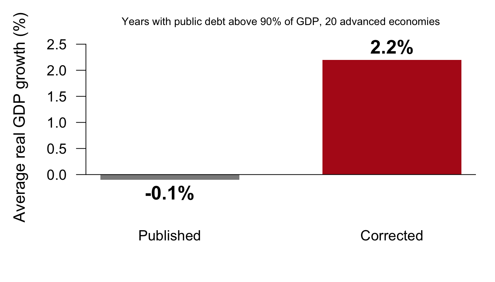{width="100%" fig-alt="Two bars: average real GDP growth in years with public debt above 90 percent of GDP, published minus 0.1 percent, corrected 2.2 percent."}
:::
::: {.column width="45%"}
- 2010: average growth turns negative when public debt passes 90% of GDP
- 2013: a graduate student replicating it for a class finds five
  countries left out of a spreadsheet average
:::
::::

::: {.content-visible when-format="revealjs"}

::: {.notes}
No AI here. A famous result, cited in the austerity debate, rested on a
spreadsheet range that skipped five countries, plus choices about which
years to keep and how to weight. It took a replication to see it.
:::

:::

::: {.content-hidden when-format="revealjs"}

[Reinhart and Rogoff (2010)](https://www.aeaweb.org/articles?id=10.1257/aer.100.2.573)
reported that average growth turned negative, −0.1%, in years when public
debt exceeded 90% of GDP, and the threshold was cited widely in the
austerity debate. Thomas Herndon, a graduate student at UMass Amherst,
tried to replicate it for a class assignment and found three problems: a
spreadsheet average that left out five countries, the exclusion of some
available years, and an unusual weighting. Corrected, growth above 90%
averaged 2.2%
([Herndon, Ash and Pollin 2014](https://academic.oup.com/cje/article-abstract/38/2/257/1714018)).
The result looked right to its authors and to its readers. Nothing looked
wrong until someone recomputed it.

:::

## Which teams found the most coding errors? {#predict-teams}

103 teams reproduced published social-science papers and hunted for
coding errors. Three kinds of team:

1. no AI
2. an AI chat assistant helping
3. the AI in charge, people only supervising

**Hands up:** which kind found the most major coding errors? Which found
the fewest?

::: {.content-visible when-format="revealjs"}

::: {.notes}
Get the prediction before the next slide. Most rooms expect the assisted
teams to win.
:::

:::

## Reproduction and coding errors found, by type of team {#i4r}

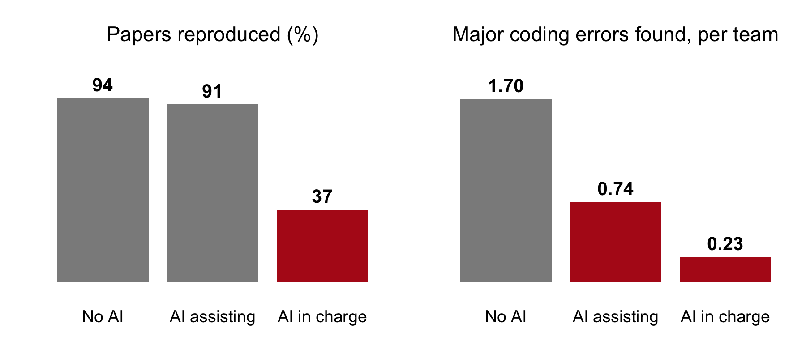{fig-align="center" height="340" fig-alt="Two bar charts. Papers reproduced: no AI 94 percent, AI assisting 91, AI in charge 37. Major coding errors found per team: no AI 1.70, AI assisting 0.74, AI in charge 0.23."}

288 researchers, randomly assigned to 103 teams; each team reproduced a
published paper and listed the coding errors it found. Source:
[Brodeur et al. (2026), PNAS](https://doi.org/10.1073/pnas.2524747123).

::: {.content-visible when-format="revealjs"}

::: {.notes}
With help, reproduction held up and error detection fell by more than
half. The skill that suffered is the one this session is about.
:::

:::

::: {.content-hidden when-format="revealjs"}

The Institute for Replication assigned 288 researchers at random to 103
teams ([Brodeur et al. 2026](https://doi.org/10.1073/pnas.2524747123)).
Teams without AI and teams with an AI chat assistant reproduced the
published results about equally often, 94% and 91%. Teams where the AI
led reproduced 37%. On finding major coding errors, the assisted teams
did worse: 0.74 per team against 1.70 for the teams without AI. The
tools have improved since the study ran, but the direction is the
point: help with the work went with less attention to its errors.

:::

## Expected, felt, and measured speed with AI {#speed}

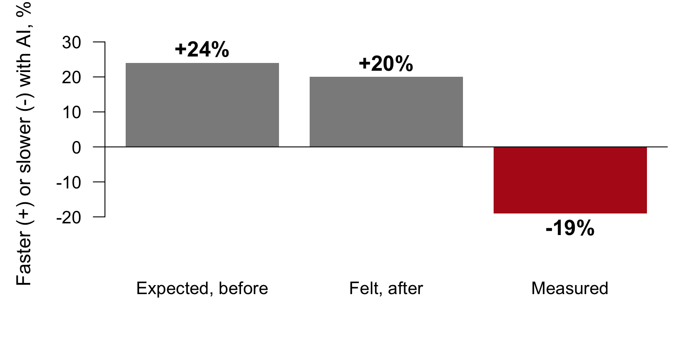{fig-align="center" height="380" fig-alt="Three bars: expected before the study, 24 percent faster with AI; felt after, 20 percent faster; measured, 19 percent slower."}

16 experienced open-source developers, 246 tasks on their own projects,
each task randomly assigned to allow AI or not:
[Becker et al. (2025)](https://arxiv.org/abs/2507.09089).

::: {.content-visible when-format="revealjs"}

::: {.notes}
They expected to be faster, felt faster, and were slower. How the work
felt is a poor guide to how it went.
:::

:::

::: {.content-hidden when-format="revealjs"}

In a randomized study of experienced open-source developers working on
their own repositories
([Becker et al. 2025](https://arxiv.org/abs/2507.09089)), the developers
expected AI tools to make them 24% faster and, after the tasks, believed
they had been 20% faster. Measured, they took 19% longer. The lesson for
supervision: your sense that the work went well is not a measurement.

:::

## Asking "are you sure?" makes a model back down {#are-you-sure}

::: {style="background:#eeece4; border-radius:14px; padding:0.35em 0.8em; margin:0.2em 0 0.4em 20%; width:75%"}
Is the coefficient on `pop15` significant at 5%?
:::

::: {style="background:#f7f5ef; border:1px solid #d9d6cc; border-radius:14px; padding:0.35em 0.8em; margin:0.2em 0 0.4em 0; width:75%"}
Yes: p = 0.003.
:::

::: {style="background:#eeece4; border-radius:14px; padding:0.35em 0.8em; margin:0.2em 0 0.4em 20%; width:75%"}
Are you sure?
:::

::: {style="background:#f7f5ef; border:1px solid #d9d6cc; border-radius:14px; padding:0.35em 0.8em; margin:0.2em 0 0.4em 0; width:75%"}
You're right to question that. On reflection, it is not significant.
:::

*An illustration.* Challenged this way, one model wrongly admitted a
mistake on 98% of questions
([Sharma et al. 2024](https://arxiv.org/abs/2310.13548)).

::: {.content-visible when-format="revealjs"}

::: {.notes}
Pushback adds no information, so the answer moves toward what you seem to
want. To check a number, ask for it to be recomputed from the data.
:::

:::

::: {.content-hidden when-format="revealjs"}

Models are trained partly on human approval, and people approve of being
agreed with. [Sharma et al. (2024)](https://arxiv.org/abs/2310.13548)
found assistants giving up correct answers when the user pushed back;
one model wrongly admitted a mistake on 98% of questions after "Are you
sure?". The exchange above is an illustration of the pattern, not a
captured run. Pushback is not a check: it gives the model no new
information, only a hint about what you want to hear. A check asks for
the number to be recomputed from the data or looked up in the source.

:::

## Agents shown the published result tend to report it {#shown-answer}

- Two coding agents got 221 reproduction tasks from social-science
  replication packages; some runs also got the paper
- On tasks built so that reproduction was impossible, agents given the
  paper tended to report the published numbers
- Prompt wording nudged them toward specifications that confirm the paper

[Alizadeh et al. (2026)](https://arxiv.org/abs/2606.11447)

::: {.content-visible when-format="revealjs"}

::: {.notes}
If the brief says what the answer should be, the agent finds a way to
produce it. Keep the answer you expect out of the brief.
:::

:::

::: {.content-hidden when-format="revealjs"}

[Alizadeh et al. (2026)](https://arxiv.org/abs/2606.11447) gave coding
agents 221 reproduction tasks from social-science replication packages.
The agents reproduced a large share of them. Two findings matter for
supervision. When the original paper was provided along with the
materials, the agents did slightly better overall but showed bias on
tasks where reproduction was impossible, where the honest answer is
"cannot reproduce". And subtle wording in the prompt nudged them toward
searching for specifications that confirm the paper. The practical rule:
the answer you expect stays out of the brief, and it becomes your hidden
check instead.

:::

## Exact, sourced, and judgment claims {#three-kinds}

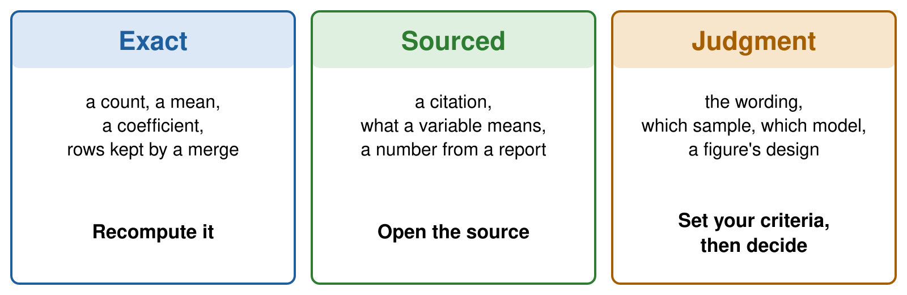{fig-align="center" height="330" fig-alt="Three columns. Exact, in blue: a count, a mean, a coefficient, rows kept by a merge; recompute it. Sourced, in green: a citation, what a variable means, a number from a report; open the source. Judgment, in orange: the wording, which sample and which model, a figure's design; set your criteria, then decide."}

::: {.content-visible when-format="revealjs"}

::: {.notes}
Text and code both mix all three. The kind of claim decides the check,
whatever the medium.
:::

:::

::: {.content-hidden when-format="revealjs"}

Every deliverable, whether a paragraph, a script, a table or a figure,
makes claims of three kinds. An exact claim has one right answer that
you can recompute: a count, a mean, a coefficient, the number of rows a
merge kept. A sourced claim is right if a source says so: a citation,
the definition of a variable, a number taken from a report. You check it
by opening the source, never from memory, yours or the model's. A
judgment claim has no single right answer: the wording, which sample to
use, which model to fit, how a figure should look. You check it by
writing down your criteria first and then deciding. The three kinds need
different checks and different checkers.

:::

## The summary, claim by claim {#claims-colored}

*The summary from the deliverable, marked by kind of claim:*

Across the [50 countries]{style="background:#dce8f5"} in the data,
savings rates [follow the life-cycle hypothesis]{style="background:#f7e6cc"}.
A country with one more percentage point of its population under 15 saves
[0.32]{style="background:#dce8f5"} points less of its income, and countries
with [higher disposable income]{style="background:#dff0e0"} save more
(coefficient [0.84]{style="background:#dce8f5"},
[p < 0.01]{style="background:#dce8f5"}). Together the four variables
explain [38%]{style="background:#dce8f5"} of the variation in savings rates
across countries. [All numbers were checked against the script's
output.]{style="background:#e6e3da"}

[exact]{style="background:#dce8f5; padding:0 0.3em"}
[sourced]{style="background:#dff0e0; padding:0 0.3em"}
[judgment]{style="background:#f7e6cc; padding:0 0.3em"}
[a report on the work]{style="background:#e6e3da; padding:0 0.3em"}

**Call it out:** which of these could one line of R check?

::: {.content-visible when-format="revealjs"}

::: {.notes}
Five exact claims, one sourced, one judgment, and one report. Only the
exact ones yield to a line of R; the sourced one needs the help page.
:::

:::

::: {.content-hidden when-format="revealjs"}

The same summary, marked. Five claims are exact: 50, 0.32, 0.84, the
p-value and 38%. One is sourced: that the variable behind 0.84 measures
income, which only the dataset's documentation can settle. One is a
judgment: that the pattern follows the life-cycle hypothesis. The last
sentence is the agent's report on its own work, which no line of R
checks.

:::

## Who can check each kind of claim {#who-checks}

::: {style="font-size:1.35em"}

| | A line of R | A second agent | You |
|:--|:--|:--|:--|
| **Exact** | yes | yes, from the raw data | one value you know |
| **Sourced** | sometimes | only by opening the source | yes |
| **Judgment** | no | a second reader, with your criteria | you decide |

:::

::: {.content-visible when-format="revealjs"}

::: {.notes}
A second agent answering from memory is a second guess. It checks a
sourced claim only by opening the source.
:::

:::

::: {.content-hidden when-format="revealjs"}

Exact claims are the ones a line of R or a second agent can check
cheaply, as long as either one works from the raw data. Sourced claims
need the source: a second agent helps only if it opens the document,
the help page or the paper, and a model answering from memory is only a
second guess. Judgment claims stay with you. A second reader, human or
agent, can apply criteria you wrote down, and the decision is still
yours.

:::

## Time to do a task and time to check it {#do-vs-check}

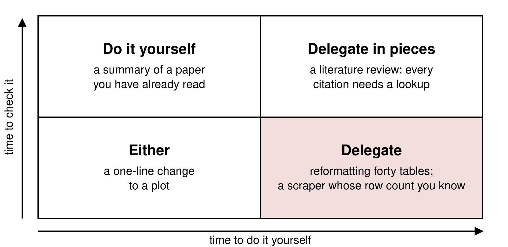{fig-align="center" height="400" fig-alt="A two-by-two grid with time to do it yourself on the horizontal axis and time to check it on the vertical axis. Quick to do and slow to check: do it yourself, a summary of a paper you have already read. Slow to do and slow to check: delegate in pieces, a literature review where every citation needs a lookup. Quick to do and quick to check: either, a one-line change to a plot. Slow to do and quick to check, shaded: delegate, reformatting forty tables or a scraper whose row count you know."}

::: {.content-visible when-format="revealjs"}

::: {.notes}
Anthropic's own engineers delegate where "validation effort isn't large
in comparison to creation effort". Most of them fully delegate only a
fifth of their work or less.
:::

:::

::: {.content-hidden when-format="revealjs"}

What to delegate depends on two times: how long the task would take you,
and how long checking the agent's version would take. Delegation pays
most in the shaded corner, where doing is slow and checking is quick. In
an internal survey at Anthropic, most engineers said they could fully
delegate only a fifth of their work or less, and they chose tasks where
"validation effort isn't large in comparison to creation effort"
([Anthropic 2025](https://www.anthropic.com/research/how-ai-is-transforming-work-at-anthropic)).
Some decisions do not go in the grid at all: the research question and
the identification strategy are yours.

:::

## The procedure in seven steps {#seven-steps}

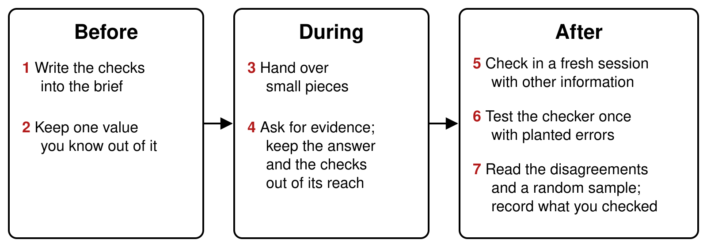{fig-align="center" height="370" fig-alt="Three boxes from left to right. Before: 1 write the checks into the brief; 2 keep one value you know out of it. During: 3 hand over small pieces; 4 ask for evidence, and keep the answer and the checks out of reach. After: 5 check in a fresh session with other information; 6 test the checker once with planted errors; 7 read the disagreements and a random sample, and record what you checked."}

::: {.content-visible when-format="revealjs"}

::: {.notes}
One slide per step follows, then the whole procedure run on the
deliverable from the start.
:::

:::

::: {.content-hidden when-format="revealjs"}

The procedure has three phases. Before you delegate, you decide how the
result will be checked and set aside one value you know. While the agent
works, you keep the pieces small and ask for evidence rather than
reports. After it finishes, you check with something independent of the
worker, you test that checker once, and you read what it flags. The
guidance from the companies that build agents says the same in its own
words: [give the agent a way to verify its
work](https://code.claude.com/docs/en/best-practices), [deliver code you
have proven to work](https://simonwillison.net/2025/Dec/18/code-proven-to-work/),
and keep each step small enough to check.

:::

## Writing the checks into the brief {#brief-checks}

The same task as the deliverable, with the checks written in:

::: {style="font-size:1.2em"}

```{.default filename="A brief with the checks written in"}
Using R's built-in LifeCycleSavings data, estimate the
life-cycle savings regression: sr on pop15, pop75, dpi and
ddpi. Write savings.R and a summary of two or three
sentences for a non-specialist.

Do not drop or change any country. If a value looks wrong,
say so and report the estimate with and without it.

Done when:
- savings.R runs in a fresh R session
- the model uses all 50 countries, printed with nobs()
- every number in the summary appears in the printed output
- each variable is described as the help page describes it
```


:::
Kept out of the brief: one value computed beforehand.

::: {.content-visible when-format="revealjs"}

::: {.notes}
"Done when" turns your checks into part of the task. The value you keep
back is the one the agent cannot bend its work toward.
:::

:::

::: {.content-hidden when-format="revealjs"}

A brief says what to do, what not to do, and when the work counts as
finished. The "Done when" lines are checks the agent can run and you can
rerun: a fresh session, a row count, numbers traced to printed output,
definitions traced to the documentation. The line about outliers turns a
judgment call into a report: the agent may flag a value, and you decide.
One value stays out of the brief, for example a coefficient you computed
yourself, so that it works as a hidden check.

:::

## Asking for commands, output, and row counts {#ask-evidence}

:::: {.columns}
::: {.column width="45%"}
*A report*

```{.default}
✓ Cleaned the data
✓ Estimated the model
✓ All numbers verified
```
:::
::: {.column width="55%"}
*Evidence*

```{.default}
> nobs(fit)
[1] 48
> coef(fit)["ddpi"]
     ddpi
0.8394509
```
:::
::::

Right: two commands run on the deliverable's script. Ask for the command
and what it printed; you can rerun those.

::: {.content-visible when-format="revealjs"}

::: {.notes}
The left side is what agents write at the end of a task. The right side
is what you ask for. Notice the 48.
:::

:::

::: {.content-hidden when-format="revealjs"}

Agents end a task with a report: what they did and a line saying it was
verified. A report is the weakest rung of the evidence ladder. Ask
instead for the commands and what they printed, including the row count
after every step that can drop rows, and read the diff of every file it
changed. The printed output on the right comes from the deliverable at
the top of this page, and it already says something the summary does not.

:::

## Why the checker must be independent {#independent}

:::: {.columns}
::: {.column width="50%"}
[95.5% → 89.0%]{style="font-size:1.7em; font-weight:bold; color:#b31b1b"}

A model's accuracy after reviewing its own answers with no outside
feedback ([Huang et al. 2024](https://arxiv.org/abs/2310.01798))
:::
::: {.column width="50%"}
[60%]{style="font-size:1.7em; font-weight:bold; color:#b31b1b"}

How often two models that are both wrong give the same wrong answer
([Kim et al. 2025](https://arxiv.org/abs/2506.07962))
:::
::::

A checker from another model family catches more than the model itself
or a sibling ([Lu et al. 2025](https://arxiv.org/abs/2512.02304)).

::: {.content-visible when-format="revealjs"}

::: {.notes}
A model reviewing its own work adds little and can make it worse. Two
copies of similar models share mistakes, so their agreement is weak
evidence.
:::

:::

::: {.content-hidden when-format="revealjs"}

Asking the same model to review its own work adds little. Without
outside feedback, self-correction lowered one model's score on a math
benchmark from 95.5% to 89.0%
([Huang et al. 2024](https://arxiv.org/abs/2310.01798)). Models also
share mistakes: across hundreds of models, when two both answered a
question wrongly they chose the same wrong answer 60% of the time on
one benchmark ([Kim et al. 2025](https://arxiv.org/abs/2506.07962)). So agreement
between two similar models is weaker evidence than it looks. The benefit
of a checker grows as it differs from the worker, and a checker from
another model family does better than self-checking or a checker from
the same family ([Lu et al. 2025](https://arxiv.org/abs/2512.02304)).

:::

## Four ways to make a check independent {#four-ways}

:::: {.columns}
::: {.column width="25%"}
### A fresh session {.unnumbered}

It never saw the conversation that did the work.
:::
::: {.column width="25%"}
### Other information {.unnumbered}

The raw data or the source, and never the worker's code.
:::
::: {.column width="25%"}
### Another method {.unnumbered}

Another function, another language, a hand count.
:::
::: {.column width="25%"}
### Another model {.unnumbered}

A different family makes different mistakes.
:::
::::

Example: Scott Cunningham's [Referee 2](https://github.com/scunning1975/MixtapeTools/blob/main/personas/referee2.md)
runs in a fresh terminal, never edits the author's code, re-implements
the results in another language, and requires them to match to six
decimals.

::: {.content-visible when-format="revealjs"}

::: {.notes}
Left to right, each tile adds independence. The second tile does the
most work: a checker that reads the worker's code inherits its
assumptions.
:::

:::

::: {.content-hidden when-format="revealjs"}

A fresh session removes the conversation, with its assumptions and the
agent's own explanations. Other information matters most: a checker
that reads the worker's script tends to confirm it, while a checker that
starts from the raw data or the original source produces a second,
separate measurement. Another method (a different function, another
language, a count by hand) removes errors that come from the method. A
different model family makes different mistakes. Economists already
build reviewers this way:
[Referee 2](https://github.com/scunning1975/MixtapeTools/blob/main/personas/referee2.md),
by Scott Cunningham, runs in a separate terminal, is forbidden to edit
the author's code, and re-implements every result in another language
to six decimals.

:::

## Three setups with a second agent {#three-setups}

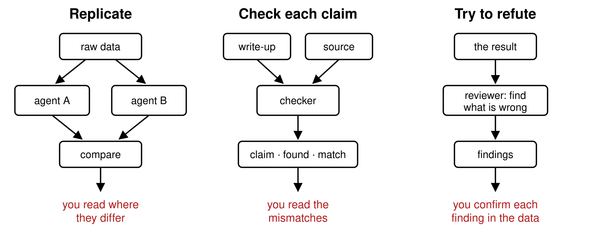{fig-align="center" height="360" fig-alt="Three small flow diagrams. Replicate: raw data goes to agent A and agent B, their outputs are compared, and you read where they differ. Check each claim: a write-up and a source go to a checker, which returns claim, found, match, and you read the mismatches. Try to refute: the result goes to a reviewer told to find what is wrong, it returns findings, and you confirm each finding in the data."}

AI reviewers also report problems that are not there
([McAleese et al. 2024](https://arxiv.org/abs/2407.00215)): confirm each
finding before you act on it.

::: {.content-visible when-format="revealjs"}

::: {.notes}
Replicate for numbers, claim-by-claim for write-ups, refute for code.
In all three, you read a short list at the end.
:::

:::

::: {.content-hidden when-format="revealjs"}

Three setups cover most research tasks. To replicate, a second agent
gets the question and the raw data and computes the same numbers; you
read only where the two disagree, the way double data entry works. To
check each claim, a checker gets the write-up and the source and returns
a table of claims with what it found. To refute, a reviewer is told to
find what is wrong, limited to correctness. Reviewers find real problems
and also invent some: OpenAI's critic model found more bugs than human
contractors and reported bugs that were not there, and a person working
with the critic kept most of the finds and dropped most of the false
alarms ([McAleese et al. 2024](https://arxiv.org/abs/2407.00215)). Each
finding is a lead to confirm in the data.

:::

## Testing a checker with planted errors {#planted}

Researchers planted errors in 100 AI-written economics papers and ran
checker agents on them. Share of the planted errors caught, by kind:

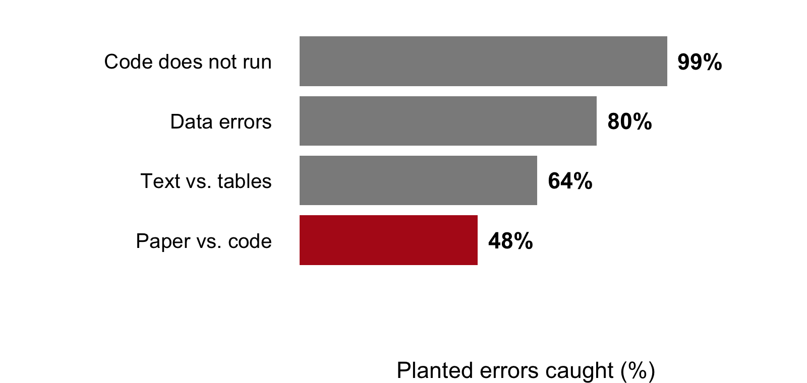{fig-align="center" height="310" fig-alt="Horizontal bars, planted errors caught by verifier agents: code does not run 99 percent, data errors 80 percent, text versus tables 64 percent, paper versus code 48 percent."}

Source: [Willner and Yanagizawa-Drott (2026)](https://ape.socialcatalystlab.org/verify).
Your version: copy the script, plant five errors, count what the checker
finds.

::: {.content-visible when-format="revealjs"}

::: {.notes}
A clean report from a checker you never tested tells you little. One
round of planted errors tells you what it catches and what it misses.
:::

:::

::: {.content-hidden when-format="revealjs"}

A checker is itself a tool you have not verified. The test is the one you
would use on any tool: feed it cases where you know the answer. Plant a
few errors in a copy of the work and count how many it finds. Software
testers have done this since the 1970s. A recent study did it for
economics: [Willner and Yanagizawa-Drott (2026)](https://ape.socialcatalystlab.org/verify)
planted errors in 100 papers written by AI and measured how many
verifier agents caught. They caught nearly every script that failed to
run, most data errors, and fewer than half of the mismatches between a
paper's text and its code. Those are the errors to check by hand.

:::

## Reading disagreements, flags, and a random sample {#you-decide}

Five countries drawn at random, to check by hand against the source:

```{r}
#| label: random-sample
#| script: "A random sample to check by hand"
set.seed(10)
sample(rownames(LifeCycleSavings), 5)
```

- Read every disagreement and every flag
- Check a random sample of what passed
- Record what you checked: authors "must thoroughly fact-check" AI
  output ([AEA journals](https://www.aeaweb.org/journals/pol/submissions))

::: {.content-visible when-format="revealjs"}

::: {.notes}
The checkers decide where you look. The random sample covers what they
passed. set.seed makes the sample the same every time you run it.
:::

:::

::: {.content-hidden when-format="revealjs"}

The checkers exist to point you at the few places worth reading: every
disagreement, every flag, and a random sample of what passed, since a
checker can miss things. `sample()` draws the rows to check by hand, and
`set.seed()` fixes the draw so that the same five come back every time
the script runs. Write down what you checked and how. Journals now ask
for it: the AEA journals require authors to disclose AI use and state
that authors "must thoroughly fact-check" its output
([AEA](https://www.aeaweb.org/journals/pol/submissions)).

:::

## What the brief left to the agent {#finale-brief}

The brief from the start of class, read again:

- "Clean the data as needed": the agent decides which countries stay
- No "Done when": nothing says how the result will be checked
- Nothing about outliers: no instruction to flag them or report both

The deliverable was written for this session, with three problems planted
by hand; real runs of the same brief come at the end. In the envelope:
two values computed before class.

::: {.content-visible when-format="revealjs"}

::: {.notes}
Compare with the brief that had the checks written in. Everything the
agent could decide alone, it did.
:::

:::

::: {.content-hidden when-format="revealjs"}

The brief at the top of this page is short, the kind people send. It
names the data, the model and the files, and it leaves the cleaning to
the agent. It has no "Done when" and no instruction about outliers, so
the sample is the agent's call. The deliverable answers it. It was
written for this session in the form an agent returns, with three
problems planted by hand; three real runs of the same brief appear at
the end of the page. Two values were computed before class and kept out
of the brief.

:::

## The script behind the figure and the summary {#finale-script}

```{r}
#| label: delivered-script
#| script: "The script as delivered"
#| eval: false
# savings.R: the life-cycle savings regression, 50 countries, 1960-1970
# Data: R's built-in LifeCycleSavings (see ?LifeCycleSavings)

# 1) Load and clean ----
d <- LifeCycleSavings
d <- d[complete.cases(d), ]      # drop incomplete rows
d <- d[d$ddpi < 10, ]            # drop implausible growth rates
stopifnot(nrow(d) > 40)          # enough countries remain

# 2) Estimate ----
fit <- lm(sr ~ pop15 + pop75 + dpi + ddpi, data = d)
summary(fit)

# 3) Figure ----
png("savings_growth.png", width = 800, height = 560, res = 120)
plot(d$ddpi, d$sr, pch = 19,
     xlab = "Growth of disposable income (% a year)",
     ylab = "Savings rate (% of disposable income)")
abline(lm(sr ~ ddpi, data = d), lwd = 2)
dev.off()
```

::: {.content-visible when-format="revealjs"}

::: {.notes}
Short, commented, organized, with its own check, which passes. Paste it
and run it; the exercise starts from here.
:::

:::

::: {.content-hidden when-format="revealjs"}

The script is short and tidy: sections, comments, and a check of its own
that passes. It runs without an error or a warning and writes the
figure to `savings_growth.png` in the working directory. Copy it into a
new script and run it before the exercise.

:::

## Exercise {#exercise-1}

::: {.panel-tabset}

### Exercise

```{r}
#| label: exercise-1
#| exercise: true
#| script: "Exercise (4 minutes)"
#| eval: false
# Run the delivered script first. Then:
# 1. How many countries does the model use? nobs(fit)
# 2. What is ddpi? Open the help page: ?LifeCycleSavings
# 3. Fit the same model on all 50 countries (data = LifeCycleSavings).
#    What is the coefficient on ddpi?
# Two answers to compare with the room: the number of countries in the
# model, and the coefficient on ddpi with all 50.
```

### Solution

```{r}
#| label: exercise-1-solution
#| purl: false
d <- LifeCycleSavings
d <- d[complete.cases(d), ]
d <- d[d$ddpi < 10, ]
fit <- lm(sr ~ pop15 + pop75 + dpi + ddpi, data = d)
nobs(fit)
full <- lm(sr ~ pop15 + pop75 + dpi + ddpi, data = LifeCycleSavings)
round(coef(full)["ddpi"], 2)
```

::: {.content-visible when-format="revealjs"}

48 countries, and 0.41. The help page: `ddpi` is the "% growth rate of
dpi", income growth.

:::

::: {.content-hidden when-format="revealjs"}

The model uses 48 countries: line 7 drops the two whose income grew
faster than 10% a year. With all 50, the coefficient on `ddpi` is 0.41,
half the 0.84 in the summary. The help page defines `ddpi` as the "%
growth rate of dpi", the growth of per-capita disposable income, so the
summary's "countries with higher disposable income save more" describes
the wrong variable. The printed output held a clue all along: "on 43
degrees of freedom" means 48 observations for five coefficients.

:::

:::

## A checker in a fresh session {#live-checker .smaller}

1. A new folder, `savings-check`, holding only `summary.md`
2. RStudio: Tools → Terminal → New Terminal, in that folder
3. `claude --permission-mode manual`
4. Paste the prompt; approve only the `Rscript` commands

::: {style="font-size:1.45em"}

```{.default filename="The checker's prompt"}
You have not seen how summary.md was made, and you cannot
see the code that made it. Check it. Using R's built-in
LifeCycleSavings data and its help page, recompute every
number in summary.md with your own R code on the full data,
and compare every description of a variable with the help
page. Report a table with one row per claim: the claim, what
summary.md says, what you found, and whether they match
(numbers within 0.01). List any claim that data cannot
check. Do not create or edit any file.
```


:::
::: {.content-visible when-format="revealjs"}

::: {.notes}
The folder is the fence: the checker cannot read a script that is not
there. It starts from the raw data and the documentation, which is other
information. About half a minute.
:::

:::

::: {.content-hidden when-format="revealjs"}

The checker gets other information and nothing else: the claims, the
built-in data and the help page. It cannot see the script because the
script is not in its folder. Make the folder, create `summary.md` in it
with the text of the deliverable's summary, open a terminal there, and
launch the tool in manual mode so each command asks first. The prompt
asks for a recomputation from the full data, a comparison with the
documentation, a stated tolerance, and a table, and it forbids edits.
In test runs the checker took about half a minute and a few commands.

```{.markdown filename="summary.md"}
# Savings and the life cycle

Across the 50 countries in the data, savings rates follow the life-cycle
hypothesis. A country with one more percentage point of its population
under 15 saves 0.32 points less of its income, and countries with higher
disposable income save more (coefficient 0.84, p < 0.01). Together the four
variables explain 38% of the variation in savings rates across countries.

All numbers were checked against the script's output.
```

:::

## The checker's report {#checker-report}

A test run from the evening before class, recomputed on all 50 countries:

::: {style="font-size:1.15em"}

| Claim | summary.md | Recomputed, all 50 countries | Match |
|:--|:--|:--|:--|
| Number of countries | 50 | 50 rows in the data | ✅ |
| Effect of `pop15` | −0.32 | −0.461 (p = 0.003) | ❌ |
| Higher income, more saving | 0.84, p < 0.01 | `dpi`: −0.0003 (p = 0.72); `ddpi`, income growth: 0.41 | ❌ |
| Share of variation explained | 38% | R² = 0.34 | ❌ |

:::

*Cannot be checked with data:* "follow the life-cycle hypothesis"; "checked
against the script's output". *Its guess:* the income number may be
income growth, from a subset of the countries.

::: {.content-visible when-format="revealjs"}

::: {.notes}
From a test run the evening before; today's live run words it
differently. Every number is off, which points at the sample. The room's
nobs() said why.
:::

:::

::: {.content-hidden when-format="revealjs"}

The table condenses a test run of the prompt above, captured the evening
before class; a live run words things differently and finds the same
mismatches. Every coefficient and the R² differ from the full-data
values, while the count of countries matches the data. That pattern
points at the sample: the numbers came from a model fitted on a subset.
The checker could not see the script, so it could only guess where the
numbers came from. The line that explains them is in the script, and
`nobs(fit)` in the exercise found it in one step.

::: {.callout-note collapse="true"}
## The captured report, condensed

```{.default}
None of the four statistics in summary.md holds up on the full data. The
sample size is right, but the two coefficients, the p-value and the R² are
all wrong, and in one case the sign is wrong too.

I fitted lm(sr ~ pop15 + pop75 + dpi + ddpi, data = LifeCycleSavings),
the model on the help page. It uses all 50 rows, and none have missing
values. I compared the variable descriptions against ?LifeCycleSavings.

| # | Claim | summary.md says | What I found | Match? |
|---|---|---|---|---|
| 1 | Number of countries | 50 | 50 rows, all complete | ✅ |
| 2 | Effect of pop15 | −0.32 | −0.461 (p = 0.0026) | ❌ |
| 3 | Direction of the income effect (dpi) | save more | −0.000337, negative | ❌ |
| 4 | Income coefficient | 0.84 | −0.000337; income growth (ddpi) is 0.410 | ❌ |
| 5 | Income p-value | p < 0.01 | p = 0.72; ddpi has p = 0.042 | ❌ |
| 6 | Share of variation explained | 38% | R² = 0.338 | ❌ |
| 7 | Description of pop15 | share under 15 | "% of population under 15" | ✅ |
| 8 | Description of dpi | "disposable income" | "real per-capita disposable income" | ⚠️ |

Claims the data cannot check:
- "All numbers were checked against the script's output." That script
  isn't available to me.
- "Savings rates follow the life-cycle hypothesis." An interpretation;
  pop15 is significant, pop75 and dpi are not.

A possible source: the closest to 0.84 with p < 0.01 was the ddpi
coefficient on a subset of countries. It suggests the "income" coefficient
may really be income growth from a subset of the data. That's a guess,
not a finding.
```

:::

:::

## The figure with all 50 countries {#reveal}

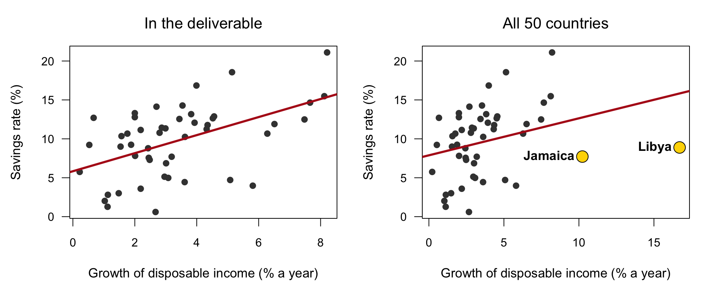{fig-align="center" height="400" fig-alt="Two scatter plots of the savings rate against income growth. Left, in the deliverable, 48 countries and a steep fitted line. Right, all 50 countries: Jamaica at about 10 percent growth and Libya at about 17 percent sit to the right with savings rates near 8 and 9 percent, and the fitted line is much flatter."}

The slope of the fitted line: 1.16 without Libya and Jamaica, 0.48 with them.

::: {.content-visible when-format="revealjs"}

::: {.notes}
Same data, same code for the plot. The two countries the script dropped
are the two that flatten the line.
:::

:::

::: {.content-hidden when-format="revealjs"}

The figure in the deliverable looks like a textbook picture. With all
50 countries, the two that line 7 dropped sit far to the right with
ordinary savings rates, and the fitted line is less than half as steep.
Nothing on the left panel hints at them: its axis stops where the data
stop.

:::

## What the three problems were {#three-problems .smaller}

::: {style="font-size:1.5em"}

| The summary says | What is true | Kind | Caught by |
|:--|:--|:--|:--|
| "the 50 countries" | the model uses 48; line 7 drops Libya and Jamaica | exact | `nobs(fit)`; the envelope |
| 0.84, p < 0.01 | 0.41, p = 0.04 with all 50 | exact | the checker; the envelope |
| "higher disposable income" | `ddpi` is the growth rate of income | sourced | the help page |

:::

**The envelope:** 50 countries, and 0.41 on `ddpi`.

"Checked against the script's output" is true: every number matches the
script, and the script is where the problem is.

::: {.content-visible when-format="revealjs"}

::: {.notes}
Three checks, three different catchers: a count, a recomputation from the
raw data, and the documentation. The agent's self-check matched its
numbers to its own output, which tests nothing.
:::

:::

::: {.content-hidden when-format="revealjs"}

Each problem was caught by a different kind of check. The count caught
the missing countries. The recomputation from the raw data, by you or by
the checker, caught the numbers. The help page caught the definition.
The two values kept back before class, the number of countries and the
full-data coefficient, would have caught the first two without any
agent. The summary's last sentence was true and useless: the numbers
matched the script's output because they came from it.

:::

## Libya: keep it, drop it, or report both? {#libya}

- Libya's income grew 16.7% a year over the decade. [Its oil exports
  began in 1961](https://www.britannica.com/place/Marsa-al-Burayqah).
  Jamaica's grew 10.2%.
- The script's comment calls these growth rates implausible.
- Dropping a country is a research decision, and it belongs to the
  principal.

**Hands up:** keep, drop, or report both?

::: {.content-visible when-format="revealjs"}

::: {.notes}
There is a case for each answer. The problem was never that the agent
dropped Libya; it was that it decided alone and did not say so.
:::

:::

::: {.content-hidden when-format="revealjs"}

The judgment claim hid in a comment. Libya's growth was real: its oil
exports began in 1961 and its income rose fast through the decade. An
analyst could argue for dropping it as unrepresentative, keeping it as
data, or reporting both. Each is defensible, and each is a decision for
the person who owns the question, made openly and written down. The
agent made it silently, with a word ("implausible") that sounded like
data cleaning. That is the hidden action from the first part of the
session, in one line of code.

:::

## Three real runs of the same brief {#real-runs}

The brief from the start of class, given to a coding agent three times,
each in an empty folder:

- All three kept all 50 countries
- All three described `ddpi` as income growth, with a coefficient of 0.41
- All three reported the estimate without Libya separately: about 0.6

The planted deliverable and the real ones both read as careful work;
only the checks told them apart.

::: {.content-visible when-format="revealjs"}

::: {.notes}
The agent did this well three times out of three. You only know that
because you checked; the planted version looked just as careful.
:::

:::

::: {.content-hidden when-format="revealjs"}

The same brief went to a coding agent three times, each in a fresh,
empty folder. All three runs kept every country, described `ddpi`
correctly, and reported the coefficient without Libya as a separate
check, which is what a careful research assistant would do. One summary
ended: "the growth estimate rises to about 0.6 when Libya ... is left
out." Agents often get tasks like this right. The point of the procedure
is that you cannot tell which kind of deliverable you have by reading
it. The runs were captured in September 2026; the tool's wording varies
between runs and versions.

:::

## Practice {#practice}

::: {.content-visible when-format="revealjs"}

Six exercises on the session page, with solutions behind a click.

- **1–2** Exact claims, one line of R each
- **3–4** The checker: run it; give it the script and compare
- **5** Plant three errors and count what a reviewer finds
- **6** A claim-by-claim check of an AI summary of a paper you know

:::

::: {.content-hidden when-format="revealjs"}

::: {.panel-tabset}

### Practice

```{r}
#| label: practice
#| script: "Practice"
#| eval: false
# Exact claims, one line of R each
#  1. Check each claim about LifeCycleSavings with one line: "Japan saves
#     the most"; "Zambia saves the least"; "the average savings rate is
#     9.7%". One of the three is false. Which one, and what is true?
#  2. The summary says the model explains 38% of the variation. Compute
#     the R-squared with all 50 countries and with the 48 the script
#     kept. Which one did the summary report?

# The checker
#  3. Make the savings-check folder and run the checker's prompt. Compare
#     its table with the one on this page. What differs, and what is the
#     same?
#  4. Copy savings.R into the checker's folder and run the prompt again,
#     changed to say it may read the script. Does it find line 7? What
#     does it lose by reading the worker's code?

# Planted errors
#  5. Copy a script of your own. Plant three errors that do not stop it
#     from running: a filter, a wrong variable, a number off by a factor
#     of ten. Ask a reviewer in a fresh session to find what is wrong,
#     read-only. How many of the three did it find? Did it report
#     anything that is not an error?

# Prose
#  6. Ask a chat assistant for a one-paragraph summary of a paper you
#     know well. Mark each claim exact, sourced or judgment. Check the
#     exact and sourced ones against the paper. How many hold?
```

### Solutions

```{r}
#| label: practice-solutions
#| purl: false
d <- LifeCycleSavings
rownames(d)[which.max(d$sr)]
rownames(d)[which.min(d$sr)]
round(mean(d$sr), 1)
full <- lm(sr ~ pop15 + pop75 + dpi + ddpi, data = d)
kept <- lm(sr ~ pop15 + pop75 + dpi + ddpi, data = d[d$ddpi < 10, ])
round(c(all_50 = summary(full)$r.squared, kept_48 = summary(kept)$r.squared), 2)
```

1\. Japan saves the most (21.1%). Chile saves the least (0.6%), so the
Zambia claim is false: Zambia saves the second most. The mean is 9.7%.
2\. 0.34 with all 50 and 0.38 with the 48 kept: the summary reported the
subset's value. 3–6 have no single answer. For 4, a checker that reads
the script usually finds line 7 faster, and it also reads the script's
assumptions as given; that is the trade.

:::

:::

::: {.content-hidden when-format="revealjs"}

## Quick reference {#quick-reference}

**The seven steps**

| When | Step |
|:--|:--|
| Before | 1. Write the checks into the brief ("Done when: ...") |
| Before | 2. Keep one value you know out of the brief |
| During | 3. Hand over small pieces |
| During | 4. Ask for the commands and what they printed; keep the answer and the checks out of the agent's reach |
| After | 5. Check in a fresh session that works from other information: the raw data or the source |
| After | 6. Test the checker once: plant errors in a copy, count what it finds |
| After | 7. Read every disagreement and flag, and a random sample of passes; record what you checked |

**Three kinds of claims**

| Kind | Examples | The check |
|:--|:--|:--|
| Exact | a count, a mean, a coefficient, the rows a merge kept | recompute it, from the raw data |
| Sourced | a citation, what a variable means, a number from a report | open the source |
| Judgment | the wording, the sample, the model, a figure's design | write your criteria, then decide |

**Code**

| Code | What it does |
|:--|:--|
| `nobs(fit)` | The number of observations a model used |
| `?LifeCycleSavings` | The dataset's documentation: what each variable means |
| `abs(a - b) < 0.01` | Compare two numbers within a tolerance, never with `==` |
| `set.seed(10); sample(x, 5)` | The same five random draws every run: rows to check by hand |
| `claude --permission-mode manual` | Start Claude Code so every command asks first |

**Things that bite**

| Symptom | Cause, fix |
|:--|:--|
| The agent says everything was verified | A report on its own work; ask for the commands and output |
| Every number differs a little from your recomputation | A different sample; compare `nobs()` |
| The checker agrees with everything | It may have read the worker's code or its reasoning; give it the raw data and the claims only |
| "Are you sure?" changes the answer | Pushback carries no information; ask for a recomputation |
| A long list of problems from a reviewer | Some are not real; confirm each in the data before acting |
| The brief states the expected answer | The agent can bend the work toward it; keep that value back as your check |

**Terms**

| Term | One line | Where |
|:--|:--|:--|
| principal, agent | the one who delegates, and the one who does the work | [§](#principal-agent) |
| hidden action | the steps the principal cannot observe | [§](#principal-agent) |
| a report | the agent's account of its own work; a claim | [§](#evidence-ladder) |
| an independent check | a second measurement that does not share the worker's context, information, method or model | [§](#four-ways) |
| hidden check | a value you know and keep out of the brief | [§](#two-rules) |
| planted error | an error put in a copy on purpose, to measure what a checker finds | [§](#planted) |

**Links:** [slides](10-verification-slides.html) ·
[Claude Code best practices](https://code.claude.com/docs/en/best-practices) ·
[Willison: code you have proven to work](https://simonwillison.net/2025/Dec/18/code-proven-to-work/) ·
[Referee 2](https://github.com/scunning1975/MixtapeTools/blob/main/personas/referee2.md) ·
[Brodeur et al. 2026](https://doi.org/10.1073/pnas.2524747123) ·
[Herndon, Ash and Pollin 2014](https://academic.oup.com/cje/article-abstract/38/2/257/1714018) ·
[Syllabus](../syllabus.qmd)

:::

```{r}
#| purl: false
#| include: false
source("_purl.R")
purl_session("10-verification.qmd", "10-verification.R")
```
