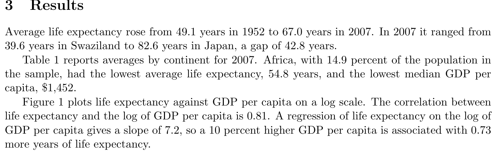
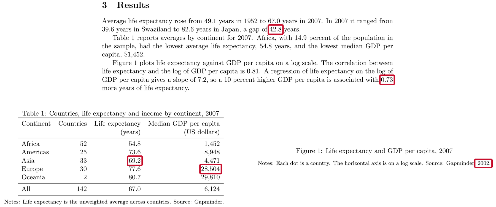

::: {.content-hidden when-format="revealjs"}

[Slides](11-reproducible-project-slides.html) · [Source](https://github.com/ArielOrtizBobea/aem6850/blob/main/fall-2026/sessions/11-reproducible-project.qmd)

How the numbers in a paper stay tied to the code that computed them,
how to check a draft for numbers that no longer match, and what a
replication package needs before you share it. The examples use a
two-page draft paper and its code:
[download the project](data/income-life-draft.zip) (a zip file).

:::

::: {.content-hidden when-format="revealjs"}

::: {#before-class .callout-important title="Before class: install three packages and render a test document"}

Ten minutes, once, on the laptop you bring. In RStudio's **Console**:

```r
install.packages(c("rmarkdown", "gapminder", "renv"))
```

If R asks whether to use a personal library, answer Yes; if it asks
about installing from sources, answer No.

Then **File → New File → Quarto Document…** and click **Create**.
RStudio opens a document with some sample text. Save it anywhere as
`test.qmd` and click **Render** above the editor. If RStudio offers to
install or update packages first, accept. A page with the sample text
opens in the Viewer pane or in your browser: Quarto works on your
laptop, and the exercise in class will too.

:::

:::

## Objectives {#objectives .smaller}

By the end of this session you can:

- Write a Quarto document whose numbers come from inline R code, and
  render it.
- For a paper written in LaTeX, have R write each table to a `.tex`
  file and each quoted number to a file of macros.
- Ask a coding agent to check every number in a draft against the code
  and the data, and read its report.
- Save tables and figures in the forms journals ask for.
- Write a README with the sections journals ask for: where the data
  come from, what to install, how to run the code, and which script
  makes each table and figure.
- Record package versions with `renv::init()` and reinstall them with
  `renv::restore()`.
- Decide when to make a repository public, and archive a release with a
  DOI.

## Plan for today {#plan}

1. Numbers in a paper, and where they come from
2. Code that writes the numbers: Quarto, and LaTeX
3. Checking a draft with an agent
4. Tables and figures for a journal
5. The replication package
6. Sharing code, and a DOI that lasts

## Numbers in a paper come from code {#numbers-from-code}

{fig-align="center" width="95%" fig-alt="The Results section of a two-page draft paper: average life expectancy rose from 49.1 years in 1952 to 67.0 years in 2007; in 2007 it ranged from 39.6 years in Swaziland to 82.6 years in Japan, a gap of 42.8 years; Africa had 14.9 percent of the population, an average life expectancy of 54.8 years and a median GDP per capita of 1,452 dollars; the correlation is 0.81, the slope 7.2, and a 10 percent higher GDP per capita goes with 0.73 more years."}

- Every number in this paragraph was copied from R's Console by hand.
- The code has changed since the copying. Which numbers are still
  right?

::: {.content-visible when-format="revealjs"}

::: {.notes}
Hands up: who has copied a number from the Console into a paper, a
slide or an email? Keep the hands up if you went back to check it after
the data changed. The copy does not know the code changed. Nobody
answers the question on the slide by reading it; we answer it at the
end of part three, with an agent.
:::

:::

::: {.content-hidden when-format="revealjs"}

A paper quotes numbers that code computed: counts, means, slopes,
shares. When you type them by hand, the link between each number and
the line that made it exists only in your memory. Then the data change,
a sample restriction moves, or a co-author fixes a bug. The code prints
new numbers; the paper keeps the old ones. The paragraph above comes
from a two-page draft whose code changed after the numbers were typed.
Some were updated by hand and some were not; part three finds which.

:::

## What journals check {#journals-check}

- AEA journals ask for the data and code before they accept a paper.
  The AEA Data Editor's team runs the package and compares its output
  with the paper.
- In one year of the Data Editor's reports, 20 of 382 papers passed
  with no changes requested; 285 passed after small changes, and 77
  were sent back for another round.
- The problems the reports name most often: unclear data sources,
  missing package versions, and manual steps, such as tables copied
  into the paper by hand.

::: {.content-visible when-format="revealjs"}

::: {.notes}
The policy page and the reports are linked on the session page. The
second bullet is the one to dwell on: a plain pass is rare, and the
fixes are the kind this session is about.
:::

:::

::: {.content-hidden when-format="revealjs"}

The [AEA Data and Code Availability
Policy](https://www.aeaweb.org/journals/data/data-code-policy) requires
that, before acceptance, authors provide "the data, code, and other
details of the computations sufficient to permit replication", and it
states that the AEA Data Editor "will assess compliance with this
policy, including by conducting reproducibility checks". The counts in
the second bullet cover December 2024 to November 2025, from the Data
Editor's report in the *AEA Papers and Proceedings* ([Vilhuber
2026](https://doi.org/10.1257/pandp.116.890), Table 2). The list of common problems is the one the reports repeat
year after year; the [report for December 2022 to November
2023](https://doi.org/10.1257/pandp.114.878) notes that "many authors
still manually save figures and copy tables".

Studies that go back to already published papers report lower rates.
When the Data Editor's team tried to reproduce 152 packages from *AEJ:
Applied Economics*, 68 reproduced fully and 66 partly ([Herbert, Kingi, Stanchi
and Vilhuber 2024](https://doi.org/10.1111/caje.12728)). An earlier
study of 67 papers in 13 economics journals reproduced the key result
of 22 of them without help from the authors ([Chang and Li
2022](https://doi.org/10.1561/104.00000053)).

:::

## Two ways to have the code write the numbers {#two-ways}

- **Quarto.** The text and the code sit in one `.qmd` file. Rendering
  runs the code and puts each number into the text. The output is a web
  page, a PDF or a Word file.
- **LaTeX with generated files.** The paper stays a `.tex` file. The
  code writes each table to its own `.tex` file and each quoted number
  to a file of macros. The paper reads those files.
- Either way, a number exists in one place: the code. Change the code,
  run it again, and the paper follows.

::: {.content-visible when-format="revealjs"}

::: {.notes}
Most of you will write papers in LaTeX, often in Overleaf; the second
route keeps that. Quarto suits reports, appendices, a project page, and
anyone who writes in Word: it renders to a Word file too.
:::

:::

::: {.content-hidden when-format="revealjs"}

Pick one route per paper. Quarto fits reports, online appendices,
project pages, and co-authors who work in Word, because the same
document renders to a web page, a PDF or a `.docx` file. LaTeX with
generated files fits a paper you already write in LaTeX: nothing about
the paper changes except that its numbers and tables arrive as files.
If you write in Overleaf, copy the regenerated files into the Overleaf
project after each run.

Gentzkow and Shapiro's guide to code and data puts the principle as two
rules: automate everything that can be automated, and write a single
script that runs all the code from beginning to end ([Gentzkow and
Shapiro 2014](https://web.stanford.edu/~gentzkow/research/CodeAndData.pdf),
chapter 2). A number typed into the paper is a step nobody automated.

:::

## A Quarto document {#quarto-document}

````markdown
---
title: "Life expectancy"
format: html
---

```{r}
#| echo: false
library(gapminder)
yr <- 2007
d <- gapminder[gapminder$year == yr, ]
low <- d[which.min(d$lifeExp), ]
```

In `r yr`, life expectancy was lowest in `r low$country`,
at `r round(low$lifeExp, 1)` years.
````

Rendered: In 2007, life expectancy was lowest in Swaziland, at 39.6
years.

::: {.content-visible when-format="revealjs"}

::: {.notes}
Three parts, top to bottom: the header between the two lines of
dashes; a chunk of R, fenced like code; and text, with R inside it in
backticks. The chunk runs first; the text uses what it made.
:::

:::

::: {.content-hidden when-format="revealjs"}

A `.qmd` file has three parts. The header, between the two `---`
lines, sets the title and the output format. A code chunk, fenced by
three backticks and `{r}`, holds R code; `#| echo: false` hides the
code in the output and keeps its results. The text is ordinary prose,
and R can appear inside it between single backticks that start with
`r`. When you render, Quarto runs every chunk from the top in a fresh R
session, replaces each piece of inline code with its value, and writes
the output file.

:::

## Inline R code {#inline-code}

- `` `r expression` `` inside a sentence: when you render, R runs it
  and its value replaces it.
- Compute the value in a chunk, print it inline. Short inline code is
  easy to read and easy to check.
- Round and format in the code, once:

| Code | Prints |
|:--|:--|
| `round(67.00742, 1)` | `67` |
| `sprintf("%.1f", 67.00742)` | `67.0` |
| `format(6124, big.mark = ",")` | `6,124` |

::: {.content-visible when-format="revealjs"}

::: {.notes}
The first row catches everyone once: round keeps one decimal, and then
printing drops the trailing zero. A paper that says 67.0 in the table
and 67 in the text looks careless; sprintf fixes the decimals for
both.
:::

:::

::: {.content-hidden when-format="revealjs"}

`round()` keeps one decimal, and printing then drops a trailing zero,
so a mean of 67.007 prints as `67`. `sprintf("%.1f", x)` returns text
with exactly one decimal, `67.0`. `format(x, big.mark = ",")` adds the
thousands separator; round first, or it prints every decimal
(`format(6124.371, big.mark = ",")` gives `6,124.371`). Quarto also
accepts `` `{r} expression` `` for inline code; both forms run the same
way.

:::

## Tables, figures and cross-references {#cross-references}

````markdown
```{r}
#| label: tbl-continents
#| tbl-cap: "Countries and life expectancy by continent, 2007"
knitr::kable(table1)
```

```{r}
#| label: fig-scatter
#| fig-cap: "Life expectancy and GDP per capita, 2007"
plot(d$gdpPercap, d$lifeExp, log = "x")
```

@tbl-continents reports averages by continent. @fig-scatter plots
life expectancy against income.
````

- A label that starts with `tbl-` or `fig-` numbers the table or figure.
- `@tbl-continents` in the text becomes "Table 1", with a link. Move the
  table and the number follows.

::: {.content-hidden when-format="revealjs"}

`knitr::kable()` turns a data frame into a table in whatever format the
document renders to. The `label` and the caption option go on the lines
starting with `#|` at the top of the chunk. The label must start with
`tbl-` for a table and `fig-` for a figure; Quarto then numbers them in
order and replaces each `@label` in the text with "Table 1", "Figure 2"
and so on, linked to the table or figure.

:::

## Render {#render}

- In RStudio: the **Render** button above the editor. In the Terminal:
  `quarto render paper.qmd`.
- `format:` in the header picks the output: `html`, `pdf` or `docx`. A
  PDF needs LaTeX; install it once with `quarto install tinytex` in the
  Terminal.
- Rendering starts a new R session. The document must load its own
  packages and read its own data: objects in your Console do not exist
  there.

::: {.content-visible when-format="revealjs"}

::: {.notes}
The third bullet is the reproducibility test hiding inside Quarto. If
the document renders, it ran from a clean start. "It works in my
Console" and "it renders" are different claims.
:::

:::

## Exercise 1 {#exercise-1}

::: {.panel-tabset}

### Exercise

:::: {.columns}

::: {.column width="48%"}

```r
# Exercise 1 (5 minutes). RStudio.
#
# 1. File > New File > Text File.
#    Paste the text on the right.
#    Save As... exercise.qmd
#
# 2. Replace each ___ with inline
#    R code, `r ...`: yr,
#    low$country, and low$lifeExp
#    rounded to one decimal.
#
# 3. Render. Read the sentence.
#
# 4. Change 2007 to 2002 in the
#    chunk. Render again.
#
# Two answers to compare with the
# room: the country and the number
# for 2007, and for 2002.
```

:::

::: {.column width="52%"}

````markdown
---
title: "Exercise"
format: html
---

```{r}
#| echo: false
library(gapminder)
yr <- 2007
d <- gapminder[gapminder$year == yr, ]
low <- d[which.min(d$lifeExp), ]
```

In ___, life expectancy was lowest
in ___, at ___ years.
````

:::

::::

### Solution

```markdown
In `r yr`, life expectancy was lowest in `r low$country`, at
`r round(low$lifeExp, 1)` years.
```

::: {.content-visible when-format="revealjs"}

**2007**: Swaziland, at 39.6 years. **2002**: Zambia, at 39.2 years.

:::

::: {.content-hidden when-format="revealjs"}

For 2007 the sentence reads "In 2007, life expectancy was lowest in
Swaziland, at 39.6 years." After changing one number in the chunk, it
reads "In 2002, life expectancy was lowest in Zambia, at 39.2 years."
Nothing in the sentence was typed: the year, the country and the number
all followed the code.

:::

::: {.content-visible when-format="revealjs"}

::: {.notes}
Debrief (1 min). The country changed too, and nobody touched the
sentence.

When it fails, say:

- `there is no package called 'gapminder'`: the Before class line;
  `install.packages("gapminder")` in the Console, then Render.
- No Render button: the file was saved as `exercise.qmd.txt` or not
  saved; Save As again with the `.qmd` ending.
- The sentence shows `r yr` literally: the backticks are missing, or
  the `r` has a space before it.
- `object 'yr' not found`: the inline code sits above the chunk, or
  the chunk's first line lost its `{r}`.
:::

:::

:::

## A paper written in LaTeX {#latex-paper}

R writes `output/numbers.tex`:

```latex
\newcommand{\nCountries}{142}
\newcommand{\lifeExpStart}{49.1}
\newcommand{\lifeExpEnd}{67.0}
\newcommand{\lifeExpGap}{43.0}
```

The paper reads it once, in the preamble, and uses the macros:

```latex
\input{../output/numbers.tex}
...
Average life expectancy rose from \lifeExpStart{} years in 1952
to \lifeExpEnd{} years in 2007.
```

::: {.content-hidden when-format="revealjs"}

Each `\newcommand` line defines a macro that prints one number. The
paper loads the file with `\input` and writes the macro where the
number goes; the `{}` after the macro name keeps LaTeX from eating the
space that follows. When the code runs again, the file changes and the
next compile prints the new numbers. Paths in `\input` are relative to
the `.tex` file, so `../output/` reaches the output folder from
`paper/`.

The AEA Data Editor's own annual report is written this way: an R
script, `programs/99_write_nums.R`, writes every number the text quotes
to `tables/latexnums.tex` as `\newcommand` lines, and the report's
sections use the macros ([the report's
source](https://github.com/AEADataEditor/report-aea-data-editor-2022)).

:::

## Writing the numbers file from R {#numbers-file}

```r
# code/03_numbers.R: every number the text quotes
d <- read.csv("data/gapminder.csv")
d07 <- d[d$year == 2007, ]

numbers <- c(
  nCountries   = length(unique(d$country)),
  lifeExpStart = sprintf("%.1f", mean(d$lifeExp[d$year == 1952])),
  lifeExpEnd   = sprintf("%.1f", mean(d07$lifeExp)),
  lifeExpGap   = sprintf("%.1f", max(d07$lifeExp) - min(d07$lifeExp))
)

writeLines(sprintf("\\newcommand{\\%s}{%s}", names(numbers), numbers),
           "output/numbers.tex")
```

- One named line per number; the decimals are set here, once.
- Macro names take letters only: `\lifeExpEnd` works, `\lifeExp2007`
  does not.

::: {.content-hidden when-format="revealjs"}

`sprintf()` builds each line: `%s` is replaced by the name, then by the
value. In R's strings a backslash is written twice, so `"\\newcommand"`
prints as `\newcommand`. The script belongs in the main script's list
of steps like any other: it runs every time the analysis runs.

:::

## Writing a table file from R {#table-file}

```r
tex <- knitr::kable(table1, format = "latex", booktabs = TRUE,
                    format.args = list(big.mark = ","))
writeLines(tex, "output/table1.tex")
```

```latex
\begin{tabular}{lrrr}
\toprule
Continent & Countries & Life expectancy & Median GDP per capita\\
\midrule
Africa & 52 & 54.8 & 1,452\\
...
\bottomrule
\end{tabular}
```

- In the paper, `\input{../output/table1.tex}` sits inside the `table`
  environment. The caption and the notes stay in the paper.

::: {.content-hidden when-format="revealjs"}

`booktabs = TRUE` draws the three horizontal rules journals use and no
vertical lines; the paper needs `\usepackage{booktabs}` in its
preamble. The paper keeps everything a reader sees around the table
(the caption, the label for `\ref`, the notes), and the code supplies
the rows:

```latex
\begin{table}[ht]
\centering
\caption{Countries, life expectancy and income by continent, 2007}
\label{tab:continents}
\input{../output/table1.tex}
\end{table}
```

:::

## The draft and its code {#draft-project}

:::: {.columns}

::: {.column width="55%"}

```
income-life-draft/
├── README.md
├── income-life-draft.Rproj
├── data/
│   └── gapminder.csv
├── code/
│   ├── run_everything.R
│   ├── 01_table1.R
│   └── 02_figure1.R
├── output/
│   ├── table1.csv
│   └── figure1.pdf
└── paper/
    ├── draft.tex
    └── draft.pdf
```

:::

::: {.column width="45%"}

- A two-page draft: abstract, three short sections, Table 1, Figure 1.
- Two scripts write Table 1 and Figure 1.
- Every number in the paper, the table included, was typed by hand.

:::

::::

::: {.content-hidden when-format="revealjs"}

[Download the project](data/income-life-draft.zip) and unzip it into
the folder where you keep your projects. The code is organized the way
a project should be: a main script, one script per output, relative
paths. The paper is the weak part: `draft.tex` types every number, and
the code changed after the typing. The data are the Gapminder excerpt
from the `gapminder` package: 142 countries, every fifth year from 1952
to 2007.

:::

## The prompt {#sweep-prompt}

```{.markdown filename="Prompt to paste into Claude Code (captured run)"}
Read paper/draft.pdf. Check every number in it that reports a result:
in the text, in Table 1, and in the notes under the table and the
figure. For each number, find the script in code/ that computes it. If
no script computes it, compute it from data/gapminder.csv with R. Then
list only the numbers that disagree with the code or the data: the
number as printed, where it appears, and the value you get. End with how
many numbers you checked. Do not change any file.
```

- Where to look, and which numbers count.
- Where the right answer lives: the scripts first, then the data.
- What to report: only the disagreements, and a count.
- What not to do: no edits, so the fixes stay with you.

::: {.content-visible when-format="revealjs"}

::: {.notes}
Live. Before class: unzip the project into ~/github, open a Terminal
there, run claude once and trust the folder. In class: Terminal, cd
~/github/income-life-draft, claude, paste the prompt. Two boxes ask to
run a command: read each, 1. Yes. The captured run took 37 seconds. If
it stalls, the next two slides are the captured run.
:::

:::

::: {.content-hidden when-format="revealjs"}

The prompt has the four parts of any task you hand an agent: where to
look and what counts, where the right answer lives, what to report, and
what not to do. "Only the disagreements, and a count" keeps the report
short enough to read while still proving the agent looked at
everything. "Do not change any file" keeps the fixes with you: an agent
that edits the paper to match its own numbers has removed the evidence
you need to check it.

Open a Terminal in the project folder (in RStudio: open
`income-life-draft.Rproj`, then **Tools → Terminal → New Terminal**),
type `claude`, and paste the prompt. The agent asks before it runs a
command; read each command, then choose `1. Yes`.

:::

## What the agent did {#sweep-run}

- Listed the project's files and extracted the text of the PDF.
- Read the three scripts, `output/table1.csv` and `paper/draft.tex`.
- Ran one R command that computed every quantity in the paper from the
  data.
- Wrote the report. In the captured run: 37 seconds, and two boxes
  asking to run a command.

::: {.content-hidden when-format="revealjs"}

::: {.callout-tip collapse="true"}
## The captured transcript

````{.default}
⏺ Bash(find . -type f | grep -v '/\.' | head -50 && pdftotext -layout paper/draft.pdf -)
⏺ Glob(**/*)
⏺ Read(paper/draft.pdf)
⏺ Read(code/01_table1.R)
⏺ Read(code/02_figure1.R)
⏺ Read(code/run_everything.R)
⏺ Read(output/table1.csv)
⏺ Read(paper/draft.tex)
⏺ Now I'll compute everything from the data in R, without writing any files.
⏺ Bash(Rscript -e '
    d0 <- read.csv("data/gapminder.csv"); str(d0)
    cat("countries", length(unique(d0$country)), " years", sort(unique(d0$year)), "\n")
    m <- tapply(d0$lifeExp, d0$year, mean); print(round(m,2))
    d <- d0[d0$year==2007,]; cat("n2007", nrow(d), "\n")
    print(d[which.min(d$lifeExp),c("country","lifeExp")]); print(d[which.max(d$lifeExp),c("country","lifeExp")])
    cat("gap", max(d$lifeExp)-min(d$lifeExp), "\n")
    print(round(tapply(d$lifeExp,d$continent,mean),2)); print(round(tapply(d$gdpPercap,d$continent,median),1))
    cat("all mean", mean(d$lifeExp), " median gdp", median(d$gdpPercap), "\n")
    p <- tapply(as.numeric(d$pop), d$continent, sum); print(round(100*p/sum(p),2))
    cat("cor", cor(d$lifeExp, log(d$gdpPercap)), "\n")
    f <- lm(lifeExp ~ log(gdpPercap), d); b <- coef(f)[2]; cat("slope", b, " x log(1.1)", b*log(1.1), " x0.1", b*0.1, "\n")
    ')
  ⎿ ...
    gap 42.99
    Africa Americas Asia Europe Oceania
     54.81    73.61 70.73  77.65   80.72
    Africa Americas Asia Europe Oceania
    1452.3   8948.1 4471.1 28054.1 29810.2
    all mean 67.00742  median gdp 6124.371
    Africa Americas Asia Europe Oceania
     14.87    14.38 60.98   9.38    0.39
    cor 0.8089803
    slope 7.202802  x log(1.1) 0.6865003  x0.1 0.7202802
⏺ Reply: the report on the next slide.
````

The R command is shortened here to the lines that produced the
report; the full run also printed the number of rows per country and
a regression on base-10 logs.

:::

:::

## The agent's report {#sweep-report}

| As printed | Where | What the code or data give |
|:--|:--|:--|
| 0.73 more years per 10% | Abstract | 0.69 (7.203 × log 1.1); 0.72 if taken as 7.203 × 0.1 |
| 42.8 years | Results, first paragraph | 43.0 (82.603 − 39.613) |
| 69.2 (Asia) | Table 1 | 70.7, from `01_table1.R` and `table1.csv` |
| 28,504 (Europe) | Table 1 | 28,054: two digits swapped |
| 0.73 | Results, third paragraph | the same as the abstract |
| Gapminder, 2002 | Note under Figure 1 | 2007: the figure plots 2007 |

- 35 numbers checked; 6 disagree, five distinct errors.
- It added: no script computes any number in the text or the "All"
  row of Table 1; it computed those from the data.

::: {.content-visible when-format="revealjs"}

::: {.notes}
Read the count first: 35 checked, 6 flagged. Then the last bullet,
which is the finding that matters most: no script behind any number in
the text. The next slide shows where the five errors sit.
:::

:::

::: {.content-hidden when-format="revealjs"}

The report is the agent's, reworded into three columns; its full text
said "I found 6 numbers that disagree with the code or the data. There
are 5 distinct errors, and one of them is printed twice," and ended with
the list of the 35 numbers it checked, section by section.

How the errors got there: the first version of the draft used the 2002
data. The code then moved to 2007, and the numbers were updated by
hand. The range's endpoints were updated and the gap between them was
not; the slope was updated and the 10 percent effect was not; one table
row was missed; one number was typed with two digits swapped; and the
figure note kept the old year.

:::

## The five errors on the draft {#sweep-marked}

{fig-align="center" width="100%" fig-alt="The Results paragraph, Table 1 and the note under Figure 1 of the draft, with five numbers boxed in red: the gap of 42.8 years, the 0.73 more years, Asia's 69.2 and Europe's 28,504 in Table 1, and the year 2002 in the figure note."}

::: {.content-visible when-format="revealjs"}

::: {.notes}
The reveal: the draft was first written with the 2002 data, then the
code moved to 2007. The endpoints of the range were updated by hand,
the gap was not; the slope was updated, the 10 percent effect was not;
one table row was missed; one number was mistyped; the figure note kept
the old year. Ask the room which of the five a referee would find
first.
:::

:::

## Reading the report {#sweep-reading}

- Check each flag yourself before you edit: one line of R each.
- 0.73 has two candidate replacements. 7.2 × 0.1 = 0.72 is the usual
  shortcut; 7.2 × log(1.1) = 0.69 is exact. Pick one, and say which in
  the paper.
- It cannot check what it cannot see: numbers read off a figure,
  numbers quoted from other papers.
- It checks what you asked about, and it can still be wrong. The
  report is a list to verify.
- The lasting fix is the numbers file: then every number has a script,
  and the next sweep has nothing to find.

::: {.content-visible when-format="revealjs"}

::: {.notes}
Two minutes. The 0.72-versus-0.69 row is the useful one: the agent
found a choice the author never made explicitly, and only the author
can make it.
:::

:::

::: {.content-hidden when-format="revealjs"}

The AEA's replicators do this same check by hand. Their report template
asks them to map every table, figure and number in the text to the
program and line that produce it, and to flag numbers in the text that
the code does not identify ([the replication report
template](https://github.com/AEADataEditor/replication-template/blob/master/REPLICATION.md)).
The template README has a box for it too: the author ticks it to state
that the code reproduces all numbers given in the text. An agent sweep
before submission does the replicator's check first, on your schedule.

:::

## Tables for a journal {#journal-tables}

- Text written by the code, never an image: the journal typesets the
  table from your LaTeX or Word file.
- Horizontal rules and white space only: no vertical lines, no shading.
- At most nine columns; split a long table into Panel A and Panel B.
- Full words in the column headings, units included; a zero before the
  decimal point, 0.357.
- AEA journals: no significance stars; standard errors in parentheses.
- Notes below the table: the sample, the definitions, and the source
  last.

::: {.content-hidden when-format="revealjs"}

These are the table rules in the [AER style
guide](https://www.aeaweb.org/journals/aer/style-guide), which the
other AEA journals repeat word for word, and the AEA asks for the LaTeX
or Word source of the paper along with the PDF. Other publishers differ
in detail; check the journal's own guide before you submit. `knitr::kable(format
= "latex", booktabs = TRUE)` already follows the rules on lines.

:::

## Figures for a journal {#journal-figures}

- Charts as vector files, PDF or EPS. Photographs, maps made from images
  and screenshots at 300 dpi.
- Saved at the size it will print, so the text size is the real one:
  at least 7 points at that size.
- `cairo_pdf()` embeds its fonts, as publishers ask; `pdf()` does not.
- The title goes in the caption, below the figure, in the paper; leave
  it out of the image.
- One file per panel, lettered: `Figure1a.pdf`, `Figure1b.pdf`.

```r
cairo_pdf("output/figure1.pdf", width = 6.5, height = 4, pointsize = 10)
```

::: {.content-hidden when-format="revealjs"}

The formats, the 300 dpi and the one-file-per-panel rule are from the
[AER style guide](https://www.aeaweb.org/journals/aer/style-guide);
captions go below figures and above tables in the AEA's LaTeX template.
The AEA pages set no font size or width. [Elsevier's sizing
guidance](https://www.elsevier.com/about/policies-and-standards/author/artwork-and-media-instructions/artwork-sizing)
gives 7 points at the final size as its rule of thumb, and widths of
90 mm (about 3.5 inches) for one column and 190 mm (about 7.5 inches)
for two. A vector file stays sharp at any zoom; a PNG is a grid of
pixels and blurs. Base R's `pdf()` writes vector files but refers to
Helvetica without embedding it; `cairo_pdf()` embeds a copy of each
font it uses, which is what production systems expect. Choose colours
that a colour-blind reader can tell apart, or add shapes and line types
so the figure works without colour.

:::

## What a replication package contains {#package}

:::: {.columns}

::: {.column width="50%"}

```
income-life/
├── README.pdf
├── income-life.Rproj
├── renv.lock
├── data/
│   └── gapminder.csv
├── code/
│   ├── run_everything.R
│   ├── 01_table1.R
│   ├── 02_figure1.R
│   └── 03_numbers.R
├── output/
│   ├── table1.tex
│   ├── figure1.pdf
│   └── numbers.tex
└── paper/
    └── paper.tex
```

:::

::: {.column width="50%"}

- A README at the top. The AEA asks for it as a PDF.
- The data, or the instructions to get them.
- The code, with one script that runs everything in order.
- Every table and figure in the paper, written by the code.
- The software: the R version and every package, in `renv.lock`.

:::

::::

::: {.content-hidden when-format="revealjs"}

This is the draft project after the fixes: a script that writes the
numbers file, a table written as `.tex`, a paper that reads both, a
lockfile, and a README. The AEA policy asks for "a README document in
PDF format in the uppermost directory of the replication package"; the
Data Editor's guidance also accepts a text file. Write it in Markdown
and render it to PDF when you deposit. The policy strongly encourages a
main script, and the reports keep finding packages without one: a scan
of 8,280 replication packages in about twenty economics journals found
a main script in 2,594 of them ([self-checking
guide](https://larsvilhuber.github.io/self-checking-reproducibility/)).

:::

## The README {#readme .smaller}

| Section | What it says |
|:--|:--|
| Data availability and provenance | Where each dataset comes from, whether you may share it, how to get it |
| Dataset list | Each data file, its source, and whether it is in the package |
| Computational requirements | Software and versions, random seeds, memory, running time |
| Description of programs | What each script does; the license for the code |
| Instructions to replicators | The steps, in order |
| List of tables and programs | Which script makes each table and figure, and the file it writes |
| References | A citation for every dataset |

Start from the [Social Science Data Editors' template
README](https://social-science-data-editors.github.io/template_README/):
the AEA policy says its use "is strongly encouraged".

::: {.content-hidden when-format="revealjs"}

The template is endorsed by the data editors of the AEA journals, the
*Review of Economic Studies*, the *Economic Journal* and the *Canadian
Journal of Economics*, and it opens with a short Overview of what the
package does and how long it runs. Every section has worked examples.
The README is the part of the package a replicator reads first. The
Data Editor's team runs the package on its own ("This happens without
interaction with the authors", in the Data Editor's
[guidance](https://aeadataeditor.github.io/aea-de-guidance/next)), so
whatever the README leaves out, they have to guess.

:::

## The data availability statement {#data-availability}

> The data are the Gapminder excerpt distributed in the R package
> `gapminder` (Bryan 2025, doi:10.32614/CRAN.package.gapminder),
> released under CC0. The underlying data come from the Gapminder
> Foundation (gapminder.org/data) under a CC BY 4.0 license. The file
> `data/gapminder.csv` is the package's `gapminder` data frame written
> with `write.csv()`; it is included in this package.

- Who made the data, and under which license.
- Where your file came from, and what you did to it.
- Whether it is in the package; if not, how to get it.

::: {.content-hidden when-format="revealjs"}

The AEA asks for this statement even when every dataset is in the
package: "This information must be provided even when all data are
included as part of the deposit." It also asks for a citation of every
dataset in the paper's references, in the same form as a citation of a
paper.

:::

## When the data cannot be shared {#restricted-data}

- Common in economics: administrative records, licensed firm data,
  surveys with personal information.
- The package still includes the code, the README and a citation for
  the data.
- The README says who holds the data, how a researcher applies for
  access, how long it takes and what it costs.
- It lists the files and variables the code expects, with their exact
  names, so someone with access can run it.

::: {.content-hidden when-format="revealjs"}

In the AEA Data Editor's report for December 2024 to November 2025,
about 60 percent of the papers reviewed used some data that could not
be shared publicly ([Vilhuber 2026](https://doi.org/10.1257/pandp.116.890)).
Restricted data change what goes in the deposit. The code, the README
and the data citation go in as usual, and the Data Availability and Provenance section explains
access in enough detail that a researcher could apply for the same
data and run the code on it.

:::

## Package versions: renv {#renv}

- `renv::init()`: gives the project its own package library and writes
  `renv.lock`.
- `renv::snapshot()`: after you install or update a package, records
  the change in the lockfile.
- `renv::restore()`: on another computer, installs the versions the
  lockfile names.
- `renv::status()`: says whether the lockfile and the library agree.
- Commit `renv.lock`, `.Rprofile`, `renv/activate.R` and
  `renv/settings.json`. renv writes its own `.gitignore`, which keeps
  the library folder out.

::: {.content-visible when-format="revealjs"}

::: {.notes}
When a co-author opens the project, renv installs itself first, then
offers to run restore. Ten or twenty seconds for a small project.
:::

:::

::: {.content-hidden when-format="revealjs"}

The Data Editor's guidance for R says it directly: "For R packages, we
suggest that users use renv". `renv::init()` scans the project's
scripts and `.qmd` files for the packages they load, installs them into
a library that belongs to the project, and writes the lockfile. It
records only what the code loads: a project whose scripts use base R
alone gets a lockfile that lists renv and nothing else. When
someone else opens the project, the `.Rprofile` file starts renv, which
installs itself if needed and offers to run `renv::restore()`. On a
fresh copy of a small project with a Quarto report (47 packages),
`renv::restore()` took about 12 seconds on the computer that made this
page.

:::

## What the lockfile records {#lockfile}

```json
{
  "R": {
    "Version": "4.6.1",
    "Repositories": [
      {
        "Name": "CRAN",
        "URL": "https://packagemanager.posit.co/cran/latest"
      }
    ]
  },
  "Packages": {
    "gapminder": {
      "Package": "gapminder",
      "Version": "1.0.1",
      "Source": "Repository",
```

- The R version, where the packages came from, and each package's
  version.
- renv records the R version; it does not install it.

::: {.content-hidden when-format="revealjs"}

The versions shown are the ones on the computer that wrote this file;
yours will differ. Each package's entry also repeats its description,
which makes the file long; the lines above are the ones that matter.
renv does not capture the operating system or system libraries either,
and restoring an old lockfile can mean installing old package versions
from source, which needs compilers on a Mac or Windows laptop.

:::

## Run it on a computer where it never ran {#clean-computer}

- Put a fresh copy where the code never ran: a new clone in a new
  folder, a lab computer, a classmate's laptop.
- Follow only the README. Every question you would ask the author is a
  line the README is missing.
- Run the main script from start to end, with no clicks in between.
  Then compare every table, figure and number with the paper.

::: {.content-visible when-format="revealjs"}

::: {.notes}
The Data Editor's own guide has a chapter titled "Have an undergraduate
student run it". A classmate works too.
:::

:::

::: {.content-hidden when-format="revealjs"}

The AEA Data Editor's guidance asks authors to "re-run the code again,
in a clean environment, possibly a fresh computer", and the Data
Editor's [self-checking
guide](https://larsvilhuber.github.io/self-checking-reproducibility/)
suggests having someone else run the package "based entirely on the
documentation you provide, without interacting with you in any other
way." A fresh clone in a new folder on your own laptop catches missing
files and paths that exist only on your disk; with renv, it also starts
from an empty package library. Someone else's laptop catches the rest.

:::

## When to make code public {#when-public}

- While you work: a private repository, shared with your co-authors.
- AEA journals ask for the package at conditional acceptance. It goes
  to a repository anyone can open, and it is published before the
  article.
- The code must be public even when the data cannot be.
- You can make it public earlier, when the working paper goes online.
- Never in any repository, private or public: confidential data, data
  you have no right to publish, personal information, passwords, API
  keys.

::: {.content-hidden when-format="revealjs"}

The [AEA policy](https://www.aeaweb.org/journals/data/data-code-policy)
requires the package prior to acceptance, in "an openly accessible
trusted data repository". When the data cannot be published, the
authors must still make the code publicly available, document the
source of the data, and keep the data and code for no less than five
years after publication; data provided "upon request" are generally not
acceptable when the authors themselves approve the requests. The Data Editor's
[guidance](https://aeadataeditor.github.io/aea-de-guidance/next) notes
that the package is published as soon as it is complete, ahead of the
article. None of this stops you from preparing the package from the
first day: the fixes in this session are cheap while you work and
expensive at acceptance.

:::

## Making a private repository public {#going-public}

- A repository holds the history of every file. Made public, it shows
  every past commit, including files you deleted later.
- Removing a file from the history takes special tools, and copies can
  survive in clones and forks.
- If the history ever held something private, copy the current files
  into a new repository and make that one public.

::: {.content-visible when-format="revealjs"}

::: {.notes}
This course's site works that way: a private working repository, and a
public repository made from a clean copy of the site's files.
:::

:::

::: {.content-hidden when-format="revealjs"}

GitHub's documentation is plain about both halves. "A repository
contains all of your code, your files, and each file's revision
history" ([About
repositories](https://docs.github.com/en/repositories/creating-and-managing-repositories/about-repositories)),
and removing sensitive data means rewriting the history with a special
tool, after which copies can still survive in other people's clones
and forks ([Removing sensitive
data](https://docs.github.com/en/authentication/keeping-your-account-and-data-secure/removing-sensitive-data-from-a-repository)).
A password or key that ever reached a commit should be treated as
exposed: change it first. This course's own site is published from a
fresh public repository built from a clean copy of the files; the
private repository where the work happens, and its history, stay
private.

:::

## An archive and a DOI {#doi}

- The owner of a GitHub repository can rename, change or delete it at
  any time, so journals do not accept a GitHub link as the archive.
- A DOI is a permanent link to one archived copy.
- AEA journals: the AEA Data and Code Repository at openICPSR, or
  another trusted repository such as Zenodo.
- Zenodo archives each release of a public GitHub repository and gives
  it a DOI; one more DOI always points to the newest version.
- Cite the DOI in the paper. The `gapminder` package's releases:
  [doi.org/10.5281/zenodo.594018](https://doi.org/10.5281/zenodo.594018).

::: {.content-hidden when-format="revealjs"}

The Social Science Data Editors list GitHub among the places that are
not acceptable as an archive, because "a project’s owner can delete a
git repository at any time" ([guidance on
hosting](https://social-science-data-editors.github.io/guidance/Guidance/Requested_information_hosting.html)),
and the [AEA's FAQ](https://www.aeaweb.org/journals/data/faq) says the
same of git platforms and cloud folders. The AEA repository is strongly
encouraged but not required; the Data Editor accepts other trusted
repositories, with Zenodo, Dataverse and Code Ocean among the examples.

To archive a GitHub repository on Zenodo, log in to Zenodo with your
GitHub account, switch the repository on in Zenodo's GitHub settings,
and publish a release on GitHub
([GitHub's guide](https://docs.github.com/en/repositories/archiving-a-github-repository/referencing-and-citing-content)).
Zenodo keeps a copy of that release and registers a DOI for it, plus a
second DOI for all versions, which always resolves to the newest one
([Zenodo on versioning](https://zenodo.org/help/versioning)). Cite the
version DOI for the version your paper used. Zenodo works only with
public repositories. The [Zenodo sandbox](https://sandbox.zenodo.org/)
is a separate copy of the site for practice; its DOIs use a test prefix
and do not lead to the record.

:::

## A license and a citation file {#license}

- A license says what others may do with your files. The AEA suggests
  the modified BSD license for code and CC BY 4.0 for data and
  documents.
- Data you got from someone else keep their own license; the README
  says which.
- A `CITATION.cff` file at the top of the repository adds a "Cite this
  repository" link on GitHub, and Zenodo reads it when it archives a
  release.

::: {.content-hidden when-format="revealjs"}

The license advice is in the [AEA's
FAQ](https://www.aeaweb.org/journals/data/faq) and the Data Editor's
[licensing guidance](https://aeadataeditor.github.io/aea-de-guidance/Licensing_guidance),
which provides a template with both licenses in one `LICENSE.txt`. The
policy itself asks only that the license permit replication. A
`CITATION.cff` file is a short plain-text file with the title, the
authors and the DOI ([GitHub on citation
files](https://docs.github.com/en/repositories/managing-your-repositorys-settings-and-features/customizing-your-repository/about-citation-files)).

:::

## Practice {#practice}

::: {.content-visible when-format="revealjs"}

Nine exercises on the session page, with solutions behind a click. All
of them use the draft project, [download it](data/income-life-draft.zip)
from the page.

- **1–3** Numbers from code: a numbers file, a table file, the Results
  section in Quarto
- **4** The sweep, run on the draft and then on your own homework
- **5** A figure saved for a journal
- **6–7** The README from the template; renv and a fresh copy
- **8–9** A release on GitHub, and a practice DOI

:::

::: {.content-hidden when-format="revealjs"}

::: {.panel-tabset}

### Practice

```r
# Practice. Everything runs in the draft project,
# income-life-draft, unless it says otherwise.

# Numbers from code
#  1. Write code/03_numbers.R: one macro for every number in the
#     Results section. Add it to run_everything.R. In draft.tex,
#     \input the file and replace each typed number with its macro.
#     Compile. Which numbers changed?
#  2. Change code/01_table1.R so it also writes output/table1.tex
#     with knitr::kable(format = "latex", booktabs = TRUE). \input it
#     in draft.tex in place of the typed tabular. Compile.
#  3. Write the Results section as a Quarto document, results.qmd,
#     with inline R for every number and Table 1 as a cross-referenced
#     knitr::kable() table. Render it to HTML.

# The sweep
#  4. Run the sweep prompt from the page on the draft project. Then
#     adapt it to a homework you submitted and run it there. Check
#     every flag by hand before you believe it.

# A figure for a journal
#  5. Change code/02_figure1.R so the figure is 3.5 inches wide, for
#     one column of a two-column journal. What else has to change so
#     the text stays readable?

# The replication package
#  6. Write README.md for the draft project from the template:
#     overview, data availability, computational requirements,
#     instructions, list of tables and programs. Under one page.
#  7. In the project, run renv::init(). Open renv.lock: which R
#     version, and which packages, does it list? Why so few? Do
#     exercise 2, run renv::snapshot(), and look again. Then copy the
#     project to a new folder, open it there, run renv::restore(),
#     then source("code/run_everything.R").

# Sharing
#  8. Make the project a private repository on GitHub. Tag a release
#     named v1.0 from the repository's Releases page.
#  9. On the Zenodo sandbox, sandbox.zenodo.org, make a practice
#     record: connect GitHub and switch on a public practice
#     repository, then publish a release on GitHub; or upload a zip of
#     the project by hand with New upload. Find the DOI it gives.
#     (Sandbox DOIs are test DOIs; they lead nowhere.)
```

### Solutions

::: {.callout-tip collapse="true"}
## Solutions

```r
# 1  code/03_numbers.R
d <- read.csv("data/gapminder.csv")
d07 <- d[d$year == 2007, ]
fit <- lm(lifeExp ~ log(gdpPercap), data = d07)
pop <- tapply(as.numeric(d07$pop), d07$continent, sum)

numbers <- c(
  lifeExpStart = sprintf("%.1f", mean(d$lifeExp[d$year == 1952])),
  lifeExpEnd   = sprintf("%.1f", mean(d07$lifeExp)),
  lifeExpMin   = sprintf("%.1f", min(d07$lifeExp)),
  lifeExpMax   = sprintf("%.1f", max(d07$lifeExp)),
  lifeExpGap   = sprintf("%.1f", max(d07$lifeExp) - min(d07$lifeExp)),
  africaPop    = sprintf("%.1f", 100 * pop[["Africa"]] / sum(pop)),
  africaLife   = sprintf("%.1f", mean(d07$lifeExp[d07$continent == "Africa"])),
  africaGdp    = format(round(median(d07$gdpPercap[d07$continent == "Africa"])),
                        big.mark = ","),
  correlation  = sprintf("%.2f", cor(d07$lifeExp, log(d07$gdpPercap))),
  slope        = sprintf("%.1f", coef(fit)[2]),
  tenPercent   = sprintf("%.2f", coef(fit)[2] * log(1.1))
)
writeLines(sprintf("\\newcommand{\\%s}{%s}", names(numbers), numbers),
           "output/numbers.tex")
# The gap becomes 43.0 and the 10 percent effect 0.69; the others
# stay as typed. In the paper, \$\africaGdp{} keeps the dollar sign.

# 2  add to code/01_table1.R
tex <- knitr::kable(table1, format = "latex", booktabs = TRUE,
                    row.names = FALSE, format.args = list(big.mark = ","),
                    col.names = c("Continent", "Countries",
                                  "Life expectancy", "Median GDP per capita"))
writeLines(tex, "output/table1.tex")
# Asia becomes 70.7 and Europe 28,054. The "All" row is gone: no code
# made it. Add it to table1 in the script if the paper needs it.

# 3  results.qmd (the chunk, then the text)
#    ```{r}
#    #| echo: false
#    d <- read.csv("data/gapminder.csv")   # render from the project folder
#    d07 <- d[d$year == 2007, ]
#    ```
#    Average life expectancy rose from
#    `r sprintf("%.1f", mean(d$lifeExp[d$year == 1952]))` years in 1952
#    to `r sprintf("%.1f", mean(d07$lifeExp))` years in 2007. ...
#    and a chunk with  #| label: tbl-continents,  #| tbl-cap: "...",
#    knitr::kable(table1), cited in the text as @tbl-continents.
#    A .qmd in the project's top folder reads data/ with the same path
#    as the scripts do.

# 4  Expect the five errors from the slide. On your homework, a flag
#    you cannot confirm with one line of R is a flag to question.

# 5  cairo_pdf("output/figure1.pdf", width = 3.5, height = 2.6,
#              pointsize = 8)
#    Shorter axis labels, or fewer tick labels on the log axis: at 3.5
#    inches the 10-point labels from the full-width version crowd.

# 6  See "The README" and "The data availability statement" above.
#    List of tables and programs, for this project:
#      Table 1   code/01_table1.R   output/table1.tex
#      Figure 1  code/02_figure1.R  output/figure1.pdf
#      Numbers in the text   code/03_numbers.R   output/numbers.tex

# 7  The first lockfile lists your R version and one package, renv
#    itself: the draft's scripts use base R only, and renv records only
#    the packages the code loads. After exercise 2, knitr (called as
#    knitr::kable) and the packages knitr needs join the list. In the
#    copy, renv installs itself when R starts and restore() installs
#    the rest. If run_everything.R stops, the message names what the
#    project was missing.

# 8  GitHub: Releases > Draft a new release > Choose a tag: v1.0 >
#    Create new tag > Publish release.

# 9  sandbox.zenodo.org > log in with GitHub > the GitHub page in
#    your account settings > switch the repository on > publish a
#    release on GitHub. The sandbox shows a record whose DOI starts
#    10.5072, the test prefix; a real Zenodo DOI starts 10.5281.
```

:::

:::

:::

## Quick reference {#quick-reference}

::: {.content-visible when-format="revealjs"}

**Each number in the paper comes from one line of code, and the code
writes it into the paper.**

The commands, the README sections and the steps to a DOI, one line
each, are on the session page.

:::

::: {.content-hidden when-format="revealjs"}

**Each number in the paper comes from one line of code, and the code
writes it into the paper.**

**Quarto**

| Write | Does |
|:--|:--|
| `` `r expr` `` in the text | Runs `expr` at render and prints its value |
| `#| echo: false` | Hides a chunk's code, keeps its results |
| `#| label: tbl-name`, `#| tbl-cap: "…"` | A numbered table; `@tbl-name` cites it |
| `#| label: fig-name`, `#| fig-cap: "…"` | A numbered figure; `@fig-name` cites it |
| `knitr::kable(df)` | A data frame as a table |
| `format: html` / `pdf` / `docx` | The output file |
| `quarto render file.qmd` | Render from the Terminal |
| `quarto install tinytex` | LaTeX for PDF output, once |

**LaTeX with generated files**

| Write | Does |
|:--|:--|
| `sprintf("\\newcommand{\\%s}{%s}", names(x), x)` | One macro line per named number |
| `writeLines(lines, "output/numbers.tex")` | Writes the lines to a file |
| `\input{../output/numbers.tex}` | Loads the macros, in the preamble |
| `\lifeExpEnd{}` | Prints the number where it stands |
| `knitr::kable(df, format = "latex", booktabs = TRUE)` | A table as LaTeX |
| `\input{../output/table1.tex}` | The table's rows, inside `table` |

**renv**

| Command | Does |
|:--|:--|
| `renv::init()` | A project library and a lockfile |
| `renv::snapshot()` | Records installs and updates in the lockfile |
| `renv::restore()` | Installs the lockfile's versions |
| `renv::status()` | Lockfile and library agree, or not |

**Things that bite**

| Symptom | Cause |
|:--|:--|
| The rendered number is `67`, the table says `67.0` | `round()` then printing drops the zero; use `sprintf("%.1f", x)` |
| `object 'x' not found` at render, fine in the Console | Rendering starts a new session; the document must create `x` |
| The sentence shows `r x` literally | Missing backticks, or a space before `r` |
| `@tbl-name` prints as `?@tbl-name` | The label does not start with `tbl-`, or is misspelled |
| `! Undefined control sequence` in LaTeX | A macro used before `\input{numbers.tex}`, or a name with a digit |
| LaTeX prints the macro and eats the next space | Write `\name{}` with the braces |
| `renv::restore()` compiles and fails | An old package version has no binary for your R; install the build tools, or update the lockfile |

**Links** — [slides](11-reproducible-project-slides.html) ·
[the draft project](data/income-life-draft.zip) ·
[AEA Data and Code Availability Policy](https://www.aeaweb.org/journals/data/data-code-policy) ·
[AEA Data Editor's guidance](https://aeadataeditor.github.io/aea-de-guidance/) ·
[Template README](https://social-science-data-editors.github.io/template_README/) ·
[Self-checking reproducibility](https://larsvilhuber.github.io/self-checking-reproducibility/) ·
[Quarto: inline code](https://quarto.org/docs/computations/inline-code.html) ·
[renv](https://rstudio.github.io/renv/)

:::
