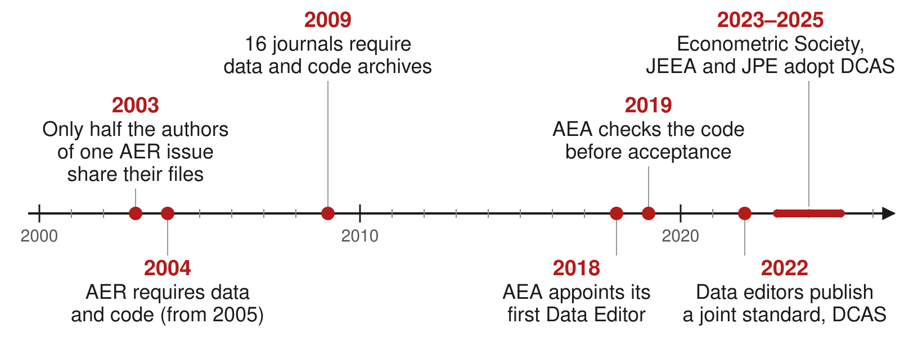
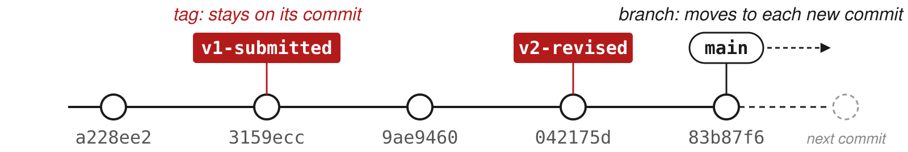
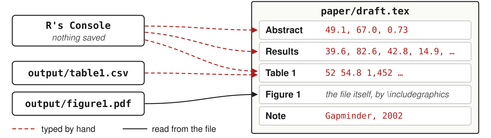

::: {.content-hidden when-format="revealjs"}

[Slides](11-reproducible-project-slides.html) · [Source](https://github.com/ArielOrtizBobea/aem6850/blob/main/fall-2026/sessions/11-reproducible-project.qmd)

Four parts: why reproducibility matters and what economics journals
require; what a replication package contains; sharing the package on
GitHub with a DOI; and linking the numbers, tables and figures in a
paper to the code. The examples use a two-page draft paper and its
code:
[download the project](data/income-life-draft.zip) (a zip file).

:::

::: {.content-hidden when-format="revealjs"}

::: {#before-class .callout-important title="Before class: install three packages and render a test document"}

Ten minutes, once, on the laptop you bring. In RStudio's **Console**:

```r
install.packages(c("rmarkdown", "gapminder", "renv"))
```

If R asks whether to use a personal library, answer Yes; if it asks
about installing from sources, answer No.

Then **File → New File → Quarto Document…** and click **Create**.
RStudio opens a document with some sample text. Save it anywhere as
`test.qmd` and click **Render** above the editor. If RStudio offers to
install or update packages first, accept. A page with the sample text
opens in the Viewer pane or in your browser: Quarto works on your
laptop, and the exercise in class will too.

:::

:::

## Objectives {#objectives .smaller}

By the end of this session you can:

- Explain why reproducibility matters.
- Define reproducibility and replicability.
- Explain what economics journals require of data and code.
- Write a README from the data editors' template.
- Record package versions with `renv`.
- Tag the code version you submit to a journal.
- Archive a release of the code with a DOI.
- Check every number in a draft against the code with Claude Code.
- Have R write the numbers and tables into a paper.
- Format tables and figures to the AER style guide.

## Plan for today {#plan}

1. **Why reproducibility matters and what journals require**\
   [Why it matters, with two examples · reproducibility versus
   replicability · journal policies · the AEA's checks]{.topics}
2. **The replication package**\
   [Contents and README · data availability · package versions with
   renv · a test on another computer · submitting homework]{.topics}
3. **GitHub and DOIs for replication packages**\
   [Git tags for submitted versions · publishing only the tagged version
   · the AEA deposit · DOIs · licenses]{.topics}
4. **Linking numbers, tables and figures to the paper**\
   [Numbers from many places · Claude Code traces them (live) · a better
   way: R writes them, and Claude Code converts the draft · formats for
   journals]{.topics}

# 1 · Why reproducibility matters and what journals require {#part-why}

::: {.content-visible when-format="revealjs"}

- Why reproducibility matters, with two examples
- Reproducibility versus replicability
- Journal policies on data and code
- Policies at AJAE, JAERE and JEEM
- The AEA Data Editor's checks

:::

## Why reproducibility matters {#why .smaller}

- **Errors in published work are common:** "a commonplace rather than a
  rare occurrence", in a 1986 attempt to rerun articles from one
  journal.
- **Many results do not reproduce** from the authors' own files: 22 of
  67 papers in 13 journals; 68 of 152 *AEJ: Applied* packages in full.
- **Others can check and build on the work.** Without the data and
  code, they take it on trust.
- **You will rerun it yourself.** Gentzkow and Shapiro reran an early
  draft of their own paper: the code no longer ran, and once fixed it
  gave different results.
- **Journals require it.** AEA journals rerun the code before
  acceptance.

[Sources: [Dewald, Thursby and Anderson (AER, 1986)](https://www.jstor.org/stable/1806061);
[Chang and Li (CFR, 2022)](https://doi.org/10.1561/104.00000053);
[Herbert, Kingi, Stanchi and Vilhuber (CJE, 2024)](https://doi.org/10.1111/caje.12728);
[Gentzkow and Shapiro (guide, 2014)](https://web.stanford.edu/~gentzkow/research/CodeAndData.pdf).]{.source}

::: {.content-visible when-format="revealjs"}

::: {.notes}
Chang and Li reproduced 22 of the 67 without contacting the authors.
Dewald, Thursby and Anderson asked the authors of 154 papers in the
Journal of Money, Credit and Banking for their data and code. Ask the
room: who has had to rerun their own analysis months later, and could
not?
:::

:::

::: {.content-hidden when-format="revealjs"}

A result that only its authors can rerun cannot be checked by anyone
else. The first systematic attempt in economics asked the authors of
154 papers published in, accepted by or submitted to the *Journal of
Money, Credit and Banking* for their data and code; 90 sent something,
only 8 of the 54 data sets examined were complete enough to attempt a
replication, and the authors concluded that inadvertent errors in
published empirical articles are "a commonplace rather than a rare
occurrence" ([Dewald, Thursby and Anderson, AER,
1986](https://www.jstor.org/stable/1806061), p. 587). Two later studies
measured how often published economics reproduces
from the authors' own files. [Chang and Li (CFR,
2022)](https://doi.org/10.1561/104.00000053) attempted 67 papers from
13 economics journals and reproduced the key qualitative result of 22
without contacting the authors. The AEA Data Editor's team attempted
152 replication packages from *AEJ: Applied Economics* and reproduced
68 fully and 66 partly ([Herbert, Kingi, Stanchi and Vilhuber, CJE,
2024](https://doi.org/10.1111/caje.12728)). The first person who needs
to rerun a project is usually its author: a referee report arrives
months after submission and asks for a new sample, a new control or a
new table, and every number in the paper has to be produced again.
Gentzkow and Shapiro describe going back to reproduce an early draft of
one of their own papers: the code no longer ran because files had
moved, and once it ran it produced different results ([Gentzkow and
Shapiro, guide, 2014](https://web.stanford.edu/~gentzkow/research/CodeAndData.pdf),
p. 4).

:::

## An error in a paper on abortion and crime {#example-abortion .smaller}

- **The claim.** Donohue and Levitt (QJE, 2001): legalized abortion in
  the 1970s explains up to half of the fall in US crime in the 1990s.
- **The check.** Foote and Goetz (QJE, 2008) reran the authors' posted
  data and code: the state-by-year controls the paper describes for its
  last table were not in the code.
- **What changed.** With the controls, the effects on arrests fell by
  more than half; with arrests per person, to about zero.
- **The reply.** Donohue and Levitt (QJE, 2008) accepted the error and
  argued that better abortion data restore the result.

**Takeaway:** the error was found because the authors had posted their
data and code.

[Sources: [Donohue and Levitt (QJE, 2001)](https://doi.org/10.1162/00335530151144050);
[Foote and Goetz (QJE, 2008)](https://doi.org/10.1162/qjec.2008.123.1.407);
[Donohue and Levitt (QJE, 2008)](https://doi.org/10.1162/qjec.2008.123.1.425).]{.source}

::: {.content-visible when-format="revealjs"}

::: {.notes}
The numbers, from Foote and Goetz's Table I: the effect on property
crime arrests went from -0.025 to -0.010 with the state-by-year
controls, and violent crime from -0.028 to -0.013; with arrests per
person, -0.001 and -0.004, not significant. The paper's claim reached a
wide audience in Freakonomics.
:::

:::

::: {.content-hidden when-format="revealjs"}

[Donohue and Levitt (QJE, 2001)](https://doi.org/10.1162/00335530151144050)
argued that the legalization of abortion in the 1970s accounts for as
much as half of the fall in US crime in the 1990s. Their final table
regressed arrests by state, year and single year of age on abortion
rates, and the text says the regressions include state-by-year
interactions, which restrict the comparison to people in the same state
and year. Christopher Foote and Christopher Goetz of the Federal Reserve
Bank of Boston reran the authors' posted data and programs and found
that those interactions were missing from the code ([Foote and Goetz,
QJE, 2008](https://doi.org/10.1162/qjec.2008.123.1.407)). Adding them
cut the estimated effect on property-crime arrests from -0.025 to
-0.010 and on violent-crime arrests from -0.028 to -0.013; measuring
arrests per person brought both to about zero
(-0.001 and -0.004, not significant). The comment first circulated as a
Boston Fed working paper in November 2005, with its data and programs.
In their reply, [Donohue and Levitt (QJE,
2008)](https://doi.org/10.1162/qjec.2008.123.1.425) accepted the coding
error and argued that a better measure of abortion exposure, which
adjusts for mobility and the timing of births, gives evidence as strong
as the original. The coding error itself is not in dispute, and
Donohue and Levitt credit the posting of their data and programs with
getting it caught.

:::

## An error in a paper on Social Security and saving {#example-saving .smaller}

- **The claim.** Feldstein (JPE, 1974): in US data for 1929–71, Social
  Security wealth reduced personal saving (coefficient 0.021, standard
  error 0.006).
- **The check.** Leimer and Lesnoy (JPE, 1982) found a bug in the
  program that built the wealth series: a loop for survivors' benefits
  did not reset each year, so the series grew too fast.
- **What changed.** On the same data, fixing the bug moved the estimate
  from 0.024 to 0.015 (0.010); with data to 1976, to 0.002 (0.011).
- **The reply.** Feldstein (JPE, 1982) accepted the bug and argued that
  adding the 1972 benefit increase restores about 0.017.

**Takeaway:** the bug sat in the program that built a variable, where
only someone rebuilding that variable could find it.

[Sources: [Feldstein (JPE, 1974)](https://doi.org/10.1086/260246);
[Leimer and Lesnoy (JPE, 1982)](https://doi.org/10.1086/261077);
[Feldstein (JPE, 1982)](https://doi.org/10.1086/261078), with the
numbers in its [working paper](https://doi.org/10.3386/w0579), Table 1.]{.source}

::: {.content-visible when-format="revealjs"}

::: {.notes}
Social Security wealth is the present value of the benefits a household
expects. "The same data" are revised national accounts for 1929–71, on
which the old series gives 0.024 rather than the published 0.021. Feldstein
stressed that his reading of the law was right and the error was in
the program.
:::

:::

::: {.content-hidden when-format="revealjs"}

[Feldstein (JPE, 1974)](https://doi.org/10.1086/260246) estimated from
US time series for 1929–71 that Social Security wealth, the present
value of expected benefits, reduced personal saving: a coefficient of
0.021 with a standard error of 0.006. Dean Leimer and Selig Lesnoy of
the Social Security Administration found that the Fortran program that
built the wealth series contained an error in its treatment of the 1957
change in survivors' benefits: a loop did not reset its starting value
each year, so the series grew faster than the specification implied
([Leimer and Lesnoy, JPE, 1982](https://doi.org/10.1086/261077)). In
his reply, [Feldstein (JPE, 1982)](https://doi.org/10.1086/261078)
accepted the error and re-estimated. On revised national accounts for
1929–71 the coefficient moved from 0.024 with the old series to 0.015
(0.010) with the corrected one, and extending the corrected series to
1976 gave 0.002 (0.011). Feldstein argued that the corrected series
leaves out the 20 percent benefit increase of 1972 and that adding it
restores an estimate of about 0.017 (Table 1 of the [working
paper](https://doi.org/10.3386/w0579)).

:::

## Reproducibility versus replicability {#definitions .smaller}

- **Reproducibility**: "obtaining consistent results using the same
  input data; computational steps, methods, and code; and conditions of
  analysis."
- **Replicability**: "obtaining consistent results across studies aimed
  at answering the same scientific question, each of which has obtained
  its own data."
- Example: a paper's code, run on its data, returns every number in
  the paper (reproducibility). A new study with other data finds the
  same relationship (replicability).
- Usage in economics varies. Journals call the files a *replication
  package*; what they check is reproducibility, the subject of this
  session.

Source of the definitions: [National Academies (report,
2019)](https://doi.org/10.17226/25303), p. 6.

::: {.content-visible when-format="revealjs"}

::: {.notes}
Same data and same code, same numbers: reproducibility. New data, same
answer: replicability. Journals can check the first before they publish;
the second takes another study.
:::

:::

::: {.content-hidden when-format="revealjs"}

The definitions are from the National Academies of Sciences,
Engineering, and Medicine's report *Reproducibility and Replicability in
Science* ([National Academies, report,
2019](https://doi.org/10.17226/25303), Summary, p. 6). An earlier pair,
from a 2015 report to the US National Science Foundation and quoted in
[Vilhuber (HDSR, 2020)](https://doi.org/10.1162/99608f92.4f6b9e67),
says the same with other words: reproducibility is "the ability […] to
duplicate the results of a prior study using the same materials and
procedures as were used by the original investigator", and
replicability is "the ability of a researcher to duplicate the results
of a prior study if the same procedures are followed but new data are
collected". Vilhuber notes that "a variety of usages and gradations of
the terms are in use" in economics, and that some authors define the
two terms the opposite way. Journals call the deposit a *replication
package* even though what they check is reproducibility.

A paper can be reproducible and still fail to replicate: the code runs
and returns the published numbers, and a new sample gives a different
answer. A paper that is not reproducible cannot be checked at all,
which is why journals now ask for the data and code.

:::

## Journal policies on data and code {#journal-policies}

{.nostretch fig-align="center" width="100%" fig-alt="A time axis from 2000 to 2026 with seven events. 2003: only half the authors of one AER issue share their files. 2004: the AER requires data and code, from 2005. 2009: 16 journals require data and code archives. 2018: the AEA appoints its first Data Editor. 2019: the AEA checks the code before acceptance. 2022: data editors publish a joint standard, DCAS. 2023 to 2025: the Econometric Society, JEEA and JPE adopt DCAS."}

[Sources: [McCullough and Vinod (AER, 2003)](https://doi.org/10.1257/000282803322157133);
[Bernanke (AER, 2004)](https://www.jstor.org/stable/3592790);
[McCullough (EAP, 2009)](https://doi.org/10.1016/S0313-5926(09)50047-1);
[AEA policy](https://www.aeaweb.org/journals/data/data-code-policy);
[datacodestandard.org](https://datacodestandard.org).]{.source}

::: {.content-visible when-format="revealjs"}

::: {.notes}
AER: American Economic Review. AEA: the American Economic Association,
which publishes the AER and the AEJs. JEEA: Journal of the European
Economic Association. JPE: Journal of Political Economy. REStud: Review
of Economic Studies. EJ: Economic Journal. DCAS: the Data and Code Availability Standard,
now endorsed by 19 journals, among them the AER, Econometrica, the JPE,
the REStud and the EJ.
Read the axis left to right: a failed attempt to rerun one AER issue,
then the AER's rule, then the spread to other journals, then the AEA
checking the code itself.
:::

:::

::: {.content-hidden when-format="revealjs"}

The AER's first policy was announced by its editor in the March 2004
issue ([Bernanke, AER, 2004](https://www.jstor.org/stable/3592790)),
after [McCullough and Vinod (AER,
2003)](https://doi.org/10.1257/000282803322157133) tried to replicate
the papers in the June 1999 issue and dropped the project because "only
half of the authors would comply" with requests for data and code (as
recorded in the AER editor's report, [AER P&P,
2011](https://doi.org/10.1257/aer.101.3.684), p. 697). The count of
journals with a mandatory archive is from Figure 1 of [McCullough (EAP,
2009)](https://doi.org/10.1016/S0313-5926(09)50047-1). The AEA appointed
its first Data Editor, Lars Vilhuber, in January 2018, and on July 10,
2019 adopted the [Data and Code Availability
Policy](https://www.aeaweb.org/journals/data/data-code-policy), under
which "replication archives will now be requested prior to acceptance";
the policy has been revised since, most recently in February 2026.

The [Data and Code Availability Standard](https://datacodestandard.org)
(version 1.0, December 2022) was written by the data editors of
economics journals. Its 16 rules fall in four groups:

| Group | Rules |
|:--|:--|
| Data | A data availability statement; raw data public; analysis data in the package unless they can be rebuilt from accessible data; common formats; variable descriptions; a citation for every dataset |
| Code | Programs that build the analysis data from the raw data; programs that produce every result; code in source form |
| Supporting materials | Survey instruments or experiment instructions; ethics approval; pre-registration; a README with the data availability statement and every software and hardware dependency |
| Sharing | Archived in a repository the journal accepts; a license; the README states anything left out for legal reasons |

The [list of journals](https://datacodestandard.org/journals/) that
endorse it includes the AER, *AER: Insights*, the four AEJs, the
*Journal of Economic Literature*, the *Journal of Economic
Perspectives*, *Econometrica*, *Quantitative
Economics*, *Theoretical Economics*, the *Journal of Political Economy*,
the *Review of Economic Studies*, the *Economic Journal*, the *Journal
of the European Economic Association*, the *Canadian Journal of
Economics*, *Economic Inquiry*, the *Econometrics Journal* and the
*Review of Financial Studies*.


:::

## Policies at AJAE, JAERE and JEEM {#field-journals}

| Journal | Asks for | When | Checked before publication |
|:--|:--|:--|:--|
| AJAE | Data and a README; code where needed | At acceptance | No data editor; partial compliance accepted |
| JAERE | Data, code, output and a README, on its Dataverse | After conditional acceptance | An editor checks the package against a checklist |
| JEEM | Data and code in a repository, cited in the paper, or a statement of why not | Not stated | Not stated |

- None of the three policies says the code is rerun before
  publication.
- JAERE asks for output files named as in the paper: `Table1.tex`,
  `intextresults.log`.

[Sources: [AJAE author guidelines](https://academic.oup.com/ajae/pages/Author_Guidelines);
[JAERE data availability policy](https://www.journals.uchicago.edu/journals/jaere/data-availability-policy);
[JEEM guide for authors](https://www.sciencedirect.com/journal/journal-of-environmental-economics-and-management/publish/guide-for-authors),
"Research data".]{.source}

::: {.content-visible when-format="revealjs"}

::: {.notes}
AJAE: American Journal of Agricultural Economics. JAERE: Journal of the
Association of Environmental and Resource Economists. JEEM: Journal of
Environmental Economics and Management. JAERE's file names are this
session's point: output written by code, named as in the paper.
:::

:::

::: {.content-hidden when-format="revealjs"}

Field journals set their own rules. The *American Journal of
Agricultural Economics* has no data editor. Its [author
guidelines](https://academic.oup.com/ajae/pages/Author_Guidelines), in
the section "Data and Documentation", say that "Upon acceptance and in
keeping with evolving policies at other top economics journals, authors
are expected to submit their datasets and associated documentation
(perhaps in a readme file), for readers to download from the AJAE
website", together with "whatever other material is needed to ensure
that their results can be replicated (this might include code or
pseudo-code used in estimation)", and that "the editors would prefer
partial compliance over non-compliance". Its [final checklist for
accepted papers](https://academic.oup.com/DocumentLibrary/ajae/author%20checklist.pdf)
asks for "Data, code (or pseudo-code) and readme files" with the final
submission.

The *Journal of the Association of Environmental and Resource
Economists* has had its [data availability
policy](https://www.journals.uchicago.edu/journals/jaere/data-availability-policy)
since July 1, 2017. Accepted papers post data, code, output and a
README on JAERE's Dataverse, with output file names that "align with
how results appear in the paper (e.g., Table1.tex, Figure C2.pdf,
intextresults.log)". After conditional acceptance, authors fill out a
replication package checklist, and "The package will be reviewed by a
JAERE editor to verify that it satisfies all requirements prior to
publication."

The *Journal of Environmental Economics and Management* follows
Elsevier's research data option C ([guide for
authors](https://www.sciencedirect.com/journal/journal-of-environmental-economics-and-management/publish/guide-for-authors),
"Research data"): authors "are required to: Deposit your research data
in a relevant data repository. Cite and link to this dataset in your
article. If this is not possible, make a statement explaining why
research data cannot be shared." Research data "may also include
software, code, models, algorithms". The guide names no data editor and
no check of the code. Read the policy of the journal you submit to
before you build the package.

:::

## The AEA Data Editor's checks {#journals-check}

- AEA journals require the replication package before final acceptance.
  The Data Editor's team runs the code and compares its output with the
  tables, figures and numbers in the paper.
- December 2024 to November 2025, 382 papers at conditional acceptance:
  20 accepted as submitted; 285 accepted with changes the authors had
  to make; 77 sent back for another round of revisions.
- A common problem, in the report for 2022–23: "many authors still
  manually save figures and copy tables".

Sources: the [AEA
policy](https://www.aeaweb.org/journals/data/data-code-policy);
[Vilhuber (AER P&P, 2026)](https://doi.org/10.1257/pandp.116.890),
Table 2.

**Takeaway:** about 1 paper in 19 passes the Data Editor's check with no
changes.

::: {.content-visible when-format="revealjs"}

::: {.notes}
The policy page and the reports are linked on the session page. The
second bullet is the one to dwell on: a plain pass is rare, and the
fixes are the kind this session is about.
:::

:::

::: {.content-hidden when-format="revealjs"}

The [AEA Data and Code Availability
Policy](https://www.aeaweb.org/journals/data/data-code-policy) requires
that, before acceptance, authors provide "the data, code, and other
details of the computations sufficient to permit replication", and it
states that the AEA Data Editor "will assess compliance with this
policy, including by conducting reproducibility checks". The counts in
the second bullet are the last recommendation on record for each
manuscript at the conditional-acceptance stage, December 2024 to
November 2025 ([Vilhuber, AER P&P,
2026](https://doi.org/10.1257/pandp.116.890), Table 2): "Accept" 20,
"Accept—with changes" 285, "Conditional accept" 77. A conditional accept
means the manuscript goes through another round of author revisions.
Manual steps are a common reason: the [report for December 2022 to
November 2023](https://doi.org/10.1257/pandp.114.878) (Vilhuber, AER
P&P, 2024) notes that "many authors still manually save figures and
copy tables".

Studies that go back to already published papers report lower rates.
When the Data Editor's team tried to reproduce 152 packages from *AEJ:
Applied Economics*, 68 reproduced fully and 66 partly ([Herbert, Kingi,
Stanchi and Vilhuber, CJE, 2024](https://doi.org/10.1111/caje.12728)).
An earlier study of 67 papers in 13 economics journals reproduced the
key result of 22 of them without help from the authors ([Chang and Li,
CFR, 2022](https://doi.org/10.1561/104.00000053)).

:::

# 2 · The replication package {#part-package}

::: {.content-visible when-format="revealjs"}

- What a package contains, and the README
- Data availability and restricted data
- Package versions with renv
- A test run on another computer
- Submitting homework the same way

:::

## What a replication package contains {#package .smaller}

A replication package is the data, code and README published with a
paper so that others can reproduce its results. Below, a package for a
two-page paper on income and life expectancy.

:::: {.columns}

::: {.column width="50%"}

```
income-life/
├── README.pdf
├── income-life.Rproj
├── renv.lock
├── data/
│   └── gapminder.csv
├── code/
│   ├── run_everything.R
│   ├── 01_table1.R
│   ├── 02_figure1.R
│   └── 03_numbers.R
├── output/
│   ├── table1.tex
│   ├── figure1.pdf
│   └── numbers.tex
└── paper/
    └── paper.tex
```

:::

::: {.column width="50%"}

- `README.pdf`: AEA journals ask for a PDF.
- `data/`: the data, or how to get them.
- `run_everything.R`: every script, in order.
- `output/`: every table, figure and number in the paper.
- `renv.lock`: R and package versions.

:::

::::

::: {.content-hidden when-format="revealjs"}

This is the draft project after the fixes: a script that writes the
numbers file, a table written as `.tex`, a paper that reads both, a
lockfile, and a README. The AEA policy asks for "a README document in
PDF format in the uppermost directory of the replication package"; the
Data Editor's guidance also accepts a text file. Write it in Markdown
and render it to PDF when you deposit. The policy strongly encourages a
main script, and the reports keep finding packages without one: a scan
of 8,280 replication packages in about twenty economics journals found
a main script in 2,594 of them ([self-checking
guide](https://larsvilhuber.github.io/self-checking-reproducibility/)).

:::

## The sections of a README {#readme .smaller}

| Section | What it says |
|:--|:--|
| Data availability and provenance | Where each dataset comes from, whether you may share it, how to get it |
| Dataset list | Each data file, its source, and whether it is in the package |
| Computational requirements | Software and versions, random seeds, memory, running time |
| Description of programs | What each script does; the license for the code |
| Instructions to replicators | The steps, in order |
| List of tables and programs | Which script makes each table and figure, and the file it writes |
| References | A citation for every dataset |

Start from the [template
README](https://social-science-data-editors.github.io/template_README/)
written by the data editors of economics journals; the AEA policy says
its use "is strongly encouraged".

::: {.content-hidden when-format="revealjs"}

The template is endorsed by the data editors of the AEA journals, the
*Review of Economic Studies*, the *Economic Journal* and the *Canadian
Journal of Economics*, and it opens with a short Overview of what the
package does and how long it runs. Every section has worked examples.
The README is the part of the package a replicator reads first. The
Data Editor's team runs the package on its own ("This happens without
interaction with the authors", in the Data Editor's
[guidance](https://aeadataeditor.github.io/aea-de-guidance/next)), so
whatever the README leaves out, they have to guess.

:::

## The data availability statement {#data-availability}

The README section that says who made each dataset, under which
license, where your file came from and what you did to it, and whether
it is in the package. For the draft project:

> The data are the Gapminder excerpt distributed in the R package
> `gapminder` (Bryan 2025, doi:10.32614/CRAN.package.gapminder),
> released under CC0. The underlying data come from the Gapminder
> Foundation (gapminder.org/data) under a CC BY 4.0 license. The file
> `data/gapminder.csv` is the package's `gapminder` data frame written
> with `write.csv()`; it is included in this package.

::: {.content-hidden when-format="revealjs"}

The AEA asks for this statement even when every dataset is in the
package: "This information must be provided even when all data are
included as part of the deposit." It also asks for a citation of every
dataset in the paper's references, in the same form as a citation of a
paper.

:::

## Replication packages with restricted data {#restricted-data}

- Restricted data: data you may not redistribute, such as
  administrative records, licensed firm data, surveys with personal
  information.
- The package still includes the code, the README and a citation for
  the data.
- The README says who holds the data, how a researcher applies for
  access, how long it takes and what it costs.
- It lists the files and variables the code expects, with their exact
  names, so someone with access can run it.

::: {.content-hidden when-format="revealjs"}

In the AEA Data Editor's report for 2025, "about 60 percent of
manuscripts used some data that could not be shared publicly" across
all AEA journals ([Vilhuber, AER P&P,
2026](https://doi.org/10.1257/pandp.116.890), pp. 894–895).
Restricted data change what goes in the deposit. The code, the README
and the data citation go in as usual, and the Data Availability and Provenance section explains
access in enough detail that a researcher could apply for the same
data and run the code on it.

:::

## Recording package versions with renv {#renv}

- renv is an R package. It gives a project its own package library and
  a lockfile, `renv.lock`, that lists the R version and each package's
  version.
- `renv::init()`: creates the project library and writes `renv.lock`.
- `renv::snapshot()`: after you install or update a package, records
  the change in the lockfile.
- `renv::restore()`: on another computer, installs the versions the
  lockfile names.
- `renv::status()`: says whether the lockfile and the library agree.
- Commit `renv.lock`, `.Rprofile`, `renv/activate.R` and
  `renv/settings.json`. renv writes its own `.gitignore`, which keeps
  the library folder out.

::: {.content-visible when-format="revealjs"}

::: {.notes}
When a co-author opens the project, renv installs itself first, then
offers to run restore. Ten or twenty seconds for a small project.
:::

:::

::: {.content-hidden when-format="revealjs"}

The Data Editor's guidance for R says it directly: "For R packages, we
suggest that users use renv". `renv::init()` scans the project's
scripts and `.qmd` files for the packages they load, installs them into
a library that belongs to the project, and writes the lockfile. It
records only what the code loads: a project whose scripts use base R
alone gets a lockfile that lists renv and nothing else. When
someone else opens the project, the `.Rprofile` file starts renv, which
installs itself if needed and offers to run `renv::restore()`. On a
fresh copy of a small project with a Quarto report (47 packages),
`renv::restore()` took about 12 seconds on the computer that made this
page.

:::

## The contents of renv.lock {#lockfile}

```json
{
  "R": {
    "Version": "4.6.1",
    "Repositories": [
      {
        "Name": "CRAN",
        "URL": "https://packagemanager.posit.co/cran/latest"
      }
    ]
  },
  "Packages": {
    ...
    "gapminder": {
      "Package": "gapminder",
      "Version": "1.0.1",
```

- From a project whose script loads gapminder: the R version, the
  repository the packages came from, and each package's version.
- renv records the R version but does not install it.

::: {.content-hidden when-format="revealjs"}

The versions shown are the ones on the computer that wrote this file;
yours will differ. The file lists twelve packages in alphabetical
order: gapminder, renv itself, and ten that gapminder needs (tibble and
the packages tibble uses); each entry also repeats the package's description,
which makes the file long. The lines above are the ones that matter.
renv does not capture the operating system or system libraries either,
and restoring an old lockfile can mean installing old package versions
from source, which needs compilers on a Mac or Windows laptop.

:::

## Other ways to control package versions {#other-ways .smaller}

| Approach | What it fixes | What it leaves open |
|:--|:--|:--|
| `library()` calls at the top of the script | Nothing: the script stops if a package is missing | Which version is installed |
| Install the missing packages, then load them | Every package is installed | The version: it installs the newest |
| `remotes::install_version("gapminder", "1.0.1")` | One package's version | The versions of the packages it needs |
| renv | Every package's version, listed in `renv.lock` | The R version, the operating system |
| A dated copy of CRAN, from Posit Package Manager | Every package as CRAN had it on that day | The R version, the operating system |
| A Docker image | The operating system, R and every package | Needs Docker on the computer that runs it |

- The `checkpoint` package used dated copies of CRAN kept by Microsoft.
  Microsoft closed that service on July 1, 2023, and `checkpoint` no
  longer works.

::: {.content-visible when-format="revealjs"}

::: {.notes}
Top to bottom, each row fixes more than the one above it and costs
more to set up. renv is the usual choice for an R project; Docker is
for code that also depends on the operating system.
:::

:::

::: {.content-hidden when-format="revealjs"}

Load packages with `library()`, which stops the script with an error
when a package is missing; `require()` only warns and returns `FALSE`,
so the script runs on and fails later with a less useful message. A
loop that installs whatever is missing (`want[!want %in%
rownames(installed.packages())]`) makes the script run on a new
computer, but it installs today's version of each package, not the one
you used.

`remotes::install_version()` installs one package at a stated version,
building it from source by default, which needs compilers. A dated
copy of CRAN fixes every package at once: Posit takes "a snapshot of
CRAN every business day", and pointing R at one of them installs the
versions of that day ([Posit's
announcement](https://posit.co/blog/migrating-from-mran-to-posit-package-manager)):

```r
options(repos = c(CRAN = "https://packagemanager.posit.co/cran/2024-01-02"))
```

Microsoft announced that its snapshot service, MRAN, "will be retired
on July 1, 2023" and that `checkpoint` would stop working
([Microsoft's notice](https://techcommunity.microsoft.com/blog/azuresqlblog/microsoft-r-application-network-retirement/3707161));
CRAN archived `checkpoint` in November 2025. A Docker image is a file
that holds an operating system, a version of R and the packages; any
computer with Docker installed runs the code inside the same
environment. The [Rocker project](https://rocker-project.org) publishes
images with a fixed version of R.

:::

## Running the package on another computer {#clean-computer}

- Copy the project to a place where the code never ran: a new clone in
  a new folder, a lab computer, a classmate's laptop.
- Follow only the README. Add to the README anything you needed that it
  does not say.
- Run `code/run_everything.R` from start to end with no manual steps.
  Compare every table, figure and number with the paper.

::: {.content-visible when-format="revealjs"}

::: {.notes}
The Data Editor's own guide has a chapter titled "Have an undergraduate
student run it". A classmate works too.
:::

:::

::: {.content-hidden when-format="revealjs"}

The AEA Data Editor's guidance asks authors to "re-run the code again,
in a clean environment, possibly a fresh computer", and the Data
Editor's [self-checking
guide](https://larsvilhuber.github.io/self-checking-reproducibility/)
suggests having someone else run the package "based entirely on the
documentation you provide, without interacting with you in any other
way." A fresh clone in a new folder on your own laptop catches missing
files and paths that exist only on your disk; with renv, it also starts
from an empty package library. Someone else's laptop catches the rest.

:::

## Submitting homework as a small replication package {#homework .smaller}

- The grader opens your homework repository in a fresh R session and
  sources `code/run_everything.R`. Nothing else.
- `run_everything.R` runs the numbered scripts in `code/` in order.
- The scripts read or download the data and write every figure, table
  and number to a file.
- Paths start at the project folder: `"data/..."`, never
  `"/Users/you/..."`.
- A short README says what each script does and what it writes.
- Before you submit, clone your repository into a new folder, restart
  R, and source `run_everything.R` there.
- Do not commit `data/` or `data_clean/`: the code rebuilds them. The
  last commit on `main` at the deadline is the one graded.

::: {.content-visible when-format="revealjs"}

::: {.notes}
The homework rubric's replicability points come down to the second-last
bullet: it runs in a clean copy, or it does not. A clone in a new
folder is the cheapest test of what the grader will do.
:::

:::

::: {.content-hidden when-format="revealjs"}

Each homework repository works like the packages in this part, on a
small scale. The grader does what a journal's data editor does: it
starts from your repository, not your laptop, opens it in a fresh R
session, sources `code/run_everything.R`, and compares what the code
writes with what the assignment asks for. A script that depends on an
object left in your environment, a file on your desktop, or a step you
did by hand fails there even when it works for you.

The most direct test is the one on the previous slide: clone your
repository into a new folder (`git clone` and the repository's
address), open its `.Rproj`, restart R, and source `run_everything.R`.
If it stops, the message names what the clean copy is missing. Raw
data stay out of the repository when the code downloads them, and
anything computed goes in `data_clean/`, which the code rebuilds; the
assignment says which files to commit. The collection script takes the
last commit on the main branch at or before the deadline, so push
before the deadline and check on GitHub that the commit is there.

:::

# 3 · GitHub and DOIs for replication packages {#part-sharing}

::: {.content-visible when-format="revealjs"}

- Git tags for submitted and revised versions
- Making only the tagged version public
- Depositing the package at an AEA journal
- Archiving a release with a DOI
- Licenses and citation files

:::

## Why tag the version you submit {#tag-why}

- After you submit, the code keeps changing. Referees' questions, and
  the journal's check at acceptance, concern the version you sent.

{.nostretch fig-align="center" width="100%" fig-alt="Five commits on a line, labelled by their hashes a228ee2, 3159ecc, 9ae9460, 042175d and 83b87f6, and a dashed next commit. Red labels v1-submitted and v2-revised are pinned to the second and fourth commits, marked: tag, stays on its commit. An outlined label, main, sits on the fifth commit with a dashed arrow toward the next commit, marked: branch, moves to each new commit."}

- A commit is known by its hash, `3159ecc`. A tag gives it a name that
  stays put, `v1-submitted`; the branch `main` moves on.
- A tag changes no file. It shows in `git log --decorate` and in
  GitHub's list of tags.

::: {.content-visible when-format="revealjs"}

::: {.notes}
Could you cite the hash instead? Yes, it identifies the same commit.
Nobody remembers 3159ecc, and GitHub and Zenodo build releases from
tags, not from hashes. The tag is the name you give the version you
sent.
:::

:::

::: {.content-hidden when-format="revealjs"}

A commit already identifies one version of every file, and its hash
never changes, so a hash in the README would do the job in principle.
A tag adds three things. It is a name people can read and remember;
every git command accepts it wherever it accepts a hash, as in `git diff
v1-submitted v2-revised`. It stays on its commit: a branch name such as
`main` moves forward with every new commit, so "the version on main"
means something different each week, while `v1-submitted` always means
the commit you sent. And GitHub builds on it: the repository's list of
tags offers a zip file of the code at each tag, a release is made from a
tag, and Zenodo archives releases and gives each one a DOI.

A tag changes no file. It shows up as a label: `git log --oneline
--decorate` prints `(tag: v1-submitted)` beside the commit, and on
GitHub tags appear under the **Tags** tab of the branch menu and on the
repository's tags page; a release made from a tag appears in the
**Releases** box on the repository's front page.

:::

## Tagging the version you submit {#tag}

```bash
git tag -a v1-submitted -m "Version submitted to the journal"
git push origin v1-submitted
```

- `-a` makes an annotated tag: it records who made it, when, and the
  message.
- `git push` alone does not send tags to GitHub; push each tag by name.
- Referees rarely run the code. The tag lets you rerun the submitted
  version when a referee asks about one of its results.
- At acceptance, tag the version you deposit and name the tag in its
  README.

::: {.content-visible when-format="revealjs"}

::: {.notes}
Two commands: name the commit, then send the name to GitHub. Tag
right after you build the PDF you send, so the tag and the PDF match.
:::

:::

::: {.content-hidden when-format="revealjs"}

Without a tag, the version you submitted is one commit among many,
known only by its date and its hash. A tag gives that commit a name
that every git command accepts in place of the hash: `git switch`,
`git diff` and `git log` all take `v1-submitted`. Name tags so they say
what happened: `v1-submitted`, `v2-revised`, `v3-accepted`. Tag the
commit that produced the PDF you sent, after the last change to the
code and the paper, and push the tag right away.

Referees in economics rarely run the authors' code; where a journal
checks the code, it does so at acceptance, as the AEA Data Editor does
at conditional acceptance. During review, the tag is for you and your
co-authors: when a referee asks about Table 3 of the submitted version,
you can rerun exactly the code that produced it, even after months of
changes. At acceptance, tag the version you deposit, such as
`v3-accepted`, and give the tag's name in the package's README, so
that anyone can match the archived copy to the commit in the
repository.

On GitHub, a **release** turns a tag into a page with a zip file of the
code at that commit: **Releases → Draft a new release → Choose a tag →
Publish release**. Zenodo archives releases (see [Archiving a release
with a DOI](#doi)).

:::

## Working on the project during revisions {#after-submission}

```bash
git log --oneline --decorate
#> 83b87f6 (HEAD -> main) README: add the list of tables and programs
#> 042175d (tag: v2-revised) Referee 2: describe the fitted line in the figure note
#> 9ae9460 Write the numbers in the text from code/03_numbers.R
#> 3159ecc (tag: v1-submitted) Correct five numbers in the text and Table 1
#> a228ee2 Draft: data, Table 1 and Figure 1 scripts, paper
```

- A project's history after one submission and one revision, made for
  this session. Each version sent has a tag; work goes on in
  `main`.
- `git diff --stat v1-submitted v2-revised`: the files that changed
  between the two versions, for the response to the referees.
- `git switch --detach v1-submitted`: the folder as it was when you
  submitted, to rerun it. `git switch main` returns to the newest
  commit.

::: {.content-visible when-format="revealjs"}

::: {.notes}
Read the log bottom to top: draft, corrections, tag at submission, two
commits in response to the referees, tag at the revision, and work
that continues after it.
:::

:::

::: {.content-hidden when-format="revealjs"}

`--decorate` prints the tags and branches next to the commits they
point to. The history above was made for this session from the draft
project; the hashes in your own repository will differ.
`git diff --stat` between the two tags lists the files that changed and
how many lines:

```bash
git diff --stat v1-submitted v2-revised
#>  code/03_numbers.R     | 10 ++++++++++
#>  code/run_everything.R |  1 +
#>  paper/draft.tex       |  4 ++--
#>  3 files changed, 13 insertions(+), 2 deletions(-)
```

Drop `--stat` to see every changed line. When a referee asks about a
result in the submitted version, switch to its tag, run the code, read
the output, and switch back:

```bash
git switch --detach v1-submitted
#> HEAD is now at 3159ecc Correct five numbers in the text and Table 1
git switch main
#> Switched to branch 'main'
```

While switched to a tag, the folder holds the files of that commit:
`code/03_numbers.R` does not exist there, because it was written after
the submission. Do not edit or commit while switched to a tag; commits
made there belong to no branch. Switch back to `main` first.

:::

## When to make a GitHub repository public {#when-public}

- While you work: a private GitHub repository, shared with your
  co-authors.
- AEA journals require the replication package at conditional
  acceptance, deposited in an open archive. The archive publishes it
  before the article.
- The code must be public even when the data cannot be.
- You may make the GitHub repository public earlier, for example when
  the working paper goes online.
- Never commit to any repository, private or public: confidential data,
  data you have no right to publish, personal information, passwords,
  API keys.

::: {.content-hidden when-format="revealjs"}

The [AEA policy](https://www.aeaweb.org/journals/data/data-code-policy)
requires the package prior to acceptance, in "an openly accessible
trusted data repository". When the data cannot be published, the
authors must still make the code publicly available, document the
source of the data, and keep the data and code for no less than five
years after publication; data provided "upon request" are generally not
acceptable when the authors themselves approve the requests. The Data Editor's
[guidance](https://aeadataeditor.github.io/aea-de-guidance/next) notes
that the package is published as soon as it is complete, ahead of the
article. None of this stops you from preparing the package from the
first day: the fixes in this session are cheap while you work and
expensive at acceptance.

:::

## Making only the tagged version public {#going-public}

- GitHub sets visibility for a whole repository; a tag cannot be public
  on its own.
- A public repository shows every past commit, including files you
  deleted later.
- `git archive` writes the files at a tag to a zip, with no history:

```bash
git archive --format=zip --output=../income-life-v3.zip v3-accepted
```

- The zip holds only files git tracks; add data kept out of git by
  hand.
- Upload the zip to Zenodo or the journal's archive, or commit it to a
  new public repository. The working repository stays private.

::: {.content-visible when-format="revealjs"}

::: {.notes}
The zip has the files exactly as they were at the tag, and nothing
committed later. This course's site works the same way: a private
working repository, and a public repository made from a clean copy of
the site's files.
:::

:::

::: {.content-hidden when-format="revealjs"}

GitHub's documentation is plain about both halves. "A repository
contains all of your code, your files, and each file's revision
history" ([About
repositories](https://docs.github.com/en/repositories/creating-and-managing-repositories/about-repositories)),
and removing sensitive data means rewriting the history with a special
tool, after which copies can still survive in other people's clones
and forks ([Removing sensitive
data](https://docs.github.com/en/authentication/keeping-your-account-and-data-secure/removing-sensitive-data-from-a-repository)).
A password or key that ever reached a commit should be treated as
exposed: change it first.

`git archive` avoids the problem by publishing files, not history. The
command above writes every file git tracks at the tag `v3-accepted` to
a zip, without the `.git` folder and without anything committed later;
git also writes the commit's hash into the zip's comment, which `unzip
-l` prints on its first line. Add `--prefix=income-life/` to put the
files inside a folder in the zip. Files git does not track, such as
data listed in `.gitignore`, are not in the zip, so a package whose data
stay out of git needs them added by hand, or instructions in the README
for getting them. Upload the zip to Zenodo with **New upload**, or to
the journal's archive; or start a new repository from its contents and
make that one public. This course's own site is published from a
fresh public repository built from a clean copy of the files; the
private repository where the work happens, and its history, stay
private.

:::

## Submitting the package to an AEA journal {#aea-deposit}

- The package does not go through GitHub. At conditional acceptance you
  deposit it in the AEA Data and Code Repository at openICPSR.
- Import the zip from `git archive` into the deposit, so the deposit
  lists every file.
- The GitHub repository can be linked from the deposit as related
  material.
- The Data Editor's team runs the package from the deposit.
- The deposit's DOI, `10.3886/E…V…`, works once the deposit is
  published, at the end of review.

[Source: the AEA Data Editor's [guidance on the
deposit](https://aeadataeditor.github.io/aea-de-guidance/data-deposit-aea.html).]{.source}

::: {.content-visible when-format="revealjs"}

::: {.notes}
openICPSR is the repository the AEA uses, run by ICPSR at the
University of Michigan. Other journals name their own archive: JAERE
uses its Dataverse; Zenodo is accepted by many.
:::

:::

::: {.content-hidden when-format="revealjs"}

The AEA Data Editor's [guidance on the
deposit](https://aeadataeditor.github.io/aea-de-guidance/data-deposit-aea.html)
walks through the steps: create a project in the AEA Data and Code
Repository on openICPSR, add the files, fill in the metadata, and
submit the deposit to the AEA from openICPSR. On files it says "Do not
upload a ZIP file - IMPORT IT!": the import unpacks the zip, so the
deposit shows each file rather than one archive. A GitHub repository
can be named in the deposit's related publications, "If code is
derived from or continues to be updated on a Git repository"; the
deposit itself is the copy the Data Editor's team runs and the copy
readers download. Its DOI has the form `10.3886/E` followed by the
project number, `V` and the version, and "the DOI will not work until
(at the very end of the review process) the deposit is published."

:::

## Archiving a release with a DOI {#doi}

- The owner of a GitHub repository can rename, change or delete it at
  any time. Journals do not accept a GitHub link as the archive.
- A DOI (digital object identifier) is a permanent link,
  `https://doi.org/...`, to one archived copy of the files.
- AEA journals: the AEA Data and Code Repository at openICPSR, or
  another trusted archive such as Zenodo.
- Zenodo archives each release of a public GitHub repository and gives
  it its own DOI, plus one DOI that always resolves to the newest
  release.
- Cite the DOI of the release the paper used. Example, the `gapminder`
  package's releases:
  [doi.org/10.5281/zenodo.594018](https://doi.org/10.5281/zenodo.594018).

::: {.content-hidden when-format="revealjs"}

The Social Science Data Editors list GitHub among the places that are
not acceptable as an archive, because "a project’s owner can delete a
git repository at any time" ([guidance on
hosting](https://social-science-data-editors.github.io/guidance/Guidance/Requested_information_hosting.html)),
and the [AEA's FAQ](https://www.aeaweb.org/journals/data/faq) says the
same of git platforms and cloud folders. The AEA repository is strongly
encouraged but not required; the Data Editor accepts other trusted
repositories, with Zenodo, Dataverse and Code Ocean among the examples.

To archive a GitHub repository on Zenodo, log in to Zenodo with your
GitHub account, switch the repository on in Zenodo's GitHub settings,
and publish a release on GitHub
([GitHub's guide](https://docs.github.com/en/repositories/archiving-a-github-repository/referencing-and-citing-content)).
Zenodo keeps a copy of that release and registers a DOI for it, plus a
second DOI for all versions, which always resolves to the newest one
([Zenodo on versioning](https://zenodo.org/help/versioning)). Cite the
version DOI for the version your paper used. Zenodo's link to GitHub
works only with public repositories; to keep the repository private,
upload the zip from `git archive` with **New upload** instead, and
Zenodo gives it a DOI the same way. The [Zenodo sandbox](https://sandbox.zenodo.org/)
is a separate copy of the site for practice; its DOIs use a test prefix
and do not lead to the record.

:::

## A license and a citation file {#license}

- A license says what others may do with your files. The AEA suggests
  the modified BSD license for code and CC BY 4.0 for data and
  documents.
- Data you got from someone else keep their own license; the README
  says which.
- A `CITATION.cff` file at the top of the repository adds a "Cite this
  repository" link on GitHub, and Zenodo reads it when it archives a
  release.

::: {.content-hidden when-format="revealjs"}

The license advice is in the [AEA's
FAQ](https://www.aeaweb.org/journals/data/faq) and the Data Editor's
[licensing guidance](https://aeadataeditor.github.io/aea-de-guidance/Licensing_guidance),
which provides a template with both licenses in one `LICENSE.txt`. The
policy itself asks only that the license permit replication. A
`CITATION.cff` file is a short plain-text file with the title, the
authors and the DOI ([GitHub on citation
files](https://docs.github.com/en/repositories/managing-your-repositorys-settings-and-features/customizing-your-repository/about-citation-files)).

:::

# 4 · Linking numbers, tables and figures to the paper {#part-paper}

::: {.content-visible when-format="revealjs"}

- The numbers in a paper come from many places
- Claude Code can find every number and trace it (live)
- A better way: R writes the numbers and tables into the paper, in
  Quarto or LaTeX
- Claude Code can convert the draft to Quarto (live)
- Table and figure formats for journals

:::

## The numbers in a paper come from many places {#numbers-from-code}

{.nostretch fig-align="center" width="100%" fig-alt="Three sources on the left: R's Console, with nothing saved; output/table1.csv; and output/figure1.pdf. On the right, the paper draft.tex with five parts: Abstract (49.1, 67.0, 0.73), Results (39.6, 82.6, 42.8, 14.9 and more), Table 1 (rows such as 52, 54.8, 1,452), Figure 1, and the Note under it (Gapminder, 2002). Dashed red arrows marked typed by hand run from the Console to the Abstract, the Results and Table 1, and from table1.csv to Table 1. A solid arrow marked read from the file runs from figure1.pdf to Figure 1."}

- The draft has 35 numbers typed by hand. When the code changes, each
  one has to be found, traced to its source and retyped, which is slow
  and error prone.

[A draft written for this session: [the paper (PDF)](data/income-life-draft.pdf) ·
[the project (zip)](data/income-life-draft.zip).]{.source}

::: {.content-visible when-format="revealjs"}

::: {.notes}
Hands up: who has copied a number from the Console into a paper, a
slide or an email? Keep the hands up if you went back to check it after
the data changed. The copy does not know the code changed. Nobody
can tell from the page which numbers are stale; Claude Code finds them
in the next two slides.
:::

:::

::: {.content-hidden when-format="revealjs"}

A paper quotes numbers that code computed: counts, means, slopes,
shares. When you type them by hand, the link between each number and
the line that made it exists only in your memory. Then the data change,
a sample restriction moves, or a co-author fixes a bug. The code prints
new numbers; the paper keeps the old ones. The diagram is the draft
paper used in this part: its text and Table 1 were typed from R's
Console and from `output/table1.csv`, and only Figure 1 is read from
its file by `\includegraphics`. The code changed after the numbers were
typed; some were updated by hand and some were not. Here is its Results
section:

{fig-align="center" width="95%" fig-alt="The Results section of a two-page draft paper: average life expectancy rose from 49.1 years in 1952 to 67.0 years in 2007; in 2007 it ranged from 39.6 years in Swaziland to 82.6 years in Japan, a gap of 42.8 years; Africa had 14.9 percent of the population, an average life expectancy of 54.8 years and a median GDP per capita of 1,452 dollars; the correlation is 0.81, the slope 7.2, and a 10 percent higher GDP per capita goes with 0.73 more years."}

:::

::: {.content-hidden when-format="revealjs"}

## The files of the draft project {#draft-project}

:::: {.columns}

::: {.column width="45%"}

```
income-life-draft/
├── README.md
├── income-life-draft.Rproj
├── data/
│   └── gapminder.csv
├── code/
│   ├── run_everything.R
│   ├── 01_table1.R
│   └── 02_figure1.R
├── output/
│   ├── table1.csv
│   └── figure1.pdf
└── paper/
    ├── draft.tex
    └── draft.pdf
```

:::

::: {.column width="55%"}

- A folder made for this session, shared as a [zip
  file](data/income-life-draft.zip) on the session page.
- `paper/draft.pdf` is the paper; `paper/draft.tex` is its LaTeX
  source.
- `run_everything.R` runs `01_table1.R`, which writes `table1.csv`, and
  `02_figure1.R`, which writes `figure1.pdf`.
- The paper reads none of these files: every number is typed in
  `draft.tex`.

:::

::::

::: {.content-hidden when-format="revealjs"}

[Download the project](data/income-life-draft.zip) and unzip it into
the folder where you keep your projects. The code is organized the way
a project should be: a main script, one script per output, relative
paths. The paper is the weak part: `draft.tex` types every number, and
the code changed after the typing. The data are the Gapminder excerpt
from the `gapminder` package: 142 countries, every fifth year from 1952
to 2007.

:::

:::

## Running Claude Code on the draft project {#steps-live .smaller}

1. Download [the project](data/income-life-draft.zip), a zip file, and
   unzip it into the folder where you keep projects, such as `~/github/`
2. Open a terminal in the project folder: in RStudio, open
   `income-life-draft.Rproj`, then Tools → Terminal → New Terminal; or
   in Terminal, `cd ~/github/income-life-draft`
3. Type `claude`. The first time, choose *Yes, I trust this folder*. If
   it says the login expired, type `/login`
4. Paste a prompt: the number check on the next slide, or the
   conversion to Quarto a few slides later
5. Read each command it proposes before you approve it (option 2
   approves that command for the rest of the session)
6. When it finishes, open the files it names

*Needs:* R; Quarto, with LaTeX for PDF output (`quarto install tinytex`
in a terminal, once); Claude Code, installed and logged in.

::: {.content-visible when-format="revealjs"}

::: {.notes}
Do steps 1 to 3 before class, so the room sees the prompt, not the
setup. The project unzips to a folder called income-life-draft.
:::

:::

::: {.content-hidden when-format="revealjs"}

Every live run in this part starts the same way. The project has
everything the prompts need: the data in `data/`, the scripts in
`code/`, their output in `output/`, and the paper in `paper/`. Work in
a fresh copy for each prompt if you want to compare runs: unzip the
project again into a new folder. Claude Code asks before it runs a
command or changes a file; read what it proposes, and decline anything
that would change a file the prompt told it to leave alone.

:::

## Claude Code can find every number and trace it {#sweep-prompt}

::: {style="font-size:1.2em"}

```{.markdown filename="Prompt to paste into Claude Code"}
Read paper/draft.pdf. Check every number in it that reports a result:
in the text, in Table 1, and in the notes under the table and the
figure. For each number, find the script in code/ that computes it. If
no script computes it, compute it from data/gapminder.csv with R. Then
list only the numbers that disagree with the code or the data: the
number as printed, where it appears, and the value you get. End with how
many numbers you checked. Do not change any file.
```

:::

- Live: it reads the PDF, the scripts and the data, recomputes each
  number, and lists the ones that disagree.

::: {.content-visible when-format="revealjs"}

::: {.notes}
Live, with the steps on the previous slide: Terminal, cd
~/github/income-life-draft, claude, paste the prompt. Two boxes ask to
run a command: read each, 1. Yes. The test run before class took 37
seconds. If the live run stalls, the next slide shows the test run's
report. The prompt has four
parts: where to look, where the right answer lives, what to report,
and what not to do.
:::

:::

::: {.content-hidden when-format="revealjs"}

The prompt has the four parts of any task you hand an agent: where to
look and what counts, where the right answer lives, what to report, and
what not to do. "Only the disagreements, and a count" keeps the report
short enough to read while still proving the agent looked at
everything. "Do not change any file" keeps the fixes with you: an agent
that edits the paper to match its own numbers has removed the evidence
you need to check it.

Open a Terminal in the project folder (in RStudio: open
`income-life-draft.Rproj`, then **Tools → Terminal → New Terminal**),
type `claude`, and paste the prompt. The agent asks before it runs a
command; read each command, then choose `1. Yes`.

:::

::: {.content-hidden when-format="revealjs"}

## What Claude Code did in a test run before class {#sweep-run}

- Listed the project's files and extracted the PDF's text with
  `pdftotext`.
- Read the three scripts, `output/table1.csv` and `paper/draft.tex`.
- Ran one `Rscript` command that recomputed every number in the paper
  from `data/gapminder.csv`.
- Wrote the report. The test run took 37 seconds (Claude Code, the
  prompt above, the draft project, September 2026).
- Claude Code asked for approval before each of its two shell commands,
  as it does in its default permission mode.

::: {.content-hidden when-format="revealjs"}

::: {.callout-tip collapse="true"}
## The transcript of the test run

````{.default}
⏺ Bash(find . -type f | grep -v '/\.' | head -50 && pdftotext -layout paper/draft.pdf -)
⏺ Glob(**/*)
⏺ Read(paper/draft.pdf)
⏺ Read(code/01_table1.R)
⏺ Read(code/02_figure1.R)
⏺ Read(code/run_everything.R)
⏺ Read(output/table1.csv)
⏺ Read(paper/draft.tex)
⏺ Now I'll compute everything from the data in R, without writing any files.
⏺ Bash(Rscript -e '
    d0 <- read.csv("data/gapminder.csv"); str(d0)
    cat("countries", length(unique(d0$country)), " years", sort(unique(d0$year)), "\n")
    m <- tapply(d0$lifeExp, d0$year, mean); print(round(m,2))
    d <- d0[d0$year==2007,]; cat("n2007", nrow(d), "\n")
    print(d[which.min(d$lifeExp),c("country","lifeExp")]); print(d[which.max(d$lifeExp),c("country","lifeExp")])
    cat("gap", max(d$lifeExp)-min(d$lifeExp), "\n")
    print(round(tapply(d$lifeExp,d$continent,mean),2)); print(round(tapply(d$gdpPercap,d$continent,median),1))
    cat("all mean", mean(d$lifeExp), " median gdp", median(d$gdpPercap), "\n")
    p <- tapply(as.numeric(d$pop), d$continent, sum); print(round(100*p/sum(p),2))
    cat("cor", cor(d$lifeExp, log(d$gdpPercap)), "\n")
    f <- lm(lifeExp ~ log(gdpPercap), d); b <- coef(f)[2]; cat("slope", b, " x log(1.1)", b*log(1.1), " x0.1", b*0.1, "\n")
    ')
  ⎿ ...
    gap 42.99
    Africa Americas Asia Europe Oceania
     54.81    73.61 70.73  77.65   80.72
    Africa Americas Asia Europe Oceania
    1452.3   8948.1 4471.1 28054.1 29810.2
    all mean 67.00742  median gdp 6124.371
    Africa Americas Asia Europe Oceania
     14.87    14.38 60.98   9.38    0.39
    cor 0.8089803
    slope 7.202802  x log(1.1) 0.6865003  x0.1 0.7202802
⏺ Reply: the report on the next slide.
````

The R command is shortened here to the lines that produced the
report; the full run also printed the number of rows per country and
a regression on base-10 logs.

:::

:::

:::

## Claude Code's report: six numbers that disagree {#sweep-report}

Claude Code's reply in a test run before class, rearranged into a table:

| As printed | Where | What the code or data give |
|:--|:--|:--|
| 0.73 more years per 10% | Abstract | 0.69 (7.203 × log 1.1); 0.72 if taken as 7.203 × 0.1 |
| 42.8 years | Results, first paragraph | 43.0 (82.603 − 39.613) |
| 69.2 (Asia) | Table 1 | 70.7, from `01_table1.R` and `table1.csv` |
| 28,504 (Europe) | Table 1 | 28,054: two digits swapped |
| 0.73 | Results, third paragraph | the same as the abstract |
| Gapminder, 2002 | Note under Figure 1 | 2007: the figure plots 2007 |

- 35 numbers checked; 6 disagree: five errors, since 0.73 appears
  twice. Recompute each before you edit the paper.
- **A better way:** have the code write every number into the paper,
  so none is typed by hand.

::: {.content-visible when-format="revealjs"}

::: {.notes}
Read the count first: 35 checked, 6 flagged. It also reported that no
script computes any number in the text or the "All" row of Table 1. An
agent can find the stale numbers after the fact; the rest of this part
removes the hand-typing that made them.
:::

:::

::: {.content-hidden when-format="revealjs"}

The report is the agent's, reworded into three columns; its full text
said "I found 6 numbers that disagree with the code or the data. There
are 5 distinct errors, and one of them is printed twice," and ended with
the list of the 35 numbers it checked, section by section.

How the errors got there: the first version of the draft used the 2002
data. The code then moved to 2007, and the numbers were updated by
hand. The range's endpoints were updated and the gap between them was
not; the slope was updated and the 10 percent effect was not; one table
row was missed; one number was typed with two digits swapped; and the
figure note kept the old year.

:::

::: {.content-hidden when-format="revealjs"}

## The five errors, marked on the draft {#sweep-marked}

{fig-align="center" width="100%" fig-alt="The Results paragraph, Table 1 and the note under Figure 1 of the draft, with five numbers boxed in red: the gap of 42.8 years, the 0.73 more years, Asia's 69.2 and Europe's 28,504 in Table 1, and the year 2002 in the figure note."}

The draft's Results section, Table 1 and the note under Figure 1. The
five numbers in Claude Code's report are boxed in red.

::: {.content-visible when-format="revealjs"}

::: {.notes}
The reveal: the draft was first written with the 2002 data, then the
code moved to 2007. The endpoints of the range were updated by hand,
the gap was not; the slope was updated, the 10 percent effect was not;
one table row was missed; one number was mistyped; the figure note kept
the old year. Ask the room which of the five a referee would find
first.
:::

:::

:::

::: {.content-hidden when-format="revealjs"}

## Checking the report before you edit the paper {#sweep-reading}

- Recompute each reported number with one line of R before you change
  the paper.
- 0.73 has two possible replacements. The slope on log GDP per capita
  is 7.2: 7.2 × log(1.1) = 0.69 is exact; 7.2 × 0.1 = 0.72 is the usual
  approximation. Choose one and say which in the paper.
- Claude Code checks only numbers it can recompute from the project's
  code and data, only those the prompt asks about, and its own
  computations can be wrong.
- To prevent these errors, have the code write every number into the
  paper. The next slides show how.

::: {.content-visible when-format="revealjs"}

::: {.notes}
Two minutes. The 0.72-versus-0.69 row is the useful one: the agent
found a choice the author never made explicitly, and only the author
can make it.
:::

:::

::: {.content-hidden when-format="revealjs"}

The AEA's replicators do this same check by hand. Their report template
asks them to map every table, figure and number in the text to the
program and line that produce it, and to flag numbers in the text that
the code does not identify ([the replication report
template](https://github.com/AEADataEditor/replication-template/blob/master/REPLICATION.md)).
The template README has a box for it too: the author ticks it to state
that the code reproduces all numbers given in the text. Running the
number-check prompt before you submit does the replicator's check
first.

:::

:::

## Two ways to have R write the numbers into a paper {#two-ways}

- **Quarto** (installed with RStudio). The text and the R code sit in
  one `.qmd` file. Rendering runs the code, puts each computed value
  into the text, and writes an HTML, PDF or Word file.
- **LaTeX with generated files.** The paper stays a `.tex` file. R
  scripts write each table to a `.tex` file and each number in the text
  to a file of LaTeX macros. The paper reads those files with `\input`.
- In both, each number is computed in one place, the code. Run the code
  again, render or compile, and the paper shows the new values.

::: {.content-visible when-format="revealjs"}

::: {.notes}
Most of you will write papers in LaTeX, often in Overleaf; the second
route keeps that. Quarto suits reports, appendices, a project page, and
anyone who writes in Word: it renders to a Word file too.
:::

:::

::: {.content-hidden when-format="revealjs"}

Pick one route per paper. Quarto fits reports, online appendices,
project pages, and co-authors who work in Word, because the same
document renders to a web page, a PDF or a `.docx` file. LaTeX with
generated files fits a paper you already write in LaTeX: nothing about
the paper changes except that its numbers and tables arrive as files.
If you write in Overleaf, copy the regenerated files into the Overleaf
project after each run.

Gentzkow and Shapiro's guide to code and data puts the principle as two
rules: automate everything that can be automated, and write a single
script that runs all the code from beginning to end ([Gentzkow and
Shapiro, guide, 2014](https://web.stanford.edu/~gentzkow/research/CodeAndData.pdf),
chapter 2). A number typed into the paper is a step nobody automated.

:::

## Asking Claude Code to convert the draft to Quarto {#convert-quarto}

::: {style="font-size:1.2em"}

```{.markdown filename="Prompt to paste into Claude Code"}
Convert paper/draft.tex into a Quarto document, paper/paper.qmd, that
renders to PDF. Every number in the text, the table and the notes must
come from R code that reads data/gapminder.csv or the files in output/;
type none by hand. Build Table 1 from output/table1.csv with
knitr::kable, and include output/figure1.pdf as Figure 1. Keep the
wording; do not try to match the layout. Render it. Then list every
number that differs from paper/draft.pdf. Do not change any other file.
```

:::

- In a test run before class (about two minutes), it wrote
  `paper/paper.qmd`, rendered `paper/paper.pdf`, and listed the five
  stale numbers with their new values.
- The one number the data cannot give, the 10 in "10 percent", it set
  once in the code: `pct <- 10`.

::: {.content-visible when-format="revealjs"}

::: {.notes}
Live, in the same folder: the number check changed no file. Type
/clear first, so the conversion starts without the number check's
findings, as in the test run.
The test run before class took about two minutes; start it, talk
through the next slide, and come back. If the live run stalls, the
next slide shows what the test run wrote. Name the new file paper.qmd: rendering a file
called draft.qmd would make Quarto write, then delete, draft.tex and
draft.pdf.
:::

:::

::: {.content-hidden when-format="revealjs"}

The test run (Claude Code, the prompt above, a fresh copy of the
draft project, October 2026) took 137 seconds. It read the paper, the
scripts and the data, wrote `paper/paper.qmd`, rendered it, read the
rendered pages to check the layout, and compared the numbers in the two
PDFs. Its list of differences was the five errors the number check
found: 0.73 became 0.69 (in the abstract and the Results), 42.8 became
43.0, Asia's 69.2 became 70.7, Europe's 28,504 became 28,054, and the
year in the figure note became 2007. Table 1's "All" row is not in
`output/table1.csv`, so it computed that row from the data with the
definitions in `code/01_table1.R`. The years and pages in the
references stay as typed: they are citations, not results.

Two details in the prompt matter. "Do not try to match the layout"
keeps the run short: an earlier run without it spent most of its ten
minutes moving the table and the figure around the page. And the new
file needs its own name: Quarto names its temporary files after the
input, so rendering a `paper/draft.qmd` would write over `draft.tex`
and `draft.pdf` and then delete them.

::: {.callout-tip collapse="true"}
## The `paper/paper.qmd` from the test run

````{.markdown}
---
title: "Income and Life Expectancy across Countries"
author: "A. Researcher"
thanks: "Draft for discussion. Please do not cite."
header-includes: |
  \AtBeginDocument{\date{Draft}}
format:
  pdf:
    geometry: margin=1in
    fontsize: 11pt
    number-sections: true
    colorlinks: false
execute:
  echo: false
  warning: false
  message: false
---

```{r setup}
# Every number in the text, table and notes is computed here from
# data/gapminder.csv or output/. Paths are relative to paper/.
d  <- read.csv("../data/gapminder.csv")
t1 <- read.csv("../output/table1.csv")

f1 <- function(x) sprintf("%.1f", x)
f2 <- function(x) sprintf("%.2f", x)
f0 <- function(x) format(round(x), big.mark = ",", trim = TRUE)

n_countries <- length(unique(d$country))
years       <- sort(unique(d$year))
first_year  <- min(years)
last_year   <- max(years)   # the year used by code/01_table1.R and 02_figure1.R
step        <- unique(diff(years))
stopifnot(length(step) == 1)
num_word <- function(n) c("one", "two", "three", "four", "five", "six",
                            "seven", "eight", "nine", "ten")[n]

le_by_year <- tapply(d$lifeExp, d$year, mean)
le_first   <- le_by_year[[as.character(first_year)]]
le_last    <- le_by_year[[as.character(last_year)]]

d_last <- d[d$year == last_year, ]
lo     <- d_last[which.min(d_last$lifeExp), ]
hi     <- d_last[which.max(d_last$lifeExp), ]
gap    <- hi$lifeExp - lo$lifeExp

pop_share <- 100 * tapply(d_last$pop, d_last$continent, sum) / sum(d_last$pop)
africa    <- t1[t1$continent == "Africa", ]

pct    <- 10                                    # size of the income change discussed
r      <- cor(d_last$lifeExp, log(d_last$gdpPercap))
slope  <- coef(lm(lifeExp ~ log(gdpPercap), data = d_last))[["log(gdpPercap)"]]
effect <- slope * log(1 + pct / 100)
```

\begin{abstract}
\noindent People in richer countries live longer. Using data on `r n_countries`
countries observed every `r num_word(step)` years from `r first_year` to
`r last_year`, we show that average life expectancy rose from
`r f1(le_first)` to `r f1(le_last)` years. In `r last_year`, a `r pct`
percent higher GDP per capita is associated with `r f2(effect)` more years
of life expectancy.
\end{abstract}

# Introduction

Preston (1975) showed that life expectancy rises with income across
countries, steeply among poor countries and slowly among rich ones. We
revisit this relationship with more recent data.

# Data

We use the Gapminder data distributed by Bryan (2025). They cover
`r n_countries` countries every `r num_word(step)` years from `r first_year` to
`r last_year`. Life expectancy is measured in years at birth. GDP per capita
is measured in inflation-adjusted US dollars.

# Results

Average life expectancy rose from `r f1(le_first)` years in `r first_year`
to `r f1(le_last)` years in `r last_year`. In `r last_year` it ranged from
`r f1(lo$lifeExp)` years in `r lo$country` to `r f1(hi$lifeExp)` years in
`r hi$country`, a gap of `r f1(gap)` years.

Table\ \ref{tab:continents} reports averages by continent for `r last_year`. Africa,
with `r f1(pop_share[["Africa"]])` percent of the population in the sample,
had the lowest average life expectancy, `r f1(africa$life_exp)` years, and
the lowest median GDP per capita, \$`r f0(africa$gdp_pc)`.

Figure\ \ref{fig:scatter} plots life expectancy against GDP per capita on a log scale.
The correlation between life expectancy and the log of GDP per capita is
`r f2(r)`. A regression of life expectancy on the log of GDP per capita
gives a slope of `r f1(slope)`, so a `r pct` percent higher GDP per capita
is associated with `r f2(effect)` more years of life expectancy.

```{r}
#| results: asis
# Continent rows come from output/table1.csv; the "All" row is computed
# from the data with the same definitions as code/01_table1.R.
all_row <- data.frame(
  continent = "All",
  countries = nrow(d_last),
  life_exp  = mean(d_last$lifeExp),
  gdp_pc    = median(d_last$gdpPercap)
)
tab <- rbind(t1, all_row)
tab$life_exp <- f1(tab$life_exp)
tab$gdp_pc   <- f0(tab$gdp_pc)

body <- knitr::kable(
  tab,
  format    = "latex",
  booktabs  = TRUE,
  align     = "lrrr",
  col.names = c("Continent", "Countries", "Life expectancy (years)",
                "Median GDP per capita (US dollars)"),
  linesep   = c(rep("", nrow(t1) - 1), "\\midrule")
)

cat(
  "\\begin{table}[ht]\n\\centering\n",
  "\\caption{Countries, life expectancy and income by continent, ", last_year, "}\n",
  "\\label{tab:continents}\n",
  body, "\n\n\\medskip\n",
  "\\begin{minipage}{0.8\\textwidth}\\footnotesize\n",
  "Notes: Life expectancy is the unweighted average across countries.\n",
  "Source: Gapminder.\n",
  "\\end{minipage}\n\\end{table}\n",
  sep = ""
)
```

```{r}
#| results: asis
cat(
  "\\begin{figure}[ht]\n\\centering\n",
  "\\includegraphics[width=\\textwidth]{../output/figure1.pdf}\n",
  "\\caption{Life expectancy and GDP per capita, ", last_year, "}\n",
  "\\label{fig:scatter}\n\n\\medskip\n",
  "\\begin{minipage}{0.8\\textwidth}\\footnotesize\n",
  "Notes: Each dot is a country. The horizontal axis is on a log scale.\n",
  "Source: Gapminder, ", last_year, ".\n",
  "\\end{minipage}\n\\end{figure}\n",
  sep = ""
)
```

# References {.unnumbered}

Bryan, J. (2025). gapminder: Data from Gapminder. R package.
<https://doi.org/10.32614/CRAN.package.gapminder>

Preston, S. H. (1975). The changing relation between mortality and level of
economic development. *Population Studies* 29(2), 231--248.
<https://doi.org/10.1080/00324728.1975.10410201>
````

:::

:::

## The Results paragraph in paper.qmd {#convert-excerpt}

```markdown
Average life expectancy rose from `r f1(le_first)` years in `r first_year`
to `r f1(le_last)` years in `r last_year`. In `r last_year` it ranged from
`r f1(lo$lifeExp)` years in `r lo$country` to `r f1(hi$lifeExp)` years in
`r hi$country`, a gap of `r f1(gap)` years.
```

- Each `` `r ...` `` is computed in one R chunk at the top of the file,
  from `data/gapminder.csv` and `output/table1.csv`.
- Change the data or the code, render again, and every number follows.
- Check what it wrote: outside `` `r ...` ``, the only digits left
  should be in the references.

::: {.content-visible when-format="revealjs"}

::: {.notes}
This is the better way, done for us: the paper now reads its numbers
from the code. The next slides explain the pieces, so you can read and
check what the agent wrote.
:::

:::

## The three parts of a Quarto document {#quarto-document}

````markdown
---
title: "Life expectancy"
format: html
---

```{r}
#| echo: false
library(gapminder)
yr <- 2007
d <- gapminder[gapminder$year == yr, ]
low <- d[which.min(d$lifeExp), ]
```

In `r yr`, life expectancy was lowest in `r low$country`,
at `r round(low$lifeExp, 1)` years.
````

Top to bottom: the header, an R code chunk, text with inline R code.
Rendered, the last two lines read: "In 2007, life expectancy was lowest
in Swaziland, at 39.6 years."

::: {.content-visible when-format="revealjs"}

::: {.notes}
Three parts, top to bottom: the header between the two lines of
dashes; a chunk of R, fenced like code; and text, with R inside it in
backticks. The chunk runs first; the text uses what it made.
:::

:::

::: {.content-hidden when-format="revealjs"}

A `.qmd` file has three parts. The header, between the two `---`
lines, sets the title and the output format. A code chunk, fenced by
three backticks and `{r}`, holds R code; `#| echo: false` hides the
code in the output and keeps its results. The text is ordinary prose,
and R can appear inside it between single backticks that start with
`r`. When you render, Quarto runs every chunk from the top in a fresh R
session, replaces each piece of inline code with its value, and writes
the output file.

:::

## Inline R code {#inline-code}

- `` `r expression` `` inside a sentence: rendering runs the expression
  and replaces it with its value.
- Compute values in a chunk. Keep inline code to an object name or one
  short function call.
- Round and format in the code. Three functions, three results:

| Code | Prints |
|:--|:--|
| `round(67.00742, 1)` | `67` |
| `sprintf("%.1f", 67.00742)` | `67.0` |
| `format(6124, big.mark = ",")` | `6,124` |

::: {.content-visible when-format="revealjs"}

::: {.notes}
The first row catches everyone once: round keeps one decimal, and then
printing drops the trailing zero. A paper that says 67.0 in the table
and 67 in the text looks careless; sprintf fixes the decimals for
both.
:::

:::

::: {.content-hidden when-format="revealjs"}

`round()` keeps one decimal, and printing then drops a trailing zero,
so a mean of 67.007 prints as `67`. `sprintf("%.1f", x)` returns text
with exactly one decimal, `67.0`. `format(x, big.mark = ",")` adds the
thousands separator; round first, or it prints every decimal
(`format(6124.371, big.mark = ",")` gives `6,124.371`). Quarto also
accepts `` `{r} expression` `` for inline code; both forms run the same
way.

:::

## Numbered tables and figures, and references to them {#cross-references}

````markdown
```{r}
#| label: tbl-continents
#| tbl-cap: "Countries and life expectancy by continent, 2007"
knitr::kable(table1)   # a data frame as a table
```

```{r}
#| label: fig-scatter
#| fig-cap: "Life expectancy and GDP per capita, 2007"
plot(d$gdpPercap, d$lifeExp, log = "x")
```

@tbl-continents reports averages by continent. @fig-scatter plots
life expectancy against income.
````

- A chunk label that starts with `tbl-` or `fig-` makes Quarto number
  the table or figure, in order.
- `@tbl-continents` in the text prints "Table 1", linked to the table.
  Add or reorder tables and the numbers change at the next render.

::: {.content-hidden when-format="revealjs"}

`knitr::kable()` turns a data frame into a table in whatever format the
document renders to. The `label` and the caption option go on the lines
starting with `#|` at the top of the chunk. The label must start with
`tbl-` for a table and `fig-` for a figure; Quarto then numbers them in
order and replaces each `@label` in the text with "Table 1", "Figure 2"
and so on, linked to the table or figure.

:::

## Rendering a Quarto document {#render}

- In RStudio: the **Render** button above the editor. In the Terminal:
  `quarto render paper.qmd`.
- `format:` in the header picks the output: `html`, `pdf` or `docx`. A
  PDF needs LaTeX; install it once with `quarto install tinytex` in the
  Terminal.
- Rendering starts a new R session. The document must load its own
  packages and read its own data: objects in your Console do not exist
  there.

::: {.content-visible when-format="revealjs"}

::: {.notes}
The third bullet is the reproducibility test hiding inside Quarto. If
the document renders, it ran from a clean start. "It works in my
Console" and "it renders" are different claims.
:::

:::

## Exercise 1 {#exercise-1}

::: {.panel-tabset}

### Exercise

:::: {.columns}

::: {.column width="48%"}

```r
# Exercise 1 (5 minutes). RStudio.
#
# 1. File > New File > Text File.
#    Paste the text on the right.
#    Save As... exercise.qmd
#
# 2. Replace each ___ with inline
#    R code, `r ...`: yr,
#    low$country, and low$lifeExp
#    rounded to one decimal.
#
# 3. Render. Read the sentence.
#
# 4. Change 2007 to 2002 in the
#    chunk. Render again.
#
# Two answers to compare with the
# room: the country and the number
# for 2007, and for 2002.
```

:::

::: {.column width="52%"}

````markdown
---
title: "Exercise"
format: html
---

```{r}
#| echo: false
library(gapminder)
yr <- 2007
d <- gapminder[gapminder$year == yr, ]
low <- d[which.min(d$lifeExp), ]
```

In ___, life expectancy was lowest
in ___, at ___ years.
````

:::

::::

### Solution

```markdown
In `r yr`, life expectancy was lowest in `r low$country`, at
`r round(low$lifeExp, 1)` years.
```

::: {.content-visible when-format="revealjs"}

**2007**: Swaziland, at 39.6 years. **2002**: Zambia, at 39.2 years.

:::

::: {.content-hidden when-format="revealjs"}

For 2007 the sentence reads "In 2007, life expectancy was lowest in
Swaziland, at 39.6 years." After changing one number in the chunk, it
reads "In 2002, life expectancy was lowest in Zambia, at 39.2 years."
Nothing in the sentence was typed: the year, the country and the number
all followed the code.

:::

::: {.content-visible when-format="revealjs"}

::: {.notes}
Debrief (1 min). The country changed too, and nobody touched the
sentence.

When it fails, say:

- `there is no package called 'gapminder'`: the Before class line;
  `install.packages("gapminder")` in the Console, then Render.
- No Render button: the file was saved as `exercise.qmd.txt` or not
  saved; Save As again with the `.qmd` ending.
- The sentence shows `r yr` literally: the backticks are missing, or
  the `r` has a space before it.
- `object 'yr' not found`: the inline code sits above the chunk, or
  the chunk's first line lost its `{r}`.
:::

:::

:::

## A LaTeX paper that reads its numbers from a file {#latex-paper}

A LaTeX macro is a name that LaTeX replaces with its definition. R
writes the definitions to `output/numbers.tex`:

```latex
\newcommand{\nCountries}{142}
\newcommand{\lifeExpStart}{49.1}
\newcommand{\lifeExpEnd}{67.0}
\newcommand{\lifeExpGap}{43.0}
```

The paper reads it once, in the preamble, and uses the macros:

```latex
\input{../output/numbers.tex}
...
Average life expectancy rose from \lifeExpStart{} years in 1952
to \lifeExpEnd{} years in 2007.
```

::: {.content-hidden when-format="revealjs"}

Each `\newcommand` line defines a macro that prints one number. The
paper loads the file with `\input` and writes the macro where the
number goes; the `{}` after the macro name keeps LaTeX from eating the
space that follows. When the code runs again, the file changes and the
next compile prints the new numbers. Paths in `\input` are relative to
the `.tex` file, so `../output/` reaches the output folder from
`paper/`.

The AEA Data Editor's own annual report is written this way: an R
script, `programs/99_write_nums.R`, writes every number the text quotes
to `tables/latexnums.tex` as `\newcommand` lines, and the report's
sections use the macros ([the report's
source](https://github.com/AEADataEditor/report-aea-data-editor-2022)).

:::

## Writing numbers.tex from R {#numbers-file}

```r
# code/03_numbers.R: every number the text quotes
d <- read.csv("data/gapminder.csv")
d07 <- d[d$year == 2007, ]

numbers <- c(
  nCountries   = length(unique(d$country)),
  lifeExpStart = sprintf("%.1f", mean(d$lifeExp[d$year == 1952])),
  lifeExpEnd   = sprintf("%.1f", mean(d07$lifeExp)),
  lifeExpGap   = sprintf("%.1f", max(d07$lifeExp) - min(d07$lifeExp))
)

writeLines(sprintf("\\newcommand{\\%s}{%s}", names(numbers), numbers),
           "output/numbers.tex")
```

- One named element per number. `sprintf("%.1f", x)` prints exactly one
  decimal.
- Macro names may contain letters only: `\lifeExpEnd` works,
  `\lifeExp2007` does not.

::: {.content-hidden when-format="revealjs"}

`sprintf()` builds each line: `%s` is replaced by the name, then by the
value. In R's strings a backslash is written twice, so `"\\newcommand"`
prints as `\newcommand`. The script belongs in the main script's list
of steps like any other: it runs every time the analysis runs.

:::

## Writing table1.tex from R {#table-file}

```r
tex <- knitr::kable(table1, format = "latex", booktabs = TRUE,
                    format.args = list(big.mark = ","))
writeLines(tex, "output/table1.tex")
```

The first lines of `output/table1.tex`, for the draft's Table 1:

```latex
\begin{tabular}{lrrr}
\toprule
Continent & Countries & Life expectancy & Median GDP per capita\\
\midrule
Africa & 52 & 54.8 & 1,452\\
...
\bottomrule
\end{tabular}
```

- `booktabs = TRUE`: three horizontal rules, no vertical lines.
- In the paper, a `table` environment holds the caption, the notes and
  `\input{../output/table1.tex}`.

::: {.content-hidden when-format="revealjs"}

`booktabs = TRUE` draws the three horizontal rules journals use and no
vertical lines; the paper needs `\usepackage{booktabs}` in its
preamble. The paper keeps everything a reader sees around the table
(the caption, the label for `\ref`, the notes), and the code supplies
the rows:

```latex
\begin{table}[ht]
\centering
\caption{Countries, life expectancy and income by continent, 2007}
\label{tab:continents}
\input{../output/table1.tex}
\end{table}
```

:::

## Table rules in the AER style guide {#journal-tables}

- Tables as text in the paper's LaTeX or Word file, written by the
  code.
- Only horizontal lines and blank space to separate the parts of a
  table; no shading.
- At most 9 columns, the row headings included.
- No abbreviations in column headings.
- A zero before the decimal point: 0.357, not .357.
- No asterisks for significance; standard errors in parentheses.
- Notes below the table; the source note comes after the other notes.

Source: the [AER style
guide](https://www.aeaweb.org/journals/aer/style-guide).

::: {.content-hidden when-format="revealjs"}

The rules are quoted or summarized from the [AER style
guide](https://www.aeaweb.org/journals/aer/style-guide), for example
"Tables must be no more than 9 columns wide including row headings",
"Do not use asterisks to denote significance of estimation results",
and "Place source note, if any, after other notes related to the
table". The AEA asks for the LaTeX or Word source of the paper along
with the PDF. Other publishers differ in detail; read the style guide
of the journal you submit to. `knitr::kable(format = "latex", booktabs
= TRUE)` already uses only horizontal lines.

:::

## Formats, sizes and fonts for figure files {#journal-figures}

- Charts as vector files, such as PDF or EPS. Photographs, maps and
  screenshots at 300 dpi.
- Each panel in its own file, lettered: `Figure1a.pdf`, `Figure1b.pdf`.
- Saved at the printed size, with text of at least 7 points at that
  size.
- `cairo_pdf()` embeds the fonts in the file; `pdf()` does not.

```r
cairo_pdf("output/figure1.pdf", width = 6.5, height = 4, pointsize = 10)
```

Sources: the [AER style
guide](https://www.aeaweb.org/journals/aer/style-guide) (formats, dpi,
panels); [Elsevier's sizing
guidance](https://www.elsevier.com/about/policies-and-standards/author/artwork-and-media-instructions/artwork-sizing)
(7 points).

::: {.content-hidden when-format="revealjs"}

The AER style guide accepts "vector PDF, EPS, AI, WMF, or PPT" for
charts, asks for 300 dpi for "Photographs and other images (maps,
screenshots, etc.)", and asks authors to "use letters for indicating
individual panels (e.g., Figure1a.ppt, Figure1b.ppt…)". The AEA pages
set no font size or width. [Elsevier's sizing
guidance](https://www.elsevier.com/about/policies-and-standards/author/artwork-and-media-instructions/artwork-sizing)
gives 7 points at the final size as its rule of thumb, and widths of
90 mm (about 3.5 inches) for one column and 190 mm (about 7.5 inches)
for two. A vector file stays sharp at any zoom; a PNG is a grid of
pixels and blurs. Base R's `pdf()` writes vector files but refers to
Helvetica without embedding it; `cairo_pdf()` embeds a copy of each
font it uses. Choose colours that a colour-blind reader can tell
apart, or add shapes and line types so the figure works without
colour.

:::

::: {.content-hidden when-format="revealjs"}

# Practice and reference {#part-practice}

:::

## Practice {#practice}

::: {.content-visible when-format="revealjs"}

Ten exercises on the session page, with solutions behind a click. All
of them use the draft project, [download it](data/income-life-draft.zip)
from the page.

- **1–2** The replication package: the README; renv, restored in a copy
  of the project
- **3–5** GitHub and DOIs: tags for a submitted and a revised version; a
  GitHub release; a test DOI on the Zenodo sandbox
- **6–10** Linking numbers, tables and figures: the number-check
  prompt; `numbers.tex` and `table1.tex` from R; the Results section in
  Quarto; Figure 1 at one column's width

:::

::: {.content-hidden when-format="revealjs"}

::: {.panel-tabset}

### Practice

```r
# Practice. Everything runs in the draft project,
# income-life-draft, unless it says otherwise.

# The replication package
#  1. Write README.md for the draft project from the template:
#     overview, data availability, computational requirements,
#     instructions, list of tables and programs. Under one page.
#  2. In the project, run renv::init(). Open renv.lock: which R
#     version, and which packages, does it list? Why so few? Run
#     install.packages("knitr"), add library(knitr) to the top of
#     code/01_table1.R, run renv::snapshot(), and look again. Then
#     copy the project to a new folder, open it there, run
#     renv::restore(), then source("code/run_everything.R").

# GitHub and DOIs
#  3. In the project, run git init and commit every file. Tag the
#     commit v1-submitted with git tag -a. In paper/draft.tex, change
#     the gap of 42.8 years to 43.0, commit, and tag the new commit
#     v2-revised. List the files that changed between the two tags.
#     Switch to v1-submitted: which gap does draft.tex show? Switch
#     back to main.
#  4. Make an empty private repository on GitHub and push main and
#     both tags to it. On the Releases page, publish a release from
#     v2-revised.
#  5. On the Zenodo sandbox, sandbox.zenodo.org, make a practice
#     record: connect GitHub and switch on a public practice
#     repository, then publish a release on GitHub; or upload a zip of
#     the project by hand with New upload. Find the DOI it gives.
#     (Sandbox DOIs are test DOIs; they lead nowhere.)

# Linking numbers, tables and figures to the paper
#  6. Run the number-check prompt from the page on the draft project.
#     Then adapt it to a homework you submitted and run it there.
#     Recompute every number it reports before you believe it.
#  7. Write code/03_numbers.R: one macro for every number in the
#     Results section. Add it to run_everything.R. In draft.tex,
#     \input the file and replace each typed number with its macro.
#     Compile. Which numbers changed?
#  8. Change code/01_table1.R so it also writes output/table1.tex
#     with knitr::kable(format = "latex", booktabs = TRUE). \input it
#     in draft.tex in place of the typed tabular. Compile.
#  9. Write the Results section as a Quarto document, results.qmd,
#     with inline R for every number and Table 1 as a cross-referenced
#     knitr::kable() table. Render it to HTML. Then run the conversion
#     prompt from the page in a fresh copy of the project and compare
#     its paper.qmd with yours.
# 10. Change code/02_figure1.R so the figure is 3.5 inches wide, for
#     one column of a two-column journal. What else has to change so
#     the text stays readable?
```

### Solutions

::: {.callout-tip collapse="true"}
## Solutions

```r
# 1  See "The sections of a README" and "The data availability
#    statement" above.
#    List of tables and programs, for this project:
#      Table 1   code/01_table1.R   output/table1.csv
#      Figure 1  code/02_figure1.R  output/figure1.pdf
#    After exercises 7 and 8, Table 1 writes output/table1.tex and a
#    new line reads: Numbers in the text  code/03_numbers.R
#    output/numbers.tex.

# 2  The first lockfile lists your R version and one package, renv
#    itself: the draft's scripts use base R only, and renv records only
#    the packages the code loads. Once a script loads knitr, knitr and
#    the packages knitr needs join the list. In the copy, renv installs
#    itself when R starts and restore() installs the rest. If
#    run_everything.R stops, the message names what the project was
#    missing.

# 3  git init
#    git add -A
#    git commit -m "Draft: data, scripts, paper"
#    git tag -a v1-submitted -m "Version submitted to the journal"
#    (edit paper/draft.tex: a gap of 43.0 years)
#    git add -A
#    git commit -m "Correct the gap in the Results section"
#    git tag -a v2-revised -m "Revision sent to the journal"
#    git diff --stat v1-submitted v2-revised
#    git switch --detach v1-submitted   # draft.tex says 42.8
#    git switch main
#    The diff lists one file, paper/draft.tex, with one line changed.

# 4  git remote add origin <the repository's address>
#    git push -u origin main
#    git push origin v1-submitted v2-revised
#    Then Releases > Draft a new release > Choose a tag: v2-revised >
#    Publish release. The release page offers the code as a zip file.

# 5  sandbox.zenodo.org > log in with GitHub > the GitHub page in
#    your account settings > switch the repository on > publish a
#    release on GitHub. The sandbox shows a record whose DOI starts
#    10.5072, the test prefix; a real Zenodo DOI starts 10.5281.

# 6  Expect the five errors from the slide. On your homework, a
#    reported number you cannot confirm with one line of R is a report
#    to question.

# 7  code/03_numbers.R
d <- read.csv("data/gapminder.csv")
d07 <- d[d$year == 2007, ]
fit <- lm(lifeExp ~ log(gdpPercap), data = d07)
pop <- tapply(as.numeric(d07$pop), d07$continent, sum)

numbers <- c(
  lifeExpStart = sprintf("%.1f", mean(d$lifeExp[d$year == 1952])),
  lifeExpEnd   = sprintf("%.1f", mean(d07$lifeExp)),
  lifeExpMin   = sprintf("%.1f", min(d07$lifeExp)),
  lifeExpMax   = sprintf("%.1f", max(d07$lifeExp)),
  lifeExpGap   = sprintf("%.1f", max(d07$lifeExp) - min(d07$lifeExp)),
  africaPop    = sprintf("%.1f", 100 * pop[["Africa"]] / sum(pop)),
  africaLife   = sprintf("%.1f", mean(d07$lifeExp[d07$continent == "Africa"])),
  africaGdp    = format(round(median(d07$gdpPercap[d07$continent == "Africa"])),
                        big.mark = ","),
  correlation  = sprintf("%.2f", cor(d07$lifeExp, log(d07$gdpPercap))),
  slope        = sprintf("%.1f", coef(fit)[2]),
  tenPercent   = sprintf("%.2f", coef(fit)[2] * log(1.1))
)
writeLines(sprintf("\\newcommand{\\%s}{%s}", names(numbers), numbers),
           "output/numbers.tex")
# The gap becomes 43.0 and the 10 percent effect 0.69; the others
# stay as typed. In the paper, \$\africaGdp{} keeps the dollar sign.

# 8  add to code/01_table1.R
tex <- knitr::kable(table1, format = "latex", booktabs = TRUE,
                    row.names = FALSE, format.args = list(big.mark = ","),
                    col.names = c("Continent", "Countries",
                                  "Life expectancy", "Median GDP per capita"))
writeLines(tex, "output/table1.tex")
# Asia becomes 70.7 and Europe 28,054. The "All" row is gone: no code
# made it. Add it to table1 in the script if the paper needs it.

# 9  results.qmd (the chunk, then the text)
#    ```{r}
#    #| echo: false
#    d <- read.csv("data/gapminder.csv")   # render from the project folder
#    d07 <- d[d$year == 2007, ]
#    ```
#    Average life expectancy rose from
#    `r sprintf("%.1f", mean(d$lifeExp[d$year == 1952]))` years in 1952
#    to `r sprintf("%.1f", mean(d07$lifeExp))` years in 2007. ...
#    and a chunk with  #| label: tbl-continents,  #| tbl-cap: "...",
#    knitr::kable(table1), cited in the text as @tbl-continents.
#    A .qmd in the project's top folder reads data/ with the same path
#    as the scripts do.

# 10 cairo_pdf("output/figure1.pdf", width = 3.5, height = 2.6,
#             pointsize = 8)
#    Shorter axis labels, or fewer tick labels on the log axis: at 3.5
#    inches the 10-point labels from the full-width version crowd.
```

:::

:::

:::

## Quick reference {#quick-reference}

::: {.content-visible when-format="revealjs"}

**Each number in the paper comes from one line of code, and the code
writes it into the paper.**

The commands, the README sections and the steps to a DOI, one line
each, are on the session page.

:::

::: {.content-hidden when-format="revealjs"}

**Each number in the paper comes from one line of code, and the code
writes it into the paper.**

**renv**

| Command | Does |
|:--|:--|
| `renv::init()` | A project library and a lockfile |
| `renv::snapshot()` | Records installs and updates in the lockfile |
| `renv::restore()` | Installs the lockfile's versions |
| `renv::status()` | Lockfile and library agree, or not |

**git: the versions you send to a journal**

| Command | Does |
|:--|:--|
| `git tag -a v1-submitted -m "…"` | Names the current commit |
| `git push origin v1-submitted` | Sends the tag to GitHub |
| `git tag -n` | Lists the tags and their messages |
| `git log --oneline --decorate` | The history, with tags |
| `git diff --stat v1-submitted v2-revised` | Files changed between two versions |
| `git switch --detach v1-submitted` | The folder as it was at the tag |
| `git switch main` | Back to the newest commit |

**Quarto**

| Write | Does |
|:--|:--|
| `` `r expr` `` in the text | Runs `expr` at render and prints its value |
| `#| echo: false` | Hides a chunk's code, keeps its results |
| `#| label: tbl-name`, `#| tbl-cap: "…"` | A numbered table; `@tbl-name` cites it |
| `#| label: fig-name`, `#| fig-cap: "…"` | A numbered figure; `@fig-name` cites it |
| `knitr::kable(df)` | A data frame as a table |
| `format: html` / `pdf` / `docx` | The output file |
| `quarto render file.qmd` | Render from the Terminal |
| `quarto install tinytex` | LaTeX for PDF output, once |

**LaTeX with generated files**

| Write | Does |
|:--|:--|
| `sprintf("\\newcommand{\\%s}{%s}", names(x), x)` | One macro line per named number |
| `writeLines(lines, "output/numbers.tex")` | Writes the lines to a file |
| `\input{../output/numbers.tex}` | Loads the macros, in the preamble |
| `\lifeExpEnd{}` | Prints the number where it stands |
| `knitr::kable(df, format = "latex", booktabs = TRUE)` | A table as LaTeX |
| `\input{../output/table1.tex}` | The table's rows, inside `table` |

**Things that bite**

| Symptom | Cause |
|:--|:--|
| The rendered number is `67`, the table says `67.0` | `round()` then printing drops the zero; use `sprintf("%.1f", x)` |
| `object 'x' not found` at render, fine in the Console | Rendering starts a new session; the document must create `x` |
| The sentence shows `r x` literally | Missing backticks, or a space before `r` |
| `@tbl-name` prints as `?@tbl-name` | The label does not start with `tbl-`, or is misspelled |
| `! Undefined control sequence` in LaTeX | A macro used before `\input{numbers.tex}`, or a name with a digit |
| LaTeX prints the macro and eats the next space | Write `\name{}` with the braces |
| `renv::restore()` compiles and fails | An old package version has no binary for your R; install the build tools, or update the lockfile |

**Links** — [slides](11-reproducible-project-slides.html) ·
[the draft project](data/income-life-draft.zip) ·
[AEA Data and Code Availability Policy](https://www.aeaweb.org/journals/data/data-code-policy) ·
[AEA Data Editor's guidance](https://aeadataeditor.github.io/aea-de-guidance/) ·
[Template README](https://social-science-data-editors.github.io/template_README/) ·
[Self-checking reproducibility](https://larsvilhuber.github.io/self-checking-reproducibility/) ·
[Quarto: inline code](https://quarto.org/docs/computations/inline-code.html) ·
[renv](https://rstudio.github.io/renv/)

:::
