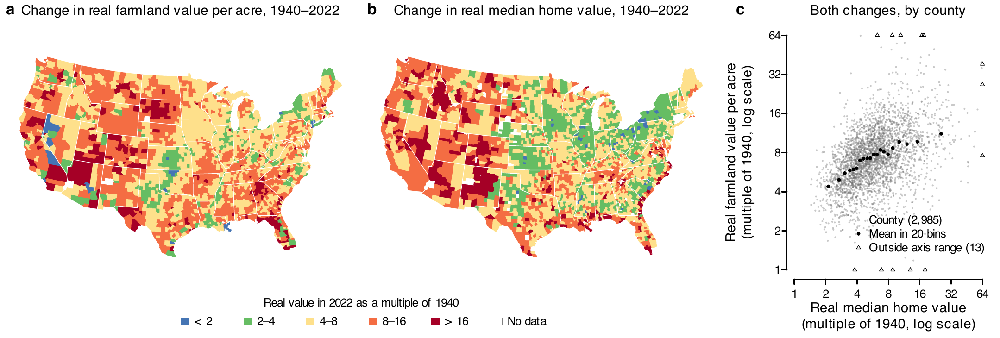
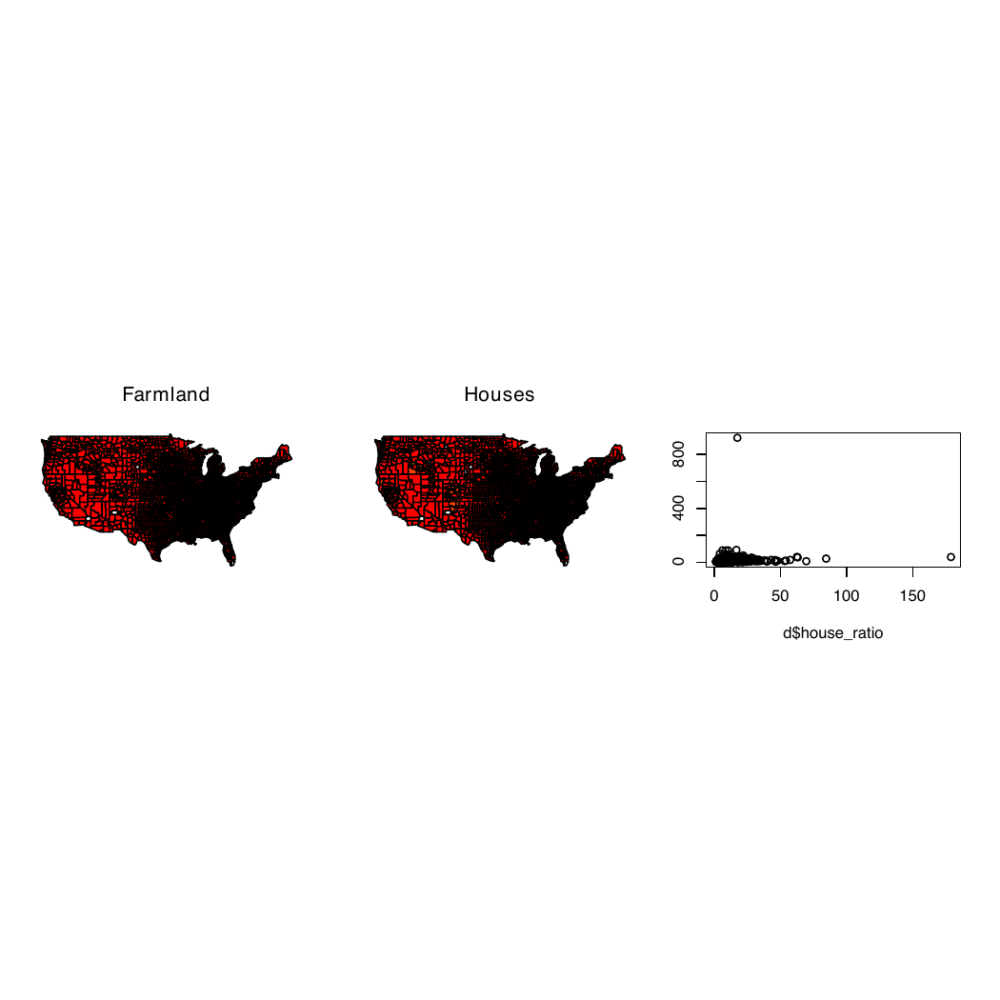
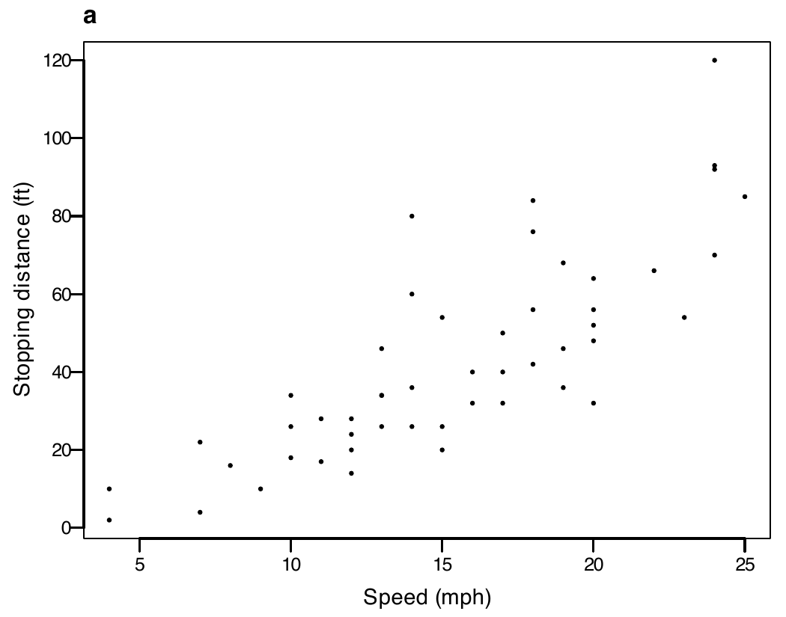
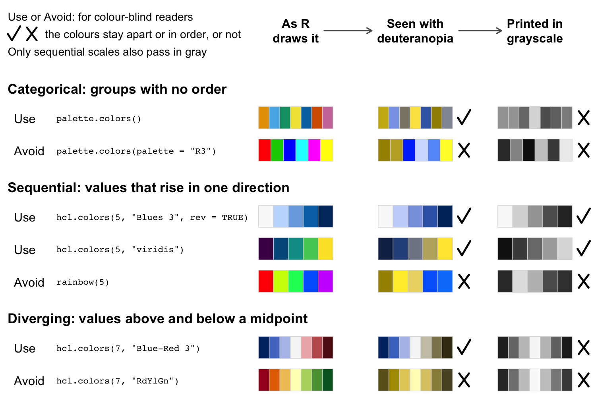
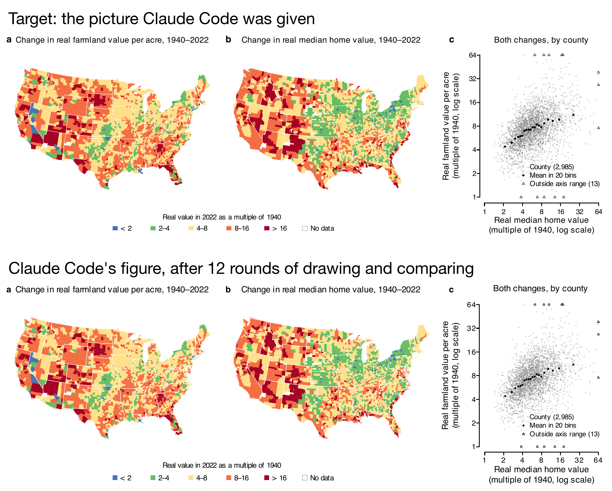
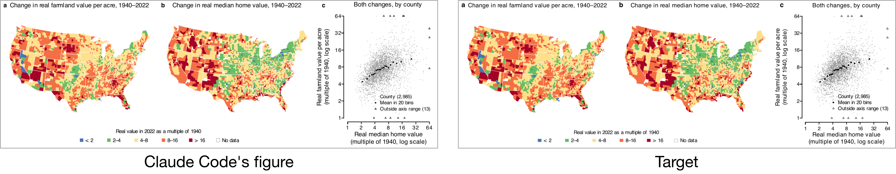
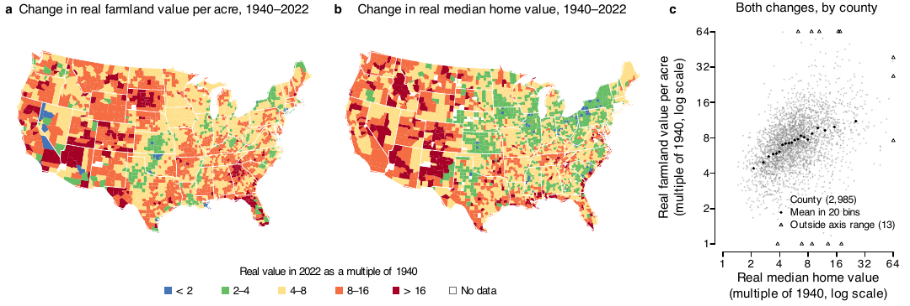
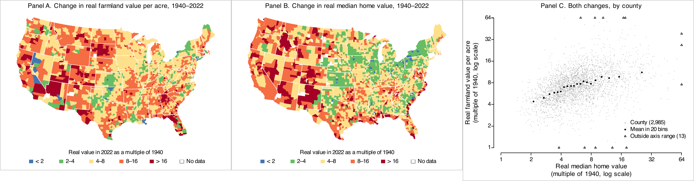
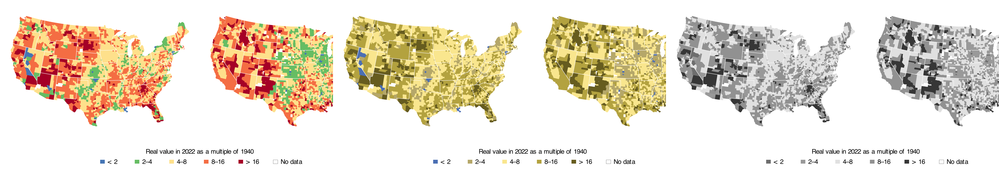

::: {.content-hidden when-format="revealjs"}

[Slides](12-ggplot-slides.html) · [Source](https://github.com/ArielOrtizBobea/aem6850/blob/main/fall-2026/sessions/12-ggplot.qmd)

How to draw a figure to a journal's rules: first by asking an agent to
match a picture of the finished figure, then by writing each journal's
rules in a file that the R code, a checking script and an agent all
read. One figure runs through the session: county maps of how much
farmland values and home values rose from 1940 to 2022, drawn for
*Nature* and for the *American Economic Review*. The project is a [zip file](data/land-house-figure.zip).
Its data, including two licensed files, are a separate download for the
class, with a Cornell NetID:

https://cornell.box.com/s/mx2eg35oytjt2a7xjsapuh8tbq2e6edc

Replace the project's `data` folder with the `data` folder in that zip.

:::

## Plan for today {#plan}

1. **What journals require of your figures**\
   [Technical specifications and readability · Nature · the AER · when
   they ask · presentation and referees · matching them in R ·
   colours]{.topics}
2. **Asking an agent to match a target figure**\
   [The default code · the target picture · Claude Code edits the code
   (live) · what it changed · where it misses · what it costs]{.topics}
3. **Using agents to write spec files and switch journals**\
   [Why a file · YAML · a script that checks a PDF against it · Claude
   Code writes Nature's spec file (live) · the AER's · rewriting the
   script to read the spec · switching journals]{.topics}

::: {.content-visible when-format="revealjs"}

::: {.notes}
From scratch, before the first demo: download data/land-house-figure.zip
from the session page and unzip it in a new folder. Download the data
zip from Box (https://cornell.box.com/s/mx2eg35oytjt2a7xjsapuh8tbq2e6edc) and replace land-house-figure/data with its data
folder. In a terminal in land-house-figure: Rscript code/1_get_data.R
(with the data folder in place it needs no API; under a minute),
then Rscript code/2_clean_data.R, Rscript code/3_figure1.R and Rscript
code/figure1_default.R. The Part 2 demo then runs in match/.
:::

:::

## Figure 1, ready for Nature {#figure1 .smaller}

{fig-alt="Three panels in one row. a and b are county maps of the lower 48 states shaded in five colours from blue to red by how many times the 2022 value is the 1940 value: a for farmland value per acre, b for the median home value. c is a scatter of 2,985 counties, farmland multiple against home multiple on log axes, with 20 binned means rising from about 4 to about 11."}

- **Question:** did farmland values rise more in counties where home
  values rose more?
- **a** Farmland value per acre (Census of Agriculture) and **b** median
  value of an owner-occupied home (1940 census; 2018–2022 American
  Community Survey), each as its 2022 value divided by its 1940 value.
  **c** One against the other, 2,985 counties.
- Real terms: each year's dollars divided by the consumer price index.
  183 mm wide, Nature's two-column width.

::: {.content-visible when-format="revealjs"}

::: {.notes}
This is where the session ends up. Say what each panel is before
anything about format. Then: everything about this file, its width, its
text sizes, its letters, came from a list of rules that R read.
:::

:::

## Figure 1 with R's default settings {#default .smaller}

:::: {.columns}

::: {.column width="44%"}

{style="border: 1px solid #999;" fig-alt="A square page, mostly blank, with three small panels in a row across the middle: two red county maps whose eastern halves are solid black, and a scatter with every point crowded into the lower left corner."}

:::

::: {.column width="56%"}

The same data, with `pdf()`, `par(mfrow = c(1, 3))`,
`map(fill = TRUE)`, `cut(x, 6)` and `plot()`. Nothing else set. The
code is at the start of Part 2.

1. A 7 × 7 in page; no journal prints that size, and two thirds of it
   is blank
2. Fonts named in the file, not embedded in it
3. Six classes of equal width: one outlier stretches them, and 3,052 of
   3,053 counties get the same red
4. No key, and black county borders that turn the East solid
5. Axis labels are variable names, `d$house_ratio`; the y label is cut
   off

:::

::::

# 1 · What journals require of your figures {#part-rules}

::: {.content-visible when-format="revealjs"}

- Two kinds of requirements
- Nature and AER requirements
- When journals ask for the final figure files
- What studies show about presentation and referees
- Matching Nature's requirements in R
- Categorical, sequential and diverging colour scales

:::

## Two kinds of requirements {#two-kinds}

::: {.dashes}

- **Technical specifications**, set by the journal and measured in the
  file:
  - Width and height of the file
  - Text size and line weight, in points (1 pt = 1/72 inch)
  - Fonts embedded: a copy of each typeface inside the file
  - A vector file (PDF or EPS, sharp at any zoom), no pictures inside
- **Readability**, judged by looking at the figure:
  - Can a reader see the main comparison?
  - Is any text cut off, overlapping, or on top of data?
  - Do titles and labels say what is shown, with units?
  - Can every class be told apart, in gray and by a colour-blind reader?
  - Do the class breaks spread the data across the classes?

:::

::: {.content-hidden when-format="revealjs"}

A *vector file* stores shapes and text as geometry, as PDF and EPS do,
so it stays sharp at any zoom; a PNG is a grid of pixels. An *embedded
font* is a copy of the typeface inside the file, so the figure prints the
same on any computer. A *point* (pt) is 1/72 inch.

The technical specifications can be checked by a program that reads the
PDF: each answer is a number, and the journal gives the range it accepts.
Readability needs someone to look at the figure: a person, or an agent
that looks at an image of it. The project splits the work along the same
line: a script measures the specifications, and an agent judges
readability (see "Agents that review and redraw a figure" below).

:::

## Nature and AER requirements for size, fonts and text {#nature}

| Requirement | Nature's words | The AER's words |
|:----|:---------------|:-------|
| Width | "Nature's standard figure sizes are 89 mm wide (single column) and 183 mm wide (double column)." | Not stated |
| Font | "Lettering should be in a sans-serif typeface, preferably Helvetica or Arial, the same font throughout all figures in the paper." | Not stated |
| Text size | "Maximum text size for all other text should be 7 pt; minimum text size should be 5 pt." | Not stated |
| Panel labels | "Separate panels in multi-part figures should each be labelled with 8 pt bold, upright (not italic) a, b, c." | For file names: "use letters for indicating individual panels (e.g., Figure1a.ppt, Figure1b.ppt, Figure1c.ppt, etc.)" |
| Line weight | "Line weights and strokes should be set between 0.25 and 1 pt at the final size" | Not stated |

[Pages: Nature,
[final submission](https://www.nature.com/nature/for-authors/final-submission)
and [preparing figures](https://research-figure-guide.nature.com/figures/preparing-figures-our-specifications/);
[AER style guide](https://www.aeaweb.org/journals/aer/style-guide).
*Not stated*: the rule is yours to set, once for the whole paper.]{.source}

## Nature and AER requirements for files, colour and labels {#aer}

| Requirement | Nature's words | The AER's words |
|:----|:-----------|:-----------|
| File format | "Vector EPS or PDF format for figures containing line drawings and graphs"; "Embed fonts (True Type 2 or 42)" | "Figures must be supplied as vector-based graphics in one of the following formats—vector PDF, EPS, AI, WMF, or PPT." |
| Photographs and images | "All photographic images must be supplied at a minimum of 300 dpi at the maximum size they can be used." | "Photographs and other images (maps, screenshots, etc.) should be provided at 300 dpi" |
| Colour | "Colour artwork can be provided in RGB (recommended) or CMYK format."; "An accessible colour palette to be used" | Not stated |
| Labels | "All axes to be labelled with units in parentheses, e.g. Data (unit)" | "If there are variables (italics) or matrices and vectors (boldface) in figures, they should be designated as such." |

[Pages: Nature,
[final submission](https://www.nature.com/nature/for-authors/final-submission)
and [preparing figures](https://research-figure-guide.nature.com/figures/preparing-figures-our-specifications/);
[AER style guide](https://www.aeaweb.org/journals/aer/style-guide). The AER
also asks that the files "correspond to the figures in your accompanying
PDF".]{.source}

::: {.content-hidden when-format="revealjs"}

The quotes are copied from the journals' pages; the project's
`specs/nature.yml` and `specs/aer.yml` hold the same sentences, each with
the page it comes from. One Nature sentence keeps a typo: "Do not
rasterize or covert text to outlines." The AER's figures section also
says "Source notes, if any, should be placed after other notes related
to the figure."

:::

## When journals ask for the final figure files {#when-files}

- **Nature:** "The Nature journals are flexible with regard to the format
  of initial submissions." "If revisions are requested, the editor will
  provide detailed formatting instructions at that time."
- **AER:** "Adherence to the journal's Style Guide is required for
  accepted articles but is optional at the time of submission."
- **PNAS:** each figure as a separate high-quality PDF or EPS file, with
  the revised manuscript.
- Journals ask for the final files at revision (Nature, PNAS) or at
  acceptance (AER). With the journal's rules in a file and a figure
  script that reads them (Part 3), the final files are one run of the
  script.

[Pages: [Nature, initial submission](https://www.nature.com/nature/for-authors/initial-submission);
[AER, submissions](https://www.aeaweb.org/journals/aer/submissions);
[PNAS, how to submit a manuscript](https://www.pnas.org/author-center/submitting-your-manuscript).]{.source}

## What studies show about presentation and referees {#presentation-evidence .smaller}

- Clear writing and readable tables and figures help a paper with
  referees.
- No study has sent the same paper to referees in the journal's format
  and in a plain one.

::: {.dashes}

- **An experiment on writing**: [Feld, Lines and Ross (JEBO,
  2024)](https://doi.org/10.1016/j.jebo.2023.11.016)
  - Professional editors improved the English of 30 economics papers,
    with the layout unchanged.
  - Economists rated the edited versions 0.2 SD higher and were 8.4
    percentage points more likely to accept them for a conference.
- **Referees' reasons for rejecting**: [Bordage (Acad Med,
  2001)](https://doi.org/10.1097/00001888-200109000-00010)
  - Among the top ten reasons for 123 manuscripts: text difficult to
    follow, and defective tables or figures.
- **A format rule and authors**: [Card and DellaVigna (JEP,
  2014)](https://doi.org/10.1257/jep.28.3.149)
  - After the AER capped submissions at 40 pages in 2008, 21% came in at
    39 or 40 pages, up from 6%.
- **The look of the page**: [Huang (arXiv,
  2018)](https://arxiv.org/abs/1812.08775)
  - A model that saw only page images of computer-vision papers set aside
    half of the weak ones and 0.4% of the good ones.

:::

::: {.content-hidden when-format="revealjs"}

Feld, Lines and Ross had 30 economists rate papers written by economics
PhD students, each economist seeing either the original or the
language-edited version of a paper, never both; most edits were to the
title, abstract and introduction, and the gains came from the papers
that were poorly written to begin with. Bordage analysed the written
comments of reviewers on 151 manuscripts submitted to a medical
education conference; excellent writing was among the main strengths
of the papers accepted unanimously. Card and DellaVigna studied the
AER's page limit; authors met it partly by tightening spacing and
margins. Huang's "weak" papers were workshop papers standing in for
rejections, so the result shows that page layout carries information
about a paper; it does not test how referees respond to layout. A wider review of this literature,
with about fifty studies, found no test of whether following a
journal's format at first submission changes referees' decisions.

:::

## Matching Nature's requirements in R {#printed-size .smaller}

Draw the file at the size it will print. Then every size you set is the
size the reader sees.

| Nature requires | Setting in R |
|:------|:--------|
| 89 mm wide, one column (183 mm for two) | `cairo_pdf(width = 89 / 25.4)`: R takes inches |
| Helvetica or Arial, embedded in the file | `family = "Helvetica"`; `cairo_pdf()` embeds the font |
| Text from 5 to 7 pt | `pointsize = 7` for 7-pt text; `cex.axis = 6 / 7` for 6-pt tick labels |
| Panel letters, 8 pt bold | `mtext("a", font = 2, cex = 8 / 7)` |
| Lines from 0.25 to 1 pt | `lwd = 0.5 / 0.75` for a 0.5-pt line (`lwd = 1` is 0.75 pt) |
| A vector file | `cairo_pdf()` writes one |

[*Point (pt)*: a length, 1/72 inch or about 0.35 mm; a font's size in
points is the height from the top of an h to the bottom of a p. With
`layout()` or `mfrow` and three or more panels, R multiplies every text
size by 0.66: add `par(cex = 1)` after it.]{.source}

::: {.content-hidden when-format="revealjs"}

A journal places a figure at its column width and scales everything in it
by the same factor, so sizes only mean something at the printed width.
Open the file at that width, in inches (25.4 mm to the inch), and set the
text size you want printed. `cairo_pdf()` writes a vector PDF with the
fonts embedded; base R's `pdf()` names the font without embedding it. Both
write a page 7 × 7 inches unless you give `width` and `height`. The Plots
pane in RStudio has no fixed size: a figure saved from it with Export
takes the pane's current size, or what you type in the dialog, so the same
code gives different files on different screens.

:::

## One Nature column, drawn in the R Console {#printed-size-code}

:::: {.columns}

::: {.column width="60%"}

```{.r filename="R Console: writes cars-nature.pdf"}
# cars comes with R: speed (mph) and
# stopping distance (ft) of 50 cars
cairo_pdf("cars-nature.pdf",
          width = 89 / 25.4, height = 70 / 25.4,
          pointsize = 7, family = "Helvetica")
par(mar = c(3, 3.2, 1.6, 0.6), mgp = c(1.8, 0.5, 0),
    cex.axis = 6 / 7,          # 6-pt tick labels
    lwd = 0.5 / 0.75, las = 1) # 0.5-pt box; axes stay 0.75 pt
plot(cars$speed, cars$dist, pch = 16, cex = 0.5,
     xlab = "Speed (mph)",
     ylab = "Stopping distance (ft)")
mtext("a", side = 3, line = 0.4, adj = 0,
      font = 2, cex = 8 / 7)   # 8-pt bold letter
dev.off()
```

:::

::: {.column width="40%"}

{style="border: 1px solid #ccc;" fig-alt="A scatter of R's cars data, speed against stopping distance, drawn 89 mm wide with 7-point axis titles, 6-point tick labels and a bold letter a at the top left."}

The file the code writes, 89 × 70 mm.

:::

::::

- Every number in the code comes from the table on the previous slide.

::: {.content-hidden when-format="revealjs"}

## Setting text sizes in R {#text-sizes}

| You set | Printed size |
|:--|:--|
| `pointsize = 7` when you open the device | 7 pt for text at `cex = 1` |
| `cex.axis = 6/7` | tick labels at 6 pt |
| `mtext("a", cex = 8/7, font = 2)` | an 8-pt bold panel letter |
| `layout()` or `mfrow` with 3 or more panels | every size × 0.66, until `par(cex = 1)` |

Text size in points = `pointsize` × `cex`. `pointsize` is the size of
ordinary text, in points (1/72 inch), for the whole file.

::: {.content-hidden when-format="revealjs"}

`cex` is a multiplier, not a size. The base it multiplies is the
`pointsize` the device was opened with, 12 unless you say otherwise.
`layout()` and `par(mfrow = )` quietly set `cex` to 0.66 when there are
three or more rows or columns (0.83 for exactly two by two), so a three
panel figure drawn at pointsize 7 prints its text at 4.6 pt unless
`par(cex = 1)` comes right after `layout()`.

:::

:::

::: {.content-hidden when-format="revealjs"}

## Setting line widths in R {#line-widths}

- On R's PDF devices, "Line widths are multiples of 1/96 inch":
  `lwd = 1` is 0.75 pt.
- Measured in a `cairo_pdf()` file before class: `lwd` 0.5, 1, 2 and 4
  drew lines of 0.375, 0.75, 1.5 and 3 pt.
- Nature's 0.25 to 1 pt is `lwd` 0.33 to 1.33.

```{.r filename="R Console: writes lines.pdf, three lines at 0.25, 0.5 and 1 pt"}
pt_to_lwd <- function(pt) pt / 0.75     # also in the project's R/fig_style.R
cairo_pdf("lines.pdf", width = 89 / 25.4, height = 30 / 25.4)
plot(NA, xlim = c(0, 1), ylim = c(0.5, 3.5), axes = FALSE, ann = FALSE)
abline(h = 1:3, lwd = pt_to_lwd(c(0.25, 0.5, 1)))
dev.off()
```

[Source: R's help page, `?pdf`. The measurement converted the PDF to SVG
with `pdftocairo` and read each stroke's width.]{.source}

:::

## Categorical, sequential and diverging colour scales {#colours .smaller}

{fig-align="center" fig-alt="Seven palettes in three groups, categorical, sequential and diverging, each marked use or avoid with the R call that makes it, in three columns: as R draws them, as a person with deuteranopia sees them, and printed in grayscale. A tick or a cross after the last two columns says whether the colours stay apart or in order there. All palettes marked use pass for deuteranopia; only the two sequential ones also pass in grayscale."}

- *Deuteranopia*: red–green colour blindness. The eye lacks the cones
  that sense green, so reds and greens look alike.

["About 1 in 12 men have color vision deficiency", most often red and
green ([National Eye Institute](https://www.nei.nih.gov/learn-about-eye-health/eye-conditions-and-diseases/color-blindness)).
Okabe-Ito colours: [Wong (Nature Methods, 2011)](https://doi.org/10.1038/nmeth.1618),
the paper Nature's guide cites. Simulation: [Machado, Oliveira and
Fernandes (IEEE TVCG, 2009)](https://doi.org/10.1109/TVCG.2009.113), full
severity.]{.source}

::: {.content-hidden when-format="revealjs"}

In the image, *Use* and *Avoid* are for readers with colour blindness. A
tick means the colours stay apart (categorical) or keep their order
(sequential, diverging) in that column; a cross means they do not. Only
the sequential scales also pass in grayscale, so a figure with categories
or a diverging scale that may be printed in gray needs labels, shapes or
line types as well as colour.

Pick the kind of scale from the data. **Categorical** colours mark groups
with no order, such as regions; they only need to look different from one
another, and the Okabe-Ito colours in `palette.colors()` stay different
for readers with deuteranopia. **Sequential** colours show values that
rise in one direction; the lightness must rise with them, from light to
dark, so the order survives in gray and for colour-blind readers.
`rainbow()` fails that test: its yellow and green are lighter than its
red and blue, so the middle classes look brighter than the ends.
**Diverging** colours show values above and below a midpoint that means
something, such as zero change; two hues meet at a light middle. Red and
green at the two ends is the classic failure, since a reader with
deuteranopia sees both ends as olive.

Figure 1's blue-to-red scale runs through green, yellow and orange, a
rainbow scale: easy to tell apart in colour, and the checks show its
cost, with green and orange alike for deuteranopia and close in gray.

:::

## Exercise 1 {#exercise-1}

::: {.panel-tabset}

### Exercise

```r
# Exercise 1 (3 minutes). Pen and paper, or the Console.
#
# Nature's double column is 183 mm wide. You want text at
# 7 pt, tick labels at 6 pt and lines at 1 pt.
# There are 25.4 mm in an inch.
#
# 1. Write the cairo_pdf() call that opens figure1.pdf,
#    183 mm wide and 100 mm tall, with 7-point text in
#    Helvetica.
# 2. Which cex.axis gives 6-point tick labels, and which
#    lwd gives a 1-point line?
#
# Two answers to compare with the room: the width in
# inches, and the lwd.
```

### Solution

```r
cairo_pdf("figure1.pdf", width = 183 / 25.4, height = 100 / 25.4,
          pointsize = 7, family = "Helvetica")   # 7.20 by 3.94 in
6 / 7         # cex.axis = 0.86 gives 6-pt tick labels
1 / 0.75      # lwd = 1.33 gives a 1-pt line
```

::: {.content-visible when-format="revealjs"}

A width of **7.20 in** (183 / 25.4), and **lwd = 1.33** (1 / 0.75).

:::

::: {.content-visible when-format="revealjs"}

::: {.notes}
Before students start: start the Part 2 demo so it runs during the
exercise (slide 18 has the prompt; in a terminal in match/, claude,
Shift+Tab, paste, "don't ask again" for Rscript and pdftoppm).
Debrief (1 min). Both answers come straight from the table: divide mm by
25.4 for inches, and points by 0.75 for lwd. Ask what happens to the
text if the same file is shrunk into one column (it halves to 3.5 pt,
below Nature's 5 pt).
:::

:::

:::

# 2 · Asking an agent to match a target figure {#part-match}

::: {.content-visible when-format="revealjs"}

- The default code for Figure 1
- The target: a picture of Figure 1 for Nature
- Claude Code edits the code to match the picture (live)
- What it drew, and what it changed
- Where it misses Nature's rules
- Exercise 2
- What matching a picture costs

:::

::: {.content-hidden when-format="revealjs"}

## The project's files {#project .smaller}

```{.default filename="land-house-figure/"}
code/1_get_data.R        downloads the public files
code/2_clean_data.R      one row per county: data_clean/counties.rds
code/3_figure1.R         Figure 1, for the journal named at the top
code/figure1_default.R   Figure 1 with R's defaults
R/fig_style.R            open_fig() and the other drawing helpers
specs/nature.yml         Nature's rules, with the journal's words
specs/aer.yml            the AER's rules, and our own
tools/check_fig.R        measures a PDF against a spec
.claude/agents/          figure-critic.md, figure-builder.md
data/                    raw files, exactly as downloaded
```

- [Download the project](data/land-house-figure.zip) (a zip file).
- Two data files are licensed and not included. Its `README.md` says how
  to get them.
- Both spec files were written before class, with each quote checked
  against the journals' pages. The code runs with them as they are.
- The live demo in Part 3 writes `specs/nature.yml` again, in a separate
  copy of the project.

:::

::: {.content-hidden when-format="revealjs"}

## The data {#data .smaller}

|  | Farmland value per acre | Median home value |
|:--|:--|:--|
| 1940 | Census of Agriculture, county file by Haines, Fishback and Rhode (ICPSR) | 1940 census, via IPUMS NHGIS |
| 2022 | Census of Agriculture, NASS Quick Stats | American Community Survey, 2018–2022, via IPUMS NHGIS |
| Counties | 3,053 | 3,016 |

- Real terms: prices rose 20.9-fold from 1940 to 2022 (consumer price
  index, BLS). 2,985 counties have both.
- The median county's farmland was worth 7.3 times its 1940 value in
  2022, its homes 5.5 times. Home values are not adjusted for quality: a
  2022 home is larger and better equipped.

[*ICPSR* and *IPUMS NHGIS*: archives that distribute research data under
terms that forbid passing the files on; each user needs a free account.
*Median*: the value with half the homes above and half below.]{.source}

::: {.content-hidden when-format="revealjs"}

Farmland value is the Census of Agriculture's value of land and buildings
per acre. The 1940 values come from Haines, Fishback and Rhode's county
files ([ICPSR 35206](https://doi.org/10.3886/ICPSR35206.v4)), part 1;
that file gives three Kansas and Georgia counties a neighbour's code,
which `2_clean_data.R` corrects. The 2022 values come from NASS's Quick
Stats API, which goes back only to the 1997 census at the county level.
The 1940 median home value is NHGIS table NT74 from the 1940 census, the
first census of housing; the 2022 value is the American Community Survey
median for 2018–2022, in 2022 dollars
([NHGIS](https://doi.org/10.18128/D050.V21.0)). Both are deflated with the
consumer price index for all urban consumers. The 1940 period comes
before the Interstate highways, which began in 1956.

:::

:::

## The default code for Figure 1 {#default-code .smaller}

:::: {.columns}

::: {.column width="60%"}

```{.r filename="code/figure1_default.R (part); runs after code/2_clean_data.R has built data_clean/ from the two licensed files"}
library(maps)
d <- readRDS("data_clean/counties.rds")
poly <- map("county", plot = FALSE, namesonly = TRUE)
fips <- sprintf("%05d",
  county.fips$fips[match(poly, county.fips$polyname)])
pdf("figures/default/figure1.pdf")
par(mfrow = c(1, 3))
map("county", fill = TRUE,
    col = heat.colors(6)[cut(d$land_ratio[match(fips, d$fips)], 6)])
title("Farmland")
map("county", fill = TRUE,
    col = heat.colors(6)[cut(d$house_ratio[match(fips, d$fips)], 6)])
title("Houses")
plot(d$house_ratio, d$land_ratio)
dev.off()
```

:::

::: {.column width="40%"}

{style="border: 1px solid #999;" fig-alt="The default version of Figure 1: a square page, mostly blank, with three small panels in a row."}

:::

::::

- `d` has one row per county. `land_ratio` and `house_ratio` are the 2022
  value divided by the 1940 value.
- [Download the project](data/land-house-figure.zip) (a zip file), then
  [its data](https://cornell.box.com/s/mx2eg35oytjt2a7xjsapuh8tbq2e6edc) (Cornell NetID login): replace the project's `data`
  folder with the one in the data zip.

::: {.content-hidden when-format="revealjs"}

`cut(x, 6)` splits the range from the smallest to the largest value
into six equal parts. One county's farmland is worth 924 times its 1940
value, so the first class runs from 0.4 to about 154 and holds every
county but one.

:::

## The target: a picture of Figure 1 for Nature {#target .smaller}

{fig-alt="The target: Figure 1 for Nature, three panels in one row, the two county maps and the scatter."}

- `target/figure1.png`: the figure from "Figure 1, ready for Nature" as a
  picture at 300 dpi (pixels per inch): 2,159 × 730 pixels, 183 mm wide
  in print.
- It stands in for a published figure whose look you want to copy. We
  drew it before class with the project's finished script (Part 3).
- The project's `match/` folder holds three things: this picture, a copy
  of the default code, and the data.
- Claude Code starts in `match/`, with no list of Nature's rules and none
  of the code that drew the target.
- The prompt says "Use only the files in this folder", and Claude Code
  asks before it reads anything outside it.

## Live demo: Claude Code edits the code to match the picture {#match-live .smaller}

```{.markdown filename="Prompt to paste into Claude Code"}
code/figure1_default.R draws figures/default/figure1.pdf. target/figure1.png
is a 300-dpi picture of the figure I want, at its printed size. Edit
code/figure1_default.R so that the PDF it draws matches the target as
closely as you can: size, layout, colours, class breaks, keys, titles, axis
labels, text sizes and line weights. Run the script, turn the PDF into a
PNG with pdftoppm, compare it with the target, and repeat until you cannot
get closer. Use only the files in this folder. When you finish, list the
changes you made.
```

- Claude Code runs live, in `match/`. It takes about six minutes.
- It asks before it edits a file or runs a command. Press Shift+Tab once
  to accept its edits, and answer "don't ask again" the first time it
  asks to run `Rscript` and `pdftoppm` (PDF to picture).

::: {.content-visible when-format="revealjs"}

::: {.notes}
From scratch, in the unzipped land-house-figure folder (see the Plan
slide's notes for the data steps): cd match, type claude, accept the
trust dialog, press Shift+Tab once (accept edits), paste the prompt.
At its first Rscript and pdftoppm requests choose "don't ask again".
Let it run to the end; the test run took 335 seconds and 12 rounds.
Talk through what it does: draws, turns the PDF into a picture, reads
the picture, edits. If it asks to read anything outside match/,
decline. When it finishes, open match/figures/default/figure1.pdf next
to target/figure1.png. The next three slides are the test run, for
comparison. The live figure gets measured in Part 3, on "The checking
script on three versions of Figure 1".
:::

:::

## What Claude Code drew {#match-result .smaller}

{.r-stretch fig-alt="Two versions of Figure 1, one above the other: the target picture, and the figure Claude Code drew after 12 rounds. They are hard to tell apart; the panel letters in Claude Code's version are slightly smaller."}

- A test run before class: 335 seconds, 12 rounds of drawing and
  comparing.
- Its own pixel-by-pixel comparison found the two almost the same.

## What Claude Code changed in the code {#match-changes .smaller}

```{.r filename="code/figure1_default.R after the test run (part)"}
W <- 7.2; H <- 2.433
cairo_pdf("figures/default/figure1.pdf", width = W, height = H,
          family = "Helvetica", pointsize = 7)
breaks <- c(0, 2, 4, 8, 16, Inf)
pal    <- c("#4575B4", "#66BD63", "#FEE08B", "#F46D43", "#A50026")
page_text(x0, 0.97, letter, adj = c(0, 0.5), font = 2, cex = 1.05)
kx <- (362 + 125.2 * (0:5)) / 2000
```

- The script grew from 20 lines to 100.
- It swapped `pdf()` for `cairo_pdf()` and set the page to 7.2 × 2.43
  in, with 7-pt Helvetica.
- It read the five colours off the picture's pixels. They are the
  target's colours exactly.
- It placed the titles and the key where it measured them on the
  picture: `page_text()`, a function it wrote, puts text at a fraction
  of the page, and `kx` holds those fractions.

## Claude Code's figure misses two of Nature's rules {#match-measured .smaller}

{fig-alt="Claude Code's figure and the target side by side. They look the same."}

| Text | Nature's rule (Part 1) | Claude Code's code (test run) | Size in print |
|:------|:------|:------|:------|
| Panel titles | at most 7 pt | `cex = 1.05` at `pointsize = 7` | 7.35 pt |
| Panel letters | 8-pt bold | `font = 2, cex = 1.05` | 7.35 pt |

- A picture shows how a figure looks, without the numbers behind it.
  Claude Code set the sizes to match the widths of words in pixels: at
  300 dpi, half a point is about two pixels.
- Matching a picture gets close, and will rarely be exact.
- Meeting a journal's rules exactly takes the rules themselves, which
  Part 3 gives the agent.

## Exercise 2 {#exercise-2 .smaller}

::: {.panel-tabset}

### Exercise

**Five minutes, in Claude; a chat is enough.**

1. Save [the picture](figures/12-publication-graphics/F03-cars-nature.png):
   the figure from "One Nature column, drawn in the R Console", at 300
   dpi.
2. Attach it in Claude with this prompt:

```{.markdown filename="Prompt to paste into Claude, with the picture attached"}
The attached picture is a 300-dpi picture of a figure, at its printed
size. My R code draws the same data but looks nothing like it:

pdf("cars.pdf")
plot(cars$speed, cars$dist)
dev.off()

Change my code so that the PDF it draws matches the picture as closely as
you can: size, font, text sizes, line weights, labels, point style and the
letter. Give me the full code.
```

3. Compare its numbers with the code on "One Nature column": width and
   height, `pointsize`, `cex.axis`, `lwd`, the letter's `cex`, and the
   PDF function (`pdf()` or `cairo_pdf()`).

Two answers to compare with the room: which numbers it matched, and
which it guessed.

### Solution

Three runs of the prompt before class, in a chat, with no code run:

| Setting | Code on "One Nature column" | Run 1 | Run 2 | Run 3 |
|:--------|:---|:---|:---|:---|
| Size | 89 × 70 mm | 89 × 70 mm | 89 × 70 mm | 89 × 69 mm |
| Tick labels | 6 pt | 5.5 pt | 5 pt | 6 pt |
| Axis lines | 0.75 pt | 1.1 pt | 1.1 pt | 1.2 pt |
| Panel letter | 8 pt | 8 pt | 8 pt | 7 pt |
| PDF function | `cairo_pdf()` | `pdf()` | `pdf()` | `pdf()` |

- All three got the size and the 7-pt Helvetica.
- Each run typed different numbers for the rest.
- In the picture the axes (0.75 pt) look heavier than the box (0.5 pt).
  All three runs saw that and overshot, past Nature's 1-pt maximum.
- All three used `pdf()`, so the fonts are not embedded.

::: {.content-visible when-format="revealjs"}

::: {.notes}
Optional, before students start: start the rewrite demo so it runs
during the exercise (slide 35: in match/, cp -R ../specs . then claude,
paste the prompt; about 4 minutes).
Debrief (1 min). Ask who got the size right (most will: it is in the
pixels and the dpi), then who got 6-pt tick labels and 0.75-pt axes.
Different answers around the room are the point of the next slide.
:::

:::

:::

## What matching a picture costs {#match-costs .smaller}

- Every number is typed into the script: the page size, the text sizes,
  the colours, and positions measured in the picture's pixels.
- Some numbers are guesses: the titles came out 0.35 pt over Nature's
  limit, the panel letters 0.65 pt short.
- The same prompt gives different numbers on each run.
- The next figure in the paper needs the same work again.
- A second journal needs a new target picture and another run.
- Nothing in the script says where a number came from.

# 3 · Using agents to write spec files and switch journals {#part-spec}

::: {.content-visible when-format="revealjs"}

- Why write the requirements in a file, and what YAML is
- The spec file for Nature, and a script that checks a PDF against it
- Claude Code writes the spec file for Nature (live), and checking it
- The spec file for the AER
- Claude Code rewrites the script to read the spec files
- `open_fig()`, panel labels, and switching journals

:::

## Why write the requirements in a file {#why-file .smaller}

- The file is `specs/nature.yml`, a short text file of Nature's
  requirements: widths, fonts, text sizes, panel labels, line weights.
- Each requirement carries the journal's own words and the page they
  come from. We call the file the *spec*, short for specification.
- Three programs read it:
  - R, to set the size and fonts when it draws
  - The checking script, `tools/check_fig.R`, to measure the PDF
  - Claude Code, when it writes or edits figure code
- In Part 2 the agent had only a picture, so it guessed the sizes. With
  the spec it reads them.
- Edit a value in the file, and every figure drawn after that uses the
  new value.

## What a YAML file is {#yaml .smaller}

::: {.dashes}

- **What it is:** a plain-text file of settings, one `name: value` per
  line, ending in `.yml` or `.yaml`.
  - Indenting by two spaces puts a value inside the name above it.
  - `{min: 5, max: 7}` is the one-line form of `min: 5` and `max: 7`
    indented under the name.
  - A `#` after a space starts a comment.
  - Text with a colon followed by a space goes in quotes.
- **What uses it:** settings that a person writes and a program reads.
  - The header at the top of a Quarto document, and `_quarto.yml`
  - GitHub's automated jobs (`.github/workflows/`)
- **What reads it:** Quarto and GitHub, for their own settings · R, with
  the yaml package · Python, with PyYAML · an agent, as text

:::

```{.r filename="R Console; needs the yaml package (install.packages(\"yaml\"))"}
library(yaml)
s <- read_yaml(text = "
text_pt:
  value: {min: 5, max: 7}
")
s$text_pt$value$max      # a list inside a list
#> [1] 7
```

## The spec file for Nature {#spec-file .smaller}

```{.yaml filename="specs/nature.yml (part)"}
text_pt:
  value: {min: 5, max: 7}
  quote: "Maximum text size for all other text should be 7 pt; minimum text size should be 5 pt."
  source: final

panel_label:
  value: {pt: 8, bold: true, case: lower, placement: inside}
  quote: "Separate panels in multi-part figures should each be labelled with 8 pt bold, upright (not italic) a, b, c."
  source: final (size, bold, lower case); house (letter at top left)

line_pt:
  value: {min: 0.25, max: 1}
  quote: "Line weights and strokes should be set between 0.25 and 1 pt at the final size (lines thinner than 0.25 pt may vanish in print)."
  source: final
```

::: {.dashes}

- Each rule has three parts:
  - `value`: what R and the checking script use
  - `quote`: Nature's sentence, word for word
  - `source`: the page, listed under `pages:` at the top of the file,
    or `house` for our own choice where the pages say nothing
- This file comes with the session's project. We wrote it before class
  and checked each quote against Nature's pages.
- Later in this part, live, Claude Code writes it again from Nature's
  pages.

:::

## A script that checks a PDF against the spec file {#check-why .smaller}

::: {.dashes}

- With Nature's rules in a file, a script can measure any PDF against
  them.
- `tools/check_fig.R` reads `specs/<journal>.yml`, measures the PDF, and
  prints one line per rule: `PASS` or `FAIL`, and what it measured.
- It works on any PDF figure, drawn in R, Python or anything else, for
  any journal with a spec file.
- It checks the rules the spec sets as numbers:
  - Width and height, fonts and whether they are embedded
  - Text sizes and panel letters
  - Line weights, and pictures pasted inside the PDF
- Readability is left to a person, or to an agent that looks at the
  figure.
- It comes in the project zip, in `tools/`, written with Claude Code
  before class: 137 lines of R.
- It needs poppler's command-line tools (on a Mac, `brew install
  poppler`) and the R packages yaml and magick.

:::

## Asking Claude Code for a checking script {#check-prompt .smaller}

```{.markdown filename="Prompt to paste into Claude Code, in a folder with specs/ and some PDFs (a test run, before class)"}
specs/nature.yml and specs/aer.yml hold two journals' rules for figures,
each with the journal's words. Write tools/check_fig.R, an R script run as
  Rscript tools/check_fig.R <pdf> <journal>
that measures the PDF against specs/<journal>.yml and prints one line per
rule, PASS or FAIL, with what it measured: the page width and height
(pdfinfo), the fonts and whether each is embedded (pdffonts), the size of
every word of text (pdftotext -bbox), the panel letters, and the line
weights (pdftocairo -svg). Read every number from the spec file; type none
into the script. Test it on the PDFs in pdfs/. pdfs/cars-nature.pdf was
drawn 89 x 70 mm with 7-pt text, 6-pt tick labels, an 8-pt bold letter a
and 0.5-pt lines, with embedded fonts, so it should pass every Nature rule.
```

- The test run took about 8 minutes and wrote a 461-line script.
- On Claude Code's Part 2 figure it found the same two failures as the
  project's script, and it passed the target.
- It also passed the default figure's missing panel letters ("single
  panel?"), where the project's script fails them: check a generated
  checker on files whose answers you know.

## How the checking script measures the width {#checker-how .smaller}

```{.bash filename="Terminal, in the project folder: the tool the script runs for the width"}
pdfinfo figures/default/figure1.pdf
```

```{.default filename="Output (one line of it)"}
Page size:       504 x 504 pts
```

::: {.dashes}

- 504 pt × 25.4 / 72 = 177.8 mm. The spec allows 89, 120 or 183 mm
  (one column, a column and a half, two columns), so
  the width fails.
- The other checks follow the same steps, with other tools that read
  the PDF:
  - `pdffonts`: each font, and whether it is embedded
  - `pdftotext -bbox`: a box around every word; its height is the text
    size
  - `pdftocairo -svg`: every line, with its width in points
- The script runs these tools and compares each result with Nature's
  number.

:::

[Text sizes are exact for embedded fonts and read about half a point low
for fonts that are not embedded.]{.source}

## The checking script on three versions of Figure 1 {#checker .smaller}

```{=html}
<table class="versions">
<colgroup><col style="width:27%"><col style="width:13%"><col style="width:14%"><col style="width:17%"><col style="width:15%"><col style="width:14%"></colgroup>
<thead><tr><th>Figure</th><th>Width</th><th>Fonts embedded</th><th>Text size</th><th>Panel letters</th><th>Other five checks</th></tr></thead>
<tbody>
<tr><td><br>Default code</td><td>FAIL, 177.8 mm</td><td>FAIL, 0 of 2</td><td>FAIL, up to 9.2 pt</td><td>FAIL, none</td><td>PASS</td></tr>
<tr><td><br>Claude Code (Part 2)</td><td>PASS</td><td>PASS</td><td>FAIL, up to 7.3 pt</td><td>FAIL, 7.3 pt</td><td>PASS</td></tr>
<tr><td><br>Target</td><td>PASS</td><td>PASS</td><td>PASS, 6 to 7 pt</td><td>PASS, 8 pt</td><td>PASS</td></tr>
</tbody>
</table>
```

```{.bash filename="Terminal, in the project folder: one run per PDF"}
Rscript tools/check_fig.R figures/default/figure1.pdf nature
```

::: {.content-visible when-format="revealjs"}

::: {.notes}
Live: measure the figure Claude Code drew in Part 2, from the project
folder: Rscript tools/check_fig.R match/figures/default/figure1.pdf
nature. Compare with the table (the test run's figure).
:::

:::

## Live demo: Claude Code writes the spec file for Nature {#spec-live .smaller}

::: {style="font-size:1.1em"}

```{.markdown filename="Prompt to paste into Claude Code"}
Read Nature's instructions for figures on these two pages:
https://www.nature.com/nature/for-authors/final-submission
https://research-figure-guide.nature.com/figures/preparing-figures-our-specifications/
Write specs/nature.yml in the same format as specs/aer.yml, with the same
rule names and the same shape of value, so that R/fig_style.R and
tools/check_fig.R can read it. Add height_mm_max. For each rule give the
value, the exact words it comes from, and which page. Where the pages say
nothing, write "not stated".
```

:::

- Claude Code runs live, in the project folder, with the shipped
  `specs/nature.yml` moved aside. It takes about two minutes.
- The prompt names `specs/aer.yml` as the format to copy, since that
  file is still there.
- You do not need to run it: the project you download already has the
  file shown on "The spec file for Nature".

::: {.content-visible when-format="revealjs"}

::: {.notes}
In the unzipped land-house-figure folder (the project root, not
match/): move the shipped file aside first, mv specs/nature.yml
~/Desktop/nature-shipped.yml, then type claude and paste the prompt. It
asks to fetch two pages and to run curl; read and approve. The test run
took 117 seconds. If it stalls or its file fails the next slide's
check, put the shipped file back: cp ~/Desktop/nature-shipped.yml
specs/nature.yml. For the next slide, cars-nature.pdf must be in the
project folder: run the R Console code from "One Nature column" with the
project folder as R's working directory.
:::

:::

::: {.content-hidden when-format="revealjs"}

The prompt names the two source pages and the format to copy. It says
why the format matters: two programs read the file. It also says what
each rule must carry, and what to write when the journal is silent. "The
exact words" is what makes the result checkable. To run it: unzip the project, delete
`specs/nature.yml` so the agent writes it fresh, open a terminal in the
project folder, type `claude`, and paste the prompt. In a run before
class, Claude Code asked twice for permission: to fetch the two pages,
and to run `curl` when its fetch tool could not load Nature's submission
page.

:::

## Checking the spec file Claude Code wrote {#spec-check .smaller}

1. **The values:** read each value against its quote, and find each
   quote on Nature's pages.
2. **The rule names:** in a terminal in the project folder, run
   `Rscript tools/check_fig.R cars-nature.pdf nature`, with the PDF from
   Part 1's cars code copied into that folder. It meets every rule, so
   all nine checks should print `PASS`.

| Check | Run 1 | Run 2 |
|:--------------|:---|:---|
| height | not run | PASS |
| font | FAIL | PASS |
| panel letters | not run | PASS |
| width, fonts embedded, text on page, text size, line weight, vector only | PASS | PASS |

- Two runs before class: run 2 used the prompt on the previous slide,
  run 1 was told only "the same format as `specs/aer.yml`".
- Run 1's quotes matched Nature's pages. It wrote `height_mm` for
  `height_mm_max`, `size_pt` for `pt`, and the font as a list.
- When the height or panel-letter rule is missing, the script skips
  that check without a message.

::: {.content-hidden when-format="revealjs"}

The first run's file also stops R when it draws: the project's
`open_fig()`, shown later in this part, passes the font to `cairo_pdf()`, which reports
`invalid 'family' argument` when the font is a list. The second run
marked the rules the pages do not state as house rules: where the panel
letter goes, and colours that stay distinct in gray.

:::

## The spec file for the AER {#spec-aer .smaller}

```{.yaml filename="specs/aer.yml (part)"}
panel_label:
  value: {placement: title}
  quote: "Be sure to label your figure files clearly, taking special care to use letters for indicating individual panels (e.g., Figure1a.ppt, Figure1b.ppt, Figure1c.ppt, etc.)."
  source: style (letters in file names); house ("Panel A." in the title)

width_mm:
  value: {panel: 115}
  quote: not stated
  source: house

text_pt:
  value: {min: 7, max: 9}
  quote: not stated
  source: house
```

[*House rule*: one the journal does not set, chosen once for the whole
paper and marked `source: house`. The AER's style guide sets the file
format, letters in the names of panel files, and where source notes go.
Our house rules: one file per panel, "Panel A." in the title, panels
115 mm wide, text 7 to 9 pt, lines 0.5 to 1.5 pt, colours that stay
distinct in gray.]{.source}

## Claude Code rewrites the script to read the spec files {#wrap-prompt .smaller}

```{.markdown filename="Prompt to paste into Claude Code, in match/, after copying the project's specs/ into it"}
code/figure1_default.R draws Figure 1 for Nature, with every width, font,
text size and line weight typed into the script. specs/nature.yml and
specs/aer.yml hold each journal's rules, with the journal's words.
1. Write R/fig_style.R with three functions: read_spec(journal), which
   reads specs/<journal>.yml; open_fig(), which opens a PDF at the
   journal's width with its font, text size and line weight; and a
   function that draws a panel's label the way the journal asks.
2. Copy the script to code/figure1.R and change it so that
   journal <- "nature" at the top picks the spec, and the script itself
   types no width, font, text size or line weight. For the AER, write one
   file per panel, as specs/aer.yml says.
3. Run it for both journals and check the PDFs with pdfinfo and pdffonts.
Do not print the data; you do not need to look at it. When you finish,
list what you changed.
```

- The goal: take the typed numbers out of Claude Code's Part 2 script,
  so that one word at the top picks the journal.
- Live, in `match/` after `cp -R ../specs .`. The test run took about
  four minutes.

::: {.content-visible when-format="revealjs"}

::: {.notes}
In a terminal in match/: cp -R ../specs . then claude (same session or
a new one), paste the prompt. It writes R/fig_style.R and code/figure1.R
and draws figures/nature/ and figures/aer/. To measure from the project
folder: Rscript tools/check_fig.R match/figures/nature/figure1.pdf nature.
The next slide is the test run's result.
:::

:::

## What the rewrite produced {#wrap-result .smaller}

- `R/fig_style.R`, 92 lines: `read_spec()`, `open_fig()`, a panel-label
  function, and one it added unasked, to undo the text shrink of R's
  `layout()`.
- `code/figure1.R`, 128 lines, with no width, font, text size or line
  weight typed in.
- It fixed the two broken rules on its own: titles and letters at
  7.35 pt became 7 pt and 8 pt.
- Measured: the Nature file passes all nine checks, and the three AER
  files pass theirs.
- Where a spec gives a range, it chose the size and wrote its rule at
  the top of `R/fig_style.R`.
- The project ships its own versions, written before class:
  `R/fig_style.R` and `code/3_figure1.R`. The next slides use them.

## `open_fig()` opens the PDF with the spec's settings {#open-fig .smaller}

```{.r filename="R/fig_style.R (part); runs in R from the project folder; needs the yaml package"}
read_spec <- function(journal) {
  r <- read_yaml(file.path("specs", paste0(journal, ".yml")))
  list(journal  = journal,
       width_mm = r$width_mm$value,
       font     = r$font$value,
       text_pt  = r$text_pt$value,
       label    = r$panel_label$value,
       line_pt  = r$line_pt$value,
       panels   = r$file$value$panels)
}

open_fig <- function(path, spec, width, height_mm) {
  cairo_pdf(path, width = spec$width_mm[[width]] / 25.4,
            height = height_mm / 25.4,
            pointsize = spec$text_pt$max, family = spec$font)
  par(las = 1, mgp = c(1.5, 0.4, 0), tcl = -0.3, lwd = line_lwd(spec))
}
```

- `open_fig()` is a *wrapper*: a short function that calls other
  functions with some arguments filled in.
- It passes the spec's width, font, text size and line weight to
  `cairo_pdf()` and `par()`. Figure scripts never type them.
- Try it in R from the project folder, no data needed:
  `source("R/fig_style.R")`,
  `open_fig("cars.pdf", read_spec("nature"), "single", 70)` (`"single"`
  is a width named in the spec), `plot(cars)`, `dev.off()`.

## Panel labels for each journal {#panel-letters .smaller}

```{.r filename="R/fig_style.R (part); in R, from the project folder, after source(\"R/fig_style.R\")"}
draw_panel_title <- function(letter, title, spec, at = par("usr")[1]) {
  if (spec$label$placement == "inside") {
    mtext(title, side = 3, line = 0.4)
    mtext(letter, side = 3, line = 0.4, adj = 0, at = at, font = 2,
          cex = spec$label$pt / spec$text_pt$max)
  } else {
    mtext(paste0("Panel ", toupper(letter), ". ", title), side = 3,
          line = 0.4)
  }
}
```

::: {.dashes}

- **Nature:** an 8-pt bold lowercase letter on each panel, as Nature
  asks.
  - Its pages do not say where the letter goes. We put it at the top
    left.
  - The three panels share one file, laid out as we want them printed.
- **AER:** "Panel A." before each panel's title, our house rule.
  - The style guide's one sentence on panels is about file names: "use
    letters for indicating individual panels (e.g., Figure1a.ppt,
    Figure1b.ppt, Figure1c.ppt, etc.)".
  - It does not require one file per panel. We follow its example and
    write `Figure1a.pdf` to `Figure1c.pdf`.

:::

::: {.content-hidden when-format="revealjs"}

## Drawing the two maps {#maps .smaller}

```{.r filename="code/3_figure1.R (part); runs once data/ holds the two licensed files"}
draw_county_map <- function(ratio, letter) {
  poly <- map("county", plot = FALSE, namesonly = TRUE)
  fips <- sprintf("%05d", county.fips$fips[match(poly, county.fips$polyname)])
  cls  <- findInterval(ratio[match(fips, d$fips)], misc$breaks) + 1
  fill <- col$classes[cls]
  fill[is.na(fill)] <- col$no_data
  map("county", projection = "albers", parameters = c(29.5, 45.5),
      fill = TRUE, col = fill, border = fill,
      lwd = pt_to_lwd(spec$line_pt$min), mar = par("mar"))
  map("state", add = TRUE, ...,  boundary = FALSE, col = "white",
      lwd = line_lwd(spec))
  draw_panel_title(letter, title[[letter]], spec)
}
```

- `county.fips` matches each map polygon to its county code. Breaks at 2,
  4, 8 and 16: each class doubles.

::: {.content-hidden when-format="revealjs"}

The map polygons are named "state,county" (`"iowa,story"`); the
`county.fips` table that comes with the `maps` package turns each name
into the five-digit county code the data use. `findInterval()` puts each
county in a class. Drawing each county's border in its own fill colour
hides the hairline gaps a PDF viewer shows between polygons. The state
lines are drawn on top with `boundary = FALSE`, which leaves out the
coastline, and with the same projection centre as the first call (the
`...` stands for `orientation = .Last.projection()$orientation`;
without it the states are drawn off-centre).

:::

:::

::: {.content-hidden when-format="revealjs"}

## Drawing the scatter plot {#scatter .smaller}

```{.r filename="code/3_figure1.R (part); runs once data/ holds the two licensed files"}
x <- log(both$house_ratio)
y <- log(both$land_ratio)
lim <- log(c(1, 64))
out <- x < lim[1] | x > lim[2] | y < lim[1] | y > lim[2]
xc  <- pmin(pmax(x, lim[1]), lim[2])          # outside the range: at the edge
yc  <- pmin(pmax(y, lim[1]), lim[2])
plot(xc[!out], yc[!out], pch = 16, cex = 0.3, col = col$points,
     axes = FALSE, xlab = "", ylab = "", xlim = lim, ylim = lim)
points(xc[out], yc[out], pch = 2, cex = 0.5)   # open triangles
cuts <- sort(x)[round(seq(1, length(x), length.out = 21))]
bin  <- findInterval(x, cuts, rightmost.closed = TRUE, all.inside = TRUE)
points(tapply(x, bin, mean), tapply(yc, bin, mean), pch = 16, cex = 0.6)
tk <- c(1, 2, 4, 8, 16, 32, 64)
axis(1, at = log(tk), labels = tk, cex.axis = cex_small(spec))
```

- Log axes: each tick doubles. The black dots are the means in 20 bins of
  about 149 counties each, sorted by home value.
- 13 counties fall outside 1 to 64; they are drawn as triangles on the
  edge and counted in the key.

::: {.content-hidden when-format="revealjs"}

A log scale puts a doubling at the same distance anywhere on the axis,
which is what a multiple needs: 2 to 4 is as far as 16 to 32. The bins
have equal counts, found by sorting the home values and cutting them at
every twentieth of the list. `findInterval()` assigns each county to its
bin and `tapply()` takes the mean in each. Points outside the axes are
the ones a reader is most likely to misread, so they get their own
symbol and a count in the key.

:::

:::

## Switching between Nature and the AER {#one-script .smaller}

```{.r filename="code/3_figure1.R (part); runs once data/ holds the two licensed files"}
journal <- "nature"                    # "nature" or "aer"
spec <- read_spec(journal)

if (spec$panels == "one file") {
  open_fig(sprintf("figures/%s/figure1.pdf", journal), spec, "double", 62)
  layout(matrix(c(1, 2, 3, 4, 4, 3), nrow = 2, byrow = TRUE),
         widths = c(1.3, 1.3, 1), heights = c(1, 0.16))
  par(cex = 1)            # layout() with 3 columns sets cex to 0.66
  ...                     # map a, map b, scatter c, the key
} else {
  for (letter in c("a", "b")) {
    open_fig(sprintf("figures/%s/Figure1%s.pdf", journal, letter), spec,
             "panel", 85)
    ...                   # one map and its key
  }
  ...                     # Figure1c.pdf: the scatter
}
```

- Changing one word, `"nature"` to `"aer"`, writes the AER's three files.

## The Nature and AER versions {#two-results .smaller}

{fig-alt="The AER version: three separate panel files side by side, titled Panel A, Panel B and Panel C, with larger text than the Nature version."}

- **AER:** three files, `Figure1a.pdf` to `Figure1c.pdf`, each 115 mm
  wide, text 8 and 9 pt, "Panel A." in each title.
- All of these are our house rules. One file per panel follows the file
  names in the style guide's example.
- **Nature:** one file, 183 × 62 mm, text 6 and 7 pt, letters a, b, c in
  8-pt bold (the slide "Figure 1, ready for Nature").

::: {.content-hidden when-format="revealjs"}

# Agents that review and redraw a figure {#part-agents}

Two agents ship with the project, in `.claude/agents/`: a critic that
checks a figure against a spec file and reports what to change, and a
builder that edits the figure code. They are not part of the class; this
section shows how they are set up and what they did in test runs.

## Setting up an agent in Claude Code {#agent-file .smaller}

```{.markdown filename=".claude/agents/figure-critic.md (top)"}
---
name: figure-critic
description: Checks a figure PDF against a journal spec in specs/ and
  reports what to change, most serious first. Use after a figure is drawn
  or changed. It reports only; it never edits files.
tools: Bash, Read, Glob, Grep
---
```

- Claude Code reads the `description` to decide when to use the agent,
  and gives it only the tools listed: no `Edit`, no `Write`.
- *Subagent*: a second Claude session with its own instructions, started
  by the first for one task. *Context*: everything a session has read so
  far. The critic starts with none of the builder's.

## The critic agent's instructions {#critic-file .smaller}

::: {style="font-size:0.85em"}

```{.markdown filename=".claude/agents/figure-critic.md (body, shortened)"}
1. Measure. Run `Rscript tools/check_fig.R <pdf> <journal>`. Use these
   numbers. Never estimate a size, a width or a line weight from a picture.

2. Look. Open check/<file>/print.png (the figure at its printed size),
   gray.png and deutan.png. Judge what code cannot measure:
   - Can a reader see the figure's main comparison without help?
   - Is any text clipped, overlapping, or covering data?
   - Do titles and axis labels say what is shown, with units?
   - Does the legend match what is drawn? Can every class be told apart?
   - Are class breaks chosen so the data spread across the classes?

3. Trace. Read the script and find the line behind each finding.

Report a numbered list, most serious first: what is wrong; the rule it
breaks, quoting the spec, or "judgment"; what was measured or seen; the
line of code to change. Do not edit any file.
```

:::

## What the critic looks at {#agent-looks .smaller}

{fig-alt="Maps a and b of Figure 1 three times: as printed, as a person with deuteranopia sees it, and in grayscale. In the deuteranope version the green and orange classes become similar olives; in grayscale they are similar greys."}

- The checking script also writes the figure at its printed size, as a
  reader with deuteranopia sees it, and in gray.
- The agent judges what has no number: whether the comparison reads,
  labels and units, classes that merge, breaks that bunch the data.

## Text sizes guessed from an image {#guessed .smaller}

| Text in Figure 1 | Agent's guess from the picture | Measured in the PDF |
|:--|:-:|:-:|
| Tick labels | 5.5 pt | 6 pt |
| Axis titles | 6.5 pt | 7 pt |
| Panel titles | 6.5 pt | 7 pt |
| Panel letters | 7.5 pt | 8 pt |

- A test run asked an agent to judge the sizes from the 300-dpi picture
  only. Every guess was half a point low (23 seconds, October 2026).
- **Takeaway:** Nature's limits are 5 and 7 pt, so half a point decides
  pass or fail. Sizes are for the script to measure; the agent's
  instructions forbid guessing them.

## Running the critic on the default figure {#critic-live}

::: {style="font-size:1.2em"}

```{.markdown filename="Prompt to paste into Claude Code"}
Use the figure-critic agent to check figures/default/figure1.pdf
against the nature spec.
```

:::

- In the project: the agent runs the checking script, looks at the
  three pictures, reads `code/figure1_default.R`, and reports.

::: {.content-visible when-format="revealjs"}

::: {.notes}
In ~/github/land-house-figure (the full project, data included), with
figures/default/figure1.pdf already drawn. Approve the Rscript command
when asked. The test run took 86 seconds. If it stalls, the next slide is
the test run's report.
:::

:::

## The critic's report from a test run {#critic-report .smaller}

1. **The maps show no data.** `cut(x, 6)` makes six equal classes; one
   outlier stretches them, and 3,052 counties land in the lowest. Lines 14
   and 17.
2. **No key**, so the colours mean nothing.
3. **County borders at 0.75 pt turn the East solid black.**
4. **Two outliers rule the scatter.** Use log axes and small filled points.
5. **Colours** (spec: accessible): `heat.colors(6)` loses its order in gray
   and for colour-blind readers.
6. **Width** 177.8 mm; Nature allows 89, 120 or 183 mm.
7. **Fonts not embedded**, 0 of 2. Use `cairo_pdf()`.
8. **Text 7.4 to 9.2 pt**, above 7 pt. Set `pointsize = 7`.
9. **No panel letters.**
10. **Axis labels are variable names**, with no units; the y label does
    not appear at all.

[Shortened from a test run: 86 seconds; Claude Code, the prompt on the
previous slide, October 2026. It passed height, font family, line weight
and vector content, and edited nothing.]{.source}

## Exercise: accept or reject a critic's findings {#exercise-critic .smaller}

::: {.panel-tabset}

### Exercise

A critic's report on `figures/default/figure1.pdf`, checked against
`specs/nature.yml`. **Four minutes, no code.** Mark each finding *accept*,
*reject* or *needs a check*, with the reason. The checking script's
output is on "The checking script on three versions of Figure 1".

1. Width is 177.8 mm; Nature allows 89, 120 or 183 mm.
2. Fonts are not embedded: 0 of 2.
3. Six equal-width classes put 3,052 of 3,053 counties in one class.
4. The panel titles are about 6 pt, so they meet Nature's 5 to 7 pt.
5. The axis labels are variable names, with no units.
6. Use a serif font such as Times for the axis labels, to match the
   paper's text.

Two answers to compare with the room: which findings you reject, and
why.

### Solution

- **Reject 4.** The checking script measured the titles at 9.2 pt, above
  Nature's 7 pt. "About 6 pt" is a guess from the picture, and it is
  wrong in the direction that hides a failure.
- **Reject 6.** Nature asks for "a sans-serif typeface, preferably
  Helvetica or Arial". The finding is a taste that contradicts the spec.
- **Accept 1, 2, 3 and 5.** Each matches a measurement or what the
  figure shows.

::: {.content-visible when-format="revealjs"}

::: {.notes}
Debrief (1 min). Both wrong findings sound reasonable. One is caught by
the measurement, the other by the spec's quote. That is why the critic
quotes the spec and runs the script, and why you read the report before
handing it to the builder.
:::

:::

:::

## The critic's second report, after the fixes {#after-fixes .smaller}

- **Accepted, from the critic's report on the spec-built figure:** a
  palette with even steps in lightness (replaced later; see "Decisions
  you make as the author"); white for no data; triangles for
  counties outside the axes; both axes from 1 to 64; "real" and "log
  scale" in the labels. **Declined:** finer class breaks.
- **The builder** made the five changes in `code/3_figure1.R`, drew both
  journals, checked each file, and listed three layout changes it made
  unasked (two-line axis labels, wider margins, a raised key).
- **The second report:** no rule broken. It asked again for other class
  breaks, and found a legend symbol too faint to see, a title not aligned
  with the others, and means taken from the values moved to the edge.

[Test runs before class, October 2026: the builder took 317 seconds, the
second critic run 75 seconds. The figure on "Figure 1, ready for Nature" is the
builder's.]{.source}

::: {.content-hidden when-format="revealjs"}

The last finding is a small error in the code the builder kept: the
binned means use `yc`, the values moved to the edge of the axis, where
they should use `y`, the values themselves. Thirteen of 2,985 counties
are affected, and the dots barely move. The critic found it because its
instructions send it to the code as well as to the pictures. The finding
about class breaks came back a second time: the critic does not know
that the author already decided, and it should not stop asking.

:::

## The builder agent, which edits the code {#builder}

```{.markdown filename=".claude/agents/figure-builder.md (body, shortened)"}
- Draw every figure through R/fig_style.R. Never set a width, height,
  font, point size, line weight or panel letter by hand; those come
  from specs/<journal>.yml.
- Change only figure code. Never change data/, data_clean/ or the
  scripts that build them. Ask before adding a package.
- Apply only the findings you were given. If a finding looks wrong,
  say so instead of applying it.
- After a change, draw the figure for each journal, run
  tools/check_fig.R on each file, and report the FAIL lines and the diff.
```

- The builder can edit files; the critic cannot. Each starts fresh, so
  the critic judges the figure without the builder's reasons for it.
- You pass findings from one to the other, after reading them.

:::

## Decisions you make as the author {#author-decisions .smaller}

- **The question.** Farmland against homes, from 1940, before the
  Interstate highways (begun in 1956). The data allowed it; no agent
  chose it.
- **What the reader compares.** Two maps with one key, and the scatter
  beside them.
- **The class breaks.** Classes that each double, because "twice as
  much" is easy to read.
- **The colours.** Five hues from blue to red make each class easy to
  find on the map. The cost: green and orange look alike for deuteranopia
  and in gray.
- **Which changes to keep**, after reading each one against the
  measurement and the spec.

## What to take away {#takeaways .smaller}

1. Draw at the printed width, in the journal's units: what you set is
   what prints.
2. A journal's rules are numbers you can measure. A reader's needs are
   judgments.
3. An agent can match a picture of a figure closely and still miss a
   rule by a fraction of a point, which a measurement of the PDF finds.
4. Matching a picture types every number into the script, and each run
   types different ones.
5. Write each journal's rules in a spec file, with the journal's words.
   R, the checking script and an agent all read it.
6. Check a spec file an agent wrote: its values against the quotes, its
   rule names with the checking script.
7. Keep one script per figure, with the journal named once at the top.

## Practice {#practice}

::: {.content-visible when-format="revealjs"}

Eleven exercises on the session page, with solutions behind a click.
All of them use the [project](data/land-house-figure.zip); the six
marked "data" need the licensed files described in its README.

- **1–2** Sizes: Figure 1 in one Nature column; the column-and-a-half
  width in the checking script
- **3–4** Spec files: AJAE's rules; a page behind a bot check
- **5–6** Colours and checks: another palette, checked in gray and for
  deuteranopia; a units check in `check_fig.R`
- **7–10** Agents: the reviewer and the editor that ship with the
  project (see the page); your own house rules for the AER
- **11** Matching a figure: a Nature figure's style, on Figure 1's data

:::

::: {.content-hidden when-format="revealjs"}

::: {.panel-tabset}

### Practice

```r
# Practice. Everything runs in the project, land-house-figure. The ones
# marked (data) need the two licensed files; the README says how to get
# them.

# Sizes
#  1. (data) Draw Figure 1 for one Nature column, 89 mm wide: the three
#     panels stacked, each map with its key under it, under 247 mm tall.
#     Run tools/check_fig.R on the file.
#  2. The checking script accepts only the widths listed in the spec.
#     Change specs/nature.yml and tools/check_fig.R so that any width
#     from 120 to 136 mm passes as a column and a half. Test it on a
#     PDF drawn 128 mm wide with cairo_pdf().

# Spec files
#  3. Write specs/ajae.yml for the American Journal of Agricultural
#     Economics from its author guidelines, with the same rule names
#     as specs/aer.yml. Mark every rule the guidelines do not set as
#     source: house. (data) Draw Figure 1 for it and check the files.
#  4. Run the spec-file prompt on Science's instructions for figures. When
#     the bot check stops the agent, save the page as a PDF in docs/
#     from your browser, and ask again with the file.

# Colours and checks
#  5. (data) Draw Figure 1 with hcl.colors(5, "YlGnBu", rev = TRUE).
#     Open check/figure1/gray.png and deutan.png: do the five classes
#     stay in order? Which palette do you keep, and why?
#  6. Add a check to tools/check_fig.R that fails when an axis title
#     has no unit in parentheses. How does the script tell an axis
#     title from a tick label?

# Agents
#  7. Run the figure-critic on a figure from your homework against
#     specs/nature.yml. Sort its findings into accept, reject and needs
#     a check, with a reason for each.
#  8. (data) Ask the figure-builder to add a panel d: farmland value
#     per acre in 1940, in dollars, as a map. Read the diff before you
#     accept it. Did it set any size, font or line weight by hand?
#  9. Change specs/aer.yml to your own house rules: text 8 to 10 pt,
#     panels 140 mm wide. (data) Draw the AER files and check them.
# 10. Draw a map with rainbow() classes and give it to the figure-critic.
#     Which finding catches it: a measurement or a judgment? What line
#     would you add to the critic's instructions?

# Matching a figure
# 11. (data) Pick a figure from a recent Nature paper published under a
#     CC BY licence (the article page says so). Give Claude Code a
#     picture of it and a default plot of Figure 1's data, and ask it to
#     match the style, as in the Part 2 demo. Run tools/check_fig.R on the
#     result: which of Nature's rules does it break?
```

### Solutions

::: {.callout-tip collapse="true"}
## Solutions

```r
# 1  In code/3_figure1.R, a third branch, or a copy of the script:
#      open_fig("figures/nature/figure1_single.pdf", spec, "single", 200)
#      layout(matrix(1:5), heights = c(1, 0.15, 1, 0.15, 1.2))
#      par(cex = 1)
#    then map a, its key, map b, its key, the scatter. The width and the
#    text sizes come from the spec, so only the layout and the height
#    change. The checker should pass width 89 mm and height under 247.

# 2  In specs/nature.yml, give the range as two numbers:
#      value: {single: 89, one_and_half: [120, 136], double: 183}
#    In tools/check_fig.R, replace the width test with
#      ok <- sapply(rules$width_mm$value, function(v)
#        if (length(v) == 2) size_mm[1] >= v[1] - 1 && size_mm[1] <= v[2] + 1
#        else abs(size_mm[1] - v) < 1)
#      add("width", any(ok), ...)
#    open_fig() needs one number for a width, so draw the test PDF with
#    cairo_pdf(width = 128 / 25.4, ...) directly.

# 3  Expect most rules to be house rules, as for the AER. Quote what
#    the guidelines do say (file types, resolution for photographs)
#    with the page's address, and keep the rule names so read_spec()
#    and check_fig.R read the file without changes.

# 4  The agent should report that the page shows a check for automated
#    readers and stop. With the PDF, it reads the text with pdftotext.
#    Check each quote against the PDF before you use the file.

# 5  YlGnBu runs from light yellow to dark blue. Its lightness rises
#    class by class, so it stays in order in gray and for deuteranopia.
#    Keep whichever palette keeps the five classes most distinct in
#    gray.png: that is the picture most likely to fail.

# 6  Run pdftotext -bbox-layout: it groups words into lines. Tick
#    labels are lines of one number; axis titles are lines of several
#    words. Test those with grepl("\\(.+\\)", line). Sideways titles
#    come out as one line too.

# 7  Check every finding against check/<file>/report.txt and the spec.
#    Reject sizes the critic estimated rather than measured, and
#    preferences no rule asks for.

# 8  The new panel needs its own classes, in dollars per acre, not
#    multiples. In the diff, look for numbers next to cex =, lwd =,
#    width = or family =: every one of them should come from spec.

# 9  text_pt: {min: 8, max: 10} and width_mm: {panel: 140}. open_fig()
#    opens at pointsize 10 and 140 mm; nothing in the figure script
#    changes. The text-size check then reports 9 to 10 pt.

# 10 No measurement fails: the file is the right size with embedded
#    fonts. The judgment checks should catch it in deutan.png and
#    gray.png, where rainbow classes lose their order. To make it a
#    rule: "Ordered classes use one hue, light to dark."

# 11 Expect the size, the fonts and the colours to come out close, and
#    text sizes to be off by up to half a point: the agent reads them
#    from pixels. Check the text-size and panel-letter lines first, and
#    compare the size of the picture with Nature's widths.
```

:::

:::

## Quick reference {#quick-reference}

**Drawing to a spec, in the project**

| Code | What it does |
|:--|:--|
| `spec <- read_spec("nature")` | The rules in `specs/nature.yml` |
| `open_fig(path, spec, "double", 62)` | A `cairo_pdf()` at the journal's width, font and text size |
| `pt_to_lwd(0.5)` | The `lwd` of a 0.5-pt line |
| `cex_small(spec)` | `cex` for text one point below the largest |
| `draw_panel_title("a", "Title", spec)` | The letter and title the journal's way |
| `Rscript tools/check_fig.R file.pdf nature` | Measures the file; writes `check/<file>/` |

**Measuring a PDF (poppler)**

| Command | Reports |
|:--|:--|
| `pdfinfo file.pdf` | Page size, in points (72 to the inch) |
| `pdffonts file.pdf` | Each font, and whether it is embedded |
| `pdftotext -bbox file.pdf -` | Each word's box; its height is the font size |
| `pdftocairo -svg file.pdf out.svg` | Every stroke with its width, in points |
| `pdfimages -list file.pdf` | Pictures inside the file |

**Colours**

| Code | For |
|:--|:--|
| `hcl.colors(5, "Blues 3", rev = TRUE)` | Ordered classes: one hue, light to dark |
| `palette.colors()` | Categories: the Okabe-Ito colours |

**Things that bite**

| Symptom | Cause |
|:--|:--|
| Text prints at 4.6 pt in a three-panel figure | `layout()` set `cex` to 0.66; add `par(cex = 1)` after it |
| `pdffonts` shows `emb no` | `pdf()` names the font; `cairo_pdf()` embeds it |
| State lines drawn off-centre on a projected map | `map(add = TRUE)` re-centres; pass `orientation = .Last.projection()$orientation` |
| Hairline gaps between counties | Draw each `border` in its own fill colour |
| A coastline inside the fill | Draw the state lines with `boundary = FALSE` |
| An agent's spec stops `read_spec()` | It renamed the rules; name the format in the prompt |

**Sources**

- Nature, [final submission](https://www.nature.com/nature/for-authors/final-submission)
  and [preparing figures](https://research-figure-guide.nature.com/figures/preparing-figures-our-specifications/);
  [AER style guide](https://www.aeaweb.org/journals/aer/style-guide).
- Haines, Fishback and Rhode, United States Agriculture Data, 1840–2012
  ([ICPSR 35206, v4, 2018](https://doi.org/10.3886/ICPSR35206.v4)).
- Schroeder and others, IPUMS National Historical Geographic Information
  System, version 21.0
  ([IPUMS, 2026](https://doi.org/10.18128/D050.V21.0)).
- USDA NASS [Quick Stats](https://quickstats.nass.usda.gov/); BLS
  consumer price index for all urban consumers, via
  [FRED](https://fred.stlouisfed.org/series/CPIAUCNS).
- [Wong (Nature Methods, 2011)](https://doi.org/10.1038/nmeth.1618);
  [Machado, Oliveira and Fernandes (IEEE TVCG, 2009)](https://doi.org/10.1109/TVCG.2009.113);
  [National Eye Institute](https://www.nei.nih.gov/learn-about-eye-health/eye-conditions-and-diseases/color-blindness).

**Links** — [slides](12-ggplot-slides.html) ·
[the project](data/land-house-figure.zip)

:::
