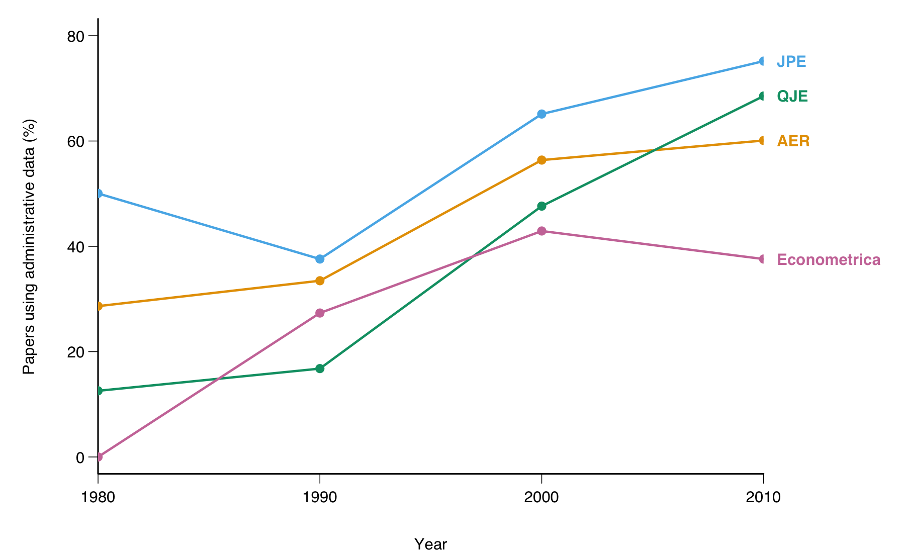
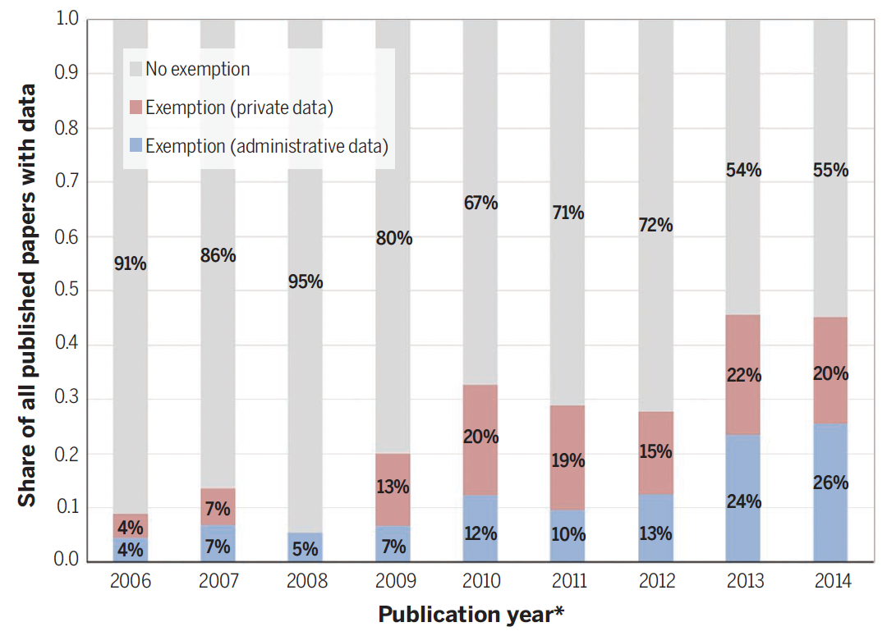
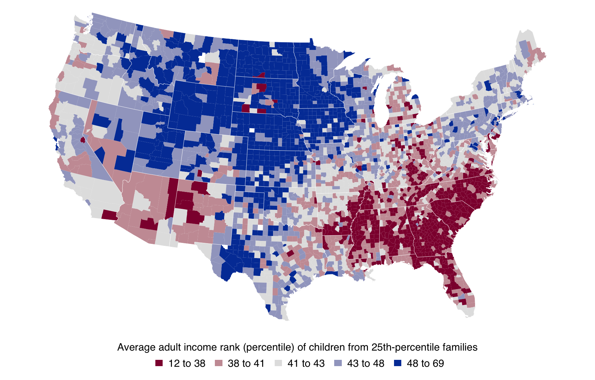
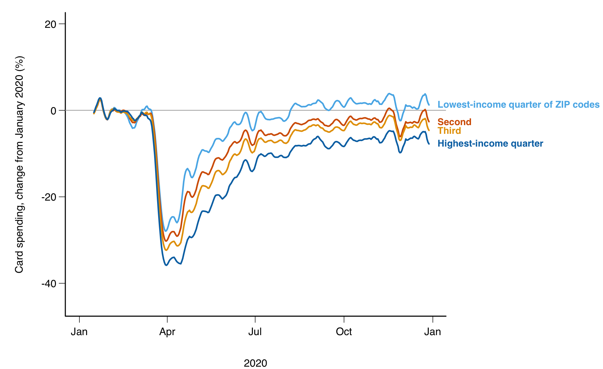

::: {.content-hidden when-format="revealjs"}

[Slides](13-landscape-slides.html) · [Source](https://github.com/ArielOrtizBobea/aem6850/blob/main/fall-2026/sessions/13-landscape.qmd)

An overview of the data economists use: the household surveys and
administrative records most papers are built on, the data firms collect
for their own operations, and the sources that were not data until
recently (satellite images, phone records, newspaper text, street images,
scraped prices, handwritten archives). For each source: what one row
describes, who may obtain it and how, and what it misses. The session
closes with what AI tools change about the cost of building data. No code
runs today. The exercise is a written answer.

## Objectives {#objectives}

By the end of this session you can:

- Sort a dataset by who collected it, how, and whether it was collected
  for research.
- Name the main household surveys and administrative records economists
  use, and say what each records.
- Say how researchers get access to restricted records and to firm data,
  and how long each route takes.
- For a research question, name a source that could hold the signal and
  say what it misses.
- Explain how AI tools lower the cost of turning documents, images and
  audio into data.

:::

## Plan for today {#plan}

1. **How the data behind economics papers has changed**\
   [Primary and secondary data · five questions · where the data came
   from · two trend charts]{.topics}
2. **Household surveys and administrative records**\
   [Surveys · what they miss · administrative records · two studies ·
   access]{.topics}
3. **Data collected by private firms**\
   [Firm data · scanner data · job ads · card feeds · what Cornell
   licenses]{.topics}
4. **Sources that were not data until recently**\
   [The rest of the course · six sources, one study each · the
   exercise]{.topics}
5. **What AI changes about the cost of building data**\
   [The steps that got cheap · free data, more discoveries · what
   stays with you]{.topics}

## A show of hands: the data you have worked with {#hands}

Hands up for each kind you have used in a project:

- A government survey (the CPS, the ACS, a census, a labour force survey).
- Records an organisation keeps to run itself (tax, school, hospital,
  payroll).
- A firm's own data (sales, ads, transactions, listings).
- Something you collected (a survey, an experiment, an archive).
- Something that was not a table until you made it one (text, images,
  audio, satellite scenes).

::: {.content-visible when-format="revealjs"}

::: {.notes}
Count roughly. The five parts of the session follow these five kinds:
surveys and administrative records, firm data, collected data, and the
sources that start as text, images or audio. Keep the counts for the
close.
:::

:::

# 1 · How the data behind economics papers has changed {#part-trends}

::: {.content-visible when-format="revealjs"}

- Primary and secondary data
- Five questions that sort a dataset
- Where the data in economics papers came from
- The questions follow the data at hand
- Administrative data in the top journals, 1980 to 2010
- Papers whose data cannot be posted

:::

## Primary and secondary data {#secondary}

- **Secondary data** is collected, processed and made available by someone
  other than the researchers of a study.
- **Primary data** is collected by the researchers for that study.
- Primary data becomes secondary data when it is reused.
- Scraping or processing existing information still produces secondary
  data.
- A paper on primary data describes the collection in detail. A paper on
  secondary data describes the source and what it misses.

## Five questions that sort a dataset {#typology}

- **Who collects it?** A government, a firm, or the researchers.
- **How?** A survey, interviews, administrative records, remote sensing,
  scraping, phone-tower pings.
- **How much?** A census of everyone, or a sample.
- **What format?** A structured table, or text, images and audio.
- **What domain?** Economic, health, education, natural.

The rest of the session follows the first question.

## Where the data in economics papers came from {#history .smaller}

| Period | The data, and who measured it | What economists did with it |
|:---|:-------|:-------|
| 1910s to 1930s | Market prices and quantities, mostly farm products, from statistical offices; crop yields from experiment stations | Demand curves and production functions fitted to market totals (Moore, 1914; [Cobb & Douglas, AER, 1928](https://www.jstor.org/stable/1811556); Schultz, 1938) |
| 1940s to 1960s | National accounts and the first regular household surveys, from statistical agencies | Macro series; individual behaviour inferred from aggregates |
| 1960s to 1990s | Public-use survey microdata: census samples, the PSID, the NLSY | Individual decisions observed: labour supply, schooling, consumption |
| 2000s on | Administrative records and firm data, kept by agencies and firms to run themselves | Whole populations followed for decades, linked across sources |
| Now | Text, images, audio, satellite scenes, phone records: by-products, not data | Turned into variables with models |

Field experiments came from agronomy
([Fisher, 1935](https://archive.org/details/in.ernet.dli.2015.199572));
[Stigler (JPE, 1954)](https://doi.org/10.1086/257495) reviews the early
demand studies.

## The questions follow the data at hand {#questions-follow}

- Each period asked what its data could answer: demand curves when market
  totals were all there was; individual labour supply once survey
  microdata arrived; the effect of a teacher or a neighbourhood once
  records followed people for decades.
- The data was measured by someone else, for their own purpose. A question
  outside it waited.
- The cost of data decides which questions get asked. When a dataset
  becomes cheap, new questions and new people appear (Part 5 shows one
  case).
- The hope: AI tools lower the cost of acquiring and processing data, so
  the question can come first and the data can be built to fit it.

## Administrative data in the top journals, 1980 to 2010 {#admin-trend .smaller}

{fig-align="center" height="440" fig-alt="Four lines, one per journal, from 1980 to 2010. The share of empirical micro papers using administrative data rises from 29 to 60 percent in the AER, 50 to 75 in the JPE, 13 to 69 in the QJE and 0 to 38 in Econometrica."}

[**Administrative data**: any dataset collected without surveying people,
such as tax returns, school records, claims, payroll and scanner data.
Share of empirical micro papers in four journals, read from
[Chetty (NBER Summer Institute slides, 2012)](https://www.nber.org/conferences/2012/SI2012/LS/ChettySlides.pdf),
digitised by [Vilhuber (Zenodo, 2018)](https://doi.org/10.5281/zenodo.1453345).]{style="font-size:0.72em"}

::: {.content-visible when-format="revealjs"}

::: {.notes}
Chetty classified every micro-data paper in the four journals in 1980,
1990, 2000 and 2010 by its main data source. Survey data went the other
way: the QJE's share built on surveys such as the CPS fell from 88 to 5
percent. His definition of administrative data is broad: anything not
collected by surveying people.
:::

:::

## Papers whose data cannot be posted {#exemptions .smaller}

{fig-align="center" height="440" fig-alt="Stacked bars for 2006 to 2014. The share of AER data papers with an exemption from the data-availability policy rises from 9 percent to 46 percent, split between administrative data (26 percent in 2014) and private data (20 percent)."}

[A **data policy** asks authors to deposit the data and code behind a
paper. An **exemption** is granted when the data belong to an agency or a
firm. Share of AER data papers, 2006 to 2014, from
[Einav & Levin (Science, 2014)](https://doi.org/10.1126/science.1243089).]{style="font-size:0.72em"}

::: {.content-visible when-format="revealjs"}

::: {.notes}
Blue: administrative data (4 percent of papers in 2006, 26 in 2014). Red:
private firm data (4 to 20). The authors warn the journal's record may
understate exemptions. Almost half of the papers with data could not post
it by 2014; today the policy asks for a data availability statement
instead, which says where the data are and how a reader can get them.
:::

:::

# 2 · Household surveys and administrative records {#part-surveys}

::: {.content-visible when-format="revealjs"}

- Household surveys economists use most, in the US and elsewhere
- What surveys miss: refusals and under-reporting
- Administrative records and who holds them
- Two studies: tax records, Danish registers
- How you get access to restricted records

:::

## Household surveys economists use most, United States (1 of 2) {#us-surveys .smaller}

| Survey | What it records | Sample, since | Frequency | Access |
|:------|:------|:-----|:----|:----|
| [CPS](https://www.census.gov/programs-surveys/cps.html), Current Population Survey (Census Bureau for the BLS) | Labour force; income each March | 60,000 households, since 1940 | Monthly | Open; harmonised files at [IPUMS CPS](https://cps.ipums.org/) |
| [ACS](https://www.census.gov/programs-surveys/acs), American Community Survey (Census Bureau) | Demographics, work, income, housing | 3.5 million addresses a year, since 2005 | Continuous; yearly files | Open; [IPUMS USA](https://usa.ipums.org/) |
| [PSID](https://psidonline.isr.umich.edu/), Panel Study of Income Dynamics (University of Michigan) | Income, wealth, health of the same families and their descendants | 5,000 families at the start, since 1968 | Yearly to 1997, then every two years | Registration |

A **panel** observes the same units repeatedly (the PSID). A
**cross-section** draws a fresh sample each round (the ACS).

## Household surveys economists use most, United States (2 of 2) {#us-surveys-2 .smaller}

| Survey | What it records | Sample, since | Frequency | Access |
|:------|:------|:-----|:----|:----|
| [NLSY79 and NLSY97](https://www.nlsinfo.org/), National Longitudinal Surveys of Youth (BLS) | Work, schooling, test scores of two birth cohorts | 12,686 and 8,984 people, since 1979 and 1997 | Yearly at first, now every two years | Registration |
| [HRS](https://hrs.isr.umich.edu/), Health and Retirement Study (University of Michigan) | Health, work, wealth of people over 50; links to Social Security and Medicare records on request | 20,000 people, since 1992 | Every two years | Registration |
| [NHANES](https://wwwn.cdc.gov/nchs/nhanes/), National Health and Nutrition Examination Survey (CDC) | An interview plus a physical examination | 5,000 people a year, since 1999 in its current form | Continuous; two-year files | Open |

## Household surveys economists use most, other countries (1 of 2) {#intl-surveys .smaller}

| Survey | What it records | Sample, since | Frequency | Access |
|:------|:------|:-----|:----|:----|
| [LSMS](https://www.worldbank.org/en/programs/lsms), Living Standards Measurement Study (World Bank) | Consumption, income, agriculture (plots measured by GPS in LSMS-ISA) | 169 studies in 45 countries, since 1985 | Irregular; LSMS-ISA panels every two to three years | Registration at the [Microdata Library](https://microdata.worldbank.org/index.php/catalog/lsms) |
| [DHS](https://dhsprogram.com/), Demographic and Health Surveys (USAID with national statistical offices) | Births, child health, assets, residence; women 15 to 49 | 400+ surveys in 90+ countries, since 1984 | About every five years per country | [Registration](https://dhsprogram.com/data/Access-Instructions.cfm); approved per country in a day or two |
| [IPUMS International](https://international.ipums.org/), Integrated Public Use Microdata Series (University of Minnesota) | Harmonised census microdata | 104 countries, 656 samples, mostly since 1960 | Census rounds, about every ten years | Registration |

## Household surveys economists use most, other countries (2 of 2) {#intl-surveys-2 .smaller}

| Survey | What it records | Sample, since | Frequency | Access |
|:------|:------|:-----|:----|:----|
| [India NSS](https://microdata.gov.in/), National Sample Survey (Ministry of Statistics) | Consumption by item, employment | Rounds since the 1970s | Consumption rounds about every five years; labour force yearly since 2017 | Registration |
| [Afrobarometer](https://www.afrobarometer.org/data/) | Trust, governance, lived poverty | 1,200 or 2,400 adults per country, up to 45 countries, since 1999 | Rounds every two to three years | Open |
| [Gallup World Poll](https://www.gallup.com/analytics/318875/global-research.aspx) | Life evaluation, well-being, work | 1,000 adults per country, 140+ countries, since 2005 | Yearly | Commercial licence |

::: {.content-visible when-format="revealjs"}

::: {.notes}
The DHS records no income; most LSMS surveys are a snapshot or a short
panel. Both are the ground truth that the satellite and phone papers
later in the session are trained on. Registration for the DHS: a project
title and a short description; access is granted by country, usually
within a day or two; you agree not to pass the files on and to send DHS
your publications.
:::

:::

## What surveys miss: refusals and under-reporting {#survey-error .smaller}

[Meyer, Mok & Sullivan (JEP, 2015)](https://doi.org/10.1257/jep.29.4.199)
compared five US household surveys with the totals the agencies paid out.

::: {.dashes}

- **Refusals rose for three decades**
  - The share of sampled households that give no interview reached 16 to
    33 percent, survey by survey.
- **Benefits go unreported**
  - Linked to New York State records, 43 percent of SNAP recipients and
    63 percent of public-assistance recipients told the survey they
    received nothing.
- **The income of the poor is understated as a result**
  - Poverty rates and the effect of transfer programmes come out wrong.

:::

**Unit nonresponse**: a sampled household gives no interview.
**Measurement error**: the gap between what a source records and the true
value.

**Takeaway:** a survey cannot reveal its own error. It took an
administrative benchmark to measure it.

## Administrative records and who holds them (1 of 2) {#admin-records .smaller}

| Record | Holder | One row is; coverage | Access |
|:----|:------|:------|:------|
| Tax returns | IRS, the Internal Revenue Service | A return per filer-year; all filers since 1996 | Application to the [Statistics of Income research programme](https://www.irs.gov/statistics/soi-tax-stats-joint-statistical-research-program) |
| Medicare claims | CMS, the Centers for Medicare & Medicaid Services, through [ResDAC](https://resdac.org/) | A claim; everyone over 65 | Data-use agreement and fees |
| Wage records from unemployment insurance | Census Bureau, [LEHD](https://lehd.ces.census.gov/) (Longitudinal Employer-Household Dynamics) | A worker-employer-quarter; most states since the late 1990s | Aggregates open; microdata in a secure room |
| Population registers | [Statistics Denmark](https://www.dst.dk/en/TilSalg/Forskningsservice), [Statistics Norway](https://microdata.no/en/), Statistics Sweden | A person-year, linkable across income, work, education, health, family; everyone since 1980 | Remote server via an authorised institution |

## Administrative records and who holds them (2 of 2) {#admin-records-2 .smaller}

| Record | Holder | One row is; coverage | Access |
|:----|:------|:------|:------|
| Formal employment contracts | Brazil's labour ministry, [RAIS](https://www.rais.gov.br/) (Relação Anual de Informações Sociais) | A worker-establishment-year; every formal job since the mid-1980s | Public de-identified files |
| Patents | USPTO, the Patent and Trademark Office, through [PatentsView](https://patentsview.org/) | A patent with its inventors, since 1976 | Open |
| School, court and property records | Districts, courts, county recorders | A pupil, a case, a deed | Agreement with each holder |

These records exist to run a programme. They cover everyone in it and
nobody outside it.

## Tax records and where children grow up {#chetty-mobility .smaller}

[Chetty, Hendren, Kline & Saez (QJE, 2014)](https://doi.org/10.1093/qje/qju022)
used de-identified tax records on more than 40 million children born in
1980 to 1982 and their parents.

- **Question:** does the place a child grows up change the chance of
  climbing from the bottom fifth of incomes to the top fifth?
- **Finding:** the chance ranges from 4.4 percent in Charlotte to 12.9
  percent in San Jose. Places with high mobility have less segregation,
  less inequality, better schools and more stable families.
- **The data:** unit a child; one cohort; access restricted (an IRS
  programme).
- **Why older data could not:** the PSID and the NLSY hold a few thousand
  families, enough for one national number and nothing by county.

**Takeaway:** population records answer questions about places and small
groups that a sample cannot.

## The open product of a restricted record {#atlas .smaller}

{fig-align="center" height="400" fig-alt="A county map of the contiguous United States in five shades of blue. Children from 25th-percentile families reach the highest adult income ranks in the Great Plains and the Mountain West and the lowest in the Southeast."}

[The Opportunity Atlas: the average adult income rank of children from
25th-percentile families, by the county they grew up in; red low, blue
high. The records stay inside the IRS; the county averages are a free
download (3,219 counties; Tompkins County: rank 43). Drawn from
`county_outcomes_simple.csv` at
[opportunityinsights.org/data](https://opportunityinsights.org/data/).]{style="font-size:0.72em"}

::: {.content-visible when-format="revealjs"}

::: {.notes}
A public aggregate: a table of averages by group released from records
that cannot be shared. Cells with few people are suppressed or noised.
This is what most of us can use from the tax data without an IRS
application.
:::

:::

## Danish registers and the first child {#kleven .smaller}

[Kleven, Landais & Søgaard (AEJ: Applied, 2019)](https://doi.org/10.1257/app.20180010)
used Denmark's registers: every person's earnings every year from 1980 to
2013, with parents linked to children.

- **Question:** how much of the gap between men's and women's earnings
  opens when the first child arrives?
- **Finding:** men's earnings do not move. Women's fall at once and stay
  about 20 percent lower in the long run.
- **The data:** unit a person-year; the whole population; access
  restricted (a remote server, through an authorised institution).
- **Why older data could not:** the design needs everyone's earnings
  every year, the first child's birth year and the family links. A survey
  has none of the three at this size.

**Takeaway:** registers let you follow everyone through an event.

## How you get access to restricted records {#access .smaller}

| Route | Example | What it takes | Time, where a source states one |
|:--|:--|:---|:--|
| An application to the agency | IRS SOI Joint Statistical Research Program | A proposal in an annual call, a background check, work on IRS equipment | About four months to a decision |
| A secure room | The Federal Statistical Research Data Centers (40 sites; Cornell hosts one) | A proposal through the Standard Application Process, sworn status, review of every output | 12 weeks of review for one agency, 24 for several, then clearance |
| A data-use agreement | Medicare claims through ResDAC | Fees per file; secure delivery or a virtual research environment | No published figure |
| A remote server | Statistics Denmark; Norway's microdata.no | An authorised institution; nothing leaves the server | No published figure |
| Public aggregates | The Opportunity Atlas; LEHD's QWI | A download | Minutes |

**Disclosure review**: the agency checks that a result cannot reveal a
person before it leaves the facility.

# 3 · Data collected by private firms {#part-firms}

::: {.content-visible when-format="revealjs"}

- Firm data economists use
- Scanner data and food deserts
- Job ads and the recession
- Card and payroll feeds in the pandemic
- Firm data Cornell licenses through Dewey Data

:::

## Firm data economists use (1 of 2) {#firm-data .smaller}

| Data | Firm (access) | One row is | What it misses |
|:-----|:--------|:----|:------|
| Barcode purchases, store sales | NielsenIQ, through the [Kilts Center](https://www.chicagobooth.edu/research/kilts/research-data/nielseniq) (licence) | A household trip; a store-week | Restaurants, produce, absent chains |
| Online job ads | [Lightcast](https://lightcast.io/academic-research) (licence) | A posting with parsed skills | Jobs never advertised online |
| Card transactions | Affinity Solutions, through the [Economic Tracker](https://opportunityinsights.org/data/); the [JPMorgan Chase Institute](https://www.jpmorganchase.com/institute) (agreement) | A transaction | Cash, other banks' customers, the unbanked |
| Credit files | Equifax, through the [New York Fed](https://www.newyorkfed.org/microeconomics/databank.html) (Fed staff) | A person-quarter | People with no credit file |

## Firm data economists use (2 of 2) {#firm-data-2 .smaller}

| Data | Firm (access) | One row is | What it misses |
|:-----|:--------|:----|:------|
| Phone locations | SafeGraph and Advan, through [Dewey Data](https://www.deweydata.io/) (licence) | A place-week | Phones that did not opt in |
| Search volume | [Google Trends](https://trends.google.com/trends/) (open) | A term-region-week index | Levels; a new sample at each pull |
| Listed-firm accounts, prices | Compustat and CRSP, through [WRDS](https://wrds-www.wharton.upenn.edu/), Wharton Research Data Services (licence) | A firm-year; a security-day | Private firms |

## Scanner data and food deserts {#allcott .smaller}

[Allcott, Diamond, Dubé, Handbury, Rahkovsky & Schnell (QJE, 2019)](https://doi.org/10.1093/qje/qjz015)
used Homescan purchases and Retail Scanner store sales, with the dates
supermarkets opened and the moves of panel households.

- **Question:** do people in food deserts eat worse because healthy
  food is far away?
- **Finding:** a new supermarket in a food desert barely changes what
  nearby low-income households buy. Supply explains about a tenth of the
  nutrition gap; demand explains the rest.
- **The data:** unit a household-week; continuous; access licensed.
- **Why older data could not:** a diet survey is small, self-reported
  and a snapshot. The panel records the same households before and after
  an opening.

**Takeaway:** a firm's panel follows the same households through an
event, which no diet survey does.

## Job ads and the recession {#hershbein .smaller}

[Hershbein & Kahn (AER, 2018)](https://doi.org/10.1257/aer.20161570)
used Burning Glass job ads for 2007 and 2010 to 2015, parsed for
education and skill requirements.

- **Question:** did employers ask for more skill after the 2007 to 2009
  recession, and did it last?
- **Finding:** the share of ads that state an education requirement rose
  by 23 percentage points on average. Ads in the metro areas the
  recession hit harder were about 5 points more likely to state education
  and experience requirements, and the rise lasted through 2015.
- **The data:** unit a posting; access licensed; misses jobs never
  advertised online.
- **Why older data could not:** official vacancy counts record how many
  jobs are open, not what the employer wants.

**Metro area**: a city and the counties around it that people commute
from.

**Takeaway:** bought data records what no official survey asks, and you
inherit the vendor's coverage.

## Card and payroll feeds in the pandemic {#tracker .smaller}

[Chetty, Friedman, Stepner & the Opportunity Insights Team (QJE, 2024)](https://doi.org/10.1093/qje/qjad048)
built a tracker from card spending, job ads, payroll and scheduling
records and small-business revenue, by county and income group, week by
week.

- **Finding:** high-income households cut spending most in March 2020
  (the next slide: the highest-income quarter of ZIP codes was 36 percent
  below January by mid-April, the lowest 23 percent). Small businesses in
  rich, dense areas lost revenue and laid off low-wage workers.
- **The data:** unit a county-week; access mixed (the aggregates are a
  free download, the transactions stay with the firms). The card data
  cover about a tenth of US card spending. Cash and rent are invisible.

**Takeaway:** firm feeds arrive in days where official statistics take
months, at the coverage the firm has.

## Card spending by ZIP-code income in 2020 {#tracker-figure .smaller}

{fig-align="center" height="440" fig-alt="Four lines through 2020: card spending relative to January, by ZIP-code income quartile. All four drop in late March; the highest-income quarter drops furthest, to about 36 percent below January in mid-April, and recovers slowest."}

[Seven-day averages of the tracker's public national file, from
[github.com/OpportunityInsights/EconomicTracker](https://github.com/OpportunityInsights/EconomicTracker).
Mid-April: lowest-income quarter of ZIP codes −23 percent, highest
−36 percent.]{style="font-size:0.72em"}

## Firm data Cornell licenses through Dewey Data {#dewey .smaller}

One login through the library gives access to data from more than thirty
providers. Among them:

::: {.dashes}

- **Consumers**
  - Card transactions by merchant, place and demographic group, since
    2018.
  - Visits to points of interest from phone locations, since 2017.
  - Point-of-sale records from thousands of convenience stores.
- **Places and property**
  - Rental listings, over a million ads a week.
  - Property records for 155 million properties: assessments, sales,
    mortgages.
  - Building permits since 1980; weather stations since 2018.
- **Firms and workers**
  - Company profiles; work histories built from résumés.

:::

A distribution layer, so each provider's blind spots carry through.

::: {.content-visible when-format="revealjs"}

::: {.notes}
From Jura Liaukonyte's overview for the Dyson School. Base access covers
some providers; others cost extra per researcher. Each provider's coverage
is the firm's: card data miss cash, phone data miss phones that did not
opt in.
:::

:::

# 4 · Sources that were not data until recently {#part-new}

::: {.content-visible when-format="revealjs"}

- Kinds of data, and where this course covers each
- Satellite images, phone records, newspaper text
- Street images, scraped prices, handwritten archives
- Exercise

:::

## Kinds of data, and where this course covers each {#kinds .smaller}

| Kind of data | Examples | Sessions |
|:-----|:----------|:----|
| Getting data | Downloading through an API; scraping pages built for people | 14, 15 |
| Text | News articles, statements: patterns and word counts, then language models | 16, 17 |
| Documents and scans | Printed tables, handwritten ledgers | 18 |
| Audio | Speech turned into text; tone and emotion | 19, 20 |
| Photographs | Pixels and vision models; classifying and counting | 21, 22 |
| Points, boundaries and grids | Addresses, district borders; rainfall on 5 km squares | 23, 24 |
| Aerial and satellite imagery | LiDAR and drones; satellite scenes on your machine; Earth Engine | 25, 26, 27 |
| Close | What each instrument misses; moving forward | 28 |

**Gridded data**: values laid on a regular net of squares over a map, one
value per square for each date.

::: {.content-visible when-format="revealjs"}

::: {.notes}
This is the map of the rest of the course: every row is a block of
sessions, in order. Each later session follows the same pipeline: what the
source answers, where to get it, how to process it, and what to compare
the result with.
:::

:::

## Satellite images and village wealth {#jean .smaller}

[Jean, Burke, Xie, Davis, Lobell & Ermon (Science, 2016)](https://doi.org/10.1126/science.aaf7894)
trained a model on daytime satellite images and night lights to predict
the wealth that LSMS and DHS surveys recorded in Nigeria, Tanzania,
Uganda, Malawi and Rwanda.

- **Question:** can an image stand in for a survey where the survey does
  not exist?
- **Finding:** the images explain 55 to 75 percent of the variation in
  village asset wealth across survey clusters, and 37 to 55 percent of
  consumption.
- **The data:** unit a survey cluster; access open (the images) plus the
  surveys; misses what a roof and a road do not show.
- **Why older data could not:** many African countries had no national
  consumption survey in a decade. A DHS or LSMS round costs 1.5 to 2
  million dollars per country, and in half of African countries at least
  6.5 years pass between rounds
  ([Burke, Driscoll, Lobell & Ermon, Science, 2021](https://doi.org/10.1126/science.abe8628)).

**Takeaway:** an image can stand in for a survey, once a model is trained
where the survey exists.

## Phone records and a wealth map {#blumenstock .smaller}

[Blumenstock, Cadamuro & On (Science, 2015)](https://doi.org/10.1126/science.aac4420)
used the call records of 1.5 million Rwandan subscribers, a phone survey
of 856 of them, and the DHS.

- **Question:** can calling patterns reveal how wealthy a person is, and
  can millions of such predictions map a country?
- **Finding:** a model trained on the 856 predicts wealth from calling
  patterns. Summed over 1.5 million users it reproduces the DHS district
  wealth map (r = 0.92 across 30 districts).
- **The data:** unit a subscriber; daily; access restricted (an agreement
  with the operator, country by country); misses people without a phone.
- **Why older data could not:** a census or a DHS comes years apart and
  costs millions. Phone records exist for everyone with a phone, every
  day.

**Takeaway:** records collected to bill calls can map a country between
censuses.

## Newspaper text and media slant {#gentzkow .smaller}

[Gentzkow & Shapiro (Econometrica, 2010)](https://doi.org/10.3982/ECTA7195)
measured each daily newspaper's slant by how much its phrases match those
of congressional Republicans or Democrats.

- **Question:** do newspapers slant to their readers or to their owners?
- **Finding:** readers' preferences explain about 20 percent of the
  variation in slant across papers. Who owns the paper explains far
  less.
- **The data:** unit a newspaper; access licensed (news archives);
  misses what readers take from the text.
- **Why older data could not:** slant had been a judgement. Phrase
  counts turn it into a number that can be compared across hundreds of
  papers.

**Takeaway:** word counts turn a judgement about bias into a measure.

## Street images and neighbourhood change {#naik .smaller}

[Naik, Kominers, Raskar, Glaeser & Hidalgo (PNAS, 2017)](https://doi.org/10.1073/pnas.1619003114)
scored street-level images of the same blocks in five US cities at two
dates with a computer-vision model of perceived safety.

- **Question:** which neighbourhoods improve physically, and what predicts
  it?
- **Finding:** blocks with more college-educated residents, a better
  initial appearance, and closer to the centre improved more.
- **The data:** unit a block at two dates; access commercial (an API key,
  charged per image); misses what is not visible from the road.
- **Why older data could not:** nobody had rated the appearance of every
  block in a city at two dates.

**Takeaway:** a photo archive becomes a panel of neighbourhood
appearance.

## Scraped online prices and Argentina's inflation {#cavallo .smaller}

[Cavallo & Rigobon (JEP, 2016)](https://doi.org/10.1257/jep.30.2.151)
collected prices daily from retailer websites: by 2010, five million
prices a day from over 300 retailers in 50 countries.

- **Question:** can prices scraped from the web measure inflation, and
  what do they show when official figures are manipulated?
- **Finding:** online indexes track official CPIs in most countries. In
  Argentina from 2007 to 2011 the official rate was 8 percent a year and
  online prices rose more than 20 percent a year.
- **The data:** unit a product-retailer-day; access licensed (the
  micro data are now a firm's); misses services and quantities.
- **Why older data could not:** a CPI is collected monthly by the
  statistical office, with a lag, and the office can be told what to
  publish.

**Takeaway:** a price collected from outside the country cannot be
edited by the statistical office.

## Handwritten archives and colonial Java {#dell .smaller}

[Dell & Olken (REStud, 2020)](https://doi.org/10.1093/restud/rdz017)
digitised and georeferenced handwritten Dutch records of 94 sugar
factories and the villages forced to grow cane for them in the 1800s, and
matched them to modern censuses and surveys.

- **Question:** do areas the colonial state used for sugar look different
  today?
- **Finding:** households within a few kilometres of an old factory
  consume about 14 percent more than those more than 10 km away. The
  areas are more industrial and better schooled.
- **The data:** unit a village; one historical layer; access collected
  by the authors. About a third of the listed villages could not be
  placed on a modern map: the coverage gap.
- **Why older data could not:** the records existed only as manuscripts
  in an archive in The Hague.

**Takeaway:** when no dataset exists you can build one from an archive,
and report what you could not match.

## Exercise {#exercise}

::: {.panel-tabset}

### Exercise

```r
# Exercise (5 minutes). Pen and paper, or comments in a script.
# Take your own research question, or one of these: did working
# from home change where people in a city spend money; do heat
# waves lower test scores; does a new highway exit raise land
# prices nearby.
# 1. The question, in one line.
# 2. One source from today that could hold the signal, and its
#    kind (survey, administrative record, firm data, a newer source).
# 3. Its unit of observation and its frequency.
# 4. The access route.
# 5. One thing it misses.
# Two answers to compare with the room: the access route, and what
# the source misses.
```

### Solution

```r
# Spending: card transactions by ZIP code (the tracker's aggregates,
#   open; a ZIP-week; misses cash).
# Heat and test scores: school test records by day (a district
#   agreement; a pupil-test; misses which schools have air
#   conditioning) joined to daily temperature grids (open).
# Highway exits: property deeds by distance to the exit (county
#   recorder, or Zillow's records through ICPSR by application; a
#   sale; misses states that do not disclose prices).
```

::: {.content-visible when-format="revealjs"}

::: {.notes}
Debrief (3 min): three call-outs, each reads the source, the route and
what it misses. Push on step 5: every source misses something, and the
paper has to say what.
:::

:::

:::

# 5 · What AI changes about the cost of building data {#part-ai}

::: {.content-visible when-format="revealjs"}

- The steps that got cheap: reading, structuring, labelling
- When data gets cheaper, more questions get asked
- What stays with you

:::

## The steps that got cheap: reading, structuring, labelling {#cheap-steps .smaller}

| Step | Before | Now | Example from today |
|:--|:---|:---|:---|
| Reading a page | Typed by hand from the scan | Transcribed by a model, checked by a person | The Dutch factory records |
| Structuring | Fields coded by hand into a table | Extracted into a table from text or an image | Skills parsed from millions of job ads |
| Labelling | A few dozen items coded by a person | A model trained on hundreds of labels, applied to millions | Village wealth predicted from images and call records |

One cost, measured: reading the 430 million articles of a digitised US
newspaper archive at the line level was estimated at 23 million dollars
with a commercial service and about 60,000 dollars with an open model
([Carlson, Bryan & Dell, ACL, 2024](https://doi.org/10.18653/v1/2024.acl-long.440),
a computer-science venue).

Two surveys of what this changes for research:
[Korinek (JEL, 2023)](https://doi.org/10.1257/jel.20231736) on language
models as research assistants, and
[Dell (JEL, 2025)](https://doi.org/10.1257/jel.20241733) on deep learning
for building datasets from text and images.

**Takeaway:** the cost of turning documents, images and audio into tables
has fallen, so questions that needed a team and a year can be tried in a
week.

## When data gets cheaper, more questions get asked {#nagaraj .smaller}

[Nagaraj (Management Science, 2022)](https://doi.org/10.1287/mnsc.2020.3878)
studied what happened when Landsat satellite images, sold for years at a
price per scene, became free to download.

- **Finding:** once a region was imaged, the rate of significant gold
  discoveries there nearly doubled, and the share of discoveries made by
  new entrants rose from about 10 to 25 percent.
- **The data:** mining company reports of discoveries matched to Landsat
  coverage.

[Nagaraj, Shears & de Vaan (PNAS, 2020)](https://doi.org/10.1073/pnas.2001682117)
find the same pattern across science: when a dataset becomes easier to
get, more and more varied researchers use it.

**Takeaway:** the cost of data decides who gets to ask.

## The work that stays with the researcher {#stays}

- Choosing the question, and deciding which source could hold its signal.
- Judging what the source misses: who and what it does not cover, and how
  far its values sit from the truth.
- Comparing what a tool produced with something outside it: a published
  total, a hand-read sample, a second source.
- Reading the conditions of use and keeping to them. Some data stewards
  now forbid AI tools on their data; the
  [PSID's conditions](https://simba.isr.umich.edu/U/CondUse.aspx) say so.

::: {.content-hidden when-format="revealjs"}

## Quick reference {#quick-reference}

**Where to find data**

| Route | Portal or facility | What it holds | Access |
|:--|:--|:---|:--|
| Open portals | [FRED](https://fred.stlouisfed.org/) | Hundreds of thousands of macroeconomic and financial series | Download, API |
| | [World Development Indicators](https://datatopics.worldbank.org/world-development-indicators/) | About 1,400 country-year indicators since 1960 | Download, API (CC BY 4.0) |
| | [IPUMS](https://www.ipums.org/) | Harmonised census and survey microdata, US and 100+ countries | Free registration |
| | [Harvard Dataverse](https://dataverse.harvard.edu/) | Research deposits, including the QJE replication archive | Download |
| | [openICPSR](https://www.openicpsr.org/openicpsr/search/aea/studies) | The AEA Data and Code Repository: replication packages for AEA journals since 1999 | Free registration |
| | [HDX](https://data.humdata.org/) | Humanitarian data: boundaries, prices, displacement, the Relative Wealth Index | Download |
| | [Eurostat](https://ec.europa.eu/eurostat/data/database) | EU aggregates by country and region | Download, API (CC BY 4.0) |
| | [NASA Earthdata](https://www.earthdata.nasa.gov/), [Copernicus](https://dataspace.copernicus.eu/) | Satellite products: MODIS, Landsat, VIIRS night lights, Sentinel | Free registration |
| | [Zenodo](https://zenodo.org/), [Our World in Data](https://ourworldindata.org/) | Deposits with DOIs; curated charts and series | Download |
| | [USDA NASS QuickStats](https://quickstats.nass.usda.gov/), [FAOSTAT](https://www.fao.org/faostat/) | The Census of Agriculture (every farm, every five years) and farm surveys; world agricultural statistics | Download, API |
| | [PRISM](https://prism.oregonstate.edu/), [CHIRPS](https://www.chc.ucsb.edu/data/chirps), [ERA5](https://cds.climate.copernicus.eu/) | Daily weather on grids: the US at 4 km, rainfall at 5 km worldwide, a global reanalysis | Download; ERA5 needs registration |
| | [Penn World Table](https://www.rug.nl/ggdc/productivity/pwt/), [World Inequality Database](https://wid.world/) | Comparable national accounts since 1950; income and wealth shares | Download |
| Restricted | [FSRDC](https://www.census.gov/about/adrm/fsrdc/locations/ny-cornell.html) | Census, BLS, NCHS and other microdata in a secure room; the New York–Cornell RDC is at 391 Pine Tree Road | Standard Application Process |
| | [ResDAC](https://resdac.org/) | Medicare and Medicaid claims | Data-use agreement, fees |
| | [IRS SOI JSRP](https://www.irs.gov/statistics/soi-tax-stats-joint-statistical-research-program) | Tax records | Annual call for proposals |
| | [Statistics Denmark](https://www.dst.dk/en/TilSalg/Forskningsservice), [microdata.no](https://microdata.no/en/) | Population registers | Through an authorised institution |
| | [UK Secure Research Service](https://www.ons.gov.uk/aboutus/whatwedo/statistics/requestingstatistics/secureresearchservice) | UK administrative and survey microdata | Accreditation |
| Commercial | [WRDS](https://wrds-www.wharton.upenn.edu/) | Compustat, CRSP and 600+ other databases | University subscription |
| | [Kilts Center](https://www.chicagobooth.edu/research/kilts/research-data/nielseniq) | NielsenIQ Consumer Panel and Retail Scanner | Institutional licence |
| | [Dewey Data](https://www.deweydata.io/) | Thirty-plus providers of transaction, mobility, property and firm data | Library-managed licence |
| | [Lightcast](https://lightcast.io/academic-research) | Online job postings since 2007 | Licence |

**Licence classes, with one example each**

| Licence | Example | What it allows |
|:--|:--|:---|
| US government public domain | Census and BLS products, NASA imagery | Any use; credit is a courtesy |
| CC BY 4.0 | World Development Indicators, Eurostat | Any use with credit |
| CC BY-NC 4.0 | The Relative Wealth Index on HDX | Non-commercial use with credit |
| ODbL | OpenStreetMap | Any use with credit; what you build from it carries the same licence |
| Vendor contract | Kilts NielsenIQ, WRDS | What the contract says; no redistribution |

**Sources**

- [Chetty (NBER Summer Institute slides, 2012)](https://www.nber.org/conferences/2012/SI2012/LS/ChettySlides.pdf);
  data digitised by [Vilhuber (Zenodo, 2018)](https://doi.org/10.5281/zenodo.1453345).
- [Einav & Levin (Science, 2014)](https://doi.org/10.1126/science.1243089);
  [Currie, Kleven & Zwiers (AEA P&P, 2020)](https://doi.org/10.1257/pandp.20201058),
  who count mentions of administrative data in 10,000 working papers;
  [Hamermesh (JEL, 2013)](https://doi.org/10.1257/jel.51.1.162).
- [Meyer, Mok & Sullivan (JEP, 2015)](https://doi.org/10.1257/jep.29.4.199);
  [Chetty, Hendren, Kline & Saez (QJE, 2014)](https://doi.org/10.1093/qje/qju022);
  [Kleven, Landais & Søgaard (AEJ: Applied, 2019)](https://doi.org/10.1257/app.20180010).
- [Allcott et al. (QJE, 2019)](https://doi.org/10.1093/qje/qjz015);
  [Hershbein & Kahn (AER, 2018)](https://doi.org/10.1257/aer.20161570);
  [Chetty, Friedman, Stepner & the Opportunity Insights Team (QJE, 2024)](https://doi.org/10.1093/qje/qjad048).
- [Jean et al. (Science, 2016)](https://doi.org/10.1126/science.aaf7894);
  [Blumenstock, Cadamuro & On (Science, 2015)](https://doi.org/10.1126/science.aac4420);
  [Gentzkow & Shapiro (Econometrica, 2010)](https://doi.org/10.3982/ECTA7195);
  [Naik et al. (PNAS, 2017)](https://doi.org/10.1073/pnas.1619003114);
  [Cavallo & Rigobon (JEP, 2016)](https://doi.org/10.1257/jep.30.2.151);
  [Dell & Olken (REStud, 2020)](https://doi.org/10.1093/restud/rdz017).
- [Korinek (JEL, 2023)](https://doi.org/10.1257/jel.20231736);
  [Dell (JEL, 2025)](https://doi.org/10.1257/jel.20241733);
  [Nagaraj (Management Science, 2022)](https://doi.org/10.1287/mnsc.2020.3878);
  [Nagaraj, Shears & de Vaan (PNAS, 2020)](https://doi.org/10.1073/pnas.2001682117).
- Figures: the Opportunity Atlas county table and the Economic Tracker's
  national daily file (Opportunity Insights, public downloads); the
  journals chart from the Zenodo record above (CC BY-NC-SA 4.0).

**Links** — [slides](13-landscape-slides.html)

:::
